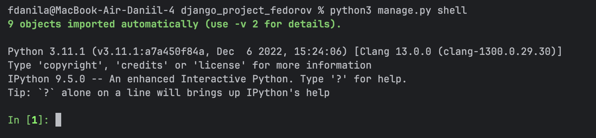
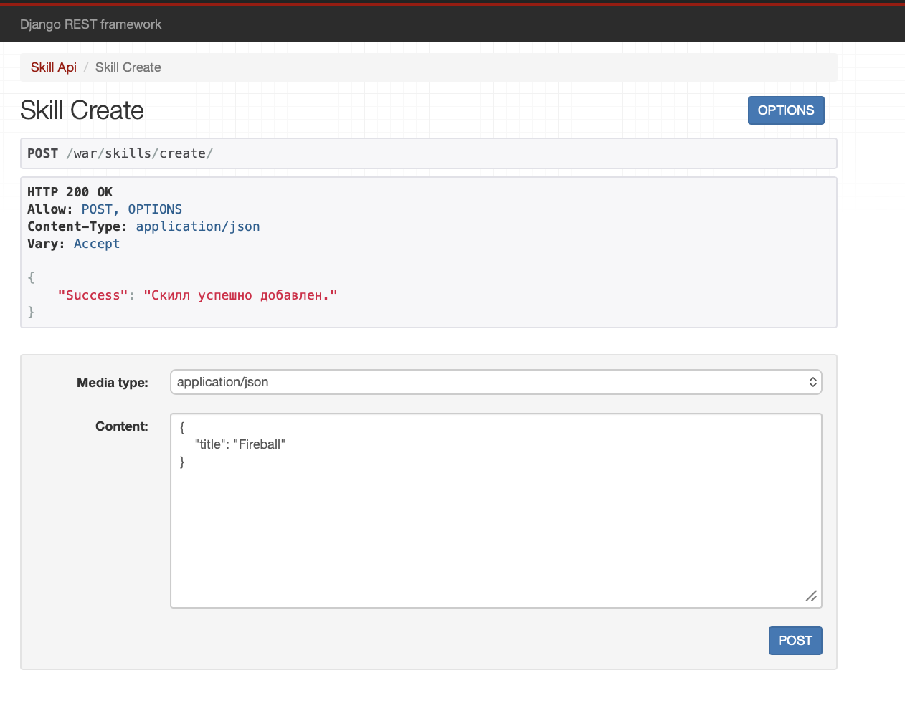
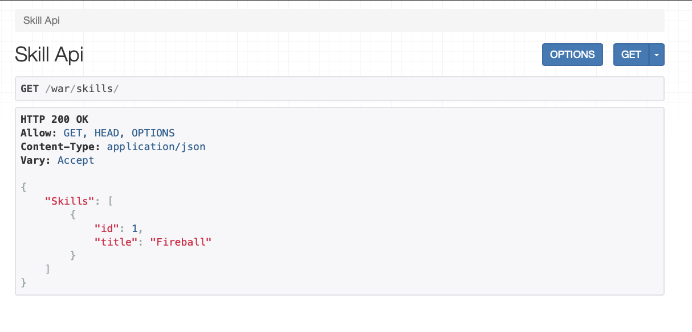
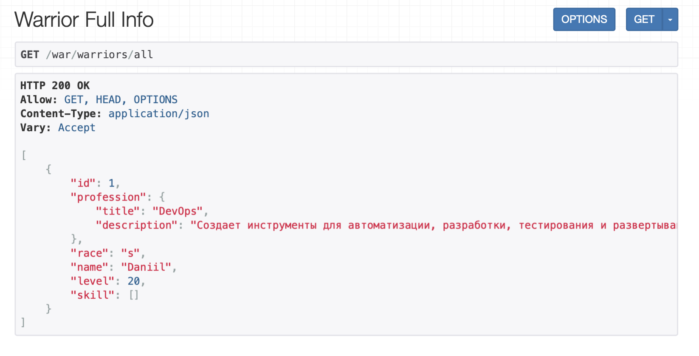
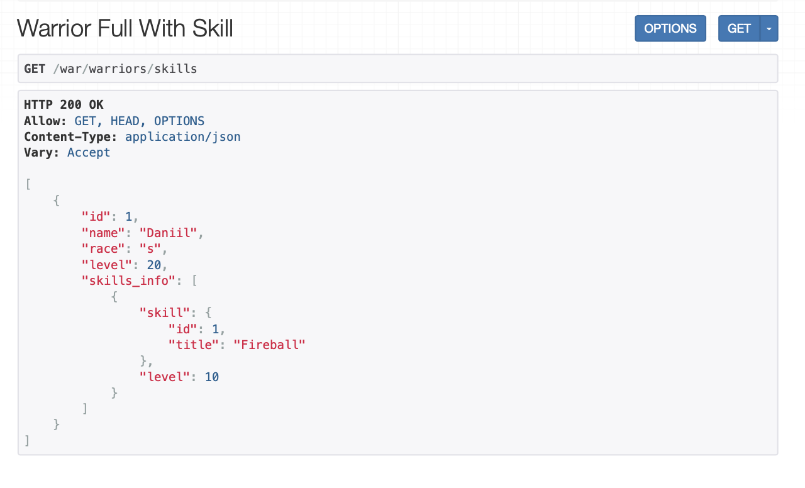
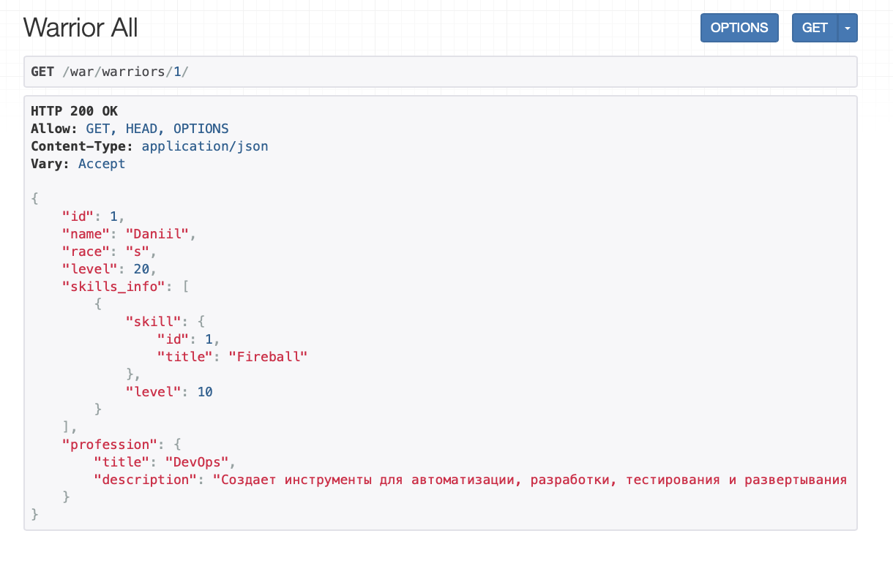
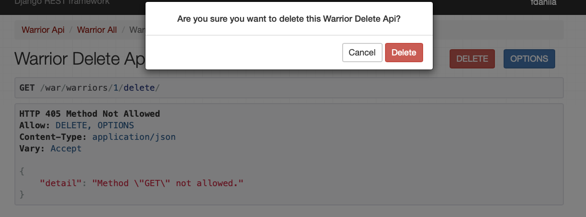
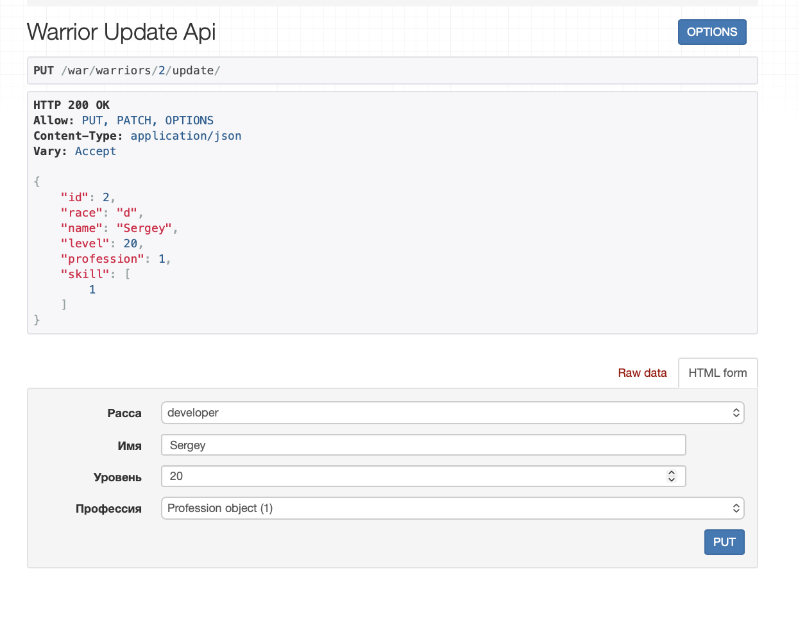
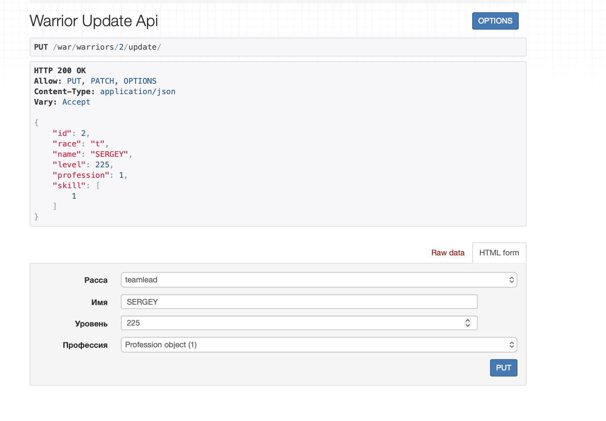

# Практическое занятие 3.1

## Практическое задание 1: Напишите запрос на создание 6-7 новых автовладельцев и 5-6 автомобилей, каждому автовладельцу назначьте удостоверение и от 1 до 3 автомобилей. Задание можете выполнить либо в интерактивном режиме интерпретатора, либо в отдельном python-файле. Результатом должны стать запросы и отображение созданных объектов. Если вы добавляете автомобили владельцу через метод .add(), не забудьте заполнить также ассоциативную сущность “владение”



Для начала запустили интерактивную оболочку.

* Далее будем создавать по отдельности владельцев, автомобили, удостоверения и назначать машины владельцам.

```
    In [5]: o1 = Owner.objects.create(username="o1", first_name="Иван", last_name="Иванов")

    In [6]: o1
    Out[6]: <Owner: Иванов Иван>

    In [7]: dl1 = DriverLicense.objects.create(owner=o1, license_number="LIC0000001", license_type="B", issue_date=timezone.now())

    In [8]: dl1
    Out[8]: <DriverLicense: DriverLicense object (1)>

    In [9]: c1 = Car.objects.create(plate_number="A111AA77", brand="Toyota", model="Camry", color="Черный")

    In [10]: c1
    Out[10]: 
    <Car: Машина: Toyota Camry
    Цвет: Черный
    Номер:A111AA77
    >

    In [11]: own1 = Ownership.objects.create(owner=o1, car=c1, start_date=timezone.now())

    In [12]: own1
    Out[12]: <Ownership: Ownership object (7)>

    In [13]: o1.cars
    Out[13]: <django.db.models.fields.related_descriptors.create_forward_many_to_many_manager.<locals>.ManyRelatedManager at 0x1047236d0>

    In [14]: o1.cars.all()
    Out[14]: 
    <QuerySet [<Car: Машина: Toyota Camry
    Цвет: Черный
    Номер:A111AA77
    >]>
```

* Таким способом мы добавили одного владельца и далее по аналогии, добавляем всё остальное и проверяем:

```
    In [32]: Ownership.objects.all()
    Out[32]: <QuerySet [<Ownership: Ownership object (8)>, <Ownership: Ownership object (9)>, <Ownership: Ownership object (10)>, <Ownership: Ownership object (11)>, <Ownership: Ownership object (12)>, <Ownership: Ownership object (13)>, <Ownership: Ownership object (14)>, <Ownership: Ownership object (15)>, <Ownership: Ownership object (16)>, <Ownership: Ownership object (17)>]>

    In [33]: Owner.objects.all()
    Out[33]: <QuerySet [<Owner:  >, <Owner: Смирнов Олег>, <Owner: Иванов Иван>, <Owner: Петрова Анна>, <Owner: Кузнецова Мария>, <Owner: Морозов Денис>, <Owner: Волкова Елена>, <Owner: Сидоров Петр>]>

    In [34]: DriverLicense.objects.all()
    Out[34]: <QuerySet [<DriverLicense: DriverLicense object (2)>, <DriverLicense: DriverLicense object (3)>, <DriverLicense: DriverLicense object (4)>, <DriverLicense: DriverLicense object (5)>, <DriverLicense: DriverLicense object (6)>, <DriverLicense: DriverLicense object (7)>, <DriverLicense: DriverLicense object (8)>]>

    In [35]: Ownership.objects.all()
    Out[35]: <QuerySet [<Ownership: Ownership object (8)>, <Ownership: Ownership object (9)>, <Ownership: Ownership object (10)>, <Ownership: Ownership object (11)>, <Ownership: Ownership object (12)>, <Ownership: Ownership object (13)>, <Ownership: Ownership object (14)>, <Ownership: Ownership object (15)>, <Ownership: Ownership object (16)>, <Ownership: Ownership object (17)>]>
```

## Практическое задание 2 По созданным в пр.1 данным написать следующие запросы на фильтрацию:

* Выведете все машины марки “Toyota” (или любой другой марки, которая у вас есть)

```
    In [36]: Car.objects.filter(brand="Toyota")
    Out[36]: 
    <QuerySet [<Car: Машина: Toyota Camry
    Цвет: Красный
    Номер:A111AA77
    >, <Car: Машина: Toyota Corolla
    Цвет: Белый
    Номер:B222BB78
    >]>
```

* Найти всех водителей с именем “Олег” (или любым другим именем на ваше усмотрение)

```
    In [37]: Owner.objects.filter(first_name__icontains="Олег")
    Out[37]: <QuerySet [<Owner: Смирнов Олег>]>
```


* Взяв любого случайного владельца получить его id, и по этому id получить экземпляр удостоверения в виде объекта модели (можно в 2 запроса)

```
In [46]: random_ovner = Owner.objects.get(username="o1")

In [47]: ovner_id = random_ovner.id

In [48]: ovner_id
Out[48]: 12

In [49]: DriverLicense.objects.get(owner_id=ovner_id)
Out[49]: <DriverLicense: DriverLicense object (2)>
```

* Вывести всех владельцев красных машин (или любого другого цвета, который у вас присутствует)

```
In [50]: Owner.objects.filter(cars__color="Красный")
Out[50]: <QuerySet [<Owner: Смирнов Олег>, <Owner: Петрова Анна>, <Owner: Морозов Денис>, <Owner: Волкова Елена>]>
```

* Найти всех владельцев, чей год владения машиной начинается с 2010 (или любой другой год, который присутствует у вас в базе)

```
In [52]: Owner.objects.filter(ownership__start_date__year=2010)
Out[52]: <QuerySet [<Owner: Смирнов Олег>, <Owner: Петрова Анна>, <Owner: Волкова Елена>]>
```

## Практическое задание 3 Необходимо реализовать следующие запросы c применением описанных методов:

* Вывод даты выдачи самого старшего водительского удостоверения

Отсортируем все водительськие удостоверения по дате и возьмем самое первое.

```
    In [53]: old_license = DriverLicense.objects.order_by('issue_date').first()

    In [54]: old_license
    Out[54]: <DriverLicense: DriverLicense object (2)>

    In [55]: old_license.issue_date
    Out[55]: datetime.datetime(2008, 5, 20, 10, 0, tzinfo=datetime.timezone.utc)
```

* Укажите самую позднюю дату владения машиной, имеющую какую-то из существующих моделей в вашей базе

Отсортируем дату старта владения в обратном порядке от самой поздней к самой ранней и возьмем первую запись.

```
    In [56]: lstest_ownership = Ownership.objects.order_by('-start_date').first()

    In [57]: lstest_ownership.start_date
    Out[57]: datetime.datetime(2022, 5, 5, 10, 0, tzinfo=datetime.timezone.utc)
```

* Выведите количество машин для каждого водителя

Здесь используем аннотацию для подсчета количества машин, которые принадлежат каждому владельцу.

```
    In [68]: owners_car_count = Owner.objects.annotate(car_count=Count('cars'))

    In [69]: for owner in owners_car_count:
    ...:     print(owner.first_name, owner.car_count)
    0
    Олег 2
    Иван 1
    Анна 2
    Мария 1
    Денис 1
    Елена 1
    Петр 2
```

* Подсчитайте количество машин каждой марки


```
    In [70]: car_count_brands = Car.objects.values('brand').annotate(count=Count('id'))

    In [71]: for car in car_count_brands:
    ...:     print(car['brand'], car['count'])
    BMW 1
    Hyundai 1
    Kia 1
    Lada 1
    Toyota 2
```

* Отсортируйте всех автовладельцев по дате выдачи удостоверения

Добавляем в запрос минимальную (самую раннюю) дату выдачи удостоверения для каждого владельца и сортируем владельцев по дате выдачи удостоверения.

```
    In [77]: from django.db.models import Min

    In [78]: owners_sorted_by_license_date = Owner.objects.annotate(license_date=Min('driverlicense__issue_date')).order_by('license_date')

    In [79]: for owner in owners_sorted_by_license_date:
    ...:     print(owner.first_name, owner.license_date)
    None
    Олег 2008-05-20 10:00:00+00:00
    Денис 2010-01-05 08:00:00+00:00
    Анна 2012-03-01 09:00:00+00:00
    Иван 2015-07-10 12:00:00+00:00
    Петр 2018-09-09 11:00:00+00:00
    Мария 2019-11-15 14:00:00+00:00
    Елена 2020-06-30 16:00:00+00:00
```


# Практическое занятие 3.2

## Реализовать ендпоинты для добавления и просмотра скилов методом, описанным в пункте выше.

Создадим сериализатор для моделb skill по аналогии с примером

```python
    class SkillSerializer(serializers.ModelSerializer):
        class Meta:
            model = Skill
            fields = "__all__"
```

Теперь реализуем представления для просмотра и добавления скиллов по аналогии с примером

```python
    class SkillAPIView(APIView):
    def get(self, request):
        skills = Skill.objects.all()
        serializer = SkillSerializer(skills, many=True)
        return Response({"Skills": serializer.data})

    class SkillCreateView(APIView):
        def post(self, request):
            serializer = SkillSerializer(data=request.data)
            if serializer.is_valid(raise_exception=True):
                serializer.save()
            return Response({"Success": "Скилл успешно добавлен."})
```

Далее добавим пути 


```python
    path('skills/', SkillAPIView.as_view()),
    path('skills/create/', SkillCreateView.as_view()),
```

* Результаты:






## Реализовать ендпоинты:

* Вывод полной информации о всех войнах и их профессиях (в одном запросе).

Для начала создадим сериализаторы для професссий и воинов, и привяжем в сериализатор воина сериализотор профессий, так мы свяжем данные из двух моделей.

```python
    class ProfessionSerializer(serializers.ModelSerializer):
        class Meta:
            model = Profession
            fields = ['title', 'description']


    class WarriorFullSerializer(serializers.ModelSerializer):
        profession = ProfessionSerializer()
        class Meta:
            model = Warrior
            fields = "__all__"
```

Далее создадим вьюшку через generic ListApiView

```python
    class WarriorFullInfo(generics.ListAPIView):
        queryset = Warrior.objects.all()
        serializer_class = WarriorFullSerializer
```

И создадим сам эндпоинт

```python
    path('warriors/all', WarriorFullInfo.as_view())
```



* Вывод полной информации о всех войнах и их скилах (в одном запросе).

По аналогии с предыдущим заданием сериализотры:

```python
    class SkillSerializer(serializers.ModelSerializer):
        class Meta:
            model = Skill
            fields = '__all__'

    class SkillOfWarriorSerializer(serializers.ModelSerializer):
        skill = SkillSerializer()

        class Meta:
            model = SkillOfWarrior
            fields = ["skill", "level"]

    class WarriorSkillsSerializer(serializers.ModelSerializer):
        skills_info = SkillOfWarriorSerializer(source='skillofwarrior_set', many=True, read_only=True)

        class Meta:
            model = Warrior
            fields = ["id", "name", "race", "level", "skills_info"]
```

Далее вьюшка

```python
    class WarriorFullWithSkill(generics.ListAPIView):
        queryset = Warrior.objects.all()
        serializer_class = WarriorSkillsSerializer
```

И сам эндпоинт

```python
    path('warriors/skills', WarriorFullWithSkill.as_view())
```



* Вывод полной информации о войне (по id), его профессиях и скилах.
 
Теперь объединим сериализаторы из предыдущих частей и во воьюшке будем использовать RetrieveAPIView, чтобы взаимодействовать с id

```python
    class WarriorAllSerializer(serializers.ModelSerializer):
        profession = ProfessionSerializer()
        skills_info = SkillOfWarriorSerializer(source='skillofwarrior_set', many=True, read_only=True)
        class Meta:
            model = Warrior
            fields = ["id", "name", "race", "level", "skills_info", 'profession']
```

```python
    class WarriorAllView(generics.RetrieveAPIView):
        queryset = Warrior.objects.all()
        serializer_class = WarriorAllSerializer
```

```python
    path('warriors/<int:pk>/',WarriorAllView.as_view())
```




* Удаление война по id.

Используем DestroyAPIView и уже готовый сериализатор

```python
    class WarriorSerializer(serializers.ModelSerializer):

    class Meta:
        model = Warrior
        fields = "__all__"
```

```python
    class WarriorDeleteAPIView(generics.DestroyAPIView):
        queryset = Warrior.objects.all()
        serializer_class = WarriorSerializer
```

```python
    path('warriors/<int:pk>/delete/', WarriorDeleteAPIView.as_view())
```




* Редактирование информации о войне.

Здесь используем UpdateAPIView.

```python
    class WarriorSerializer(serializers.ModelSerializer):

    class Meta:
        model = Warrior
        fields = "__all__"
```

```python
    class WarriorUpdateAPIView(generics.UpdateAPIView):
        queryset = Warrior.objects.all()
        serializer_class = WarriorSerializer
```

```python
    path('warriors/<int:pk>/update/', WarriorUpdateAPIView.as_view()),
```





