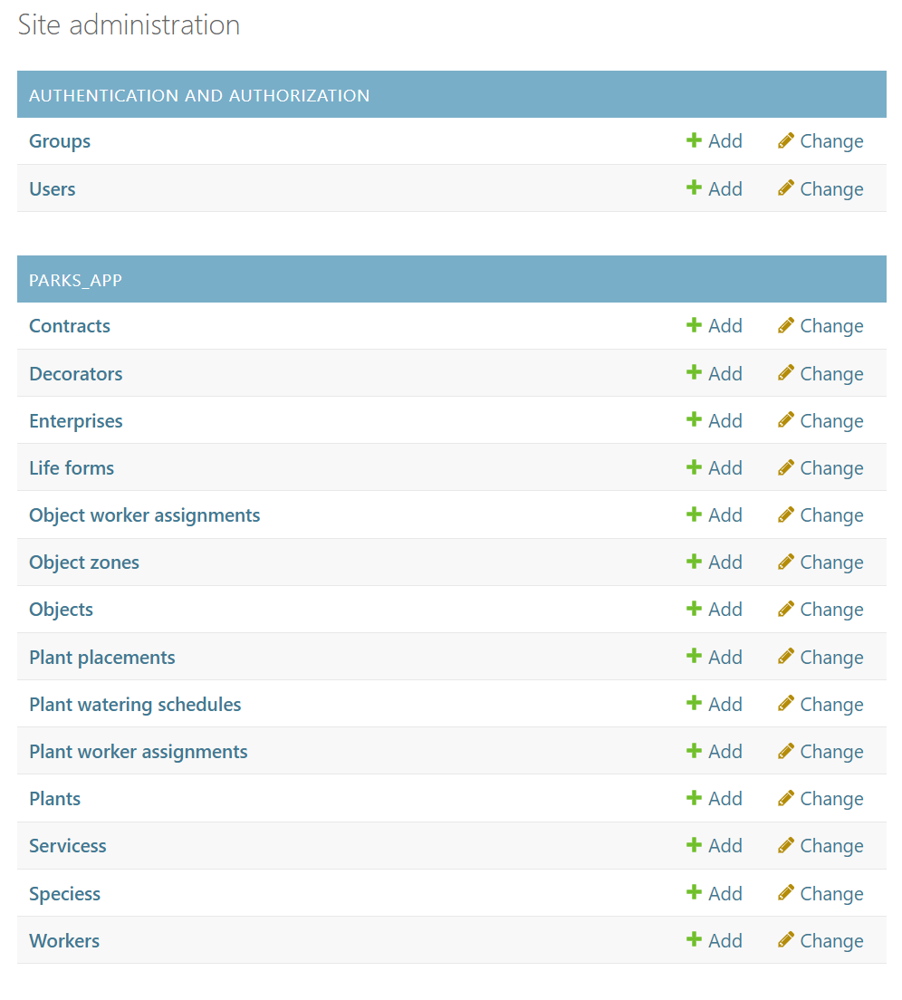
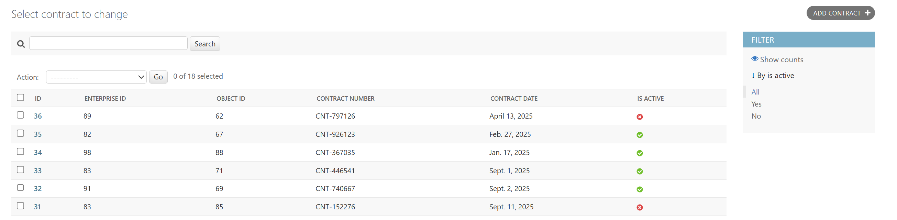

## Админка


Регистрируем сущности в админке так, чтобы можно было использовать фильтры и поиск для более удобного доступа:

```python title='parks_app/admin.py'
from django.contrib import admin
from .models import Services, Enterprise, Object, Contract, Decorator, ObjectZone, Plant, \
    PlantPlacement, LifeForm, Species, PlantWateringSchedule, Worker, PlantWorkerAssignment, ObjectWorkerAssignment


# Register your models here.

@admin.register(Services)
class ServicesAdmin(admin.ModelAdmin):
    list_display = ("id", "name")
    search_fields = ("name",)


@admin.register(Enterprise)
class EnterpriseAdmin(admin.ModelAdmin):
    list_display = ("id", "name", "legal_address", "ogrn")
    search_fields = ("name", "legal_address", "ogrn")


@admin.register(Object)
class ObjectAdmin(admin.ModelAdmin):
    list_display = ("id", "name", "is_serviced")
    list_filter = ("is_serviced",)
    search_fields = ("name",)

    ....

```

После создаем суперюзера и заходим в админку:




Далее можно заметить, что фильтрация и поиск действительно работают в классах, для которых это прописано:

