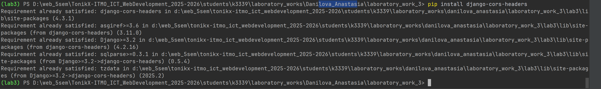

## Настройка CORS

Сначала устанавливаем библиотеку django-cors-headers:



Вписываем его в settings file:

```python
INSTALLED_APPS = [
    ## ...
    'corsheaders',
]
```

Также прописываем следующее в middleware:

```python
MIDDLEWARE = [
    'corsheaders.middleware.CorsMiddleware',
    'django.middleware.common.BrokenLinkEmailsMiddleware',
    'django.middleware.common.CommonMiddleware',
    ## ...
]
```

Включаем CORS для всех доменов:

```python
CORS_ORIGIN_ALLOW_ALL = True
```

На этом всё.