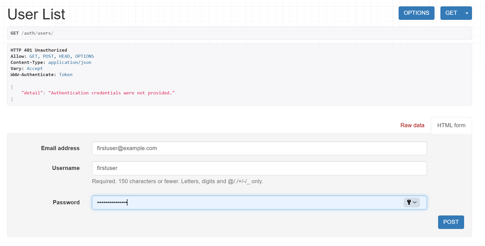
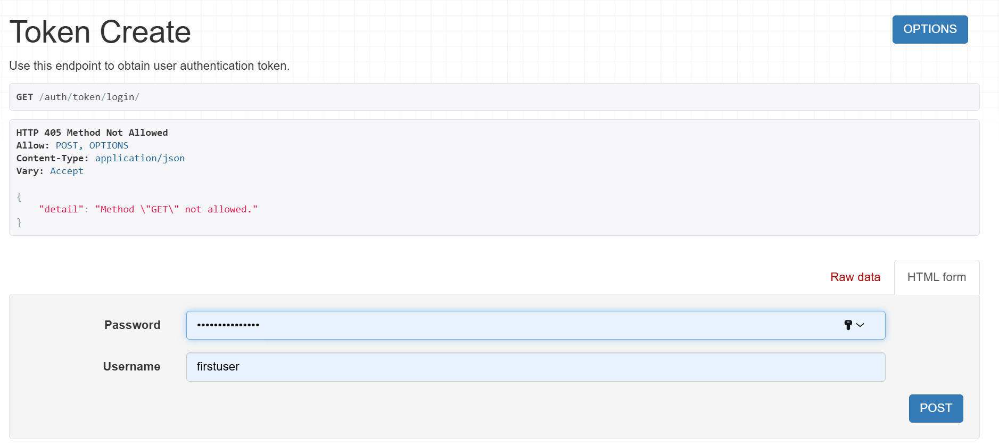
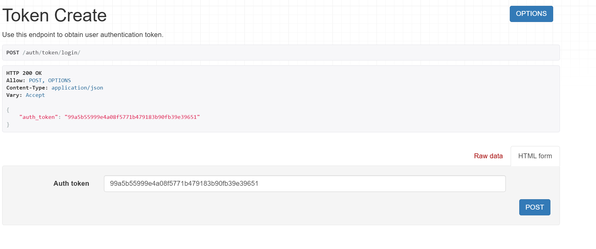
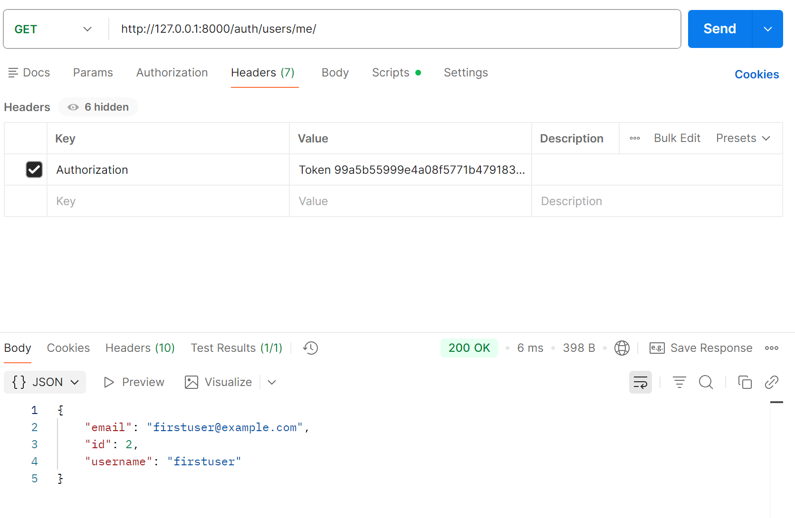
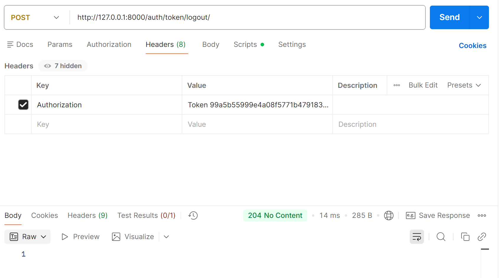
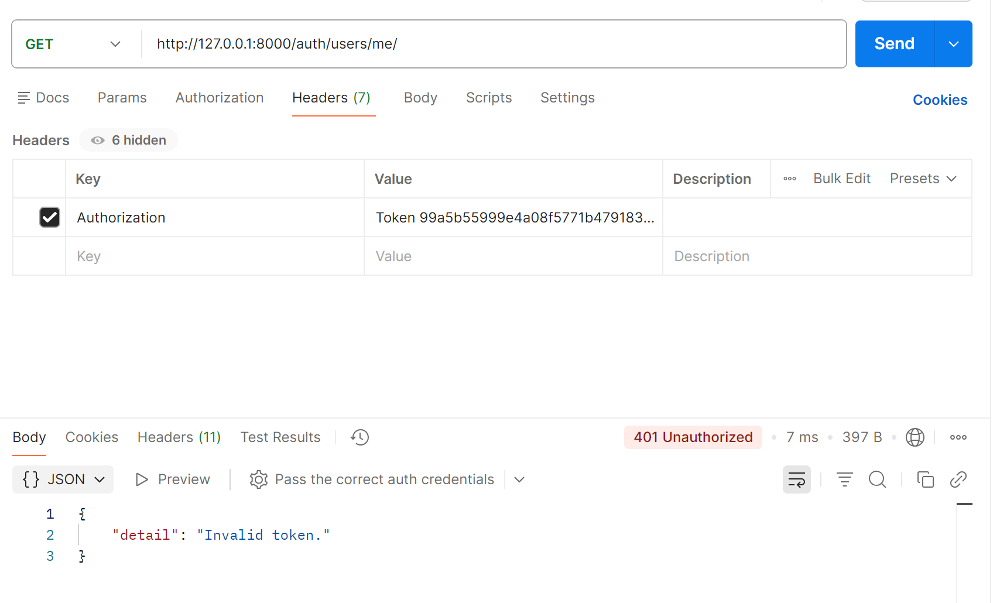

## Djoser

### 1. Настройка
Для начала на официальном сайте документации Djoser была скопирована команда импорта джозера в проект:

```shell
 pip install -U djoser
```

Далее в settings.py в INSTALLED_APPS был добавлен djoser и rest_framework.authtoken:

```python
INSTALLED_APPS = [
    'django.contrib.admin',
    'django.contrib.auth',
    'django.contrib.contenttypes',
    'django.contrib.sessions',
    'django.contrib.messages',
    'django.contrib.staticfiles',
    'rest_framework',
    'rest_framework.authtoken',
    'djoser',
    'parks_app',
    'reports_app',
]
```

В этом же файле были добавлены настройки REST-Framework:

```python
REST_FRAMEWORK = {
    'DEFAULT_AUTHENTICATION_CLASSES': (
        'rest_framework.authentication.TokenAuthentication',
    ),
}
```

Также в путях были добавлены необходимые урлы:

```python
from django.contrib import admin
from django.urls import path, include, re_path

urlpatterns = [
    path('admin/', admin.site.urls),
    path('auth/', include('djoser.urls')), # этот
    re_path(r'^auth/', include('djoser.urls.authtoken')), # и этот
    path('parks/', include('parks_app.urls')),
    path('reports/', include('reports_app.urls'))
]
```

Также была осуществлена миграция и уже после запущен сервер.

### 2. Endpoints

В результате получены ендпоинты:

#### POST /auth/users/

Проводим регистрацию пользователя: 

```text
/auth/users/
```



#### POST /auth/token/login/ 

После регистрации по введенным данным авторизации получаем токен для первого юзера:

```text
/auth/token/login/
```



В результате выполнения запроса мы получили токен:



Токен:

```text
99a5b55999e4a08f5771b479183b90fb39e39651
```

#### GET /auth/users/me/

Теперь, передав токен в заголовке запроса, можно посмотреть текущего пользователя:

```text
GET /auth/users/me/
```



#### POST /auth/token/logout/

Произведем логаут пользователя передав токен:

```text
/auth/token/logout/
```



Теперь при повторном POST-запросе /auth/users/me/ токен будет недействительным и вот что произойдет:




