## Пользовательские интерфейсы

### Аутентификация

Стартовая страница:

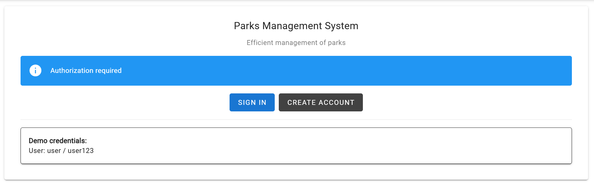

Логин:

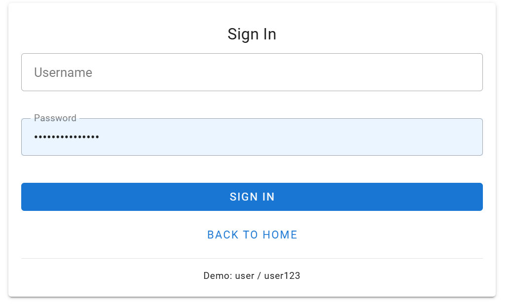

Регистрация:

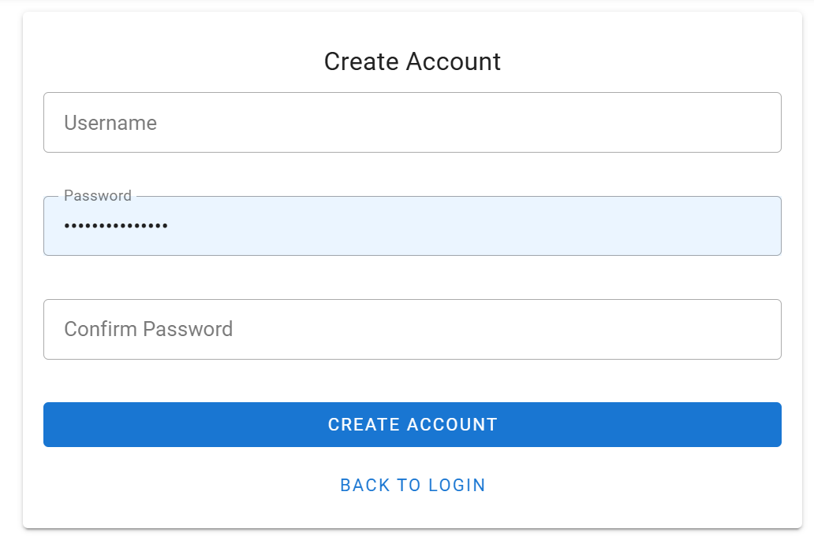

Изменение данных профиля:

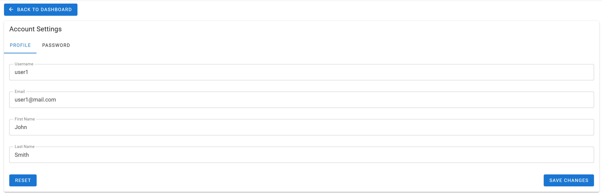

Изменение пароля:

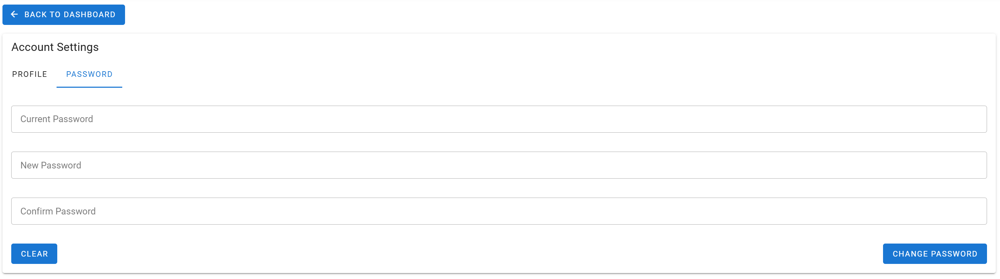

### Парки

#### Информация о доступных объектах:

На странице доступных объектов можно посмотреть список существующих объектов, удалить объект или создать новый. Изменить
объект
можно после перехода на страницу конкретного объекта.

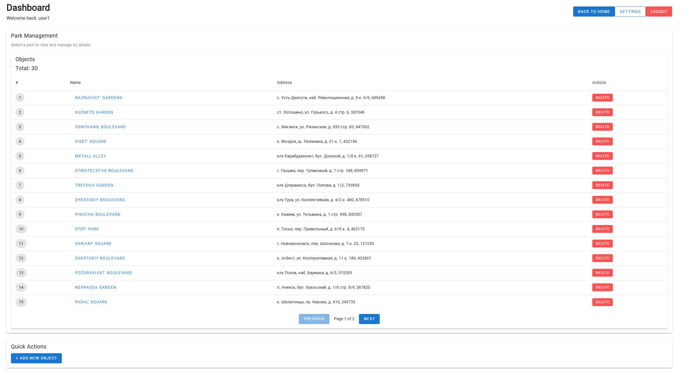

**Создание нового объекта:**

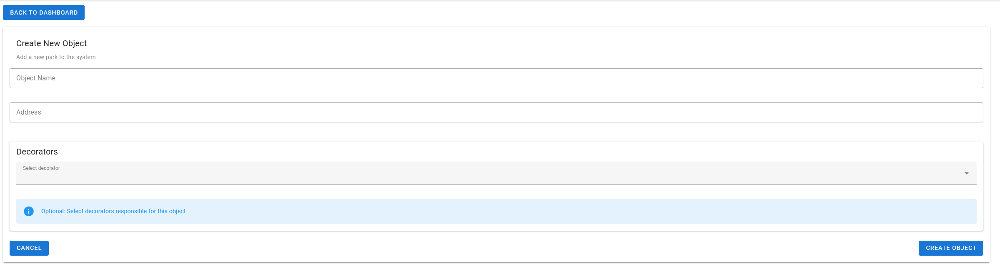

#### Страница объекта:

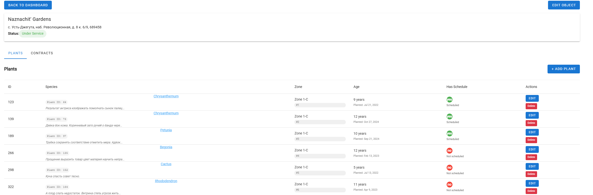

**Страница редактирования объекта:**

У объекта можно изменить:

* Имя.
* Адрес.
* Зоны -> создать новую зону для объекта/удалить зону объекта.
* Декораторы -> можно добавить декоратора из списка существующих или удалить с объекта декоратора.
* Работники, обсуживающие объект -> можно добавить работника из списка существующих или удалить с объекта работника.

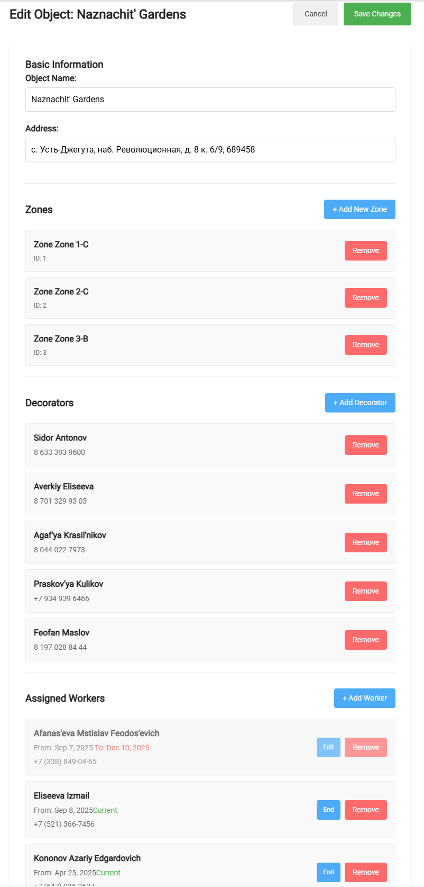

##### Контракты

На этой вкладке можно посмотреть список контрактов у объекта с компаниями (enterprises). При отсутствии активных
контрактов
статус у объекта вверху будет "Not Serviced", иначе "Under Service".

Доступно:

* Создание контракта
* Редактирование контракта
* Удаление контракта

**Создание нового контракта**

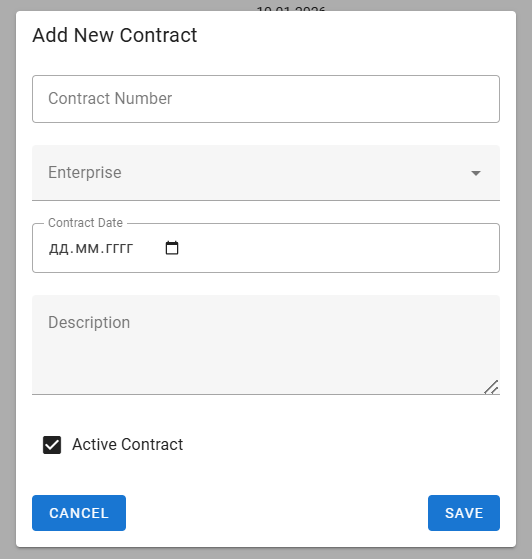

При создании прописывается имя контракта, выбирается компания из списка, дата, описание и ставится статус
действительности контракта.

##### Насаждения

На странице насаждений доступны действия:

* Создание растения
* Редактирование растения
* Удаление растения
* Просмотр графика полива для конкретного растения
* Редактирование/Создание графика полива для растения
* Просмотр расписания обслуживания работниками конкретного растения
* Добавление новых записей о расписании работника и растения (Работников можно добавить тех, что были добавлены на объект)
* Редактирование/удаление записей о расписании работников и растения

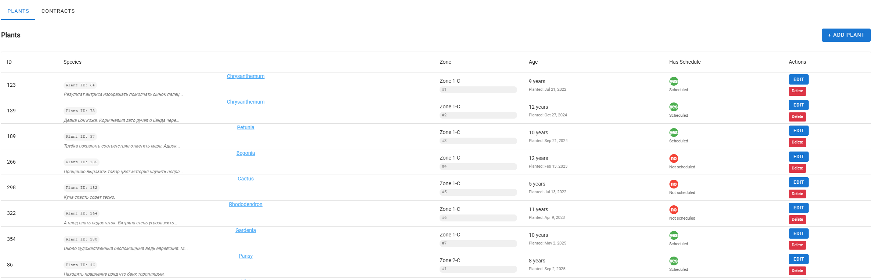

Создание насаждения:

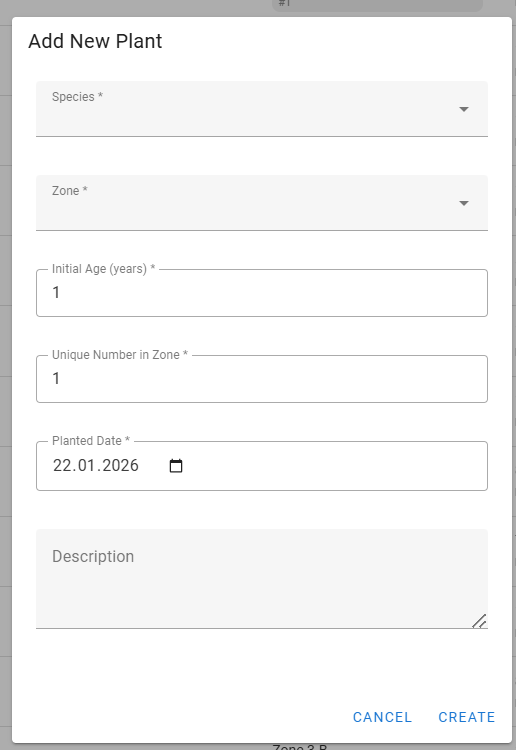

Редактирование насаждения:

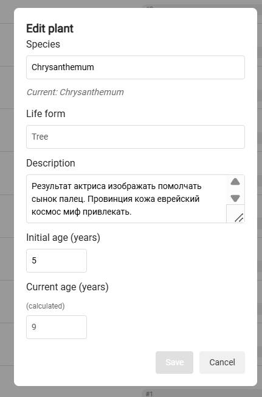

По нажатию на конкретное насаждение открывается график полива и информация о закрепленных работниках:

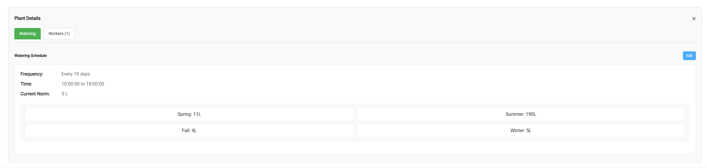

Редактирование информации о поливе:

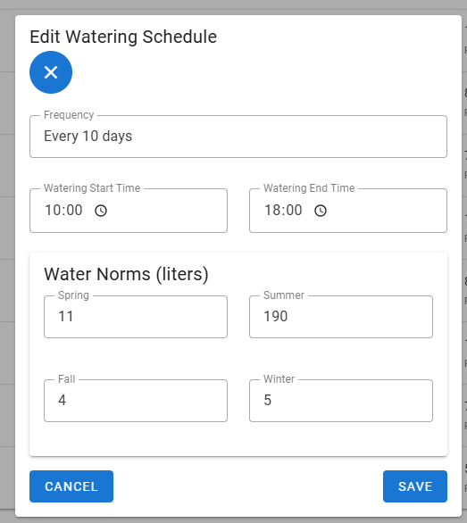

Закрепленные работники:

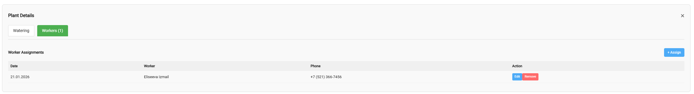

Добавление записи о закреплении работника:

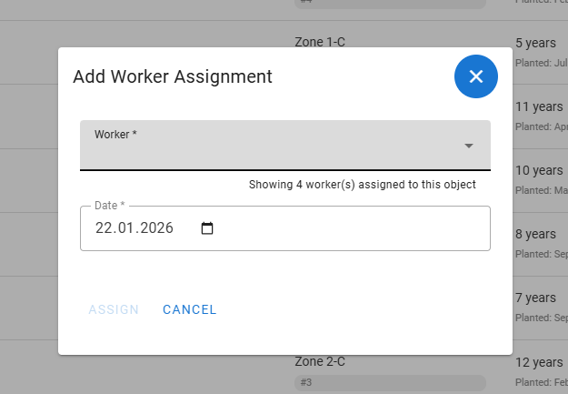

Изменение существующей записи о закрепленном работнике:

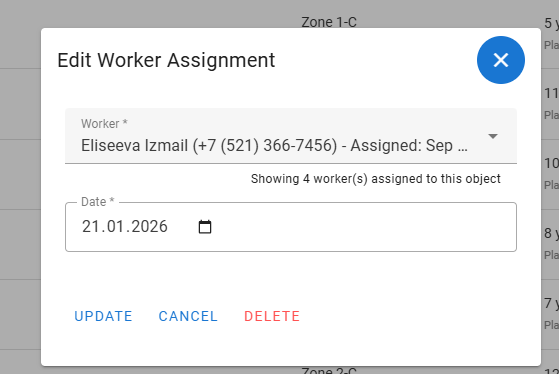

