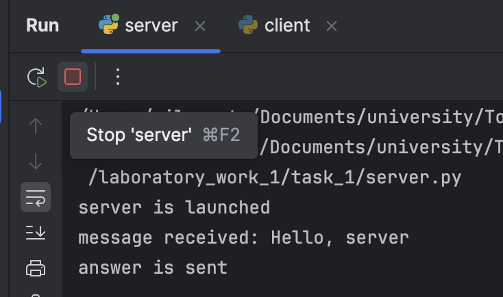
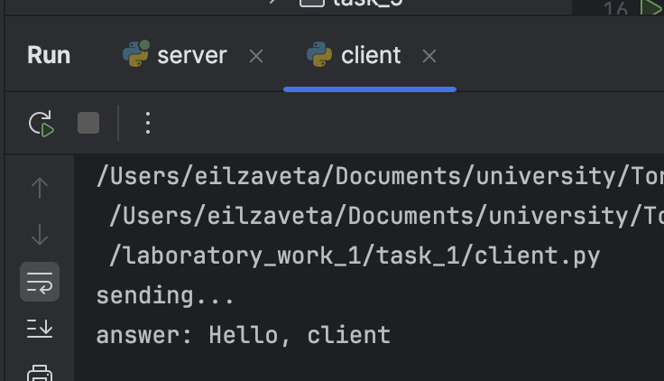

# Задание 1

---

Реализовать клиентскую и серверную часть приложения. Клиент отправляет серверу сообщение «Hello, server», и оно должно отобразиться на стороне сервера. В ответ сервер отправляет клиенту сообщение «Hello, client», которое должно отобразиться у клиента.

**Требования:**

- Обязательно использовать библиотеку socket.
- Реализовать с помощью протокола UDP.

## Выполнение работы 
Создано два файла `client.py` и `server.py`

Импортируем библиотеку `socket`, создаем объект сокет и связываем его с нужными нам портом и хостом:
```python
sock = socket.socket(socket.AF_INET, socket.SOCK_DGRAM)
sock.bind(("localhost", 8080))
```
Отправка сообщения клиенту в файле `server.py`: 
```python
data, client_address = sock.recvfrom(1024)
reply = "Hello, client"
sock.sendto(reply.encode(), client_address)
```

Получение сообщения в файле `client.py`:
```python
message = "Hello, server"
sock.sendto(message.encode(), server_address)
data, _ = sock.recvfrom(1024)
```

Так же не забываем закрыть соедиение с помощью `sock.close()`

На клиенте подключаемся к сокету, который прослушивает сервер и получаем сообщение, выводим его в консоль:



