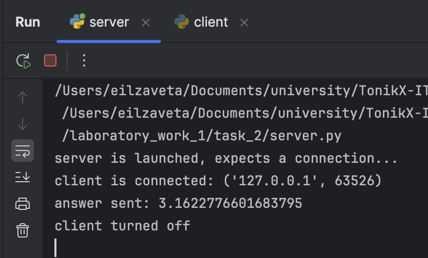
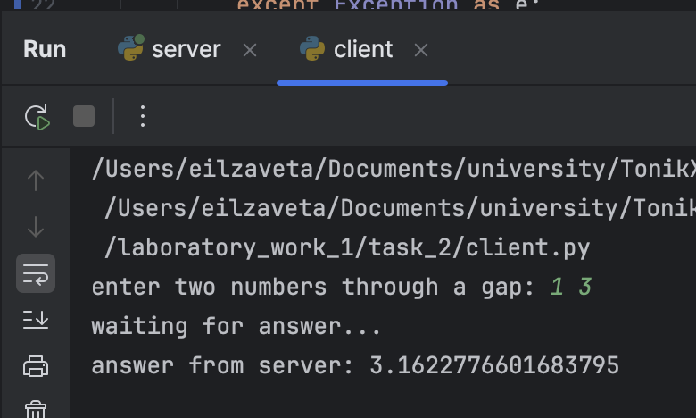

# Задание 2

--- 
Реализовать клиентскую и серверную часть приложения. Клиент запрашивает выполнение математической операции, параметры которой вводятся с клавиатуры. Сервер обрабатывает данные и возвращает результат клиенту.

Вариант 1. Теорема пифагора. 

**Требования:**

- Обязательно использовать библиотеку socket.
- Реализовать с помощью протокола TCP.

## Выполнение

Создаем TCP соединение в `client.py` и `server.py`
```python 
sock = socket.socket(socket.AF_INET, socket.SOCK_STREAM)
```

В `server.py` переводим сокет в режим ожидания входящих соединений.
```python
sock.bind(("localhost", 8080))
sock.listen(1) 
```

Далее в цикле ожидаем подключения клиента. При подключении читаем, обрабатываем данные и отправляем их:
```python
connection, client_address = sock.accept()
data = connection.recv(1024)
if not data:
    break
a, b = data.decode().split()
reply = str((float(a) ** 2 + float(b) ** 2) ** 0.5)
connection.sendall(reply.encode())
```

В файле `client.py` устанавливаем соединение с сервером и получаем данные от пользователя и отправляем серверу
```python
sock.connect(server_address)
message = input("enter two numbers through a gap: ")
sock.sendall(message.encode())
```
Ответ сервера: 
```python 
data = sock.recv(1024)
print(f"answer from server: {data.decode()}")
```



