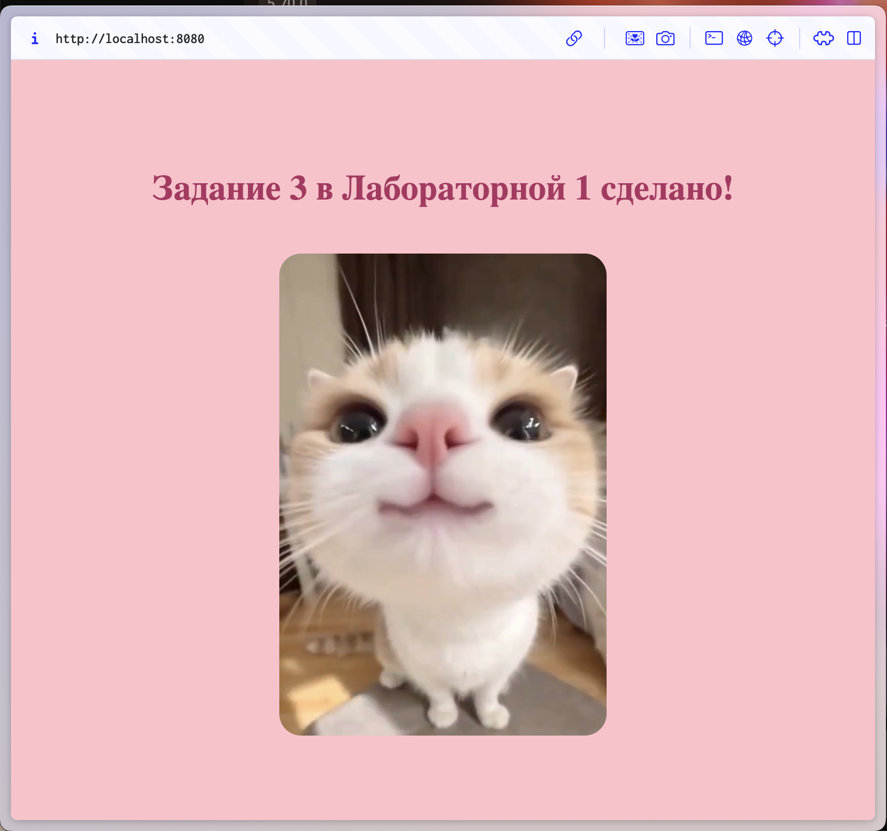
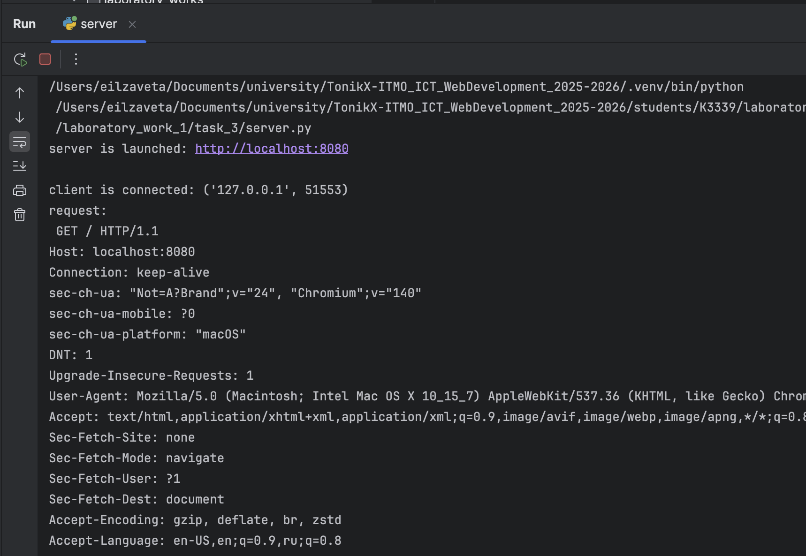

# Задание 3

---
Реализовать серверную часть приложения. Клиент подключается к серверу, и в ответ получает HTTP-сообщение, содержащее HTML-страницу, которая сервер подгружает из файла index.html.

**Требования:**

- Обязательно использовать библиотеку socket.

## Выполнение 
В этом задании происходит инициализация сервера, создание и настройка сокета и запуск прослушивания.

```python
host, port = "localhost", 8080
server_socket = socket.socket(socket.AF_INET, socket.SOCK_STREAM)
server_socket.bind((host, port))
server_socket.listen(1)
```
Основной цикл обработки запросов в `server.py`: 
```python
    while True:
        client_socket, client_address = server_socket.accept()
        print(f"\nclient is connected: {client_address}")

        request = client_socket.recv(1024).decode("utf-8")
        print("request:\n", request)

        try:
            with open("index.html", "r", encoding="utf-8") as f:
                body = f.read()
            response = (
                "HTTP/1.1 200 OK\r\n"
                "Content-Type: text/html; charset=utf-8\r\n"
                f"Content-Length: {len(body.encode('utf-8'))}\r\n"
                "Connection: close\r\n"
                "\r\n"
                f"{body}"
            )
        except FileNotFoundError:
            response = (
                "HTTP/1.1 404 Not Found\r\n"
                "Content-Type: text/html; charset=utf-8\r\n"
                "Connection: close\r\n"
                "\r\n"
                "<h1>404 — file index.html not found</h1>"
            )

        client_socket.sendall(response.encode("utf-8"))
        client_socket.close()
```


