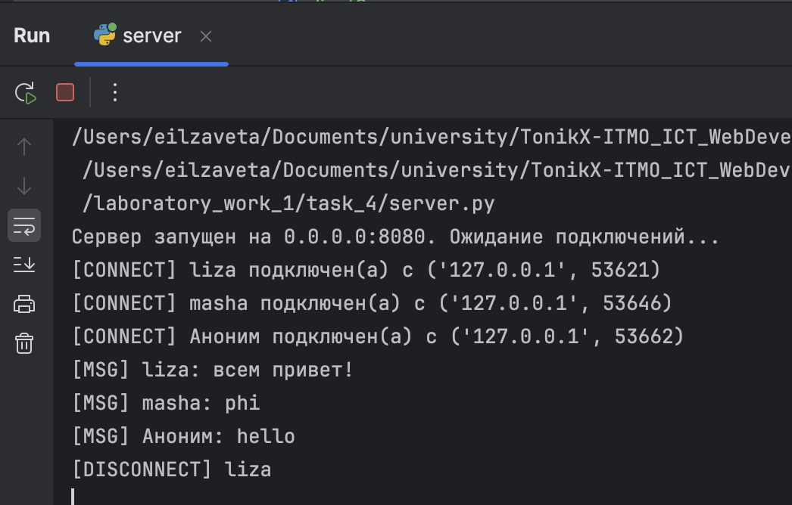
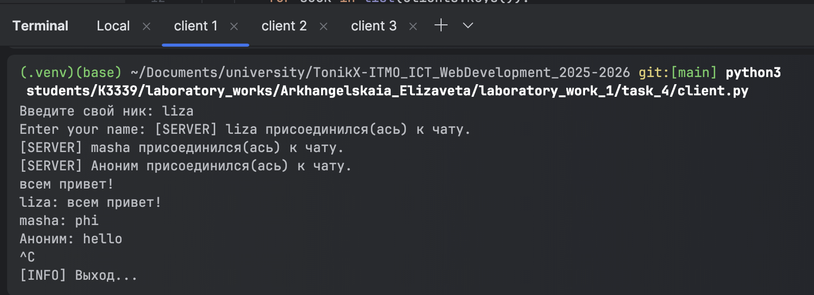
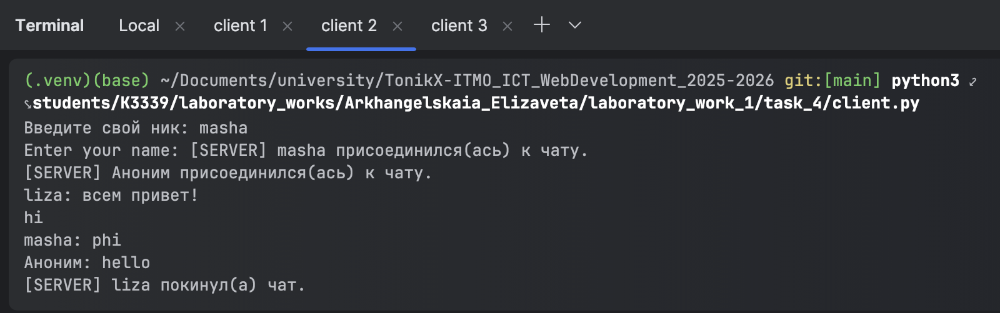
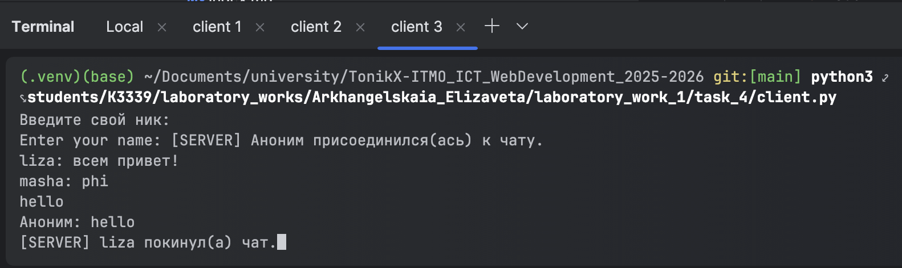

# Задание 4

---

Реализовать двухпользовательский или многопользовательский чат. Для максимального количества баллов реализуйте многопользовательский чат.

**Требования:**

- Обязательно использовать библиотеку socket.
- Для многопользовательского чата необходимо использовать библиотеку threading.

**Реализация:**
- Протокол TCP: 100% баллов.
- Протокол UDP: 80% баллов.
- Для UDP используйте threading для получения сообщений на клиенте.
- Для TCP запустите клиентские подключения и обработку сообщений от всех пользователей в потоках. Не забудьте сохранять пользователей, чтобы отправлять им сообщения.

## Выполнение 

Был реализован многопользовательский чат с использованием протокола TCP. 

В файле `client.py` пользователь подключается и может отправлять всем сообщения. 
Запускается отдельный поток для параллельного приёма сообщений от сервера.
```python
threading.Thread(target=listen_for_messages, args=(sock,), daemon=True).start()
```
`target` это функция, которую должен выполнить поток. Она отвечает за получение и отображение сообщений от сервера. 

```python
def listen_for_messages(sock):
    while True:
        try:
            data = sock.recv(4096)
            if not data:
                print("[INFO] Соединение с сервером закрыто.")
                break
            sys.stdout.write(data.decode("utf-8"))
            sys.stdout.flush()
        except:
            break
```

Отправка сообщений происходит в цикле: 
```python
try:
    while True:
        line = input()
        line = line.encode("utf-8", errors="replace").decode("utf-8")
        sock.sendall((line + "\n").encode("utf-8"))
except (KeyboardInterrupt, EOFError):
    print("\n[INFO] Выход...")
finally:
    sock.close()
```

В файле `server.py` сервер запускается так же в отдельном потоке. Каждому подключившемуся клиенту создаётся отдельный поток в основном цикле.
```python
while True:
    client_sock, addr = srv.accept()
    thread = threading.Thread(target=handle_client, args=(client_sock, addr), daemon=True)
    thread.start()
```
```python
clients_lock = threading.Lock()
clients = {}
```
`clients` — хранит все подключённые клиенты.

`clients_lock` — гарантирует, что несколько потоков не будут одновременно изменять словарь.

В этой функции клиент подключается и отправляет сообщения. 
```python
def handle_client(client_sock, addr):
    try:
        client_sock.sendall(b'Enter your name: ')
        name_bytes = recv_until_newline(client_sock)
        if not name_bytes:
            remove_client(client_sock)
            return
        username = name_bytes.decode('utf-8').strip()
        if not username:
            username = f'{addr[0]}:{addr[1]}'

        with clients_lock:
            clients[client_sock] = username

        print(f'[CONNECT] {username} подключен(а) с {addr}')
        broadcast(f'[SERVER] {username} присоединился(ась) к чату.\r\n'.encode('utf-8'))
        while True:
            data = recv_until_newline(client_sock)
            if not data:
                break
            text = data.decode('utf-8', errors='replace').rstrip('\n')
            message = f'{username}: {text}\n'
            print(f'[MSG] {message.strip()}')
            broadcast(message.encode('utf-8'))

    except Exception as e:
        print(f'[ERROR] Ошибка с клиентом {addr}: {e}')
    finally:
        remove_client(client_sock)
```

Отправка сообщений всем: 
```python
def broadcast(message: bytes):
    with clients_lock:
        for sock in list(clients.keys()):
            try:
                sock.sendall(message)
            except:
                remove_client(sock)
```

Чтение строки до `\n`:
```python
def recv_until_newline(sock):
    buffer = bytearray()
    try:
        while True:
            chunk = sock.recv(1024)
            if not chunk:
                return b''
            buffer.extend(chunk)
            if b'\n' in chunk:
                break
    except:
        return b''
    idx = buffer.find(b'\n') + 1
    return bytes(buffer[:idx])
```

Отключение клиента от чата: 
```python
def remove_client(sock):
    with clients_lock:
        name = clients.pop(sock, None)
    try:
        sock.close()
    except:
        pass
    if name:
        print(f'[DISCONNECT] {name}')
        broadcast(f'[SERVER] {name} покинул(а) чат.\n'.encode('utf-8'))
```




