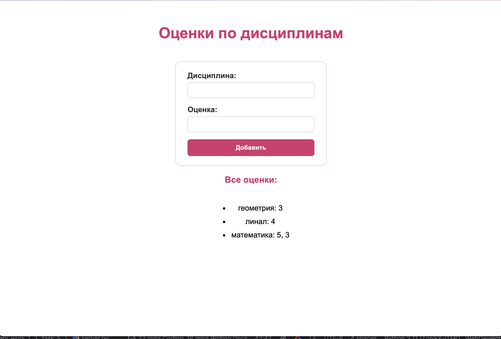

# Задание 5

--- 

Написать простой веб-сервер для обработки GET и POST HTTP-запросов с помощью библиотеки socket в Python.

**Задание:**

Сервер должен:
1. Принять и записать информацию о дисциплине и оценке по дисциплине. 
2. Отдать информацию обо всех оценках по дисциплинам в виде HTML-страницы.

## Выполнение 

В файле `index.html` хранится основная часть кода для html. 

В файле `server.py` есть функция `generate_html`, которая генерирует данные с добавлением дисциплины: 
```python
def generate_html():
    with open("index.html", "r", encoding="utf-8") as f:
        html = f.read()

    for item in sorted(grades):
        html += f"<li>{item}: " + ", ".join(grades[item])+ "</li>"
    html += """
        </ul>
    </body>
    </html>
    """
    return html
```

```python
def main():
    with socket.socket(socket.AF_INET, socket.SOCK_STREAM) as s:
        s.bind((HOST, PORT))
        s.listen(1)
        print(f"server is launched: http://{HOST}:{PORT}")

        while True:
            conn, addr = s.accept()
            with conn:
                request = conn.recv(1024).decode('utf-8')
                if not request:
                    continue
                try:
                    headers = request.split('\r\n')
                    method, path, _ = headers[0].split()
                except ValueError:
                    continue

                if method == "POST":
                    body = request.split('\r\n\r\n')[1]
                    data = parse_qs(body)
                    subject = data.get('subject', [''])[0]
                    grade = data.get('grade', [''])[0]
                    if subject not in GRADES:
                        GRADES[subject] = [grade]
                    else:
                        GRADES[subject].append(grade)

                response_body = generate_html()
                response = (
                        "HTTP/1.1 200 OK\r\n"
                        "Content-Type: text/html; charset=utf-8\r\n"
                        f"Content-Length: {len(response_body.encode('utf-8'))}\r\n"
                        "Connection: close\r\n"
                        "\r\n" +
                        response_body
                )

                conn.sendall(response.encode('utf-8'))
```


