### Задание 1:

Воспользуйтесь проектом из практики 2.1

Напишите запрос на создание 6-7 новых автовладельцев и 5-6 автомобилей, каждому автовладельцу назначьте удостоверение и от 1 до 3 автомобилей. 
Задание можете выполнить либо в интерактивном режиме интерпретатора, либо в отдельном python-файле. 
Результатом должны стать запросы и отображение созданных объектов. 

**Выполнение:**

Создание новых автовладельцев:

```python
from project_first_app.models import * 

man1 = CarOwner.objects.create(surname="Ivanov", name="Ivan", birth_date="2002-12-12", passport_number="1111111", address="Moscow", nationality="rus", username='ivan')
man2 = CarOwner.objects.create(surname="Petrov", name="Petr", birth_date="2002-04-04", passport_number="22222", address="Moscow", nationality="rus", username='petr')
man3 = CarOwner.objects.create(surname="Arkhangelskaia", name="Elizaveta", birth_date="2004-03-21", passport_number="3333333", address="Saint-Petersburg", nationality="rus", username='Liza')
man4 = CarOwner.objects.create(surname="Smirnova", name="Maria", birth_date="2003-03-13", passport_number="123456", address="Vladivostok", nationality="rus", username='masha')
man5 = CarOwner.objects.create(surname="Popov", name="Dmitry", birth_date="1995-07-06", passport_number="345612", address="Vladivostok", nationality="rus", username='dima')
man6 = CarOwner.objects.create(surname="Fedorova", name="Xenia", birth_date="1993-09-10", passport_number="123456", address="Saint-Petersburg", nationality="rus", username='xenia')
```

Создание и присваивание автовладельцам водительские права: 

```python
licence1 = DriverLicense.objects.create(id_owner=man1, number="12345", license_type="B", date_of_issue="2030-12-12")
licence2 = DriverLicense.objects.create(id_owner=man2, number="234567", license_type="B", date_of_issue="2029-10-09")
licence3 = DriverLicense.objects.create(id_owner=man3, number="7823672", license_type="BC", date_of_issue="2026-03-03")
licence4 = DriverLicense.objects.create(id_owner=man4, number="3278", license_type="BC", date_of_issue="2027-10-03")
licence5 = DriverLicense.objects.create(id_owner=man5, number="267468", license_type="AB", date_of_issue="2035-05-03")
licence6 = DriverLicense.objects.create(id_owner=man6, number="274864", license_type="AB", date_of_issue="2040-05-06")
```

Создание новых автомобилей: 

```python
car1 = Car.objects.create(number="a123bc", car_brand="mersedes-benz", car_model="e-class", car_color="red")
car2 = Car.objects.create(number="b234cd", car_brand="mersedes", car_model="s-class", car_color="black")
car3 = Car.objects.create(number="c345de", car_brand="toyota", car_model="land criuser", car_color="white")
car4 = Car.objects.create(number="d888dd", car_brand="toyota", car_model="land criuser prado", car_color="black")
car5 = Car.objects.create(number="m111mm", car_brand="porsh", car_model="911", car_color="dark blue")
```

Cозданные автовладельцы, присвоенные им права; созданные машины

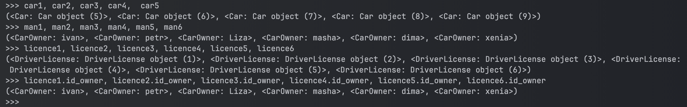

Владение автомобилями: 
```python
ownership1 = Ownership.objects.create(id_owner=man1, id_car=car1, start_date="2018-01-01", end_date="2019-12-12")
ownership2 = Ownership.objects.create(id_owner=man1, id_car=car2, start_date="2019-01-13", end_date="2020-12-30")
ownership3 = Ownership.objects.create(id_owner=man1, id_car=car3, start_date="2019-01-14", end_date="2021-01-30")

ownership4 = Ownership.objects.create(id_owner=man2, id_car=car2, start_date="2021-01-25", end_date="2025-09-09")
ownership5 = Ownership.objects.create(id_owner=man2, id_car=car4, start_date="2023-07-08", end_date="2024-08-10")

ownership6 = Ownership.objects.create(id_owner=man3, id_car=car3, start_date="2022-11-11", end_date="2025-04-11")
ownership7 = Ownership.objects.create(id_owner=man3, id_car=car5, start_date="2013-04-07", end_date="2024-11-11")

ownership8 = Ownership.objects.create(id_owner=man4, id_car=car1, start_date="2013-10-27", end_date="2017-11-30")
ownership9 = Ownership.objects.create(id_owner=man5, id_car=car2, start_date="2018-11-12", end_date="2019-12-11")
ownership10 = Ownership.objects.create(id_owner=man5, id_car=car4, start_date="2017-01-01", end_date="2022-01-01")
ownership11 = Ownership.objects.create(id_owner=man6, id_car=car4, start_date="2025-01-01", end_date="2025-11-03")
```

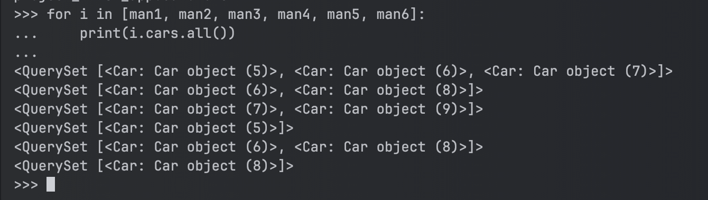

---

### Задание 2:

Обновленные классы с учетом `related_name`:

```python
from django.contrib.auth.models import AbstractUser
from django.db import models


class CarOwner(AbstractUser):
    surname = models.CharField(max_length=30)
    name = models.CharField(max_length=30)
    birth_date = models.DateField(null=True, blank=True)
    passport_number = models.CharField(max_length=20, default="Unknown", blank=True)
    address = models.CharField(max_length=255, default="Unknown", blank=True)
    nationality = models.CharField(max_length=50, default="Unknown", blank=True)
    cars = models.ManyToManyField('Car', through='Ownership')

    def __str__(self):
        return f'{self.surname} {self.name}, {self.birth_date} from {self.address}'


class DriverLicense(models.Model):
    id_owner = models.ForeignKey(CarOwner, on_delete=models.CASCADE, null=False, related_name='driver_licenses')
    number = models.CharField(max_length=10, null=False)
    license_type = models.CharField(max_length=10, null=False)
    date_of_issue = models.DateField(null=False)

    def __str__(self):
        return f'{self.number} {self.license_type}'

class Car(models.Model):
    number = models.CharField(max_length=15, null=False)
    car_brand = models.CharField(max_length=20, null=False)
    car_model = models.CharField(max_length=20, null=False)
    car_color = models.CharField(max_length=30, null=False)
    owners = models.ManyToManyField(CarOwner, through='Ownership')

    def __str__(self):
        return f'{self.car_brand} {self.car_model} {self.car_color} {self.number}'


class Ownership(models.Model):
    id_owner = models.ForeignKey(CarOwner, on_delete=models.CASCADE, null=False, related_name='ownerships')
    id_car = models.ForeignKey(Car, on_delete=models.CASCADE, null=False, related_name='ownerships' )
    start_date = models.DateField(null=False)
    end_date = models.DateField(null=True)

    def __repr__(self):
        return f'owner: {self.id_owner.__str__()}, car: {self.id_car.__str__()}. c {self.start_date} по {self.end_date}'
```

**Запросы:**

Выведете все машины марки “toyota”
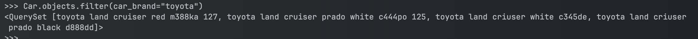

Найти всех водителей с именем “Ivan”
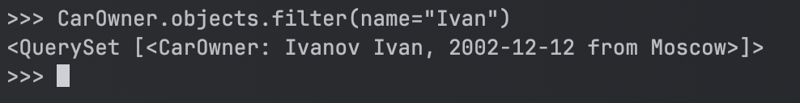

Взяв любого случайного владельца получить его id, и по этому id получить экземпляр удостоверения в виде объекта модели (можно в 2 запроса)
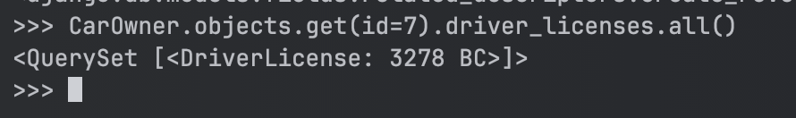

Вывести всех владельцев красных машин (или любого другого цвета, который у вас присутствует)
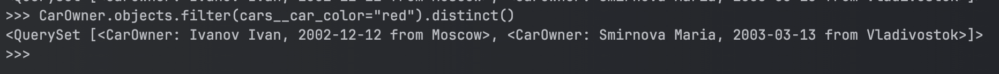

Найти всех владельцев, чей год владения машиной начинается с 2020(или любой другой год, который присутствует у вас в базе)
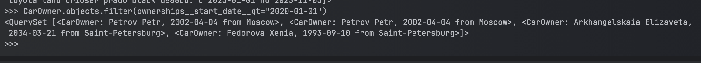

---

### Задание 3:

**Запросы:**

Вывод даты выдачи самого старшего водительского удостоверения
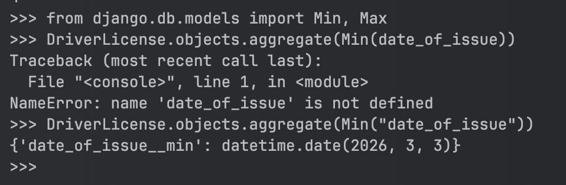

Укажите самую позднюю дату владения машиной, имеющую какую-то из существующих моделей в вашей базе
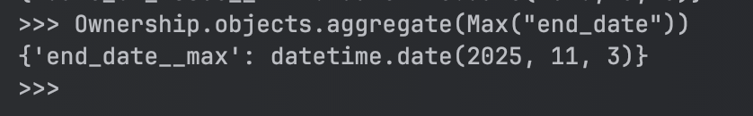

Выведите количество машин для каждого водителя
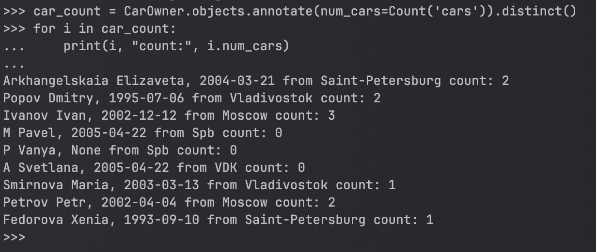

Подсчитайте количество машин каждой марки
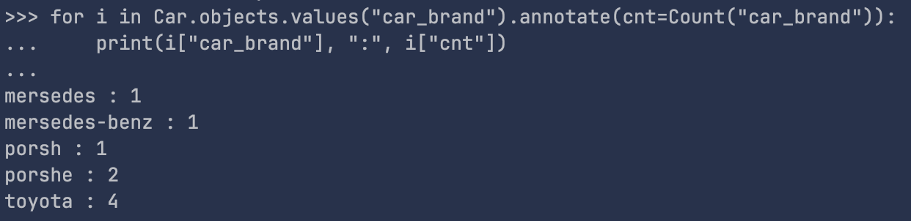

Отсортируйте всех автовладельцев по дате выдачи удостоверения 
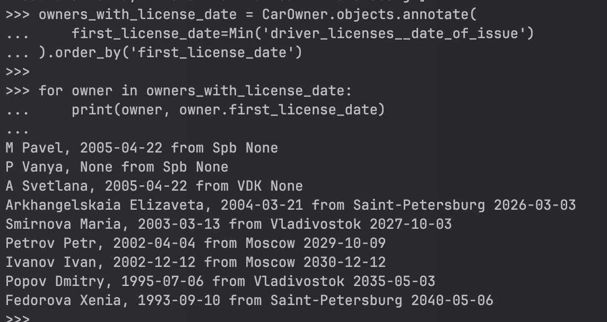