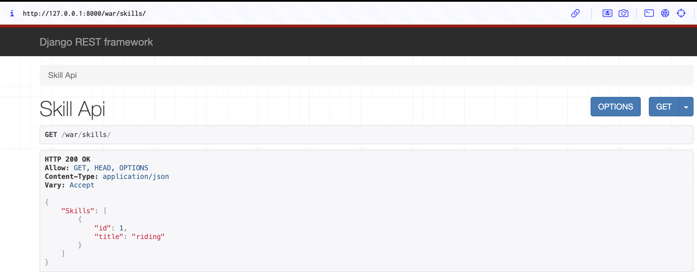
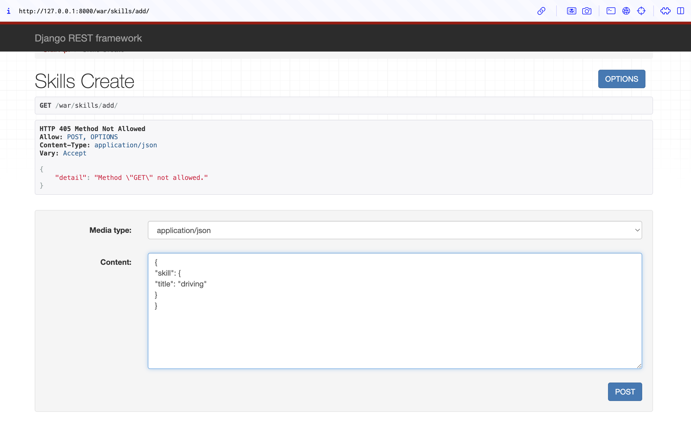
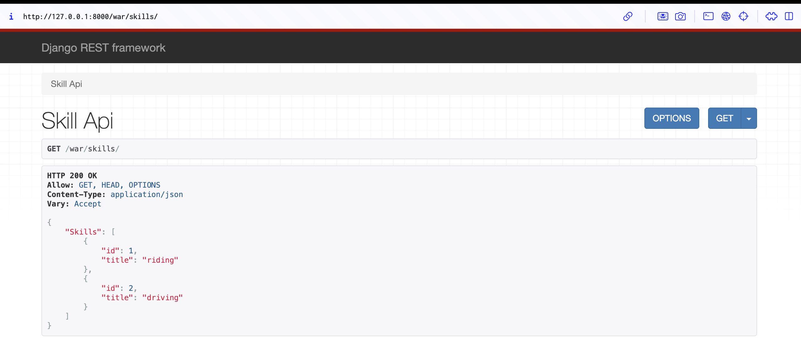
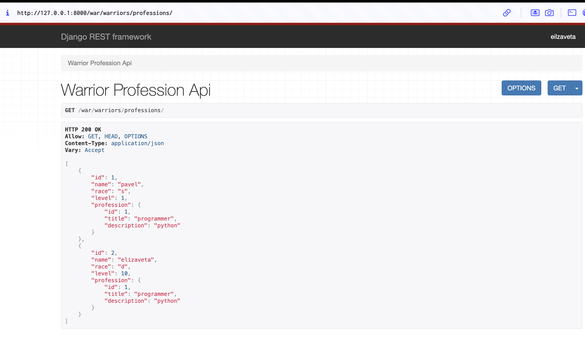
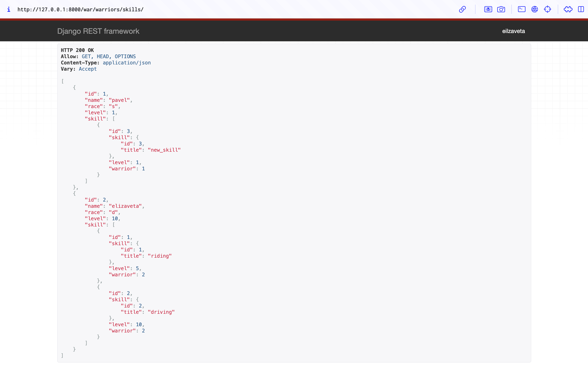
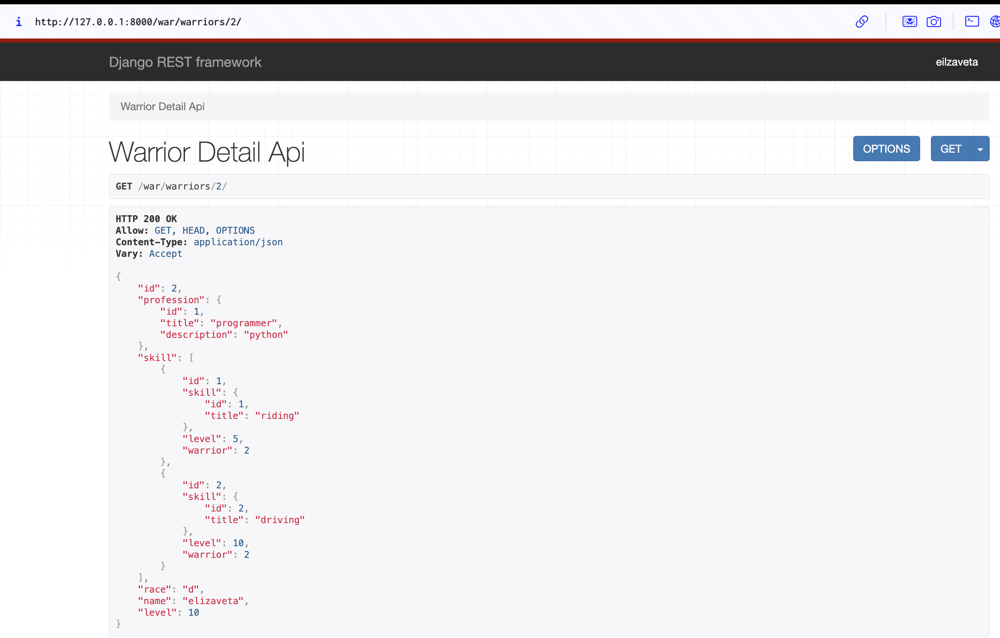
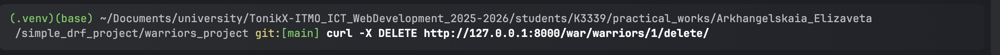
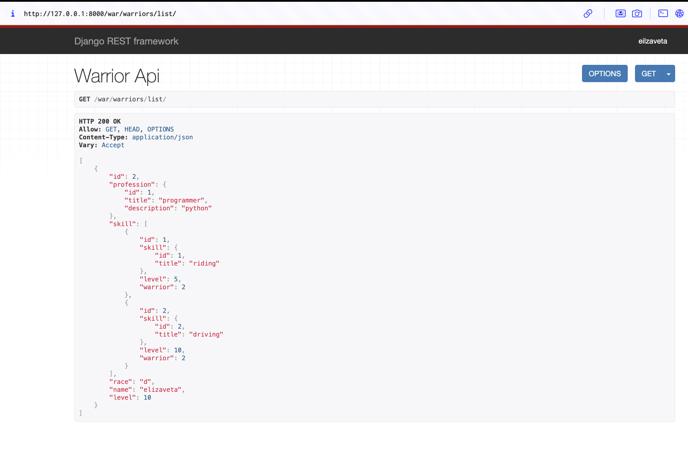
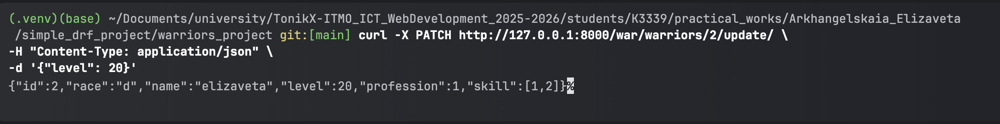
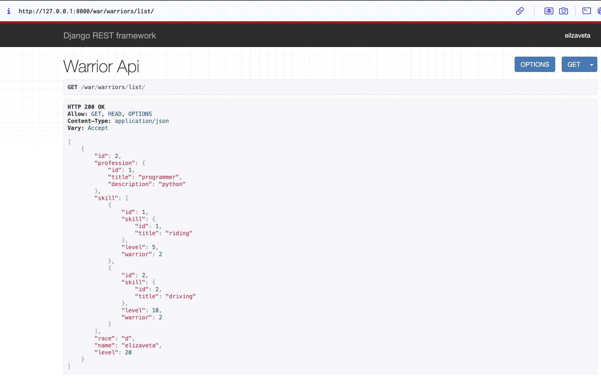

## Практическое задание 3.2


1. Реализовать эндпоинты для добавления и просмотра скилов методом, описанным в пункте выше.

`serializers.py`
```python
class SkillSerializer(serializers.ModelSerializer):
    class Meta:
        model = Skill
        fields = "__all__"

class SkillCreateSerializer(serializers.ModelSerializer):
    class Meta:
        model = Skill
        fields = "__all__"
```

`views.py`
```python
class SkillAPIView(APIView):
    def get(self, request):
        skills = Skill.objects.all()
        serializer = SkillSerializer(skills, many=True)
        return Response({"Skills": serializer.data})


class SkillsCreateView(APIView):
    def post(self, request):
        skill = request.data.get("skill")
        serializer = SkillCreateSerializer(data=skill)

        if serializer.is_valid(raise_exception=True):
            skill_saved = serializer.save()

        return Response({"Success": "Skill '{}' created succesfully.".format(skill_saved.title)})
```

`urls.py`
```python
urlpatterns = [
   path('warriors/', WarriorAPIView.as_view()),
   path('profession/create/', ProfessionCreateView.as_view()),
   path('skills/', SkillAPIView.as_view()),
   path('skills/add/', SkillsCreateView.as_view()),
]
```





--- 

2. Вывод полной информации о всех воинах и их профессиях (в одном запросе).
3. Вывод полной информации о всех воинах и их скилах (в одном запросе).

Создаем в `views.py` два класса, один отвечает за задачу 2, второй за задачу 3. 
```python
class WarriorProfessionAPIView(generics.ListAPIView):
    queryset = Warrior.objects.select_related('profession').all()
    serializer_class = WarriorSerializer

    def get_serializer(self, *args, **kwargs):
        serializer = super().get_serializer(*args, **kwargs)
        allowed = ['id', 'name', 'race', 'level', 'profession']
        serializer.child.fields = {field: serializer.child.fields[field] for field in allowed}
        return serializer

class WarriorSkillsAPIView(generics.ListAPIView):
    queryset = Warrior.objects.prefetch_related('skillofwarrior_set__skill').all()
    serializer_class = WarriorSerializer

    def get_serializer(self, *args, **kwargs):
        serializer = super().get_serializer(*args, **kwargs)
        allowed = ['id', 'name', 'race', 'level', 'skill']
        serializer.child.fields = {field: serializer.child.fields[field] for field in allowed}
        return serializer
```

Обновленные `serializers.py`
```python
class SkillOfWarriorSerializer(serializers.ModelSerializer):
    skill = SkillSerializer()

    class Meta:
        model = SkillOfWarrior
        fields = "__all__"

class WarriorSerializer(serializers.ModelSerializer):
    profession = ProfessionSerializer()
    skill = SkillOfWarriorSerializer(source='skillofwarrior_set', many=True)
    class Meta:
        model = Warrior
        fields = "__all__"
```

Так же добавляем в `urls.py` пути: 
```python
path('warriors/professions/', WarriorProfessionAPIView.as_view()),
path('warriors/skills/', WarriorSkillsAPIView.as_view())
```

Результаты: 




---
4. Вывод полной информации о воине (по id), его профессиях и скилах.
Во `views.py` создаем новый класс, используем RetrieveAPIView, чтобы выбрать нужного воина по `id`
```python
class WarriorDetailAPIView(generics.RetrieveAPIView):
    serializer_class = WarriorSerializer
    queryset = Warrior.objects.all()
    lookup_field = 'id'
```
Так же добавляем в `urls.py` следующий путь `path('warriors/<int:id>/', WarriorDetailAPIView.as_view())`

Результат по запросу с `id=2`:

---
5. Удаление воина по id.

`views.py`
```python
class WarriorDestroyAPIView(generics.DestroyAPIView):
    serializer_class = WarriorSerializer
    queryset = Warrior.objects.all()
    lookup_field = 'id'
```

В `urls.py` добавляем `path('warriors/<int:id>/delete', WarriorDestroyAPIView.as_view())`



В результате запись с `id=1` удалилась, это можно проверить по пути `war/warriors/list`


---
6. Редактирование информации о воине.
`views.py`
```python
class WarriorUpdateAPIView(generics.UpdateAPIView):
    queryset = Warrior.objects.all()
    serializer_class = WarriorUpdateSerializer
    lookup_field = 'id'
```
В `urls.py` добавляем `path('warriors/<int:id>/update', WarriorUpdateAPIView.as_view())`



В результате в записи с `id=2` изменился уровень на 20: 

