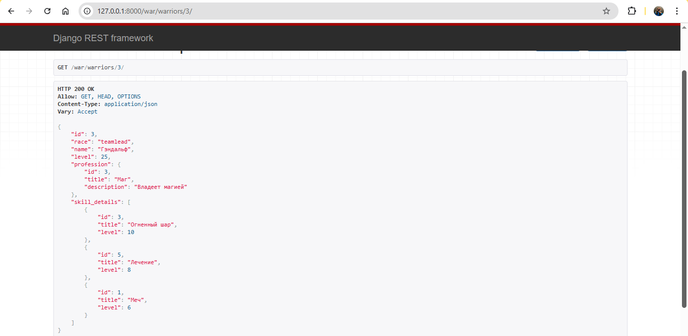

# Практическое задание 3.2. Django rest framework

## Практическое задание:

Реализовать ендпоинты:
- Вывод полной информации о всех войнах и их профессиях (в одном запросе).
- Вывод полной информации о всех войнах и их скилах (в одном запросе).
- Вывод полной информации о войне (по id), его профессиях и скилах.
- Удаление война по id.
- Редактирование информации о войне.

## Решение

Я создала приложение по методичке и добавила тестовые данные (создала несколько воинов, чтобы протестировать эндпоинты).

Вот, например, эндпоинт с отображением полной информации о воине:

Код приложения здесь: [warriors_app](https://github.com/viktoriaskk/TonikX-ITMO_ICT_WebDevelopment_2025-2026/tree/main/Students/K3341/Skoblilova_Vika/lab_3/pr/simple_drf_project/warriors_app)

Код создания воинов здесь: [pr2.py](https://github.com/viktoriaskk/TonikX-ITMO_ICT_WebDevelopment_2025-2026/blob/main/Students/K3341/Skoblilova_Vika/lab_3/pr/simple_drf_project/pr2.py)

### Пример работы

