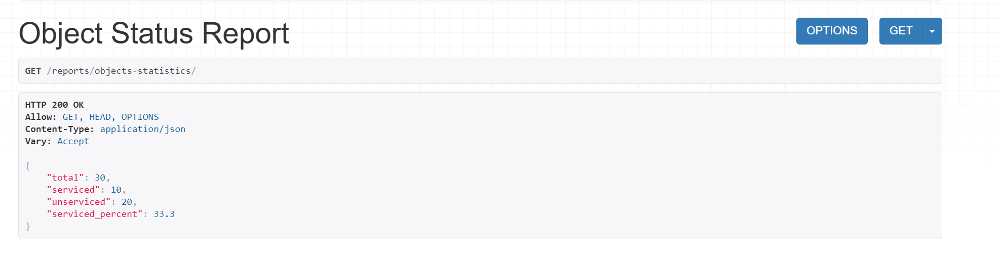
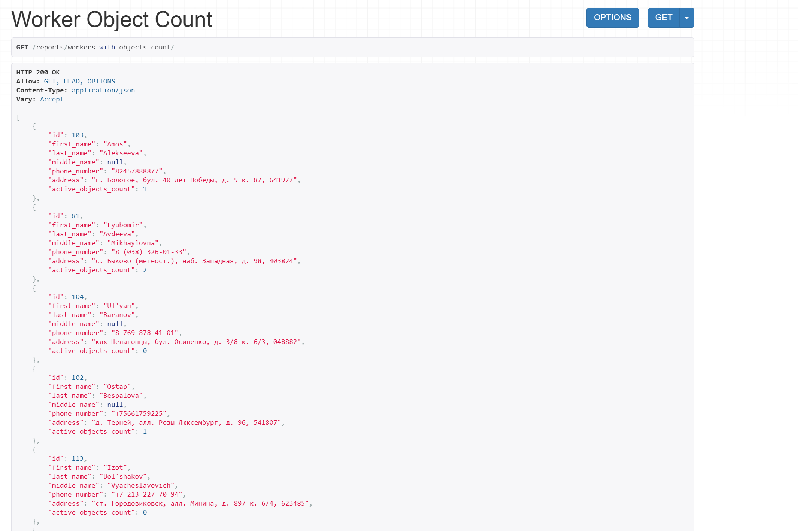
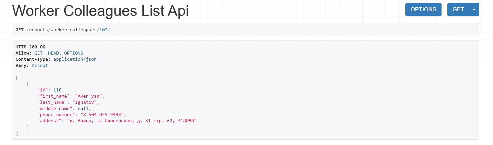
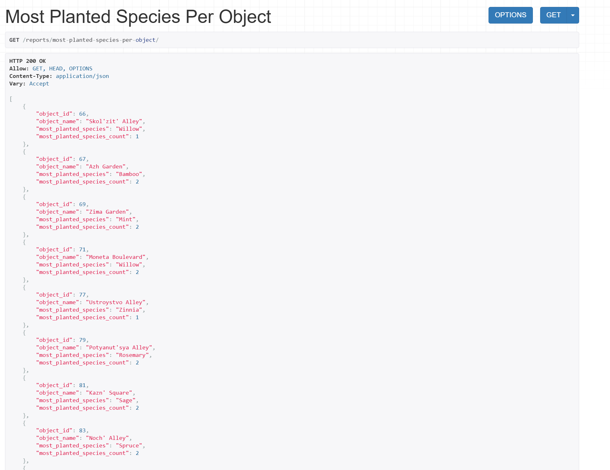
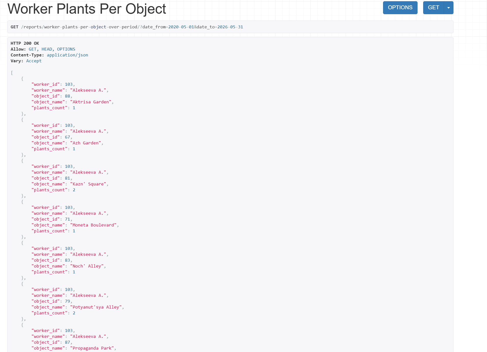
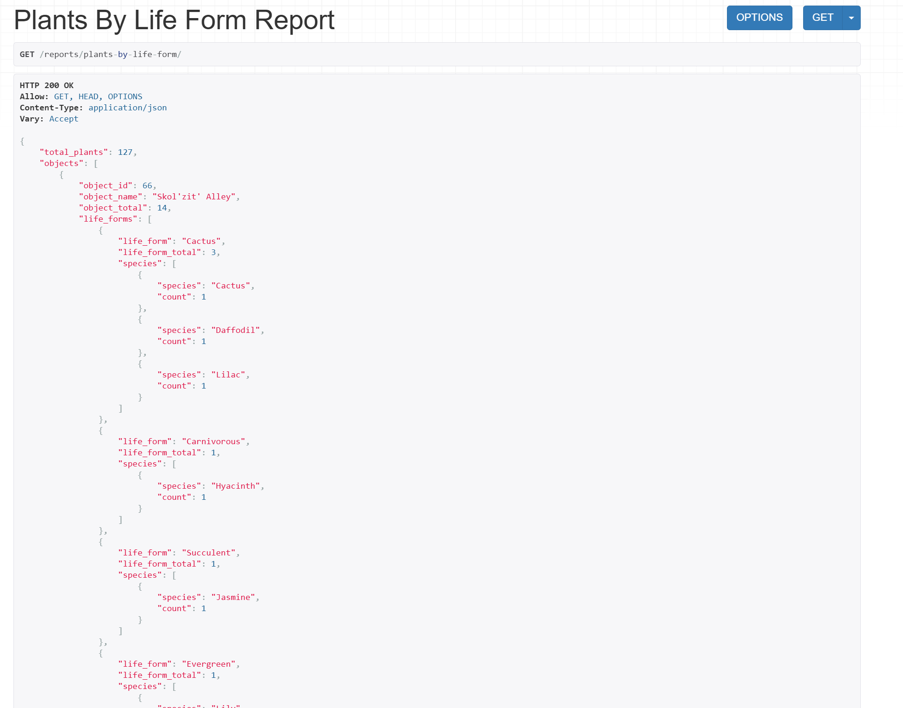

## Запросы

В тексте варианта были прописаны следующие запросы:

```text
Перечень возможных запросов:

1. Вывести информацию о количестве обслуживаемых и необслуживаемых
   объектов.
2. Для каждого сотрудника вывести количество объектов, которые он
   обслуживает.
3. Для заданного сотрудника вывести список сотрудников, работающих на тех же
   объектах, что и заданный.
4. Найти самый популярный по количеству высаженных единиц вид растения на
   обслуживаемых объектах.
5. Для каждого сотрудника вывести количество обслуживаемых растений на
   каждом объекте в заданный период времени.

Необходимо предусмотреть возможность получения отчета, в котором отражается
информация об обслуживаемых растениях по жизненным формам и видам по каждому
объекту с указанием их общего количества по видам, по объекту и суммарно по всем
объектам.
```

Для реализации данных запросов было решено сделать отдельное приложение для отчетных запросов под названием report_app.

У него были прописаны свои сериализаторы для сложных запросов, свои вью и соотвественно урлы, по которым лежат
результаты этих запросов.

### 1. Вывести информацию о количестве обслуживаемых и необслуживаемых объектов.
   
Здесь сериализатор не требуется, во views.py:

```python
class ObjectStatusReportView(generics.ListAPIView):
    def get(self, request):
        total = Object.objects.count()
        serviced = Object.objects.filter(contracts__is_active=True).distinct().count()

        return Response({'total': total,
                         'serviced': serviced,
                         'unserviced': total - serviced,
                         'serviced_percent': round(serviced / total * 100, 1) if total > 0 else 0
                         })

```

**Результат:**




### 2. Для каждого сотрудника вывести количество объектов, которые он обслуживает.
   
serializers.py:

```python
class WorkerWithObjectsSerializer(serializers.ModelSerializer):
    active_objects_count = serializers.SerializerMethodField(read_only=True)

    class Meta:
        model = Worker
        fields = ["id", "first_name", "last_name", "middle_name", "phone_number", "address", "active_objects_count"]

    def get_active_objects_count(self, obj):
        return obj.object_assignments.filter(
            end_date__isnull=True
        ).count()
```

views.py: 

```python
class WorkerObjectCountView(generics.ListAPIView):
    serializer_class = WorkerWithObjectsSerializer
    queryset = Worker.objects.all()
```

**Результат:**




### 3. Для заданного сотрудника вывести список сотрудников, работающих на тех же объектах, что и заданный.

views.py: 

```python
class WorkerColleaguesListAPIView(generics.ListAPIView):
    serializer_class = WorkerSerializer

    def get_queryset(self):
        worker_id = self.kwargs['pk']

        return Worker.objects.filter(
            object_assignments__end_date__isnull=True,
            object_assignments__object_id__in=ObjectWorkerAssignment.objects.filter(
                worker_id=worker_id,
                end_date__isnull=True
            ).values('object_id')
        ).exclude(
            id=worker_id
        ).distinct()
```

**Результат:**




### 4. Найти самый популярный по количеству высаженных единиц вид растения на обслуживаемых объектах.

serializers.py:

```python
class MostPlantedSpeciesPerObjectSerializer(serializers.Serializer):
    object_id = serializers.IntegerField()
    object_name = serializers.CharField()
    most_planted_species = serializers.CharField()
    most_planted_species_count = serializers.IntegerField()
```

views.py: 

```python
class MostPlantedSpeciesPerObjectView(APIView):

    def get(self, request):
        serviced_objects = Object.objects.filter(
            contracts__is_active=True
        ).distinct()

        results = []

        for obj in serviced_objects:
            species_stats = (
                PlantPlacement.objects
                .filter(zone__object_id=obj)
                .values('plant__species__name')
                .annotate(count=Count('id'))
                .order_by('-count')
            )

            if not species_stats.exists():
                continue

            top_species = species_stats.first()

            results.append({
                'object_id': obj.id,
                'object_name': obj.name,
                'most_planted_species': top_species['plant__species__name'],
                'most_planted_species_count': top_species['count']
            })

        serializer = MostPlantedSpeciesPerObjectSerializer(results, many=True)
        return Response(serializer.data)
```

**Результат:**



### 5. Для каждого сотрудника вывести количество обслуживаемых растений на каждом объекте в заданный период времени.
   
serializers.py:

```python
class WorkerObjectPlantCountSerializer(serializers.Serializer):
    worker_id = serializers.IntegerField()
    worker_name = serializers.CharField()
    object_id = serializers.IntegerField()
    object_name = serializers.CharField()
    plants_count = serializers.IntegerField()
```

views.py: 

```python
class WorkerPlantsPerObjectView(APIView):

    def get(self, request):
        date_from = request.query_params.get('date_from')
        date_to = request.query_params.get('date_to')

        if not date_from or not date_to:
            raise ValidationError(
                "Необходимо передать date_from и date_to (YYYY-MM-DD)"
            )

        queryset = (
            PlantWorkerAssignment.objects
            .filter(
                date__range=[date_from, date_to],
                plant__placements__zone__object_id__contracts__is_active=True
            )
            .values(
                'worker_id',
                'worker__last_name',
                'worker__first_name',
                'worker__middle_name',
                'plant__placements__zone__object_id__id',
                'plant__placements__zone__object_id__name'
            )
            .annotate(
                plants_count=Count('plant', distinct=True)
            )
            .order_by(
                'worker__last_name',
                'plant__placements__zone__object_id__name'
            )
        )

        results = []
        for row in queryset:
            full_name = f"{row['worker__last_name']} {row['worker__first_name'][0]}."
            if row['worker__middle_name']:
                full_name += f"{row['worker__middle_name'][0]}."

            results.append({
                'worker_id': row['worker_id'],
                'worker_name': full_name,
                'object_id': row['plant__placements__zone__object_id__id'],
                'object_name': row['plant__placements__zone__object_id__name'],
                'plants_count': row['plants_count']
            })

        serializer = WorkerObjectPlantCountSerializer(results, many=True)
        return Response(serializer.data)
```

**Результат:**




### 6. Отчет об обслуживаемых растениях по жизненным формам и видам

views.py: 

```python
class SpeciesReportSerializer(serializers.Serializer):
    species = serializers.CharField()
    count = serializers.IntegerField()


class LifeFormReportSerializer(serializers.Serializer):
    life_form = serializers.CharField()
    life_form_total = serializers.IntegerField()
    species = SpeciesReportSerializer(many=True)


class ObjectPlantReportSerializer(serializers.Serializer):
    object_id = serializers.IntegerField()
    object_name = serializers.CharField()
    object_total = serializers.IntegerField()
    life_forms = LifeFormReportSerializer(many=True)


class PlantsSummaryReportSerializer(serializers.Serializer):
    total_plants = serializers.IntegerField()
    objects = ObjectPlantReportSerializer(many=True)
```

serializers.py:

```python
class PlantsByLifeFormReportView(APIView):

    def get(self, request):
        queryset = (
            PlantPlacement.objects
            .filter(
                zone__object_id__contracts__is_active=True
            )
            .values(
                'zone__object_id__id',
                'zone__object_id__name',
                'plant__species__name',
                'plant__species__life_form__name'
            )
            .annotate(count=Count('plant', distinct=True))
        )

        report = defaultdict(lambda: {
            'object_total': 0,
            'life_forms': defaultdict(lambda: {
                'life_form_total': 0,
                'species': []
            })
        })

        total_plants = 0

        for row in queryset:
            obj_id = row['zone__object_id__id']
            obj_name = row['zone__object_id__name']
            species = row['plant__species__name']
            life_form = row['plant__species__life_form__name']
            count = row['count']

            report[obj_id]['object_name'] = obj_name
            report[obj_id]['object_total'] += count
            report[obj_id]['life_forms'][life_form]['life_form_total'] += count
            report[obj_id]['life_forms'][life_form]['species'].append({
                'species': species,
                'count': count
            })

            total_plants += count

        objects_result = []
        for obj_id, obj_data in report.items():
            life_forms_list = []
            for lf_name, lf_data in obj_data['life_forms'].items():
                life_forms_list.append({
                    'life_form': lf_name,
                    **lf_data
                })

            objects_result.append({
                'object_id': obj_id,
                'object_name': obj_data['object_name'],
                'object_total': obj_data['object_total'],
                'life_forms': life_forms_list
            })

        serializer = PlantsSummaryReportSerializer({
            'total_plants': total_plants,
            'objects': objects_result
        })

        return Response(serializer.data)

```

**Результат:**

