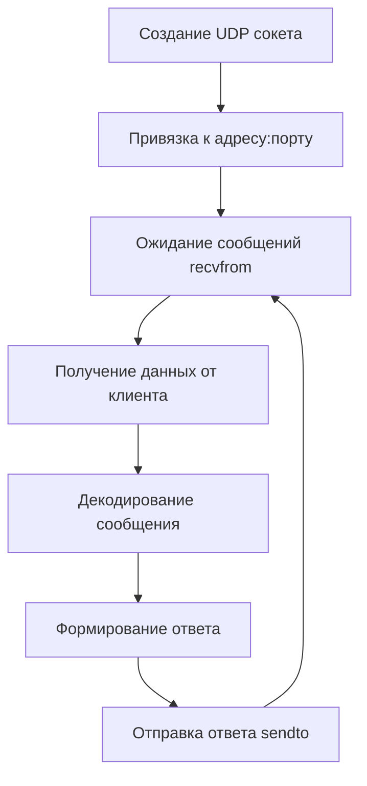
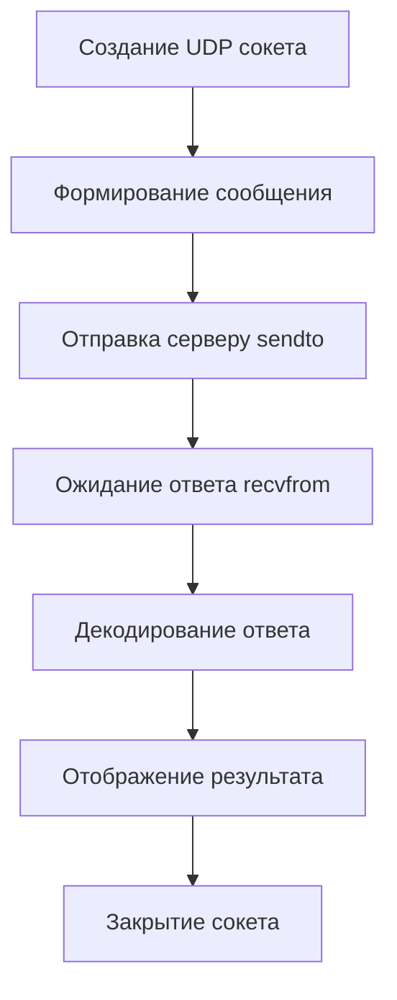

# Задание 1: UDP клиент-сервер

## 📝 Описание

Простое приложение клиент-сервер, использующее протокол **UDP**. Клиент отправляет сообщение "Hello, server", сервер отвечает "Hello, client".

## 🎯 Технические требования

- **Протокол**: UDP (User Datagram Protocol)
- **Порт сервера**: 12345
- **Адрес**: localhost (127.0.0.1)
- **Тип сокета**: `SOCK_DGRAM`
- **Кодировка**: UTF-8

## 🔍 Алгоритм работы

### Серверная часть

### Клиентская часть

## 📚 Ключевые концепции UDP

### Особенности протокола

!!! note "UDP характеристики"
    - **Без установления соединения** - данные отправляются сразу
    - **Передача датаграммами** - каждое сообщение независимо
    - **Быстрая передача** - минимальные накладные расходы
    - **Без гарантий доставки** - сообщения могут потеряться
    - **Без порядка доставки** - сообщения могут прийти не по порядку

### Сравнение с TCP

| Аспект | UDP | TCP |
|--------|-----|-----|
| Соединение | Без соединения | С установлением соединения |
| Надежность | Ненадежный | Надежный |
| Скорость | Быстрый | Медленнее |
| Размер заголовка | 8 байт | 20+ байт |
| Использование | Игры, видео, DNS | Веб, email, файлы |

## 🔧 Методы socket для UDP

| Метод | Описание | Пример |
|-------|----------|--------|
| `socket()` | Создание сокета | `socket.socket(AF_INET, SOCK_DGRAM)` |
| `bind()` | Привязка к адресу | `sock.bind(('localhost', 12345))` |
| `sendto()` | Отправка данных | `sock.sendto(data, address)` |
| `recvfrom()` | Получение данных | `data, addr = sock.recvfrom(1024)` |
| `close()` | Закрытие сокета | `sock.close()` |

## ❓ Частые вопросы

??? question "Что происходит, если сервер не запущен?"
    Клиент отправит сообщение, но не получит ответа. UDP не устанавливает соединение, поэтому ошибка может не возникнуть сразу.

??? question "Можно ли запустить несколько клиентов?"
    Да! UDP сервер может обслуживать множество клиентов одновременно, так как каждый запрос обрабатывается независимо.

??? question "Что означает размер буфера 1024?"
    Это максимальный размер данных, которые можно получить за один вызов `recvfrom()`. Если сообщение больше, оно будет обрезано.

??? question "Почему используется encode/decode?"
    Сокеты передают только байты, а Python строки в Unicode. `encode('utf-8')` преобразует строку в байты, `decode('utf-8')` - обратно.
