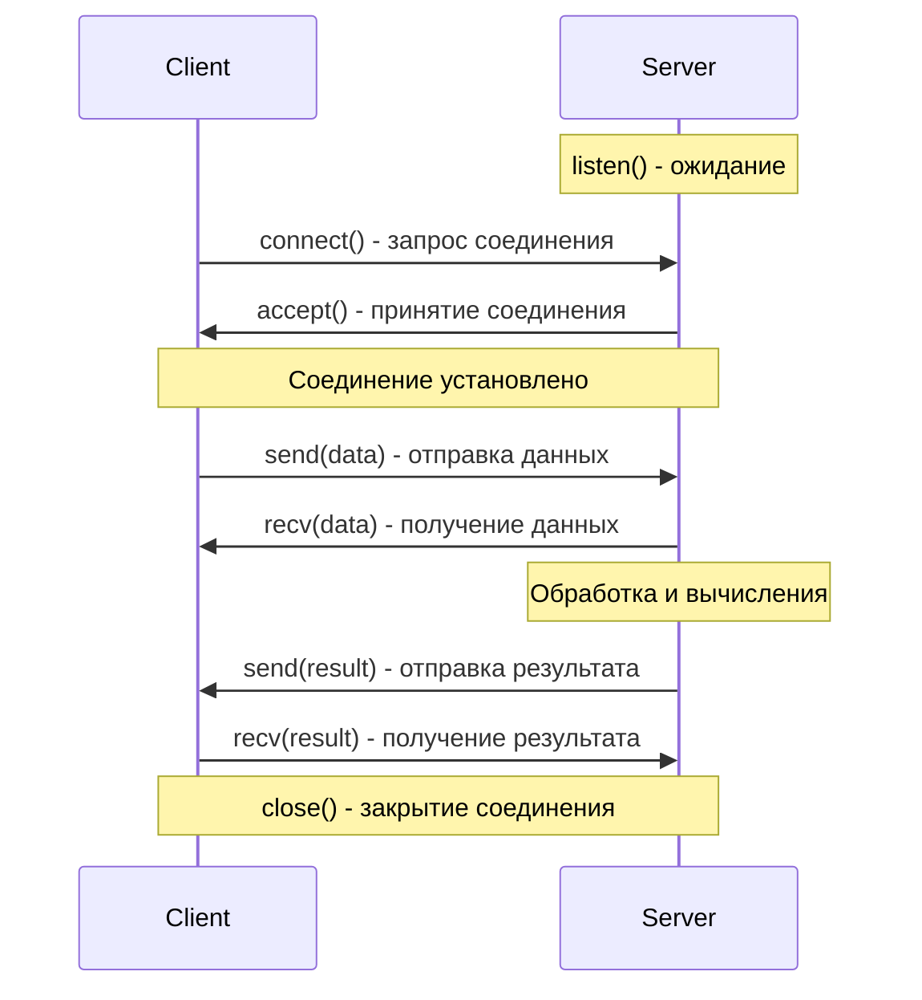
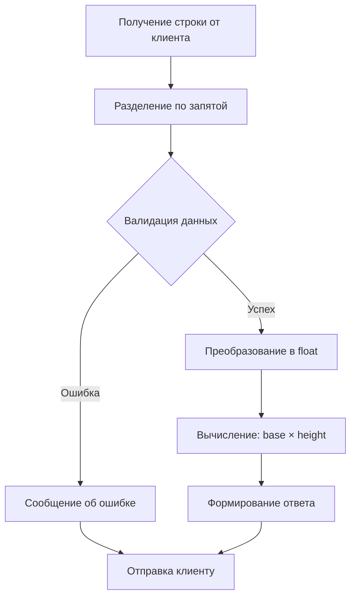

# Задание 2: TCP математические операции

## 📝 Описание

**Вариант 4**: Поиск площади параллелограмма  
**Позиция в журнале**: 12

TCP приложение клиент-сервер для вычисления площади параллелограмма. Клиент запрашивает ввод параметров с клавиатуры, сервер выполняет вычисления и возвращает результат.

### Математическая формула
```
Площадь = основание × высота
```

## 🎯 Технические требования

- **Протокол**: TCP (Transmission Control Protocol)
- **Порт сервера**: 12346
- **Адрес**: localhost (127.0.0.1)
- **Тип сокета**: `SOCK_STREAM`
- **Формат данных**: "основание,высота"
- **Кодировка**: UTF-8

### Пример работы с несколькими клиентами

Сервер обрабатывает клиентов последовательно:

```bash
# Терминал 1: Сервер
TCP сервер запущен на ('localhost', 12346)
Ожидание подключений...
Подключился клиент: ('127.0.0.1', 54321)
Получены данные: 5,3
Результат вычисления: Площадь параллелограмма: 15.0
Соединение с клиентом закрыто

Подключился клиент: ('127.0.0.1', 54322)
Получены данные: 10,4
Результат вычисления: Площадь параллелограмма: 40.0
Соединение с клиентом закрыто
```

## 🔍 Алгоритм работы

### TCP соединение



### Обработка данных на сервере



## 📚 Ключевые концепции TCP

### Особенности протокола

!!! note "TCP характеристики"
    - **Установление соединения** - обязательный handshake
    - **Надежная доставка** - гарантия получения данных
    - **Порядок данных** - сохранение последовательности
    - **Контроль потока** - управление скоростью передачи
    - **Обнаружение ошибок** - автоматическая повторная передача

### Жизненный цикл TCP соединения


## 🔧 Методы socket для TCP

| Метод | Сторона | Описание | Пример |
|-------|---------|----------|--------|
| `socket()` | Обе | Создание сокета | `socket.socket(AF_INET, SOCK_STREAM)` |
| `bind()` | Сервер | Привязка к адресу | `sock.bind(('localhost', 12346))` |
| `listen()` | Сервер | Ожидание подключений | `sock.listen(5)` |
| `accept()` | Сервер | Принятие соединения | `client, addr = sock.accept()` |
| `connect()` | Клиент | Подключение к серверу | `sock.connect(('localhost', 12346))` |
| `send()` | Обе | Отправка данных | `sock.send(data.encode())` |
| `recv()` | Обе | Получение данных | `data = sock.recv(1024)` |
| `close()` | Обе | Закрытие сокета | `sock.close()` |

## ❓ Частые вопросы

??? question "Что происходит, если клиент отключается во время вычислений?"
    TCP обнаружит разрыв соединения, и сервер получит исключение при попытке отправить данные. Сервер корректно закроет соединение и будет ждать следующего клиента.

??? question "Может ли сервер обслуживать несколько клиентов одновременно?"
    В данной реализации - нет. Сервер обрабатывает клиентов последовательно. Для одновременной обработки нужна многопоточность (см. Задание 4).

??? question "Почему используется `listen(1)`?"
    Это размер очереди ожидающих подключений. Если сервер занят обработкой одного клиента, другие будут ждать в очереди.

??? question "Что означает `recv(1024)`?"
    Максимальный размер данных для получения за один раз. TCP может доставить данные по частям, поэтому для больших сообщений может потребоваться несколько вызовов.
