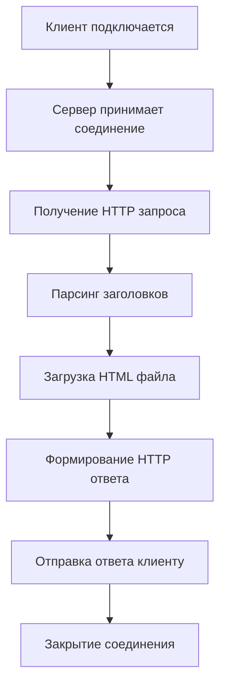

# Задание 3: HTTP сервер

## 📝 Описание

Простой HTTP сервер, написанный на Python с использованием библиотеки `socket`. Сервер принимает подключения клиентов и отвечает HTML-страницей, загруженной из файла `index.html`.

## 🎯 Технические требования

- **Протокол**: HTTP/1.1 over TCP
- **Порт**: 8080
- **Адрес**: localhost (127.0.0.1)
- **Тип сокета**: `SOCK_STREAM`
- **Кодировка**: UTF-8
- **Content-Type**: text/html

## 🔍 Анализ HTTP протокола

### Структура HTTP запроса

```
GET / HTTP/1.1
Host: localhost:8080
User-Agent: Mozilla/5.0 (...)
Accept: text/html,application/xhtml+xml,*/*
Accept-Language: ru,en;q=0.9
Connection: keep-alive

```

### Структура HTTP ответа

```
HTTP/1.1 200 OK
Content-Type: text/html; charset=utf-8
Content-Length: 2847
Connection: close

<!DOCTYPE html>
<html lang="ru">
...
```

### HTTP заголовки сервера

| Заголовок | Значение | Назначение |
|-----------|----------|------------|
| `HTTP/1.1 200 OK` | Статус | Успешный ответ |
| `Content-Type` | `text/html; charset=utf-8` | Тип контента и кодировка |
| `Content-Length` | Размер в байтах | Длина тела ответа |
| `Connection` | `close` | Закрытие соединения после ответа |

## 🔧 Архитектура решения

### Поток обработки запроса



## ❓ Частые вопросы

??? question "Почему используется `SO_REUSEADDR`?"
    Этот флаг позволяет сразу переиспользовать адрес после остановки сервера, без ожидания освобождения порта операционной системой.

??? question "Можно ли обслуживать несколько клиентов одновременно?"
    В данной реализации - нет. Сервер обрабатывает запросы последовательно. Для concurrent обработки нужна многопоточность.

??? question "Что произойдет, если `index.html` отсутствует?"
    Сервер вернет заранее подготовленную HTML страницу с сообщением об ошибке, благодаря обработке исключения `FileNotFoundError`.

??? question "Поддерживает ли сервер HTTPS?"
    Нет, данная реализация поддерживает только HTTP. Для HTTPS нужна поддержка SSL/TLS.
