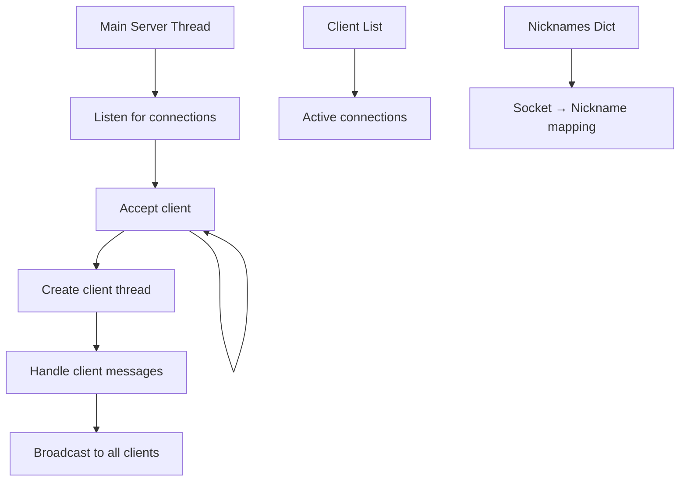
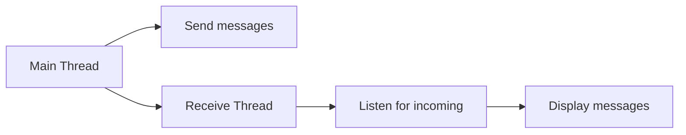
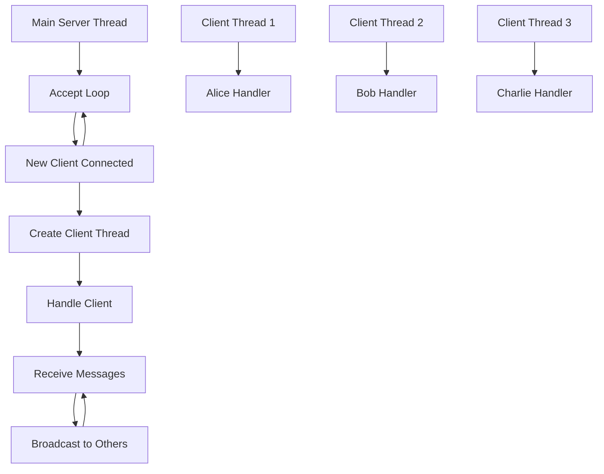
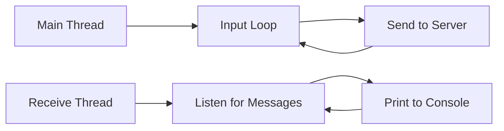

# Задание 4: Многопользовательский чат

## 📝 Описание

Многопользовательский TCP чат с использованием библиотек `socket` и `threading`. Поддерживает одновременное подключение множества пользователей с возможностью обмена сообщениями в реальном времени.

## 🎯 Технические требования

- **Протокол**: TCP (SOCK_STREAM)
- **Порт**: 12347
- **Многопоточность**: Каждый клиент в отдельном потоке
- **Архитектура**: Broadcast-модель рассылки сообщений
- **Функции**: Никнеймы, уведомления о подключении/отключении
- **Realtime**: Мгновенная доставка сообщений

## 🏗️ Архитектура системы

### Серверная архитектура



### Клиентская архитектура



### Пример сессии чата

=== "Сервер"
    ```
    🚀 Сервер чата запущен на localhost:12347
    Ожидание подключений...
    Новое подключение от ('127.0.0.1', 54321)
    Пользователь Алиса подключился с адреса ('127.0.0.1', 54321)
    Новое подключение от ('127.0.0.1', 54322)
    Пользователь Боб подключился с адреса ('127.0.0.1', 54322)
    Рассылка сообщения: *** Боб присоединился к чату ***
    Сообщение от Алиса: Привет всем!
    Рассылка сообщения: Алиса: Привет всем!
    Сообщение от Боб: Привет, Алиса!
    Рассылка сообщения: Боб: Привет, Алиса!
    ```

=== "Клиент Алиса"
    ```
    🔄 Подключение к серверу чата...
    ✅ Подключение установлено!
    Введите ваш никнейм: Алиса
    Добро пожаловать в чат, Алиса!
    💬 Чат активен! Введите сообщение или 'exit' для выхода:
    --------------------------------------------------
    *** Боб присоединился к чату ***
    Привет всем!
    Боб: Привет, Алиса!
    Как дела?
    Боб: Отлично! А у тебя?
    ```

=== "Клиент Боб"
    ```
    🔄 Подключение к серверу чата...
    ✅ Подключение установлено!
    Введите ваш никнейм: Боб
    Добро пожаловать в чат, Боб!
    💬 Чат активен! Введите сообщение или 'exit' для выхода:
    --------------------------------------------------
    Алиса: Привет всем!
    Привет, Алиса!
    Алиса: Как дела?
    Отлично! А у тебя?
    ```

## 🧵 Многопоточная архитектура

### Threading модель сервера



### Threading модель клиента



## ❓ Частые вопросы

??? question "Сколько клиентов может одновременно подключиться?"
    Теоретически ограничения только системные (количество файловых дескрипторов). Практически рекомендуется до 100-1000 одновременных подключений для простого чата.

??? question "Что происходит, если клиент внезапно отключается?"
    TCP автоматически обнаружит разрыв соединения. Сервер получит исключение при попытке отправить данные и корректно удалит клиента из списка.

??? question "Почему используются daemon потоки?"
    Daemon потоки автоматически завершаются при завершении главного процесса, что обеспечивает корректное завершение программы.
