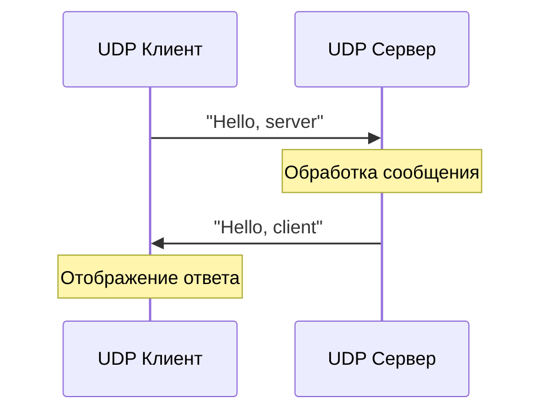

# Задание 1: UDP Hello

## Описание задания

Реализовать клиентскую и серверную часть приложения. Клиент отправляет серверу сообщение «Hello, server», и оно должно отобразиться на стороне сервера. В ответ сервер отправляет клиенту сообщение «Hello, client», которое должно отобразиться у клиента.

## Требования

- Использование библиотеки `socket`
- Реализация с помощью протокола UDP
- Простой обмен сообщениями

## Техническая реализация

### UDP Сервер

```python
import socket

def udp_server():
    # Создание UDP сокета
    server_socket = socket.socket(socket.AF_INET, socket.SOCK_DGRAM)
    
    # Привязка к адресу и порту
    server_socket.bind(('localhost', 12345))
    print("UDP сервер запущен на порту 12345")
    
    while True:
        # Получение данных от клиента
        data, addr = server_socket.recvfrom(1024)
        message = data.decode('utf-8')
        print(f"Получено от {addr}: {message}")
        
        # Проверка сообщения и отправка ответа
        if message == "Hello, server":
            response = "Hello, client"
            server_socket.sendto(response.encode('utf-8'), addr)
            print(f"Отправлено: {response}")
```

### UDP Клиент

```python
import socket

def udp_client():
    # Создание UDP сокета
    client_socket = socket.socket(socket.AF_INET, socket.SOCK_DGRAM)
    
    # Отправка сообщения серверу
    message = "Hello, server"
    client_socket.sendto(message.encode('utf-8'), ('localhost', 12345))
    print(f"Отправлено: {message}")
    
    # Получение ответа от сервера
    response, addr = client_socket.recvfrom(1024)
    print(f"Получено: {response.decode('utf-8')}")
    
    # Закрытие сокета
    client_socket.close()
```

## Запуск

### Отдельные компоненты

```bash
# Запуск сервера
python task1_udp_hello.py server

# Запуск клиента (в другом терминале)
python task1_udp_hello.py client

# Демонстрация
python task1_udp_hello.py demo
```

### Через главное меню

```bash
python main.py
# Выберите пункт 1
```

## Диаграмма взаимодействия



## Образовательная ценность

Данное задание демонстрирует:

- **Основы UDP протокола** - ненадежная доставка, отсутствие установления соединения
- **Работу с сокетами** - создание, привязка, отправка/получение данных
- **Кодирование данных** - преобразование строк в байты и обратно
- **Базовую клиент-серверную архитектуру**

## Особенности реализации

- **Простота**: Минимальный код для демонстрации UDP
- **Надежность**: Обработка ошибок кодирования/декодирования
- **Интерактивность**: Демонстрационный режим
- **Документированность**: Подробные комментарии в коде

## Выводы

UDP протокол идеально подходит для простых задач обмена сообщениями, где не требуется гарантированная доставка данных. Простота реализации делает его отличным выбором для изучения основ сетевого программирования.