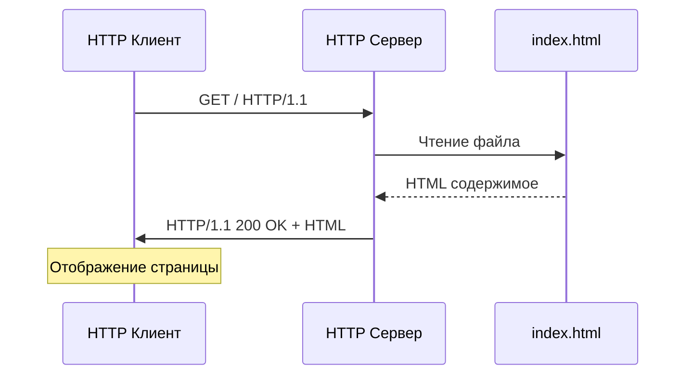

# Задание 3: HTTP Сервер

## Описание задания

Реализовать серверную часть приложения. Клиент подключается к серверу, и в ответ получает HTTP-сообщение, содержащее HTML-страницу, которая сервер подгружает из файла `index.html`.

## Требования

- Использование библиотеки `socket`
- HTTP протокол
- Загрузка HTML из файла

## Техническая реализация

### HTTP Сервер

```python
import socket
import os

def http_server():
    # Создание TCP сокета для HTTP
    server_socket = socket.socket(socket.AF_INET, socket.SOCK_STREAM)
    server_socket.setsockopt(socket.SOL_SOCKET, socket.SO_REUSEADDR, 1)
    server_socket.bind(('localhost', 8080))
    server_socket.listen(1)
    
    while True:
        client_socket, addr = server_socket.accept()
        
        try:
            # Получение HTTP запроса
            request = client_socket.recv(1024).decode('utf-8')
            
            # Парсинг HTTP запроса
            request_lines = request.split('\n')
            if request_lines:
                request_line = request_lines[0]
                method, path, version = request_line.split()
                
                if method == 'GET' and path == '/':
                    # Чтение HTML файла
                    with open('index.html', 'r', encoding='utf-8') as f:
                        html_content = f.read()
                    
                    # Формирование HTTP ответа
                    response = f"""HTTP/1.1 200 OK
Content-Type: text/html; charset=utf-8
Content-Length: {len(html_content.encode('utf-8'))}
Connection: close

{html_content}"""
                    
                    client_socket.send(response.encode('utf-8'))
```

### HTTP Клиент

```python
import socket

def http_client():
    client_socket = socket.socket(socket.AF_INET, socket.SOCK_STREAM)
    client_socket.connect(('localhost', 8080))
    
    # Формирование HTTP GET запроса
    request = "GET / HTTP/1.1\r\nHost: localhost\r\n\r\n"
    client_socket.send(request.encode('utf-8'))
    
    # Получение HTTP ответа
    response = client_socket.recv(4096).decode('utf-8')
    print("HTTP ответ:")
    print(response)
    
    client_socket.close()
```

## HTML файл (index.html)

```html
<!DOCTYPE html>
<html lang="ru">
<head>
    <meta charset="UTF-8">
    <title>Добро пожаловать!</title>
    <style>
        body {
            font-family: Arial, sans-serif;
            max-width: 800px;
            margin: 0 auto;
            padding: 20px;
            background-color: #f5f5f5;
        }
        .container {
            background-color: white;
            padding: 30px;
            border-radius: 10px;
            box-shadow: 0 2px 10px rgba(0,0,0,0.1);
        }
        h1 {
            color: #333;
            text-align: center;
        }
    </style>
</head>
<body>
    <div class="container">
        <h1>Добро пожаловать на наш сайт!</h1>
        <p>Это демонстрационная HTML-страница, загружаемая через HTTP-сервер, 
        реализованный с помощью библиотеки socket в Python.</p>
    </div>
</body>
</html>
```

## HTTP Протокол

### Структура HTTP запроса
```
GET / HTTP/1.1
Host: localhost
```

### Структура HTTP ответа
```
HTTP/1.1 200 OK
Content-Type: text/html; charset=utf-8
Content-Length: 1234
Connection: close

<!DOCTYPE html>
<html>
...
</html>
```

## Запуск

### Отдельные компоненты

```bash
# Запуск сервера
python task3_http_server.py server

# Запуск клиента (в другом терминале)
python task3_http_server.py client

# Демонстрация
python task3_http_server.py demo
```

### Через главное меню

```bash
python main.py
# Выберите пункт 3
```

### В браузере

Откройте http://localhost:8080/ в браузере

## Диаграмма взаимодействия



## Образовательная ценность

- **HTTP протокол** - структура запросов и ответов
- **Работа с файлами** - чтение HTML файлов
- **Парсинг HTTP** - разбор заголовков и методов
- **Обработка ошибок** - HTTP коды состояния (200, 404)
- **Кодировка** - правильная работа с UTF-8

## Особенности реализации

- **Простой HTTP парсер** - разбор основных HTTP методов
- **Обработка ошибок** - корректные HTTP коды ответов
- **Кодировка UTF-8** - поддержка русского языка
- **Заголовки HTTP** - правильное формирование ответов

## Тестирование

### С помощью curl
```bash
curl http://localhost:8080/
```

### С помощью Python клиента
```python
import requests
response = requests.get('http://localhost:8080/')
print(response.text)
```

## Выводы

HTTP сервер демонстрирует основы веб-технологий. Понимание структуры HTTP протокола критично для веб-разработки. Простая реализация помогает понять принципы работы современных веб-серверов.