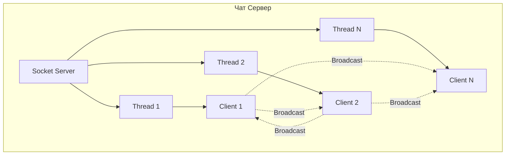

# Задание 4: Многопользовательский чат

## Описание задания

Реализовать двухпользовательский или многопользовательский чат. Для максимального количества баллов реализуйте многопользовательский чат.

## Требования

- Использование библиотеки `socket`
- Протокол TCP
- Библиотека `threading` для многопользовательского чата
- Сохранение пользователей для отправки сообщений

## Техническая реализация

### Многопользовательский чат сервер

```python
import socket
import threading
from datetime import datetime

class ChatServer:
    def __init__(self, host='localhost', port=12347):
        self.host = host
        self.port = port
        self.clients = []  # Список клиентских сокетов
        self.nicknames = []  # Список никнеймов
        self.server_socket = socket.socket(socket.AF_INET, socket.SOCK_STREAM)
        self.server_socket.setsockopt(socket.SOL_SOCKET, socket.SO_REUSEADDR, 1)
        
    def start(self):
        self.server_socket.bind((self.host, self.port))
        self.server_socket.listen()
        
        while True:
            # Принятие нового подключения
            client_socket, address = self.server_socket.accept()
            
            # Запрос никнейма
            client_socket.send("NICK".encode('utf-8'))
            nickname = client_socket.recv(1024).decode('utf-8')
            
            # Добавление клиента в списки
            self.nicknames.append(nickname)
            self.clients.append(client_socket)
            
            # Уведомление всех о новом пользователе
            self.broadcast(f"{nickname} присоединился к чату!")
            
            # Запуск потока для обработки клиента
            thread = threading.Thread(target=self.handle_client, args=(client_socket, nickname))
            thread.start()
    
    def broadcast(self, message):
        """Отправка сообщения всем клиентам"""
        timestamp = datetime.now().strftime("%H:%M:%S")
        formatted_message = f"[{timestamp}] {message}"
        
        for client in self.clients:
            try:
                client.send(formatted_message.encode('utf-8'))
            except:
                self.remove_client(client)
    
    def handle_client(self, client, nickname):
        """Обработка сообщений от клиента"""
        while True:
            try:
                message = client.recv(1024)
                if message:
                    timestamp = datetime.now().strftime("%H:%M:%S")
                    formatted_message = f"[{timestamp}] {nickname}: {message.decode('utf-8')}"
                    self.broadcast(formatted_message)
                else:
                    self.remove_client(client)
                    break
            except:
                self.remove_client(client)
                break
```

### Чат клиент

```python
import socket
import threading

class ChatClient:
    def __init__(self, host='localhost', port=12347):
        self.host = host
        self.port = port
        self.client_socket = socket.socket(socket.AF_INET, socket.SOCK_STREAM)
        
    def connect(self, nickname):
        self.client_socket.connect((self.host, self.port))
        self.nickname = nickname
        
        # Отправка никнейма
        self.client_socket.send(nickname.encode('utf-8'))
        
        # Запуск потока для получения сообщений
        receive_thread = threading.Thread(target=self.receive)
        receive_thread.daemon = True
        receive_thread.start()
        
        # Запуск отправки сообщений
        self.send()
    
    def receive(self):
        """Получение сообщений от сервера"""
        while True:
            try:
                message = self.client_socket.recv(1024).decode('utf-8')
                print(message)
            except:
                print("Ошибка получения сообщения")
                self.client_socket.close()
                break
    
    def send(self):
        """Отправка сообщений на сервер"""
        while True:
            try:
                message = input()
                if message.lower() == 'quit':
                    self.client_socket.close()
                    break
                self.client_socket.send(message.encode('utf-8'))
            except:
                break
```

## Многопоточность

### Основные потоки:

1. **Главный поток сервера** - принятие новых подключений
2. **Поток обработки клиента** - получение и пересылка сообщений
3. **Поток получения сообщений клиента** - отображение входящих сообщений
4. **Поток отправки сообщений клиента** - ввод и отправка текста

### Преимущества многопоточности:

- **Параллельная обработка** - несколько клиентов одновременно
- **Неблокирующая работа** - сервер не зависает на одном клиенте
- **Масштабируемость** - легко добавить новых пользователей

## Запуск

### Отдельные компоненты

```bash
# Запуск сервера
python task4_chat.py server

# Запуск клиента (в другом терминале)
python task4_chat.py client

# Демонстрация
python task4_chat.py demo
```

### Через главное меню

```bash
python main.py
# Выберите пункт 4
```

### Тестирование с несколькими клиентами

1. Запустите сервер: `python task4_chat.py server`
2. Откройте 3-4 терминала
3. В каждом запустите клиент: `python task4_chat.py client`
4. Введите разные никнеймы
5. Отправляйте сообщения из разных терминалов

## Диаграмма архитектуры



## Образовательная ценность

- **TCP протокол** - надежная доставка сообщений
- **Многопоточность** - параллельная обработка клиентов
- **Сетевые приложения** - реальные примеры клиент-сервер архитектуры
- **Обработка ошибок** - корректное отключение клиентов
- **Синхронизация** - безопасная работа с общими ресурсами

## Особенности реализации

- **Классовая архитектура** - объектно-ориентированный подход
- **Обработка отключений** - автоматическое удаление неактивных клиентов
- **Broadcast сообщения** - отправка всем подключенным пользователям
- **Никнеймы** - идентификация пользователей в чате
- **Временные метки** - отображение времени сообщений

## Выводы

Многопользовательский чат демонстрирует сложные концепции сетевого программирования:
- Многопоточность критична для масштабируемых приложений
- TCP обеспечивает надежную доставку сообщений
- Правильная архитектура упрощает добавление новых функций