# Лабораторная работа 3. Реализация серверной части на Django REST. Документирование API  
**Практические работа 3.1**

> Проект: отдельный мини-проект `lr3_api` с приложением `garage`.  
> База: SQLite.  

---

## 0. Подготовка проекта

### Установка и создание проекта
```bash
pip install django

django-admin startproject lr3_api .
python manage.py startapp garage
```

### Подключение приложения
`lr3_api/settings.py` → `INSTALLED_APPS`:
```python
INSTALLED_APPS = [
    # стандартные приложения Django …
    'garage',
]
```

### Модели данных
`garage/models.py`:
```python
from django.db import models

class Owner(models.Model):
    last_name  = models.CharField("Фамилия", max_length=30)
    first_name = models.CharField("Имя", max_length=30)
    birth_date = models.DateTimeField("Дата рождения", null=True, blank=True)
    def __str__(self): return f"{self.last_name} {self.first_name}"
    class Meta: verbose_name="Автовладелец"; verbose_name_plural="Автовладельцы"; ordering=["last_name","first_name","id"]

class Car(models.Model):
    plate_number = models.CharField("Гос. номер", max_length=15)
    make  = models.CharField("Марка",  max_length=20)
    model = models.CharField("Модель", max_length=20)
    color = models.CharField("Цвет", max_length=30, null=True, blank=True)
    def __str__(self): return f"{self.make} {self.model} ({self.plate_number})"
    class Meta:
        verbose_name="Автомобиль"; verbose_name_plural="Автомобили"
        ordering=["make","model","plate_number"]
        indexes=[models.Index(fields=["plate_number"]), models.Index(fields=["make","model"])]

class Ownership(models.Model):
    owner = models.ForeignKey(Owner, on_delete=models.CASCADE, related_name="ownerships", verbose_name="Владелец")
    car   = models.ForeignKey(Car,   on_delete=models.CASCADE, related_name="ownerships", verbose_name="Автомобиль")
    start_date = models.DateTimeField("Дата начала")
    end_date   = models.DateTimeField("Дата окончания", null=True, blank=True)
    def __str__(self): return f"{self.owner} ↔ {self.car} [{self.start_date} — {self.end_date or 'по н.в.'}]"
    class Meta: verbose_name="Владение"; verbose_name_plural="Владения"; ordering=["-start_date","owner_id","car_id"]

Owner.add_to_class("cars",
    models.ManyToManyField(Car, through=Ownership, related_name="owners", verbose_name="Автомобили", blank=True)
)

class DriverLicense(models.Model):
    owner = models.ForeignKey(Owner, on_delete=models.CASCADE, related_name="licenses", verbose_name="Владелец")
    number = models.CharField("Номер удостоверения", max_length=10)
    type   = models.CharField("Тип", max_length=10)
    issue_date = models.DateTimeField("Дата выдачи")
    def __str__(self): return f"ВУ {self.number} ({self.type}) — {self.owner}"
    class Meta:
        verbose_name="Водительское удостоверение"; verbose_name_plural="Водительские удостоверения"
        ordering=["-issue_date","number"]; indexes=[models.Index(fields=["number"])]
```

---

##  Задание 1. Наполнение базы

**Цель:** создать 6–7 автовладельцев, 5–6 автомобилей, выдать каждому владельцу удостоверение, связать каждого владельца с 1–3 машинами через ассоциативную сущность «Владение».

`/task1.py`:
```python
N_OWNERS = 7
N_CARS = 6

FIRST_NAMES = ["Олег", "Мария", "Дмитрий", "Анна", "Илья", "Елена", "Сергей"]
LAST_NAMES  = ["Иванов", "Соколова", "Петров", "Кузнецова", "Смирнов", "Попова", "Васильев"]
COLORS = ["черный", "белый", "красный", "синий", "серый", "зеленый", None]
TYPES = ["A", "B", "C", "D", "BE", "CE", "DE"]

CAR_POOL = [
    ("Toyota",  "Camry"),
    ("BMW",     "3 Series"),
    ("Kia",     "Rio"),
    ("Lada",    "Vesta"),
    ("Hyundai", "Solaris"),
    ("Audi",    "A4"),
]

PLATES = ["A123AA77", "B456BB77", "C789CC77", "E001EE77", "H234HH77", "O777OO77"]


def rand_dt(year_from=2014, year_to=datetime.now().year):
    y = randint(year_from, year_to)
    m = randint(1, 12)
    d = randint(1, 28)
    hh = randint(8, 19)
    mm = randint(0, 59)
    return datetime(y, m, d, hh, mm)


#  Очистка данных
if RESET_DB:
    Ownership.objects.all().delete()
    DriverLicense.objects.all().delete()
    Car.objects.all().delete()
    Owner.objects.all().delete()


#  Создаём владельцев
owners = []
for i in range(N_OWNERS):
    o = Owner.objects.create(
        last_name=LAST_NAMES[i % len(LAST_NAMES)],
        first_name=FIRST_NAMES[i % len(FIRST_NAMES)],
        birth_date=rand_dt(1980, 2002),
    )
    owners.append(o)

#  Создаём автомобили
cars = []
for i in range(N_CARS):
    make, model = CAR_POOL[i % len(CAR_POOL)]
    car = Car.objects.create(
        plate_number=PLATES[i],
        make=make,
        model=model,
        color=choice(COLORS),
    )
    cars.append(car)

#  Выдаём каждому владельцу удостоверение
for idx, owner in enumerate(owners, start=1):
    issue = rand_dt(2015, datetime.now().year)
    DriverLicense.objects.create(
        owner=owner,
        number=f"{700000+idx:010d}"[:10],
        type=choice(TYPES),
        issue_date=issue,
    )

# Привязываем каждому владельцу от 1 до 3 машин через Ownership
for owner in owners:
    k = randint(1, 3)
    owned = sample(cars, k)
    for car in owned:
        start = rand_dt(2016, 2024)
        # иногда сделаем дату окончания, иногда нет
        if randint(0, 1):
            end = start + timedelta(days=randint(200, 1200))
        else:
            end = None
        Ownership.objects.create(
            owner=owner,
            car=car,
            start_date=start,
            end_date=end,
        )
```

**Скриншоты (консольный вывод):**
- _Владельцы и их удостоверения_:  
  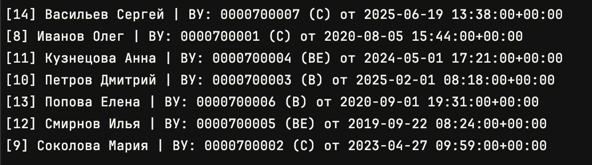
- _Автомобили_:  
  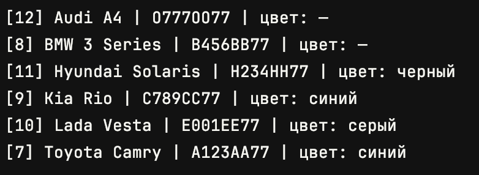
- _Владения_:  
  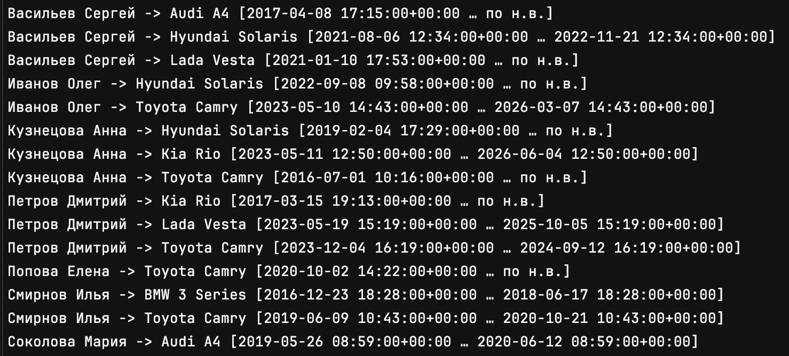

---

## Задание 2. Запросы через ORM


### 2.1. Все машины марки «Toyota»
```python
Car.objects.filter(make__iexact="Toyota")
```

**Скриншот:**  
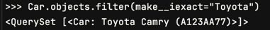

---

### 2.2. Все водители с именем «Олег»
```python
Owner.objects.filter(first_name__iexact="Олег")
```

**Скриншот:**  
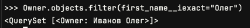

---

### 2.3. Случайный владелец → его id → его удостоверения
```python
owner = random.choice(list(Owner.objects.all()))
owner.id
DriverLicense.objects.filter(owner_id=owner.id)
```

**Скриншот:**  
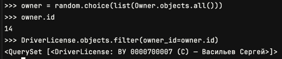

---

### 2.4. Владельцы машин черного цвета
```python
Owner.objects.filter(ownerships__car__color__iexact="черный").distinct()
```

**Скриншот:**  
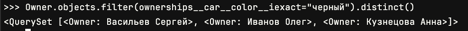

---

### 2.5. Владельцы, чьё владение началось в 2023 году
```python
Owner.objects.filter(ownerships__start_date__year=2023).distinct()
```

**Скриншот:**  
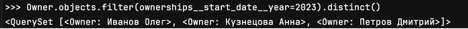

---

## Практическое задание 3. Агрегаты, группировки, сортировки

Импорты:
```python
from django.db.models import Min, Max, Count
```

### 3.1. Дата выдачи самого старшего водительского удостоверения
```python
DriverLicense.objects.aggregate(oldest=Min("issue_date"))
```

**Скриншот:**  
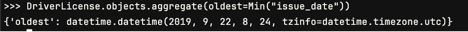

---

### 3.2. Самая поздняя дата владения машиной
```python
Ownership.objects.aggregate(latest_start=Max("start_date"), latest_end=Max("end_date"))
```

**Скриншот:**  
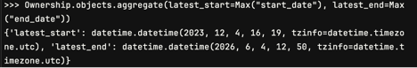

---

### 3.3. Количество машин для каждого водителя
```python
owners_car_counts = (
    Owner.objects
    .values("id", "last_name", "first_name")
    .annotate(car_count=Count("ownerships__car", distinct=True))
    .order_by("last_name", "first_name")
)
list(owners_car_counts)[:10]
```

**Скриншот:**  
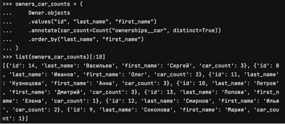

---

### 3.4. Количество машин каждой марки
```python
Car.objects.values("make").annotate(total=Count("id")).order_by("make")
```

**Скриншот:**  
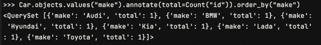

---

### 3.5. Отсортировать всех автовладельцев по дате выдачи удостоверения
```python
Owner.objects.order_by("licenses__issue_date").distinct()
```

**Скриншот:**  
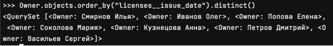

---


### Вывод

- Практическое задание 1: БД наполнена объектами и связями.  
- Практическое задание 2: Выполнены запросы выборки/фильтрации через shell.  
- Практическое задание 3: Выполнены агрегаты, группировки и сортировки.
