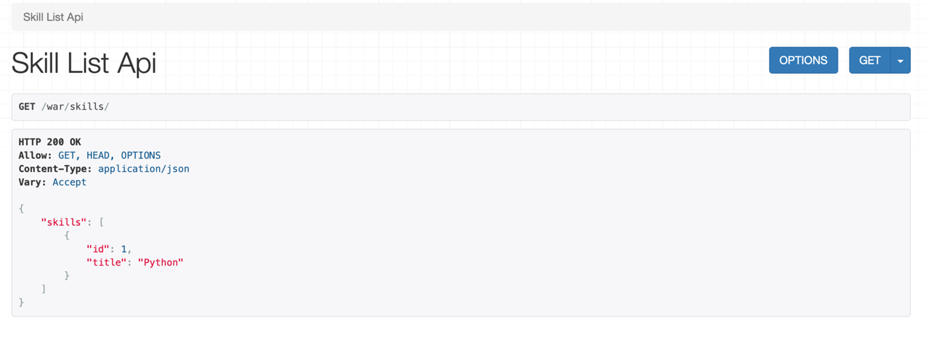
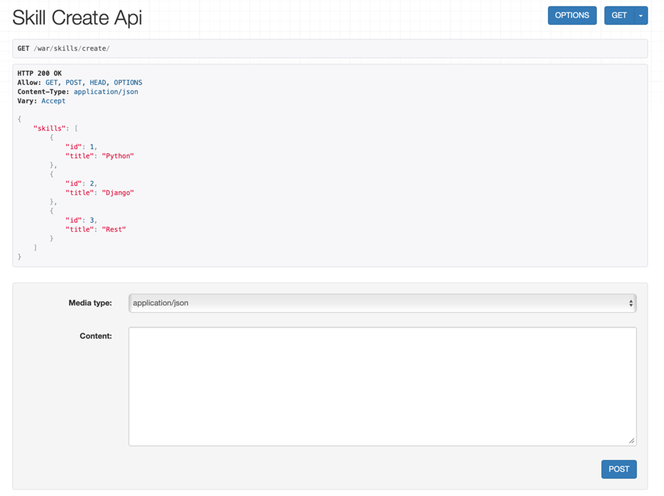
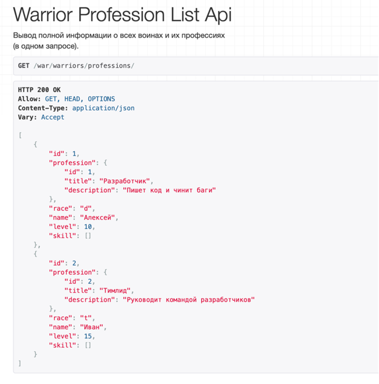
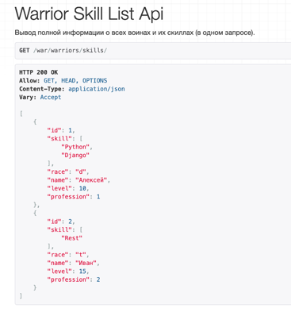
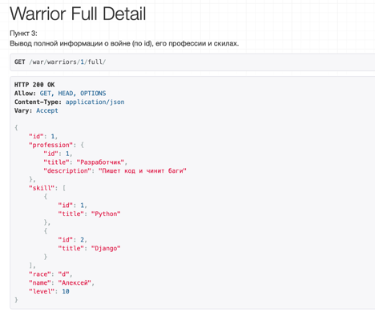
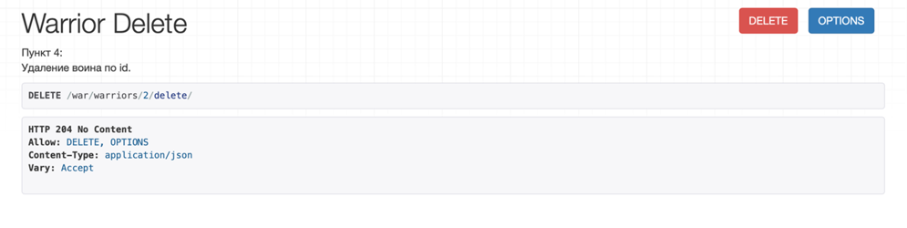
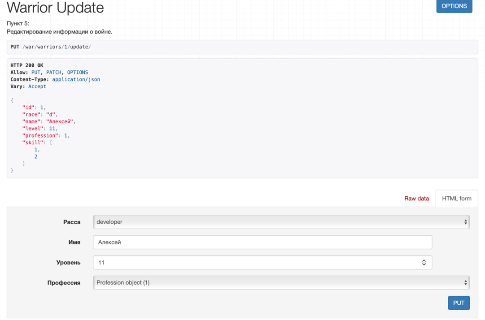

# Лабораторная работа 3. Реализация серверной части на Django REST.
**Практическая работа 3.2**

> Проект: `warriors_project` с приложением `warriors_app`.  
> База: SQLite.  
> Фреймворк для API: Django REST Framework.

---

## 0. Подготовка проекта

### 0.1. Создание и активация виртуального окружения

В терминале (macOS):

```bash
python3 -m venv venv
source venv/bin/activate
```

### 0.2. Установка зависимостей

```bash
pip install django djangorestframework
```

### 0.3. Создание проекта и приложения

```bash
django-admin startproject warriors_project
cd warriors_project
python manage.py startapp warriors_app
```

### 0.4. Подключение приложения и DRF

`warriors_project/settings.py` → `INSTALLED_APPS`:

```python
INSTALLED_APPS = [
    # стандартные приложения Django …
    'rest_framework',
    'warriors_app',
]
```

---

## 1. Модели данных

Цель: описать доменную область «Воин — Профессия — Умения» с помощью моделей Django.

`warriors_app/models.py`:

```python
from django.db import models


class Warrior(models.Model):
    """
    Описание война
    """
    race_types = (
        ('s', 'student'),
        ('d', 'developer'),
        ('t', 'teamlead'),
    )
    race = models.CharField(max_length=1, choices=race_types, verbose_name='Расса')
    name = models.CharField(max_length=120, verbose_name='Имя')
    level = models.IntegerField(verbose_name='Уровень', default=0)
    skill = models.ManyToManyField(
        'Skill',
        verbose_name='Умения',
        through='SkillOfWarrior',
        related_name='warrior_skils',
    )
    profession = models.ForeignKey(
        'Profession',
        on_delete=models.CASCADE,
        verbose_name='Профессия',
        blank=True,
        null=True,
    )

    def __str__(self):
        return f'{self.name} (lvl {self.level})'


class Profession(models.Model):
    """
    Описание профессии
    """
    title = models.CharField(max_length=120, verbose_name='Название')
    description = models.TextField(verbose_name='Описание')

    def __str__(self):
        return self.title


class Skill(models.Model):
    """
    Описание умений
    """
    title = models.CharField(max_length=120, verbose_name='Наименование')

    def __str__(self):
        return self.title


class SkillOfWarrior(models.Model):
    """
    Описание умений война (через таблицу связи)
    """
    skill = models.ForeignKey('Skill', verbose_name='Умение', on_delete=models.CASCADE)
    warrior = models.ForeignKey('Warrior', verbose_name='Воин', on_delete=models.CASCADE)
    level = models.IntegerField(verbose_name='Уровень освоения умения')

    def __str__(self):
        return f'{self.warrior} — {self.skill} (lvl {self.level})'
```

После описания моделей выполняем миграции:

```bash
python manage.py makemigrations
python manage.py migrate
```


## 2. Регистрация моделей в админке и наполнение БД

### 2.1. Регистрация моделей

`warriors_app/admin.py`:

```python
from django.contrib import admin
from .models import Warrior, Profession, Skill, SkillOfWarrior


@admin.register(Warrior)
class WarriorAdmin(admin.ModelAdmin):
    list_display = ('id', 'name', 'race', 'level', 'profession')
    list_filter = ('race', 'profession')


@admin.register(Profession)
class ProfessionAdmin(admin.ModelAdmin):
    list_display = ('id', 'title')


@admin.register(Skill)
class SkillAdmin(admin.ModelAdmin):
    list_display = ('id', 'title')


@admin.register(SkillOfWarrior)
class SkillOfWarriorAdmin(admin.ModelAdmin):
    list_display = ('id', 'warrior', 'skill', 'level')
```

Создаём суперпользователя и заходим в админку:

```bash
python manage.py createsuperuser
python manage.py runserver
```

Переходим в браузере по адресу `http://127.0.0.1:8000/admin/` и создаём:

- несколько профессий (например, «Разработчик», «Тимлид»);
- несколько умений («Python», «Django», «REST»);
- 2–3 воинов с выбранной профессией;
- записи `SkillOfWarrior`, чтобы привязать к каждому воину 1–3 скилла.

**Скриншоты:**  

- _Список профессий в админке_  
  ``

- _Список воинов и их профессий_  
  ``

- _Таблица SkillOfWarrior с уровнями владения навыками_  
  ``

---

## 3. Настройка сериализаторов

Создаём файл `warriors_app/serializers.py`.

```python
from rest_framework import serializers
from .models import Warrior, Profession, Skill
```

### 3.1. Базовый сериализатор воина и создание профессии

```python
class WarriorSerializer(serializers.ModelSerializer):
    """
    Базовый сериализатор модели Warrior.
    Используется для операций обновления/удаления.
    """
    class Meta:
        model = Warrior
        fields = '__all__'


class ProfessionCreateSerializer(serializers.Serializer):
    """
    Пример «ручного» сериализатора для создания профессии.
    Используется в теоретической части работы.
    """
    title = serializers.CharField(max_length=120)
    description = serializers.CharField()

    def create(self, validated_data):
        profession = Profession(**validated_data)
        profession.save()
        return profession
```

### 3.2. Сериализатор скилла

```python
class SkillSerializer(serializers.ModelSerializer):
    """
    Сериализатор для модели Skill.
    """
    class Meta:
        model = Skill
        fields = '__all__'
```

### 3.3. Сериализатор профессии

```python
class ProfessionSerializer(serializers.ModelSerializer):
    """
    Сериализатор для модели Profession.
    Используется как вложенный.
    """
    class Meta:
        model = Profession
        fields = '__all__'
```

### 3.4. Вложенный сериализатор «воин + профессия»

Используется для эндпоинта «все воины и их профессии».

```python
class WarriorProfessionSerializer(serializers.ModelSerializer):
    """
    Воин с вложенным объектом профессии.
    """
    profession = ProfessionSerializer()

    class Meta:
        model = Warrior
        fields = '__all__'
```

### 3.5. Сериализатор «воин + список названий скиллов»

Использует `SlugRelatedField` для красивого представления ManyToMany-связи.

```python
class WarriorSkillSerializer(serializers.ModelSerializer):
    """
    Воин с перечнем его умений (только названия).
    """
    skill = serializers.SlugRelatedField(
        many=True,
        read_only=True,
        slug_field='title',
    )

    class Meta:
        model = Warrior
        fields = '__all__'
```

### 3.6. Полный вложенный сериализатор «воин + профессия + объекты скиллов»

Используется для подробного вывода информации по одному воину.

```python
class WarriorNestedSerializer(serializers.ModelSerializer):
    """
    Полная информация о войне:
    - вложенная профессия;
    - список умений как объектов Skill.
    """
    profession = ProfessionSerializer()
    skill = SkillSerializer(many=True)

    class Meta:
        model = Warrior
        fields = '__all__'
```

---

## 4. Реализация эндпоинтов для работы со скиллами (APIView)

**Практическое задание:**  
Реализовать эндпоинты для добавления и просмотра скиллов методом, описанным в теории (через `APIView`).

### 4.1. Представления

`warriors_app/views.py` (фрагмент):

```python
from rest_framework.views import APIView
from rest_framework.response import Response
from rest_framework.generics import (
    ListAPIView,
    RetrieveAPIView,
    DestroyAPIView,
    UpdateAPIView,
)

from .models import Warrior, Profession, Skill
from .serializers import (
    WarriorSerializer,
    ProfessionCreateSerializer,
    SkillSerializer,
    ProfessionSerializer,
    WarriorProfessionSerializer,
    WarriorSkillSerializer,
    WarriorNestedSerializer,
)
```

Классы для работы со скиллами:

```python
class SkillListAPIView(APIView):
    """
    Список всех доступных умений (GET).
    """
    def get(self, request):
        skills = Skill.objects.all()
        serializer = SkillSerializer(skills, many=True)
        return Response({'skills': serializer.data})


class SkillCreateAPIView(APIView):
    """
    Создание нового умения (POST).
    """
    def get(self, request):
        """
        GET-запрос используется только для отображения формы DRF.
        """
        skills = Skill.objects.all()
        serializer = SkillSerializer(skills, many=True)
        return Response({'skills': serializer.data})

    def post(self, request):
        """
        Ожидаемый формат тела запроса:
        {
          "skill": {
            "title": "Python"
          }
        }
        """
        skill_data = request.data.get('skill')
        serializer = SkillSerializer(data=skill_data)

        if serializer.is_valid(raise_exception=True):
            skill_saved = serializer.save()
            return Response({'Success': f"Skill '{skill_saved.title}' created successfully."})
```

### 4.2. URL-маршруты

`warriors_app/urls.py`:

```python
from django.urls import path
from .views import (
    SkillListAPIView,
    SkillCreateAPIView,
    WarriorProfessionListAPIView,
    WarriorSkillListAPIView,
    WarriorFullDetailView,
    WarriorDeleteView,
    WarriorUpdateView,
)

app_name = 'warriors_app'

urlpatterns = [
    path('skills/', SkillListAPIView.as_view(), name='skill-list'),
    path('skills/create/', SkillCreateAPIView.as_view(), name='skill-create'),

    # остальные маршруты — в следующих разделах
]
```

`warriors_project/urls.py`:

```python
from django.contrib import admin
from django.urls import path, include

urlpatterns = [
    path('admin/', admin.site.urls),
    path('war/', include('warriors_app.urls')),
]
```

### 4.3. Проверка работы

1. Запускаем сервер: `python manage.py runserver`.
2. Переходим в браузере по адресу:

   - `http://127.0.0.1:8000/war/skills/` — просмотр списка скиллов;
   - `http://127.0.0.1:8000/war/skills/create/` — создание нового умения.

3. Для создания указываем JSON в формате:

```json
{
  "skill": {
    "title": "Python"
  }
}
```

**Скриншоты:**  

- _Список умений (GET /war/skills/)_  
  

- _Создание нового умения (POST /war/skills/create/)_  
  

---

## 5. Эндпоинт: все воины и их профессии (ListAPIView)

**Пункт 1 практического задания блока:**  
Вывод полной информации о всех воинах и их профессиях (в одном запросе).

### 5.1. Представление

`warriors_app/views.py`:

```python
class WarriorProfessionListAPIView(ListAPIView):
    """
    Список всех воинов с подробной информацией о профессии.
    """
    queryset = Warrior.objects.select_related('profession').all()
    serializer_class = WarriorProfessionSerializer
```

### 5.2. URL-маршрут

`warriors_app/urls.py` (добавление):

```python
urlpatterns = [
    # ...
    path(
        'warriors/professions/',
        WarriorProfessionListAPIView.as_view(),
        name='warrior-profession-list',
    ),
]
```

### 5.3. Проверка

Запрос:

```text
GET http://127.0.0.1:8000/war/warriors/professions/
```

Пример ответа:

```json
[
  {
    "id": 1,
    "race": "d",
    "name": "Алексей",
    "level": 10,
    "profession": {
      "id": 1,
      "title": "Разработчик",
      "description": "Пишет код и чинит баги"
    },
    "skill": [1, 2]
  },
  {
    "id": 2,
    "race": "t",
    "name": "Иван",
    "level": 15,
    "profession": {
      "id": 2,
      "title": "Тимлид",
      "description": "Руководит разработчиками"
    },
    "skill": [3]
  }
]
```

**Скриншот:**  


---

## 6. Эндпоинт: все воины и их скиллы

**Пункт 2 практического задания:**  
Вывод полной информации о всех воинах и их скиллах (в одном запросе).

### 6.1. Представление

`warriors_app/views.py`:

```python
class WarriorSkillListAPIView(ListAPIView):
    """
    Список всех воинов и их умений.
    Для вывода умений используется SlugRelatedField (только названия).
    """
    queryset = Warrior.objects.prefetch_related('skill').all()
    serializer_class = WarriorSkillSerializer
```

### 6.2. URL-маршрут

`warriors_app/urls.py`:

```python
urlpatterns = [
    # ...
    path(
        'warriors/skills/',
        WarriorSkillListAPIView.as_view(),
        name='warrior-skill-list',
    ),
]
```

### 6.3. Проверка

Запрос:

```text
GET http://127.0.0.1:8000/war/warriors/skills/
```

Пример ответа:

```json
[
  {
    "id": 1,
    "race": "d",
    "name": "Алексей",
    "level": 10,
    "profession": 1,
    "skill": ["Python", "Django"]
  },
  {
    "id": 2,
    "race": "t",
    "name": "Иван",
    "level": 15,
    "profession": 2,
    "skill": ["REST"]
  }
]
```

**Скриншот:**  


---

## 7. Эндпоинты для работы с одним воином (Retrieve / Update / Destroy)

**Пункты 3–5 практического задания:**

- Вывод полной информации о войне (по id), его профессиях и скилах.  
- Удаление воина по id.  
- Редактирование информации о войне.

Для каждого пункта реализован отдельный generic-класс и отдельный URL.

### 7.1. Полная информация о войне по id (RetrieveAPIView)

`warriors_app/views.py`:

```python
class WarriorFullDetailView(RetrieveAPIView):
    """
    Пункт 3:
    Вывод полной информации о войне (по id), его профессии и скилах.
    Используется вложенный сериализатор WarriorNestedSerializer.
    """
    queryset = Warrior.objects.select_related('profession').prefetch_related('skill').all()
    serializer_class = WarriorNestedSerializer
    lookup_field = 'id'
```

URL:

```python
urlpatterns = [
    # ...
    path(
        'warriors/<int:id>/full/',
        WarriorFullDetailView.as_view(),
        name='warrior-full-detail',
    ),
]
```

Запрос:

```text
GET http://127.0.0.1:8000/war/warriors/1/full/
```

Пример ответа:

```json
{
  "id": 1,
  "race": "d",
  "name": "Алексей",
  "level": 10,
  "profession": {
    "id": 1,
    "title": "Разработчик",
    "description": "Пишет код и чинит баги"
  },
  "skill": [
    {
      "id": 1,
      "title": "Python"
    },
    {
      "id": 2,
      "title": "Django"
    }
  ]
}
```

**Скриншот:**  


---

### 7.2. Удаление воина по id (DestroyAPIView)

`warriors_app/views.py`:

```python
class WarriorDeleteView(DestroyAPIView):
    """
    Пункт 4:
    Удаление воина по id.
    """
    queryset = Warrior.objects.all()
    serializer_class = WarriorSerializer
    lookup_field = 'id'
```

URL:

```python
urlpatterns = [
    # ...
    path(
        'warriors/<int:id>/delete/',
        WarriorDeleteView.as_view(),
        name='warrior-delete',
    ),
]
```

Проверка:

1. Открыть в браузере `http://127.0.0.1:8000/war/warriors/1/delete/`.
2. В выпадающем списке методов выбрать **DELETE**.
3. Нажать кнопку **DELETE**.


**Скриншот:**  


---

### 7.3. Редактирование информации о войне по id (UpdateAPIView)

`warriors_app/views.py`:

```python
class WarriorUpdateView(UpdateAPIView):
    """
    Пункт 5:
    Редактирование информации о войне по id.
    """
    queryset = Warrior.objects.all()
    serializer_class = WarriorSerializer
    lookup_field = 'id'
```

URL:

```python
urlpatterns = [
    # ...
    path(
        'warriors/<int:id>/update/',
        WarriorUpdateView.as_view(),
        name='warrior-update',
    ),
]
```

Проверка:

1. Открыть `http://127.0.0.1:8000/war/warriors/1/update/`.
2. В форме изменить необходимые поля
   (например, увеличить `level` и поменять `profession`).
3. Выбрать метод **PUT** или **PATCH** и отправить запрос.

После успешного обновления можно повторно запросить:

```text
GET http://127.0.0.1:8000/war/warriors/1/full/
```

и убедиться, что изменения применились.

**Скриншот:**  


---

## 8. Вывод

В ходе практической работы 3.2 были выполнены следующие шаги:

1. Создан проект `warriors_project` и приложение `warriors_app`, настроен Django REST Framework.
2. Описаны модели `Warrior`, `Profession`, `Skill`, `SkillOfWarrior` и зарегистрированы в админке.
3. Реализованы сериализаторы:
   - базовые (`WarriorSerializer`, `ProfessionSerializer`, `SkillSerializer`);
   - вложенные (`WarriorProfessionSerializer`, `WarriorSkillSerializer`, `WarriorNestedSerializer`).
4. С помощью `APIView` реализованы эндпоинты для просмотра и добавления умений.
5. С помощью generic-классов `ListAPIView`, `RetrieveAPIView`, `DestroyAPIView`, `UpdateAPIView` реализованы:
   - вывод списка воинов с профессиями;
   - вывод списка воинов с их скиллами;
   - вывод полной информации о войне (по id), включая профессию и список умений;
   - удаление воина по id;
   - редактирование информации о войне.
6. Работа всех эндпоинтов проверена через DRF browsable API, подготовлены скриншоты для отчёта.

Проект демонстрирует использование Django REST Framework для построения CRUD‑API со сложными связями между моделями и вложенной сериализацией данных.
