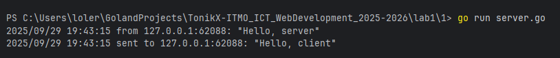
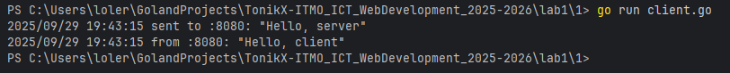

# Задание 1: UDP-клиент и сервер

## Условие
Реализовать клиентскую и серверную часть приложения.  
Клиент отправляет серверу сообщение «Hello, server», и оно должно отобразиться на стороне сервера.  
В ответ сервер отправляет клиенту сообщение «Hello, client», которое должно отобразиться у клиента.

Требования:

- Использовать библиотеку `socket`.
- Реализовать с помощью протокола *UDP*.

---

## Код программы

### Сервер (server.go)

```go
package main

import (
	"context"
	"flag"
	"log"
	"net"
	"os"
	"os/signal"
	"syscall"
	"time"
)

const defaultUDPAddr = ":8080"

func main() {
	server := flag.String("server", defaultUDPAddr, "UDP server address host:port")
	flag.Parse()

	udpAddr, err := net.ResolveUDPAddr("udp", *server)
	if err != nil {
		log.Fatalf("resolve addr: %v", err)
	}

	conn, err := net.ListenUDP("udp", udpAddr)
	if err != nil {
		log.Fatalf("listen udp: %v", err)
	}
	defer func(conn *net.UDPConn) {
		err := conn.Close()
		if err != nil {
			log.Printf("close udp: %v", err)
		}
	}(conn)

	ctx, stop := signal.NotifyContext(context.Background(), os.Interrupt, syscall.SIGTERM)
	defer stop()

	go func() {
		for {
			select {
			case <-ctx.Done():
				return
			default:
			}
			_ = conn.SetReadDeadline(time.Now().Add(2 * time.Second))

			buf := make([]byte, 1024)

			n, clientAddr, err := conn.ReadFromUDP(buf)
			if ne, ok := err.(net.Error); ok && ne.Timeout() {
				continue
			}
			if err != nil {
				if ctx.Err() != nil {
					return
				}
				log.Printf("read error: %v", err)
				continue
			}

			msg := string(buf[:n])
			log.Printf("from %s: %q", clientAddr.String(), msg)

			reply := []byte("Hello, client")
			if _, err := conn.WriteToUDP(reply, clientAddr); err != nil {
				log.Printf("write error to %s: %v", clientAddr.String(), err)
			}
			log.Printf("sent to %s: %q\n", clientAddr.String(), string(reply))
		}
	}()

	<-ctx.Done()
	log.Println("shutting down…")
}

```

### Клиент (client.go)

```go
package main

import (
	"flag"
	"log"
	"net"
	"time"
)

const (
	defaultServerAddress = ":8080"
	defaultTimeout       = 3 * time.Second
)

func main() {
	server := flag.String("server", defaultServerAddress, "UDP server address host:port")
	timeout := flag.Duration("timeout", defaultTimeout, "read timeout")
	flag.Parse()

	raddr, err := net.ResolveUDPAddr("udp", *server)
	if err != nil {
		log.Fatalf("resolve server addr: %v", err)
	}

	conn, err := net.DialUDP("udp", nil, raddr)
	if err != nil {
		log.Fatalf("dial udp: %v", err)
	}
	defer func(conn *net.UDPConn) {
		err := conn.Close()
		if err != nil {
			log.Printf("close udp: %v", err)
		}
	}(conn)

	payload := []byte("Hello, server")
	if _, err := conn.Write(payload); err != nil {
		log.Fatalf("send: %v", err)
	}
	log.Printf("sent to %s: %q\n", raddr.String(), string(payload))

	if err := conn.SetReadDeadline(time.Now().Add(*timeout)); err != nil {
		log.Fatalf("set deadline: %v", err)
	}

	buf := make([]byte, 1024)
	n, err := conn.Read(buf)
	if err != nil {
		log.Fatalf("recv: %v", err)
	}
	log.Printf("from %s: %q", raddr.String(), string(buf[:n]))
}
```

## Запуск

1. Необходимо открыть два терминала.
2. В первом запустите сервер:
   `go run server.go`
3. Во втором терминале запустите клиент:
   `go run client.go`

## Результат

Cо стороны сервера видим следующее: 

Cо стороны клиента видим: 

Значит, цели задания выполнены.

## Выводы

1. Было реализовано простое взаимодействие между клиентом и сервером через UDP-соединение.
2. Сообщения корректно передаются и отображаются с обеих сторон.
3. Использован минимальный, но достаточный набор функций библиотеки `socket`.