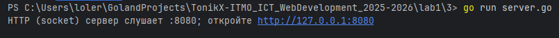
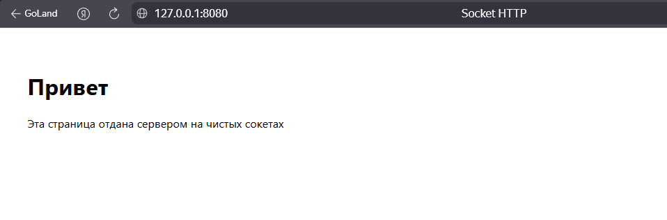

# Задание 3: HTTP-сервер на сокетах

## Условие
Реализовать серверную часть приложения. Клиент подключается к серверу, и в ответ получает HTTP-сообщение, содержащее HTML-страницу, которая сервер подгружает из файла index.html.

Требования:

- Обязательно использовать библиотеку `socket`

## Принцип работы
1. Клиент отправляет HTTP-запрос типа GET на адрес сервера.

2. Сервер:
    - читает и разбирает запрос;
    - загружает файл index.html;
    - формирует и отправляет корректный HTTP-ответ с заголовками и телом;
    - в случае ошибки — формирует ответ с соответствующим кодом (404, 405).
3. Клиент получает HTML-страницу и отображает её.

## Код программы

### Сервер (server.go)

```go
package main

import (
	"bufio"
	"errors"
	"fmt"
	"io"
	"net"
	"os"
	"path"
	"strings"
	"time"
)

// Константы для сервера
const (
	addr        = ":8080"
	fileToServe = "index.html"
	contentType = "text/html; charset=utf-8"
	readTimeout = 5 * time.Second
)

// parseRequestLine читает первую строку HTTP-запроса: "GET / HTTP/1.1"
func parseRequestLine(r *bufio.Reader) (method, path, proto string, err error) {
	line, err := r.ReadString('\n')
	if err != nil {
		return "", "", "", err
	}
	line = strings.TrimRight(line, "\r\n")
	parts := strings.Fields(line)
	if len(parts) != 3 {
		return "", "", "", errors.New("bad request line")
	}
	return parts[0], parts[1], parts[2], nil
}

// drainHeaders дочитывает остальные заголовки до пустой строки.
func drainHeaders(r *bufio.Reader) error {
	for {
		line, err := r.ReadString('\n')
		if err != nil {
			return err
		}
		line = strings.TrimRight(line, "\r\n")
		if line == "" {
			return nil
		}
	}
}

// writeResponse пишет статусную строку, заголовки и тело.
func writeResponse(w io.Writer, status int, statusText string, headers map[string]string, body []byte) error {
	bw := bufio.NewWriter(w)
	if _, err := fmt.Fprintf(bw, "HTTP/1.1 %d %s\r\n", status, statusText); err != nil {
		return err
	}

	if headers == nil {
		headers = map[string]string{}
	}
	headers["Date"] = time.Now().UTC().Format(time.RFC1123)
	headers["Server"] = "Go-Socket-Server"
	headers["Connection"] = "close"

	if body != nil {
		headers["Content-Length"] = fmt.Sprintf("%d", len(body))
	}

	for k, v := range headers {
		if _, err := fmt.Fprintf(bw, "%s: %s\r\n", k, v); err != nil {
			return err
		}
	}

	if _, err := bw.WriteString("\r\n"); err != nil {
		return err
	}
	if body != nil {
		if _, err := bw.Write(body); err != nil {
			return err
		}
	}
	return bw.Flush()
}

func handleConn(c net.Conn) {
	defer c.Close()
	_ = c.SetReadDeadline(time.Now().Add(readTimeout))
	reader := bufio.NewReader(c)

	method, urlPath, proto, err := parseRequestLine(reader)
	if err != nil {
		_ = writeResponse(c, 400, "Bad Request", map[string]string{
			"Content-Type": "text/plain; charset=utf-8",
		}, []byte("Bad Request\n"))
		return
	}

	urlPath = strings.SplitN(urlPath, "#", 2)[0]
	urlPath = strings.SplitN(urlPath, "?", 2)[0]

	cleanPath := path.Clean(urlPath)
	if cleanPath == "." {
		cleanPath = "/"
	}

	fmt.Printf("%s %s (%s) from %s -> cleanPath=%q\n",
		method, urlPath, proto, c.RemoteAddr(), cleanPath)

	if err := drainHeaders(reader); err != nil {
		_ = writeResponse(c, 400, "Bad Request", map[string]string{
			"Content-Type": "text/plain; charset=utf-8",
		}, []byte("Bad Request\n"))
		return
	}

	if method != "GET" {
		_ = writeResponse(c, 405, "Method Not Allowed", map[string]string{
			"Allow":        "GET",
			"Content-Type": "text/plain; charset=utf-8",
		}, []byte("Method Not Allowed\n"))
		return
	}

	if cleanPath == "/" {
		cleanPath = "/index.html"
	}
	if cleanPath != "/index.html" {
		_ = writeResponse(c, 404, "Not Found", map[string]string{
			"Content-Type": "text/plain; charset=utf-8",
		}, []byte("Not Found\n"))
		return
	}

	data, err := os.ReadFile(fileToServe)
	if err != nil {
		if os.IsNotExist(err) {
			_ = writeResponse(c, 404, "Not Found", map[string]string{
				"Content-Type": "text/plain; charset=utf-8",
			}, []byte("index.html not found\n"))
		} else {
			_ = writeResponse(c, 500, "Internal Server Error", map[string]string{
				"Content-Type": "text/plain; charset=utf-8",
			}, []byte("Internal Server Error\n"))
		}
		return
	}

	_ = writeResponse(c, 200, "OK", map[string]string{
		"Content-Type": contentType,
	}, data)
}

func main() {
	ln, err := net.Listen("tcp", addr)
	if err != nil {
		panic(err)
	}
	defer func(ln net.Listener) {
		err := ln.Close()
		if err != nil {
			fmt.Println(err)
		}
	}(ln)
	fmt.Printf("HTTP (socket) сервер слушает %s; откройте http://127.0.0.1%v\n", addr, addr)

	for {
		conn, err := ln.Accept()
		if err != nil {
			fmt.Println("accept error:", err)
			continue
		}
		go handleConn(conn)
	}
}
```

### HTML-страница (index.html)

```html
<!doctype html>
<html lang="ru">
<head>
    <meta charset="utf-8">
    <title>Socket HTTP</title>
    <meta name="viewport" content="width=device-width, initial-scale=1">
    <style>body{font-family:system-ui, sans-serif; padding:2rem}</style>
</head>
<body>
<h1>Привет</h1>
<p>Эта страница отдана сервером на чистых сокетах</p>
</body>
</html>

```

## Запуск

1. Необходимо открыть терминал.
2. Запустите сервер:
   `go run server.go`
3. Перейдите по ссылке, указанной в терминале.

## Результат

Cо стороны сервера видим следующее: 

Переходим по адресу, указанному в терминале: [http://127.0.0.1:8080](http://127.0.0.1:8080)

Видим HTML-страницу, полученную при помощи сервера: 

Значит, цели задания выполнены.

## Выводы
1. Реализован собственный HTTP-сервер с использованием библиотеки net и протокола TCP.

2. Сервер корректно обрабатывает запросы типа GET и возвращает содержимое HTML-файла.

3. Обработаны основные ошибки: отсутствие файла (404) и неподдерживаемые методы (405).

4. Задание позволило понять базовые принципы работы HTTP-протокола на низком уровне.