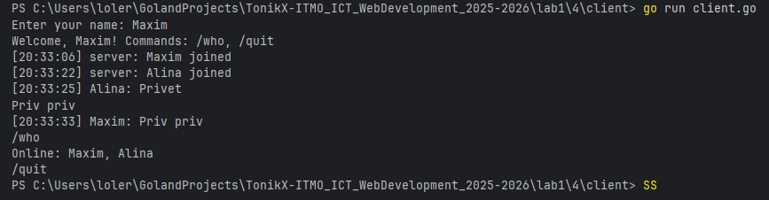
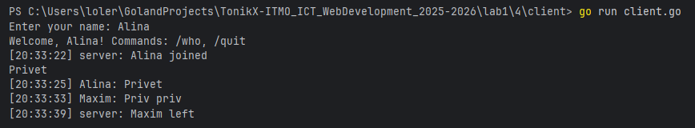

# Задание 4: Многопользовательский чат на TCP

## Условие

Реализовать многопользовательский чат.

**Требования:**

* Обязательно использовать библиотеку `socket`.
* Для многопользовательского чата необходимо использовать **параллелизм**:

**Реализация:**

* Протокол **TCP**: 100% баллов.
* (Альтернативно: UDP — 80% баллов; в клиенте отдельный поток/горшрутина на приём.)

## Принцип работы

1. **Сервер**

    * слушает адрес (TCP);
    * при новом подключении запускает отдельную горутину на обработку клиента;
    * хранит список активных клиентов (по имени), защищённый `sync.Mutex`;
    * входящие сообщения складывает в общий канал трансляции и рассылает всем клиентам (через отдельную горутину-«ретранслятор»);
    * поддерживает команды `/who` (список онлайн) и `/quit` (выход).

2. **Клиент**

    * подключается к серверу, первой строкой отправляет **имя**;
    * отдельная горутина непрерывно **читает** сообщения от сервера и выводит их;
    * основной поток читает ввод пользователя и **отправляет** строки на сервер.

3. **Реальное время** достигается за счёт разделения ввода/вывода в разные горутины и неблокирующей рассылки через буферизированные каналы.

---

## Код программы

### Сервер (`server.go`)

```go
package main

import (
	"bufio"
	"fmt"
	"net"
	"os"
	"os/signal"
	"strings"
	"sync"
	"syscall"
	"time"
)

// Сообщение, которое будет транслироваться всем
type chatMsg struct {
	From string
	Text string
	Time time.Time
}

// Описание подключенного пользователя
type client struct {
	Name string
	Conn net.Conn
	Out  chan string // буфер исходящих строк этому клиенту
}

type server struct {
	mu      sync.Mutex
	clients map[string]*client // по имени
	bcast   chan chatMsg       // общий канал трансляции
}

func newServer() *server {
	return &server{
		clients: make(map[string]*client),
		bcast:   make(chan chatMsg, 128),
	}
}

func (s *server) run(addr string) error {
	ln, err := net.Listen("tcp", addr)
	if err != nil {
		return err
	}
	defer ln.Close()

	fmt.Printf("Chat server listening on %s\n", addr)

	// Горутина-транслятор: читает из s.bcast и отправляет всем пользователям
	go s.broadcaster()

	sigCh := make(chan os.Signal, 1)
	signal.Notify(sigCh, os.Interrupt, syscall.SIGTERM)
	go func() {
		<-sigCh
		fmt.Println("\nShutting down...")
		ln.Close()
		s.mu.Lock()
		for _, c := range s.clients {
			c.Conn.Close()
		}
		s.mu.Unlock()
		os.Exit(0)
	}()

	for {
		conn, err := ln.Accept()
		if err != nil {
			if ne, ok := err.(net.Error); ok && !ne.Temporary() {
				return nil
			}
			fmt.Println("accept error:", err)
			continue
		}
		go s.handleConn(conn)
	}
}

func (s *server) handleConn(conn net.Conn) {
	defer conn.Close()
	r := bufio.NewScanner(conn)
	r.Buffer(make([]byte, 0, 1024), 64*1024)

	// 1) Первая строка — имя
	if !r.Scan() {
		return
	}
	name := strings.TrimSpace(r.Text())
	if name == "" {
		fmt.Fprintln(conn, "ERROR: empty name")
		return
	}
	// запретим служебные символы
	if strings.ContainsAny(name, " \t\r\n") || len(name) > 32 {
		fmt.Fprintln(conn, "ERROR: invalid name")
		return
	}

	// 2) Регистрируем клиента с уникальным именем
	c := &client{
		Name: name,
		Conn: conn,
		Out:  make(chan string, 64),
	}
	if !s.addClient(c) {
		fmt.Fprintln(conn, "ERROR: name already taken")
		return
	}
	defer s.removeClient(c.Name)

	// 3) Горутина отправки сообщений этому клиенту
	go s.writer(c)

	// 4) Приветствие и оповещение всех
	c.Out <- fmt.Sprintf("Welcome, %s! Commands: /who, /quit", c.Name)
	s.bcast <- chatMsg{From: "server", Text: fmt.Sprintf("%s joined", c.Name), Time: time.Now()}

	// 5) Чтение входящих сообщений от клиента
	for r.Scan() {
		line := strings.TrimSpace(r.Text())
		if line == "" {
			continue
		}
		switch line {
		case "/quit":
			c.Out <- "Bye!"
			return
		case "/who":
			c.Out <- "Online: " + strings.Join(s.listClients(), ", ")
			continue
		}
		// широковещательное сообщение
		s.bcast <- chatMsg{From: c.Name, Text: line, Time: time.Now()}
	}
	// Если сканер завершился клиент отключился
}

func (s *server) writer(c *client) {
	w := bufio.NewWriter(c.Conn)
	for msg := range c.Out {
		if _, err := w.WriteString(msg + "\n"); err != nil {
			return
		}
		if err := w.Flush(); err != nil {
			return
		}
	}
}

func (s *server) broadcaster() {
	for m := range s.bcast {
		line := fmt.Sprintf("[%s] %s: %s", m.Time.Format("15:04:05"), m.From, m.Text)
		s.mu.Lock()
		for _, c := range s.clients {
			// не блокируемся: неблокирующая попытка записать в буфер
			select {
			case c.Out <- line:
			default:
				// если у клиента переполнен буфер — пропустим
			}
		}
		s.mu.Unlock()
	}
}

func (s *server) addClient(c *client) bool {
	s.mu.Lock()
	defer s.mu.Unlock()
	if _, exists := s.clients[c.Name]; exists {
		return false
	}
	s.clients[c.Name] = c
	return true
}

func (s *server) removeClient(name string) {
	s.mu.Lock()
	c, ok := s.clients[name]
	if ok {
		delete(s.clients, name)
	}
	s.mu.Unlock()
	if ok {
		close(c.Out)
		_ = c.Conn.Close()
		s.bcast <- chatMsg{From: "server", Text: fmt.Sprintf("%s left", name), Time: time.Now()}
	}
}

func (s *server) listClients() []string {
	s.mu.Lock()
	defer s.mu.Unlock()
	out := make([]string, 0, len(s.clients))
	for name := range s.clients {
		out = append(out, name)
	}
	return out
}

func main() {
	srv := newServer()
	if err := srv.run(":8080"); err != nil {
		fmt.Println("server error:", err)
	}
}
```

### Клиент (`client.go`)

```go
package main

import (
	"bufio"
	"fmt"
	"net"
	"os"
	"strings"
)

// Клиент: первая строка - имя, затем пересылаем всё, что вводит пользователь.
// От сервера читаем в отдельной горутине, чтобы можно было одновременно печатать и получать.

func main() {
	serverAddr := "127.0.0.1:8080"
	if len(os.Args) > 1 {
		serverAddr = os.Args[1]
	}

	fmt.Print("Enter your name: ")
	in := bufio.NewReader(os.Stdin)
	name, _ := in.ReadString('\n')
	name = strings.TrimSpace(name)
	if name == "" {
		fmt.Println("Name cannot be empty")
		return
	}

	conn, err := net.Dial("tcp", serverAddr)
	if err != nil {
		fmt.Println("connect error:", err)
		return
	}
	defer conn.Close()

	// 1) Отправляем имя первой строкой
	fmt.Fprintln(conn, name)

	// 2) Горутина чтения из сервера
	go func() {
		r := bufio.NewScanner(conn)
		r.Buffer(make([]byte, 0, 1024), 64*1024)
		for r.Scan() {
			fmt.Println(r.Text())
		}
		os.Exit(0) // сервер закрыл соединение — выходим
	}()

	// 3) Главная петля: читаем stdin и шлём на сервер
	for {
		line, err := in.ReadString('\n')
		if err != nil {
			return
		}
		line = strings.TrimRight(line, "\r\n")
		if line == "" {
			continue
		}
		fmt.Fprintln(conn, line)
		if line == "/quit" {
			return
		}
	}
}
```

---

## Запуск

1. Открой два (и больше) терминала.
2. В первом — сервер:

   ```bash
   go run server.go
   ```
3. В остальных — клиенты:

   ```bash
   go run client.go
   ```

   (или с параметром адреса: `go run client.go 127.0.0.1:8080`)
4. В каждом клиенте введите **имя**.
5. Печатайте сообщения. Команды:

    * `/who` — список подключённых пользователей;
    * `/quit` — выход.

---

## Результат

* Все сообщения от любого клиента транслируются остальным пользователям с меткой времени.
* Подключение/отключение пользователя отображается у всех.
* Клиент читает входящие сообщения независимо от ввода (за счёт горутин).

User 1


User 2

---

## Выводы

1. Реализован многопользовательский чат на **TCP** с использованием `net`, горутин и синхронизации.
2. Сервер обрабатывает каждое подключение в отдельной горутине; рассылка выполняется централизованно через канал.
3. Используются буферизированные каналы на клиентах для неблокирующей отправки; список клиентов защищён `sync.Mutex`.
4. Поведение устойчиво к отключениям клиентов; есть простые команды `/who` и `/quit`.
5. Архитектура легко расширяется (аутентификация, приватные чаты, логирование, хранение истории и т. п.).
