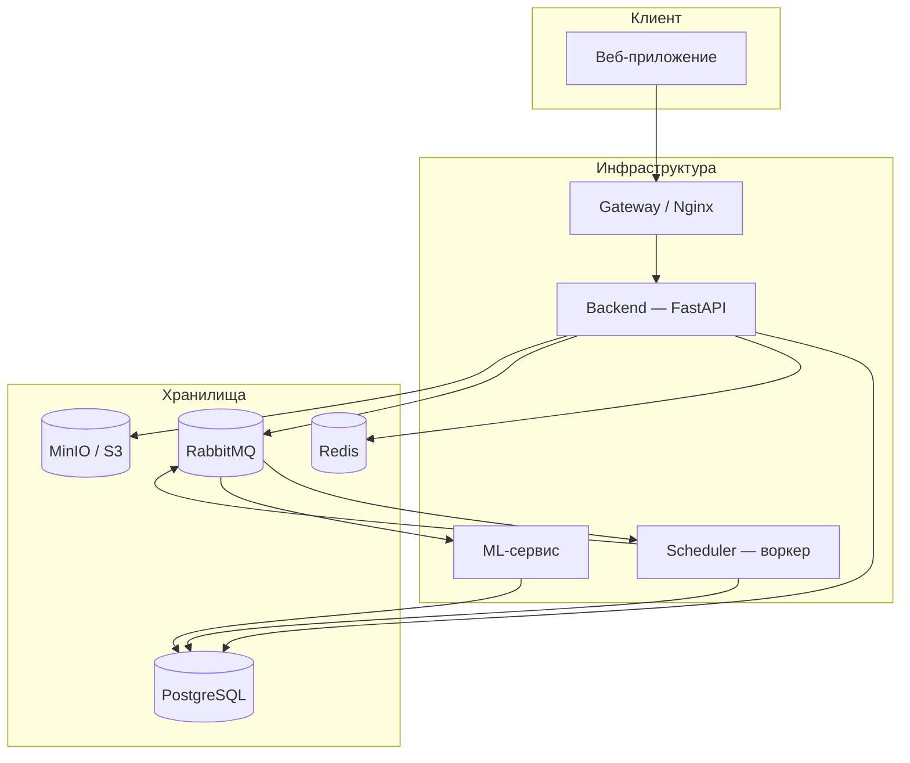

# Лабораторные работы

## Pulse Platform — серверная платформа аналитики

В рамках курса была разработана полноценная серверная платформа **Pulse** — система для управления и аналитики коммерческой недвижимости. Платформа объединяет REST API, фоновую обработку данных, интеграцию с внешними источниками и контейнеризированное развёртывание.

Проект реализован как **монорепозиторий** с несколькими независимыми сервисами, работающими в единой инфраструктуре:

| Компонент | Назначение |
|-----------|------------|
| **Backend** | Основной HTTP API: аутентификация, управление объектами, файлами, чатами, дашбордами |
| **Scheduler** | Фоновый воркер: парсинг загруженных файлов, периодический сбор данных, очистка временных ресурсов |
| **ML-сервис** | Аналитические вычисления и обработка очереди машинного обучения |
| **Gateway** | Reverse-proxy, TLS-терминация, раздача клиентского приложения |

### Технологический стек

- **Python 3.12** — язык серверной части
- **FastAPI** — веб-фреймворк для построения API
- **PostgreSQL** — основное хранилище данных
- **Redis** — кэширование, rate limiting, WebSocket pub/sub
- **RabbitMQ** — асинхронная шина сообщений между сервисами
- **Docker Compose** — оркестрация контейнеров
- **Alembic** — миграции схемы базы данных

### Архитектурный принцип

Каждый сервис построен по **слоистой архитектуре**:

```
HTTP-запрос → Endpoint (роутер) → Core (бизнес-логика) → Service (интеграции) → База данных
```

Такое разделение позволяет изолировать транспортный слой от доменной логики и упрощает тестирование и сопровождение.

---

## Структура отчёта

Отчёт состоит из трёх лабораторных работ, каждая из которых раскрывает отдельный аспект разработки:

<div class="grid cards" markdown>

-   :material-api:{ .lg .middle } **Лабораторная 1**

    ---

    Построение полноценного серверного приложения на FastAPI с применением DI, middleware, ORM и внешних интеграций.

    [:octicons-arrow-right-24: Перейти](lab1-fastapi.md)

-   :material-lightning-bolt:{ .lg .middle } **Лабораторная 2**

    ---

    Потоки, процессы и асинхронность в Python на примере реальных паттернов проекта.

    [:octicons-arrow-right-24: Перейти](lab2-async.md)

-   :material-docker:{ .lg .middle } **Лабораторная 3**

    ---

    Контейнеризация FastAPI, интеграция парсера с БД, вызов через API и очередь сообщений.

    [:octicons-arrow-right-24: Перейти](lab3-docker.md)

</div>

---

## Общая схема взаимодействия сервисов



---

## Как собрать и опубликовать

```bash
pip install -r requirements.txt
mkdocs serve        # локальный предпросмотр на http://127.0.0.1:8000
mkdocs build        # сборка в каталог site/
mkdocs gh-deploy    # публикация на GitHub Pages
```

Каталог `mkdocs-labs/` можно перенести в любой репозиторий — достаточно скопировать его целиком и настроить `repo_url` в `mkdocs.yml`.
