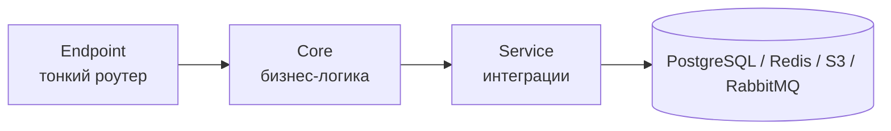
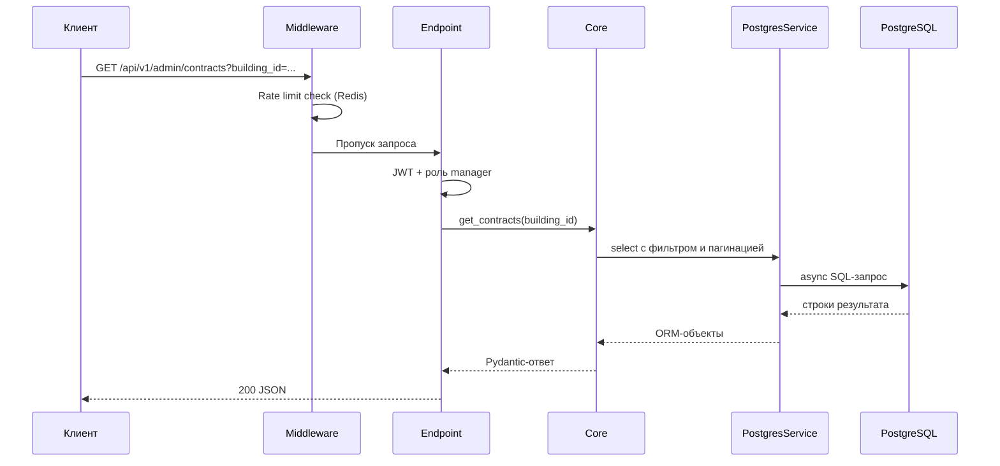

# Лабораторная работа №1

## Реализация полноценного серверного приложения на FastAPI

!!! info "Цель работы"
    Научиться реализовывать полноценное серверное приложение с помощью фреймворка **FastAPI** с применением дополнительных средств и библиотек.

---

## 1. Введение

В первой лабораторной работе была спроектирована и реализована серверная часть платформы **Pulse** — REST API для управления коммерческой недвижимостью, арендаторами, договорами, финансовой аналитикой и внутренними коммуникациями.

Приложение не ограничивается набором простых CRUD-эндпоинтов: оно включает аутентификацию с ролевой моделью, загрузку и валидацию файлов, WebSocket-каналы для чатов, интеграцию с объектным хранилищем и публикацию задач в брокер сообщений.

---

## 2. Структура FastAPI-приложения

### 2.1. Точка входа и режимы запуска

Серверная часть организована через единую CLI-точку входа, которая перед стартом автоматически применяет миграции базы данных. Поддерживаются три режима:

| Режим | Описание |
|-------|----------|
| `--dev` | Локальная разработка с hot-reload через Uvicorn |
| `--run` | Продакшен-запуск: Gunicorn с несколькими Uvicorn-воркерами |
| `--test` | Запуск автоматических тестов через pytest |

Такой подход позволяет использовать **один Docker-образ** для разных ролей (API-сервер и фоновый воркер), меняя только команду запуска контейнера.

### 2.2. Монтирование API и версионирование

Корневое приложение FastAPI выступает «обёрткой» жизненного цикла (lifespan), а сам REST API смонтирован на префикс `/api/v1`. Это даёт возможность в будущем выпускать новые версии API параллельно, не ломая существующих клиентов.

Внутри версии API собраны независимые роутеры по доменным областям:

- **Аутентификация** — вход, обновление токена, верификация кода
- **Пользователи и настройки** — профили, системные параметры
- **Администрирование** — управление зданиями, договорами, биллингом
- **Файлы** — загрузка, скачивание, привязка к сообщениям
- **Чаты и сообщения** — текстовая переписка с вложениями
- **Сервисы аналитики** — дашборды, посещаемость, финансы, арендаторы, эксплуатация
- **WebSocket** — real-time уведомления и чаты

### 2.3. Слоистая архитектура

Каждый HTTP-эндпоинт следует единому паттерну из трёх слоёв:



**Endpoint** отвечает только за HTTP-контракт: принимает запрос, валидирует входные данные через Pydantic-схемы, вызывает core-слой и возвращает ответ.

**Core** содержит бизнес-правила: проверку прав доступа, оркестрацию нескольких операций, формирование ответа.

**Service** инкапсулирует работу с внешними системами — базой данных, кэшем, брокером, почтой, хранилищем файлов.

Такое разделение делает код предсказуемым: при добавлении нового эндпоинта разработчик всегда знает, куда поместить каждую часть логики.

---

## 3. Дополнительные средства и библиотеки

### 3.1. Внедрение зависимостей (Dishka)

Вместо ручного создания объектов в каждом эндпоинте используется контейнер **Dishka**. Провайдеры регистрируют сервисы по областям видимости:

- подключение к PostgreSQL (async-сессия)
- Redis-клиент для кэша и rate limiting
- менеджеры ORM-сущностей
- JWT-сервис и фабрики аутентифицированных пользователей
- клиент RabbitMQ, S3, email-отправитель

Роутеры объявляются с `DishkaRoute`, а зависимости инжектируются через аннотацию `FromDishka[...]`. Это устраняет «спагетти» из глобальных синглтонов и упрощает тестирование — каждый тест может подменить провайдер.

### 3.2. Middleware

Стек middleware обрабатывает сквозные задачи до попадания запроса в роутер:

| Middleware | Функция |
|------------|---------|
| **CORS** | Управление cross-origin запросами; в продакшене — строгий allow-list |
| **Error** | Логирование запросов, rate limiting через Redis, глобальный перехват исключений в JSON-ответы |
| **FileSize** | Ограничение размера тела запроса для эндпоинтов загрузки файлов |

Rate limiting реализован на уровне middleware: для каждого IP-адреса в Redis хранится счётчик запросов с TTL. При превышении лимита клиент получает ответ `429 Too Many Requests` ещё до выполнения бизнес-логики.

### 3.3. Работа с базой данных

Для доступа к PostgreSQL применяется **SQLAlchemy 2.0** в асинхронном режиме с драйвером `asyncpg`. ORM-модели вынесены в общий пакет `app/models` и переиспользуются всеми сервисами монорепозитория.

Миграции схемы управляются через **Alembic**: при каждом старте приложения выполняется `upgrade head`, что гарантирует актуальность структуры БД в любом окружении.

Менеджеры данных (Data Access Layer) инкапсулируют типовые операции — выборку с фильтрами, пагинацию, bulk upsert — и кэшируются через Redis для часто читаемых справочников.

### 3.4. Валидация и конфигурация

**Pydantic v2** используется на всех уровнях:

- HTTP-схемы запросов и ответов
- ORM-схемы для сериализации
- конфигурация приложения через `pydantic-settings` (переменные окружения, `.env`)

Секреты (JWT-ключи, пароли БД, API-токены) никогда не попадают в код — только в переменные окружения с типом `SecretStr`.

### 3.5. Аутентификация и авторизация

Реализована схема **JWT Bearer**:

1. Пользователь отправляет логин и пароль → получает access- и refresh-токены.
2. Access-токен передаётся в заголовке `Authorization: Bearer ...`.
3. Зависимости `AuthenticatedUser`, `AuthenticatedManager`, `AuthenticatedAdmin` проверяют роль и отклоняют запрос при недостаточных правах.

Для WebSocket-соединений токен передаётся в query-параметре, а зависимость `AuthenticatedWebSocketUser` выполняет аналогичную проверку до установки соединения.

### 3.6. OpenAPI и документация

В режиме разработки доступна интерактивная документация Swagger UI. В продакшене генерация OpenAPI отключена (`docs_url=None`) — это снижает поверхность атаки и скрывает внутреннюю структуру API.

---

## 4. Пример жизненного цикла запроса

Рассмотрим типичный сценарий: **администратор запрашивает список договоров по зданию**.



На каждом шаге ответственность чётко разграничена: middleware не знает о договорах, endpoint не пишет SQL, core не формирует HTTP-заголовки.

---

## 5. WebSocket и real-time

Помимо классического REST, платформа поддерживает **WebSocket** для чатов и уведомлений. Соединения проходят через Redis Pub/Sub — это позволяет масштабировать backend на несколько инстансов: сообщение, опубликованное одним воркером, доставляется клиентам, подключённым к другому.

Heartbeat-механизм отслеживает «живые» соединения и освобождает ресурсы при обрыве связи.

---

## 6. Единственный фрагмент кода — структура CLI

Для иллюстрации подхода к организации точки входа:

```python
# Упрощённая схема: один main.py — три сервиса
parser.add_subparsers(dest="command")  # backend | scheduler | ml

# backend --run  →  Gunicorn + UvicornWorker (prod)
# backend --dev  →  uvicorn с reload
# scheduler --run → uvicorn + фоновые asyncio-задачи
```

---

## 7. Результаты и выводы

В ходе первой лабораторной работы было реализовано полноценное серверное приложение, демонстрирующее ключевые практики промышленной разработки на FastAPI:

| Навык | Как применён в проекте |
|-------|------------------------|
| Маршрутизация и версионирование API | Монтирование `/api/v1`, доменные роутеры |
| DI-контейнер | Dishka-провайдеры для всех внешних зависимостей |
| Middleware | CORS, rate limit, обработка ошибок, лимит размера файлов |
| ORM и миграции | SQLAlchemy 2 async + Alembic |
| Аутентификация | JWT с ролевой моделью |
| Валидация | Pydantic-схемы на всех границах |
| Real-time | WebSocket + Redis Pub/Sub |
| Конфигурация | pydantic-settings, секреты через env |

Полученная архитектура масштабируется горизонтально (несколько Gunicorn-воркеров, несколько инстансов API) и готова к расширению новыми доменными модулями без переписывания существующего кода.

---

!!! success "Ключевой вывод"
    FastAPI в сочетании с Dishka, Pydantic и async SQLAlchemy позволяет построить серверное приложение enterprise-уровня, сохраняя читаемость кода и чёткое разделение ответственности между слоями.
