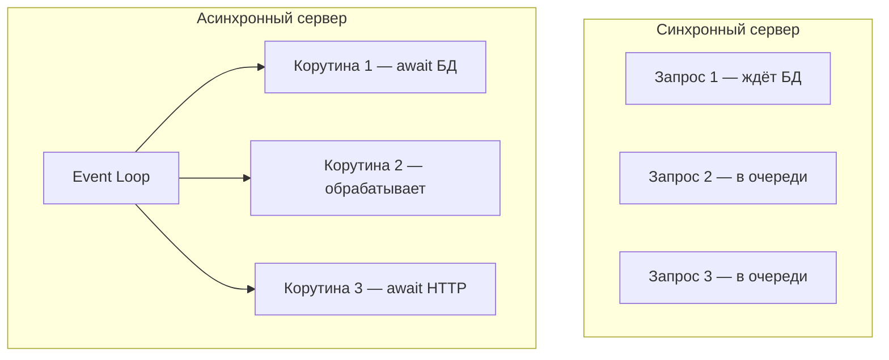
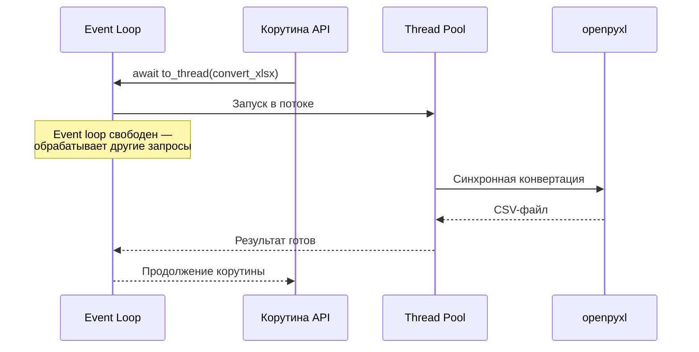
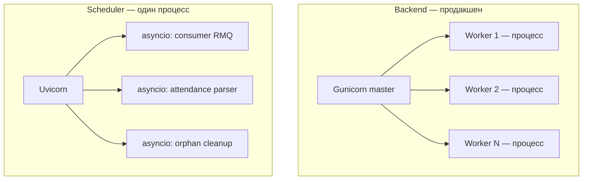

# Лабораторная работа №2

## Потоки, процессы и асинхронность в Python

!!! info "Цель работы"
    Понять отличия между **потоками** и **процессами** и разобраться, что такое **асинхронность** в Python.

---

## 1. Введение

Современные серверные приложения одновременно обслуживают сотни и тысячи клиентов. Чтобы эффективно использовать ресурсы CPU и не блокировать обработку запросов, разработчик должен понимать три модели параллелизма в Python:

- **Многопроцессность** — несколько независимых процессов ОС
- **Многопоточность** — несколько потоков внутри одного процесса
- **Асинхронность (asyncio)** — кооперативная многозадачность в одном потоке

В проекте **Pulse** все три подхода применяются осознанно — каждый там, где он даёт максимальный эффект.

---

## 2. Теоретические основы

### 2.1. Процессы

**Процесс** — это изолированная единица выполнения с собственным адресным пространством памяти. Процессы не разделяют данные напрямую; для обмена нужны IPC-механизмы (очереди, сокеты, shared memory).

| Свойство | Значение |
|----------|----------|
| Изоляция памяти | Полная |
| Накладные расходы на создание | Высокие |
| Обход GIL | Да — каждый процесс имеет свой GIL |
| Подходит для | CPU-bound задач, изоляции сбоев |

### 2.2. Потоки

**Поток** — легковесная единица выполнения внутри процесса. Потоки разделяют память процесса, что упрощает обмен данными, но требует синхронизации (lock, semaphore).

| Свойство | Значение |
|----------|----------|
| Изоляция памяти | Общая для процесса |
| Накладные расходы | Низкие |
| GIL в CPython | Один поток выполняет байткод Python одновременно |
| Подходит для | I/O-bound задач, вызовов блокирующих библиотек |

### 2.3. Асинхронность (asyncio)

**asyncio** — модель **кооперативной многозадачности** в одном потоке. Корутины (`async def`) явно отдают управление через `await`, когда ждут I/O. Event loop переключается между корутинами, пока одна из них ожидает ответа сети или диска.

| Свойство | Значение |
|----------|----------|
| Потоков | Один (в типичном случае) |
| Переключение | Явное — через `await` |
| GIL | Не мешает — пока корутина ждёт I/O, другие работают |
| Подходит для | Массовых I/O-bound операций (HTTP, БД, очереди) |



---

## 3. Асинхронность как основа проекта Pulse

### 3.1. Async-first архитектура

Весь I/O-стек платформы построен на **async/await**:

| Компонент | Асинхронная библиотека |
|-----------|------------------------|
| PostgreSQL | SQLAlchemy 2 + `asyncpg` |
| Redis | `redis.asyncio` |
| RabbitMQ | `aio-pika` |
| HTTP-клиент (внешние API) | `aiohttp`, `httpx` |
| Файловые операции | `aiofiles` |
| WebSocket | `websockets` + Redis Pub/Sub |

Это означает, что пока один запрос ждёт ответа от базы данных, event loop обрабатывает десятки других запросов в том же потоке — без создания новых потоков на каждое соединение.

### 3.2. Фоновые задачи через asyncio

Сервис **Scheduler** не использует внешний планировщик (Celery, cron). Вместо этого при старте приложения в lifespan поднимаются **фоновые asyncio-задачи**:

| Задача | Периодичность | Назначение |
|--------|---------------|------------|
| Consumer очереди файлов | Постоянно | Чтение сообщений из RabbitMQ и запуск парсинга |
| Парсинг посещаемости | Каждый час | Опрос внешнего Traffic API |
| Очистка временных файлов | Каждые 2 минуты | Удаление «осиротевших» CSV из shared volume |

Базовый цикл планировщика реализован через `asyncio.wait_for(event.wait(), timeout=...)`: задача «спит» до наступления интервала, не блокируя event loop.

Аналогично ML-сервис поднимает consumer очереди `ml_queue` как отдельную `asyncio.create_task` в lifespan.

### 3.3. Примитивы синхронизации в async-коде

Даже в однопоточном event loop нужна координация:

- **`asyncio.Lock`** — защищает ленивую инициализацию канала RabbitMQ: только одна корутина создаёт соединение, остальные ждут
- **`asyncio.Semaphore(10)`** — ограничивает параллельное удаление файлов при очистке (не более 10 одновременных операций)
- **`asyncio.gather`** — запускает несколько корутин параллельно и собирает результаты

Эти примитивы — async-аналоги threading.Lock и threading.Semaphore, но они **не блокируют поток**, а приостанавливают корутину.

---

## 4. Потоки: точечное применение

### 4.1. Проблема блокирующих библиотек

Не все Python-библиотеки поддерживают async. **openpyxl** — синхронная библиотека для работы с Excel. Если вызвать её напрямую в корутине, event loop заблокируется на время конвертации файла (секунды для больших таблиц).

### 4.2. Решение: asyncio.to_thread

В сервисе проверки и подготовки файлов конвертация XLSX → CSV выполняется через **`asyncio.to_thread()`** — стандартный механизм Python 3.9+, который запускает синхронную функцию в **отдельном потоке** из пула ThreadPoolExecutor и возвращает awaitable.



Это классический паттерн: **async для I/O, thread pool для CPU/блокирующих операций** — без перевода всего приложения на многопоточность.

---

## 5. Процессы: масштабирование API

### 5.1. Gunicorn + UvicornWorker

В продакшене backend запускается не одним процессом Uvicorn, а через **Gunicorn** с несколькими воркерами. Каждый воркер — отдельный **процесс ОС** с собственным event loop и копией приложения.

| Параметр | Значение |
|----------|----------|
| `worker_class` | `uvicorn.workers.UvicornWorker` |
| Число воркеров | Из переменной окружения `WORKERS` |
| Платформа | Linux (в dev на Windows — один Uvicorn) |

Каждый процесс-воркер обходит GIL независимо: при 4 воркерах четыре ядра CPU могут обрабатывать запросы параллельно.

### 5.2. Почему Scheduler и ML — один процесс

Фоновые сервисы (Scheduler, ML) запускаются как **один процесс Uvicorn** с несколькими asyncio-задачами внутри. Причины:

- Они не обслуживают массовый HTTP-трафик
- Их параллелизм — I/O-bound (БД, очереди, HTTP)
- Один event loop эффективнее для координации consumer'ов и планировщиков
- Упрощает управление состоянием (одно соединение с RabbitMQ)



---

## 6. Сравнительная таблица применения в проекте

| Задача | Модель | Почему |
|--------|--------|--------|
| HTTP API, WebSocket | asyncio (корутины) | Тысячи одновременных I/O-соединений |
| Запросы к PostgreSQL | asyncio (`asyncpg`) | Неблокирующие SQL-запросы |
| RabbitMQ consume/publish | asyncio (`aio-pika`) | Постоянное ожидание сообщений |
| Конвертация XLSX → CSV | поток (`asyncio.to_thread`) | Блокирующая библиотека openpyxl |
| Продакшен API | процессы (Gunicorn) | Обход GIL, использование всех ядер |
| Фоновые планировщики | asyncio (задачи в одном процессе) | Координация I/O-задач без overhead процессов |

---

## 7. Единственный фрагмент кода — выбор модели

```python
# I/O-bound → async
async def get_contracts(session: AsyncSession, building_id: int):
    result = await session.execute(select(Contract).where(...))
    return result.scalars().all()

# CPU/blocking-bound → thread pool
async def prepare_upload(file_path: str) -> str:
    csv_path = await asyncio.to_thread(convert_xlsx_to_csv, file_path)
    return csv_path

# Масштабирование HTTP → процессы (Gunicorn config)
# workers = 4  →  4 независимых процесса с UvicornWorker
```

---

## 8. Результаты и выводы

В ходе второй лабораторной работы на примере реального проекта были изучены и применены три модели параллелизма:

!!! tip "Процессы"
    Gunicorn-воркеры масштабируют HTTP API горизонтально в рамках одного контейнера. Каждый воркер — изолированный процесс со своим event loop.

!!! tip "Потоки"
    `asyncio.to_thread` используется точечно для блокирующих библиотек (openpyxl), не нарушая async-архитектуру всего приложения.

!!! tip "Асинхронность"
    asyncio — основа проекта: БД, кэш, очереди, HTTP, WebSocket, фоновые планировщики. Event loop обеспечивает высокую пропускную способность без создания потока на каждый запрос.

**Главный практический вывод:** не существует «лучшей» модели параллелизма — в production-приложении они дополняют друг друга. Async даёт масштабируемость I/O, потоки — мост к синхронным библиотекам, процессы — горизонтальное масштабирование CPU.

---

!!! success "Ключевой вывод"
    Понимание границ применимости процессов, потоков и asyncio позволяет проектировать серверные системы, которые эффективно используют ресурсы и остаются отзывчивыми под нагрузкой.
