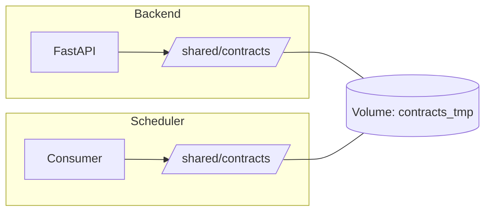
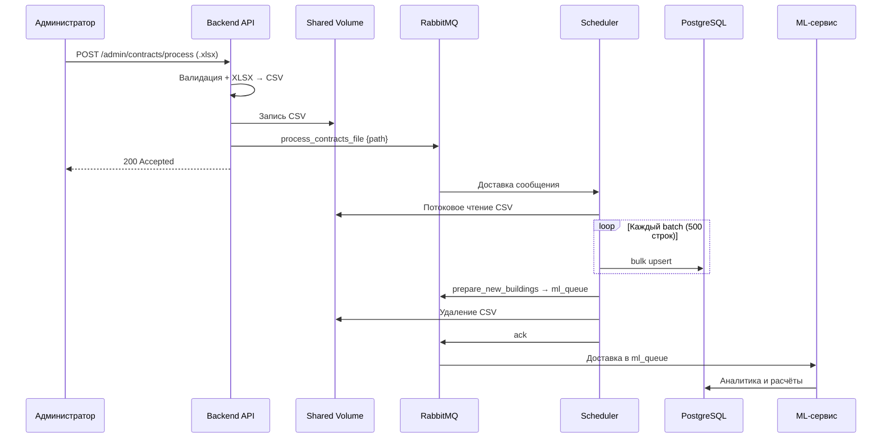
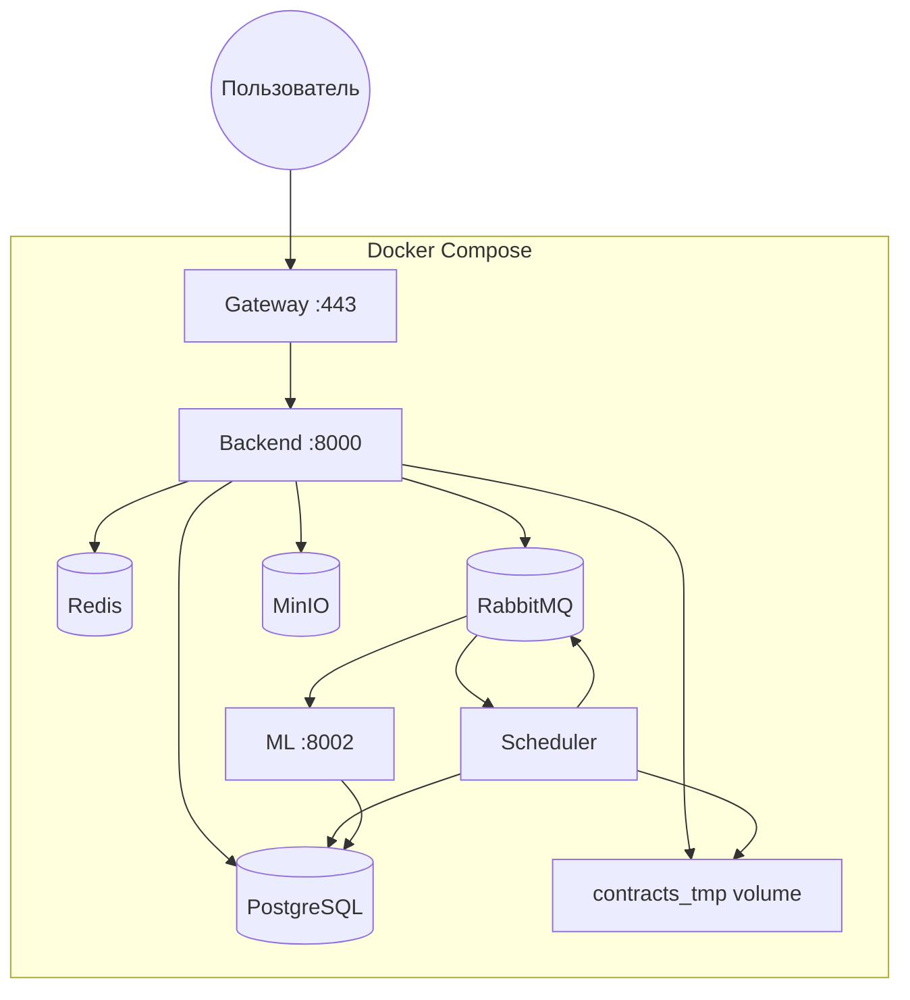

# Лабораторная работа №3

## Docker, парсер данных, база данных, API и очередь

!!! info "Цель работы"
    Научиться упаковывать FastAPI-приложение в **Docker**, интегрировать **парсер данных** с **базой данных** и вызывать парсер через **API** и **очередь** сообщений.

---

## 1. Введение

Третья лабораторная работа объединяет три навыка в единый production-ready pipeline: контейнеризация приложения, асинхронная обработка данных и связь компонентов через message broker.

В проекте **Pulse** реализован полный цикл обработки бизнес-данных:

```
Загрузка Excel → Валидация → Публикация в очередь → Парсинг CSV → Запись в PostgreSQL → Аналитика
```

API отвечает клиенту за миллисекунды, а тяжёлая работа выполняется фоновым воркером — это классический паттерн **event-driven architecture**.

---

## 2. Контейнеризация FastAPI-приложения

### 2.1. Docker-образ backend

Backend и Scheduler собираются из **одного Dockerfile**:

| Этап | Действие |
|------|----------|
| Base image | `python:3.12.7` |
| Зависимости | `pip install -r backend/requirements.txt` |
| Код | `COPY . .` — весь монорепозиторий `project/` |
| Рабочая директория | `/project` |

ML-сервис имеет отдельный Dockerfile со своим `requirements.txt`, так как набор зависимостей отличается (ML-библиотеки, LLM-клиент).

Gateway собирается multi-stage: Node.js для сборки фронтенда → Nginx для раздачи статики и reverse-proxy.

### 2.2. Docker Compose — инфраструктура

Все сервисы описаны в `docker-compose.yml` и работают в общей сети `pulse-net`:

| Сервис | Образ | Назначение |
|--------|-------|------------|
| `postgres` | postgres:14-alpine | Основная БД |
| `redis` | redis:latest | Кэш, rate limit, WebSocket pub/sub |
| `rabbitmq` | rabbitmq:3.13-management | Брокер сообщений |
| `minio` | minio/minio | S3-совместимое хранилище файлов |
| `backend` | backend:${TAG} | REST API |
| `backend-scheduler` | backend:${TAG} | Фоновый воркер (тот же образ!) |
| `ml` | ml:${TAG} | Аналитика и ML-consumer |
| `gateway` | custom Nginx | TLS, прокси, фронтенд |

Ключевой момент: **backend** и **backend-scheduler** используют один образ, но разные команды запуска:

| Контейнер | Команда | Роль |
|-----------|---------|------|
| `backend` | `python main.py backend --run` | HTTP API |
| `backend-scheduler` | `python main.py scheduler --run` | Парсинг и планировщики |

Это экономит ресурсы сборки и гарантирует идентичность кода между API и воркером.

### 2.3. Healthchecks и зависимости

Каждый сервис имеет healthcheck:

- Backend и ML: `GET /api/v1/health`
- Scheduler: `GET /health`
- PostgreSQL, Redis, RabbitMQ, MinIO: встроенные проверки

`depends_on` с условием `service_healthy` гарантирует, что backend стартует только после готовности БД и брокера — это предотвращает race condition при первом запуске.

### 2.4. Shared volume для файлов

Между backend и scheduler смонтирован общий том `contracts_tmp` → `/shared/contracts`. API записывает подготовленный CSV-файл в этот каталог, а в сообщение очереди кладёт только **путь к файлу**. Scheduler читает файл по этому пути.

Такой подход (передача пути, а не содержимого) эффективен для больших файлов и не перегружает брокер сообщений.



---

## 3. Интеграция парсера с базой данных

### 3.1. Типы парсеров в проекте

Платформа включает три независимых парсера данных:

| Парсер | Источник | Результат в БД |
|--------|----------|----------------|
| **Договоры** | Excel → CSV | Здания, арендаторы, договоры, начисления |
| **Биллинг** | Excel → CSV | Финансовые записи, категории доходов/расходов |
| **Посещаемость** | Внешний Traffic API (JSON) | Показания датчиков `SensorReading` |

### 3.2. Парсинг Excel-файлов (основной pipeline)

#### Этап 1 — Подготовка на стороне API

1. Администратор загружает `.xlsx` через `POST /api/v1/admin/contracts/process` (или аналог для биллинга).
2. Сервис валидации проверяет структуру файла, лимиты размера и числа строк.
3. XLSX конвертируется в CSV (через thread pool — см. лабораторную 2).
4. CSV сохраняется в shared volume.
5. В RabbitMQ публикуется JSON-сообщение с action и путём к файлу.
6. API немедленно возвращает `200 Accepted` — клиент не ждёт парсинга.

#### Этап 2 — Обработка на стороне Scheduler

Consumer `MessageBrokerScheduler` постоянно слушает очередь `process_files_queue`:

1. Получает сообщение, определяет action (`process_contracts_file` / `process_billing_file`).
2. Потоково читает CSV через `aiofiles` чанками (настраиваемый `read_chunk_size`).
3. Парсит строки с разделителем `;`, кодировка UTF-8-sig.
4. Накапливает batch (по 500 строк) и выполняет bulk-операции в PostgreSQL.
5. По завершении удаляет временный CSV и подтверждает сообщение (ack).

#### Этап 3 — Операции с БД

Парсер использует транзакционные bulk-операции:

- **`custom_bulk_get_or_create`** — найти существующую запись или создать новую (здания, арендаторы)
- **`custom_upsert`** — обновить при конфликте или вставить (договоры, начисления)
- **`custom_insert_do_nothing`** — вставить только новые записи (идемпотентность)

Все операции выполняются внутри `start_transaction_immediately()` — при ошибке парсинга batch откатывается, а сообщение возвращается в очередь (requeue).

### 3.3. Парсинг посещаемости (внешний API)

Планировщик `AttendanceParseScheduler` каждый час:

1. Читает API-токен из таблицы `Settings`.
2. Выполняет HTTP-запрос к внешнему Traffic API.
3. Парсит JSON-ответ в объекты `SensorReading`.
4. Выполняет upsert батчами по 100 записей.
5. В 23:00 (MSK) публикует сообщение `buildings_to_analyze` в ML-очередь.

### 3.4. Защитные лимиты парсера

| Лимит | Назначение |
|-------|------------|
| Максимальный размер файла | Защита от OOM при загрузке |
| Максимальное число строк | Предсказуемое время обработки |
| Размер batch (500 строк) | Баланс между скоростью и памятью |
| Prefetch = 10 (RabbitMQ) | Не перегружать воркер сообщениями |

---

## 4. Вызов парсера через API и очередь

### 4.1. Почему очередь, а не прямой вызов

Синхронный вызов парсера из API привёл бы к:

- таймаутам HTTP при больших файлах (минуты обработки)
- блокировке воркера API на время парсинга
- невозможности retry при сбоях

**RabbitMQ** решает эти проблемы: API публикует задачу и сразу отвечает клиенту, а Scheduler обрабатывает в своём темпе с автоматическим requeue при ошибках.

### 4.2. Очереди и маршрутизация

| Очередь | Producer | Consumer | Содержание |
|---------|----------|----------|------------|
| `process_files_queue` | Backend API | Scheduler | Задачи парсинга файлов |
| `ml_queue` | Scheduler | ML-сервис | Задачи аналитики и ML |

Сообщения — JSON с полем `action` и `model`:

| action | Описание |
|--------|----------|
| `process_contracts_file` | Путь к CSV договоров |
| `process_billing_file` | Путь к CSV биллинга |
| `prepare_new_buildings` | Список ID договоров → ML |
| `buildings_to_analyze` | ID зданий и аналитик → ML |

Очереди **durable**, сообщения **persistent** — при перезапуске RabbitMQ задачи не теряются.

### 4.3. Полный pipeline (sequence diagram)



### 4.4. Обработка ошибок в очереди

Consumer реализует стратегию ack/reject:

- **Успех** → `ack` — сообщение удаляется из очереди
- **Transient error** (сеть, временная недоступность БД) → `reject(requeue=True)` — сообщение вернётся в очередь
- **Permanent error** (битый файл, невалидные данные) → логирование + `ack` — сообщение не блокирует очередь

`asyncio.Lock` на стороне publisher гарантирует, что соединение с RabbitMQ инициализируется только один раз при конкурентных запросах.

---

## 5. Схема развёртывания



---

## 6. Локальная сборка и запуск

Для локальной разработки предусмотрен `Makefile`:

| Команда | Действие |
|---------|----------|
| `make build` | Сборка образов backend, ml, gateway |
| `make up` | `docker compose up` |
| `make test` | Запуск pytest внутри контейнера |

Перед первым запуском необходимо создать `.env` с переменными для PostgreSQL, Redis, RabbitMQ, MinIO и JWT-секретами.

---

## 7. Единственный фрагмент кода — публикация в очередь

```python
# Упрощённая схема: API не вызывает парсер напрямую
await message_broker.send_message(
    action="process_contracts_file",
    model={"path": "/shared/contracts/upload_123.csv"},
    queue="process_files_queue",
)
# Клиент уже получил 200 — парсинг идёт асинхронно
```

---

## 8. Результаты и выводы

В ходе третьей лабораторной работы был реализован и задокументирован полный production-pipeline:

| Навык | Реализация |
|-------|------------|
| Docker-упаковка FastAPI | Dockerfile + Compose, один образ — две роли |
| Интеграция парсера с БД | Потоковый CSV-парсер, bulk upsert, транзакции |
| Вызов через API | Upload endpoint → валидация → публикация в очередь → 200 Accepted |
| Очередь сообщений | RabbitMQ, durable queues, persistent messages, ack/reject |
| Масштабируемость | API и воркер масштабируются независимо |

### Преимущества выбранной архитектуры

- **Отзывчивость API** — клиент не ждёт минуты парсинга
- **Надёжность** — сообщения переживают перезапуск сервисов
- **Идемпотентность** — повторная обработка не создаёт дубликатов
- **Независимое масштабирование** — можно добавить второй Scheduler-consumer без изменения API
- **Изоляция сбоев** — ошибка парсинга не роняет API

---

!!! success "Ключевой вывод"
    Связка **FastAPI + Docker + RabbitMQ + PostgreSQL** позволяет построить устойчивый pipeline обработки данных, в котором API остаётся быстрым, а тяжёлая работа выполняется надёжно и асинхронно в фоновых воркерах.
