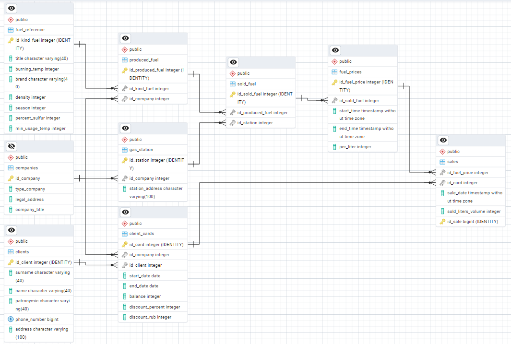
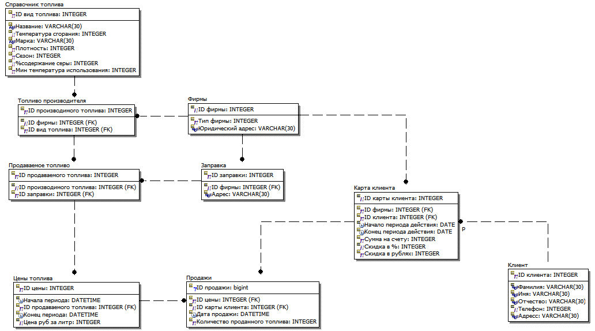

# Лабораторная работа 3. Вариант 20.

### Выполнил: <span style="color:#36ea1a">Проскуряков Роман Владимирович K3339</span>.

## Описание варианта и БД

Вариант 20. БД «Автозаправки»
Описание предметной области: Фирмы–поставщики автомобильного топлива имеют сеть заправочных станций (АЗС и АЗГС).
На автозаправках реализуется жидкое автомобильное топливо различных видов или газ (АЗС или АЗГС). Топливо продается за безналичный расчет с помощью специальных пластиковых карт. База данных предназначена для анализа продаж автомобильного топлива клиентам по видам топлива в сети заправок конкретной фирмы-производителя (поставщика топлива), спроса на автомобильное топливо и т.д. Каждая фирма имеет несколько автозаправок. Каждый вид топлива предоставляется несколькими фирмами-производителями.
Для оплаты используется карта-счет клиента (карты имеют заданный период действия и могут иметь скидку).
Цены на топливо могут меняться.
БД должна содержать следующий минимальный набор сведений: Карта-счет клиента. Сумма на счете клиента. Ф.И.О. клиента. Адрес клиента. Телефон клиента. Код автозаправки. Адрес автозаправки. Название фирмы. Юридический адрес. Телефон. Код топлива. Вид топлива. Единица измерения. Цена (руб.) за литр. Дата продажи топлива. Количество топлива. Код фирмы-поставщика. Фирма-поставщик топлива. Юридический адрес. Сроки действия цены на топливо.
Дополните состав атрибутов на основе анализа предметной области.

ERD диаграмма

[]()

IDEF1X диаграмма

[]()


## Описание работы всех используемых endpoint (Fuel Management API)

### Основные API Endpoints (ModelViewSets)

Все `ModelViewSet` используют стандартные CRUD операции: `list`, `retrieve`, `create`, `update`, `partial_update`, `destroy`.

| Endpoint           | Model           | Description                                                  |
| ------------------ | --------------- | ------------------------------------------------------------ |
| `/fuel-reference/` | `FuelReference` | Справочник видов топлива.                                    |
| `/companies/`      | `Companies`     | Справочник компаний.                                         |
| `/produced-fuel/`  | `ProducedFuel`  | Произведённое топливо с привязкой к компании и виду топлива. |
| `/gas-stations/`   | `GasStation`    | Станции с привязкой к компании.                              |
| `/sold-fuel/`      | `SoldFuel`      | Проданное топливо на конкретной станции.                     |
| `/fuel-prices/`    | `FuelPrices`    | Цены на проданное топливо (с началом и окончанием действия). |
| `/clients/`        | `Clients`       | Клиенты системы.                                             |
| `/client-cards/`   | `ClientCards`   | Карты клиентов с балансом, скидкой и датами активности.      |
| `/sales/`          | `Sales`         | Продажи топлива с привязкой к цене и карте клиента.          |

---

### Дополнительные API Endpoints

### Получение актуальных цен на заправочной станции

**GET** `/my-station-prices/`

Возвращает все цены на топливо для станции, к которой привязан User (кассир).

**Response:**

```json
[
  {
    "id_fuel_price": 1,
    "sold_fuel": 3,
    "start_time": "2025-12-29T10:00:00Z",
    "end_time": null,
    "per_liter": 50.0
  },
  ...
]
```

---

### Расчёт суммы к оплете (с предварительно известной суммой)

**POST** `/calculate-payment/`

**Request:**

```json
{
  "id_card": 1,
  "initial_amount": 1000.0
}
```

**Response:**

```json
{
  "final_amount": 900.0,
  "sufficient_balance": true
}
```

* `final_amount` — сумма после применения скидок.
* `sufficient_balance` — достаточно ли средств на карте.

---

### Расчёт суммы к оплете (по виду топлива)

**POST** `/calculate-payment/`

**Request:**

```json
{
  "id_fuel_price": 1,
  "liters": 50,
  "id_card": 1
}
```

**Response:**

```json
{
  "final_amount": 2250.0,
  "sufficient_balance": true
}
```

* Рассчитывает оплату на основе цены за литр и объёма топлива.
* Проверяет активность карты и баланс.

---

### Выполнение оплаты топлива

**POST** `/execute-fuel-payment/`

**Request:**

```json
{
  "id_fuel_price": 1,
  "liters": 50,
  "id_card": 1
}
```

**Response Success:**

```json
{
  "success": true
}
```

**Response Failure:**

```json
{
  "success": false,
  "detail": "Insufficient balance"
}
```

* Создаёт запись в `Sales`.
* Списывает сумму с баланса карты клиента.
* Все операции выполняются в транзакции для сохранения целостности данных.

---

## Сериализаторы

* **FuelReferenceSerializer** — виды топлива.
* **CompaniesSerializer** — компании.
* **ProducedFuelSerializer** — произведённое топливо с детализацией.
* **GasStationSerializer** — станции и их компании.
* **SoldFuelSerializer** — проданное топливо с детализацией.
* **FuelPricesSerializer** — цены топлива.
* **ClientsSerializer** — данные клиентов.
* **ClientCardsSerializer** — карты клиентов с балансом и скидками.
* **SalesSerializer** — продажи топлива.
* **CustomUserCreateSerializer / CustomUserSerializer** — пользователь с привязкой к станции.
* **PaymentCalculationSerializer / FuelPurchaseCalculationSerializer** — расчёт сумм и проверка баланса.

## Вывод

Наслаждаемся быстротой создания стандартных с сериализаторов и Api к ним. Возможно добавить, что то в Api при реализации frontend-а.