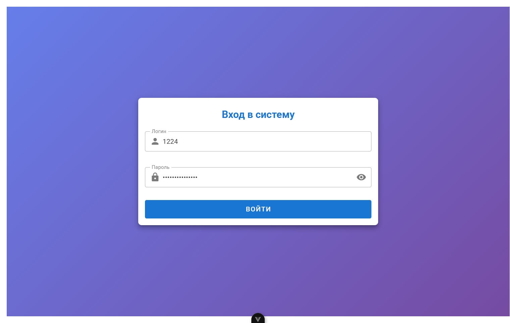
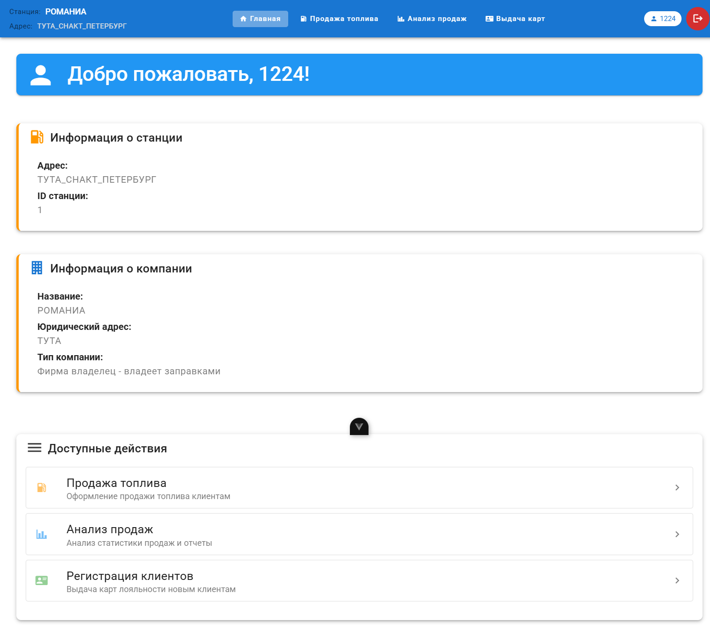
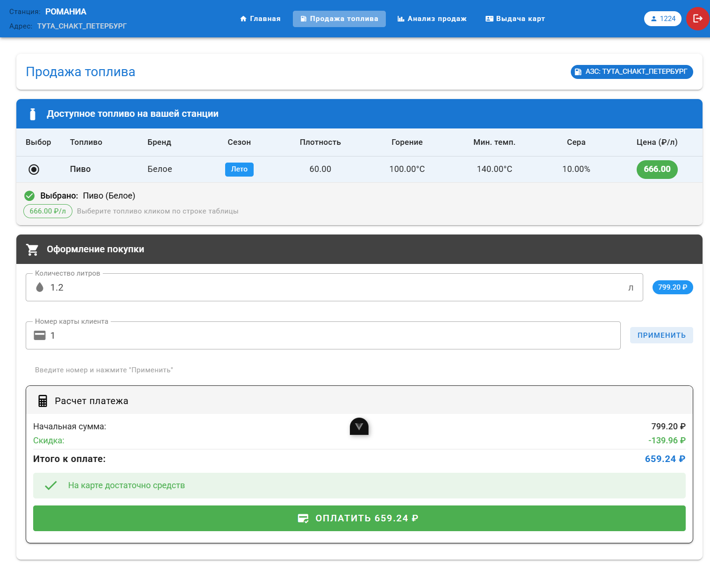
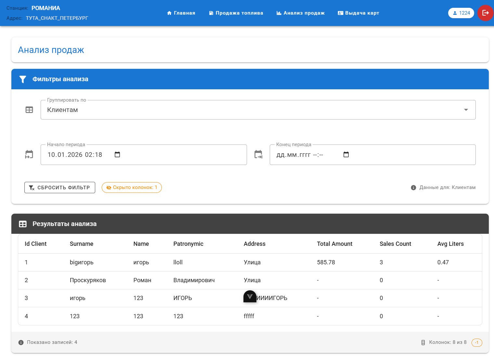
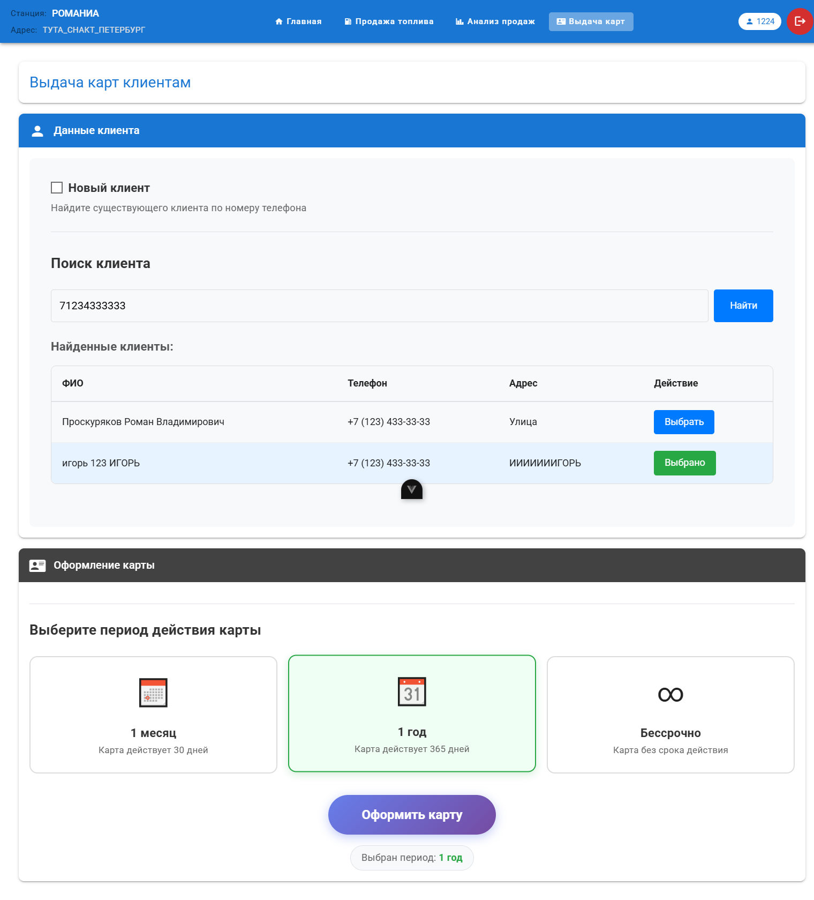
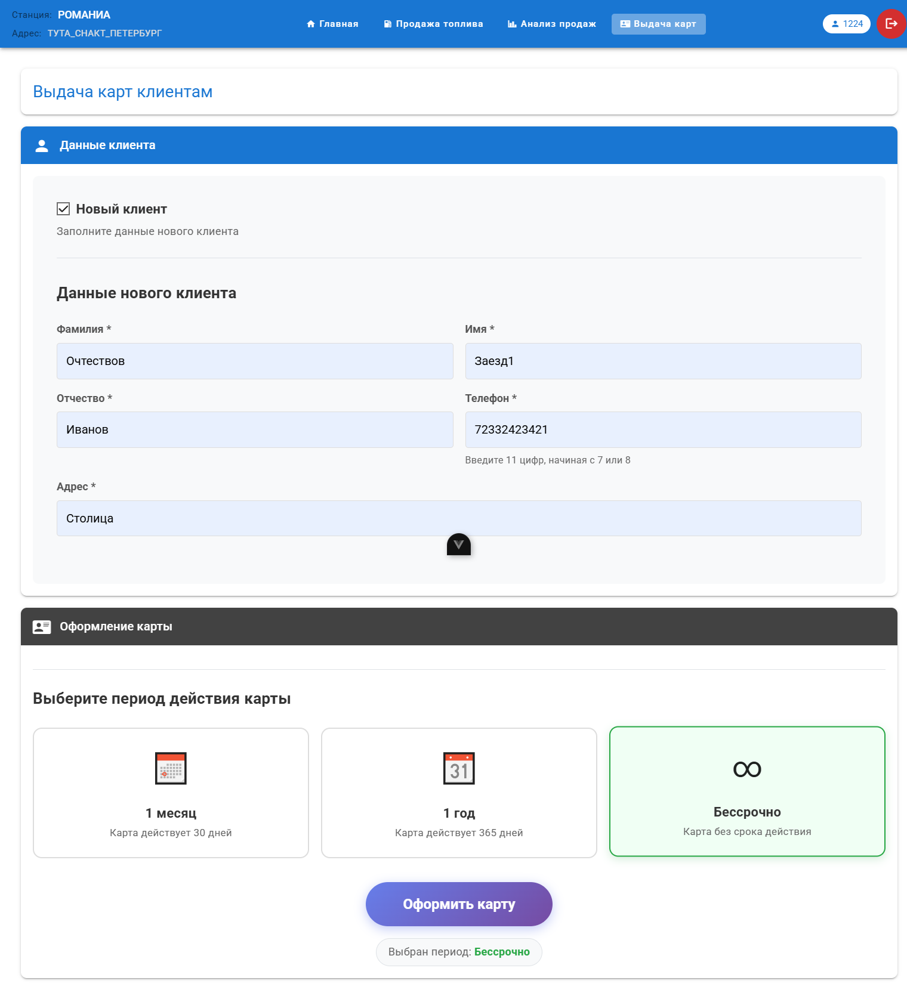

# Лабораторная работа 4.

### Выполнил: Проскуряков Роман Владимирович K3339.

# Документация по интерфейсам системы управления АЗС

## Авторизация в системе

### Назначение
Страница входа в систему для сотрудников автозаправочных станций. Предоставляет доступ к функционалу системы после успешной аутентификации.

### Порядок действий пользователя
1. **Ввод учетных данных**: 
   - В поле "Логин" вводится username, выданный администратором
   - В поле "Пароль" вводится пароль, выданный администратором
   
2. **Аутентификация**:
   - Нажать кнопку "Войти"
   - При успешной авторизации происходит автоматический переход на главную страницу
   - При ошибке отображается сообщение с причиной отказа

### Визуальные элементы
- Поля ввода логина и пароля
- Кнопка "Войти"
- Сообщения об ошибках валидации

*Форма входа в систему*

---

## Дашборд сотрудника

### Назначение
Главная страница системы, отображающая информацию о текущем пользователе и предоставляющая доступ ко всем основным функциям.

### Порядок действий пользователя
1. **Просмотр информации**:
   - В верхней панели отображается название компании, адрес станции и имя пользователя
   - В основном блоке показывается приветственное сообщение и краткая информация о станции
   
2. **Навигация по системе**:
   - Использование навигационного меню для перехода к нужному разделу:
     - "Продажа топлива" - оформление продаж топлива клиентам
     - "Анализ продаж" - просмотр статистики и аналитических отчетов
     - "Выдача карт" - регистрация клиентов и выдача карт лояльности
   
3. **Выход из системы**:
   - Нажатие кнопки "Выйти" в правом верхнем углу для завершения сессии

### Визуальные элементы
- Панель навигации с информацией о пользователе
- Блок приветствия
- Быстрые ссылки на основные разделы
- Кнопка выхода из системы

*Главная страница системы*

---

## Продажа топлива

### Назначение
Оформление продажи автомобильного топлива клиентам с применением скидок по картам лояльности.

### Порядок действий пользователя
1. **Выбор топлива**:
   - В таблице отображаются все доступные виды топлива на текущей станции и их характеристики
   - Выбрать нужное топливо кликом по строке таблицы
   
2. **Указание количества**:
   - В поле "Количество литров" ввести требуемый объем (дробное число)
   
3. **Применение карты лояльности**:
   - В поле "Номер карты клиента" ввести ID карты
   - Нажать кнопку "Применить" для расчета скидки
   
4. **Просмотр расчета**:
   - Система автоматически рассчитывает:
     - Начальную сумму (цена × литры)
     - Размер скидки (процент + фиксированная сумма)
     - Итоговую сумму к оплате
   - Если баланс карты недостаточен, отображается предупреждение
   
5. **Подтверждение оплаты**:
   - При достаточном балансе активируется кнопка "Оплатить"
   - Нажатие открывает модальное окно подтверждения
   - После подтверждения выполняется списание средств и создается запись о продаже
   - Отображается сообщение об успешной операции

### Визуальные элементы
- Таблица доступного топлива
- Поля ввода количества литров и номера карты
- Блок расчета с отображением суммы и скидки
- Кнопка "Оплатить"
- Модальное окно подтверждения операции

*Страница оформления продажи топлива*

---

## Анализ продаж

### Назначение
Аналитическая страница для просмотра статистики продаж с возможностью группировки данных по различным критериям.

### Порядок действий пользователя
1. **Выбор критерия группировки**:
   - В выпадающем списке "Группировать по" выбрать один из вариантов:
     - АЗС
	 - Виды топлива
	 - Карты клиентов
     - Клиенты
	 - Компании
	 - Продаваемому топливу
	 - Производимому топливу
     - Заправки
   
2. **Настройка временного периода**:
   - Указать начальную и/или конечную дату анализа
   - Можно указать только начало (анализ с даты до текущего момента)
   - Можно указать только конец (анализ с начала истории до даты)
   - Можно указать оба значения (анализ за конкретный период)
   
3. **Просмотр таблицы результатов**:
   - После выбора критерия автоматически загружается таблица с данными
   - Каждая строка представляет одну группу с агрегированными показателями
   - Отображаются основные для выбранного варианты группировки колонки и 3 дополнительные колонки: суммы продаж, количество продаж, средний объем
   
4. **Настройка отображения колонок**:
   - Правый клик по заголовку колонки открывает контекстное меню
   - Выбор "Скрыть колонку" убирает ее из таблицы (кроме последних трех колонок с итогами)
   - Скрытые колонки (как и остальные филтры) сохраняются в параметрах URL
   
5. **Сброс фильтров**:
   - Нажатие кнопки "Сбросить фильтр" очищает временные интервалы и скрытые колонки
   - Таблица обновляется с параметрами по умолчанию

### Визуальные элементы
- Выпадающий список критериев группировки
- Поля выбора даты начала и окончания периода
- Таблица с агрегированными данными
- Контекстное меню для управления колонками
- Кнопка сброса фильтров

*Аналитическая панель продаж*

---

## Выдача карт клиентам

### Назначение
Регистрация новых клиентов и выдача им карт с различными периодами действия.

### Порядок действий пользователя
1. **Выбор типа клиента**:
   - По умолчанию чекбокс "Новый клиент" не активен
   - Если его поставить - режим создания нового клиента
   
2. **Режим "Новый клиент"**:
   - Заполнить все обязательные поля:
     - Фамилия, Имя, Отчество
     - Номер телефона
     - Адрес проживания
   
3. **Режим "Существующий клиент"**:
   - Ввести номер телефона в поле поиска
   - Нажать "Найти" или дождаться автоматического поиска
   - В таблице выбрать нужного клиента из найденных
   
4. **Выбор периода действия карты**:
   - Выбрать один из трех вариантов кликом по карточке:
     - "1 месяц" (30 дней)
     - "1 год" (365 дней)
     - "Бессрочно" (без срока действия)
   
5. **Оформление карты**:
   - После заполнения всех данных активируется кнопка "Оформить карту"
   - Нажатие открывает модальное окно с подтверждением данных
   - После подтверждения создается клиент (если новый) и карта
   
6. **Получение результата**:
   - Отображается сообщение об успешной выдаче карты
   - Показывается номер карты крупным шрифтом
   - Выводится вся информация о карте и клиенте
   - Предлагается выдать еще одну карту или распечатать информацию

### Визуальные элементы
- Переключатель нового/существующего клиента
- Форма ввода данных клиента
- Поле поиска и таблица найденных клиентов
- Карточки выбора периода действия
- Кнопка оформления карты
- Модальное окно подтверждения
- Блок с результатом выдачи карты

*Страница выдачи карт лояльности для старых клиентов*

*Страница выдачи карт лояльности для новых клиентов*

---

## Ключевые особенности интерфейсов

### Единый дизайн и навигация
- Все страницы используют общую навигационную панель
- Единая цветовая схема и стилистика
- Адаптивный дизайн для работы на различных устройствах

### Интерактивные элементы
- Контекстные меню для расширенных действий
- Модальные окна для подтверждения важных операций
- Динамическая загрузка данных без перезагрузки страниц
- Автоматические расчеты и валидация ввода

### Безопасность и удобство
- Сохранение состояния фильтров в URL
- Поддержка навигации по истории браузера
- Автоматический выход при истечении сессии
- Подробные сообщения об ошибках и успешных операциях

---

## Заключение
Разработанная система предоставляет полный набор инструментов для управления продажами на автозаправочных станциях. Интерфейсы интуитивно понятны, функциональны и ориентированы на повышение эффективности работы сотрудников.