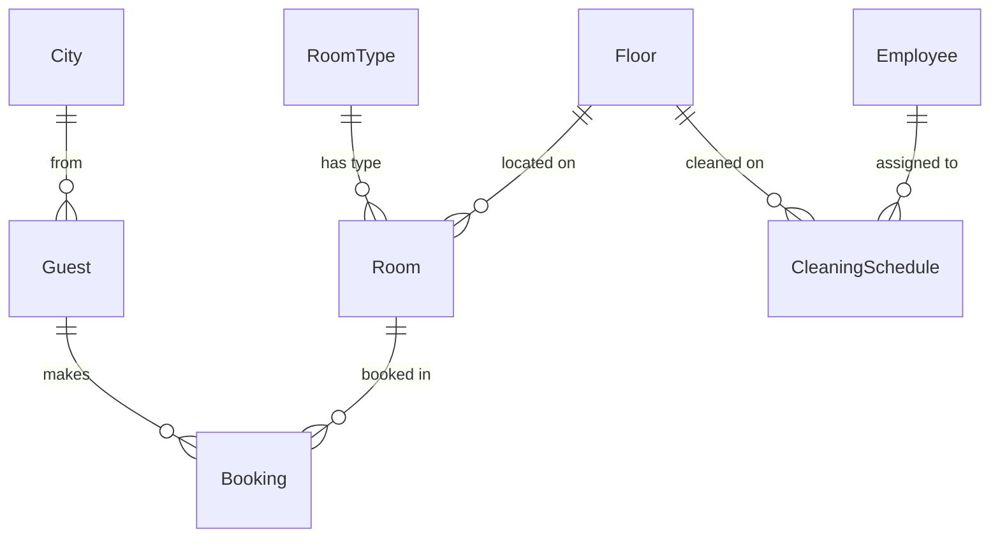
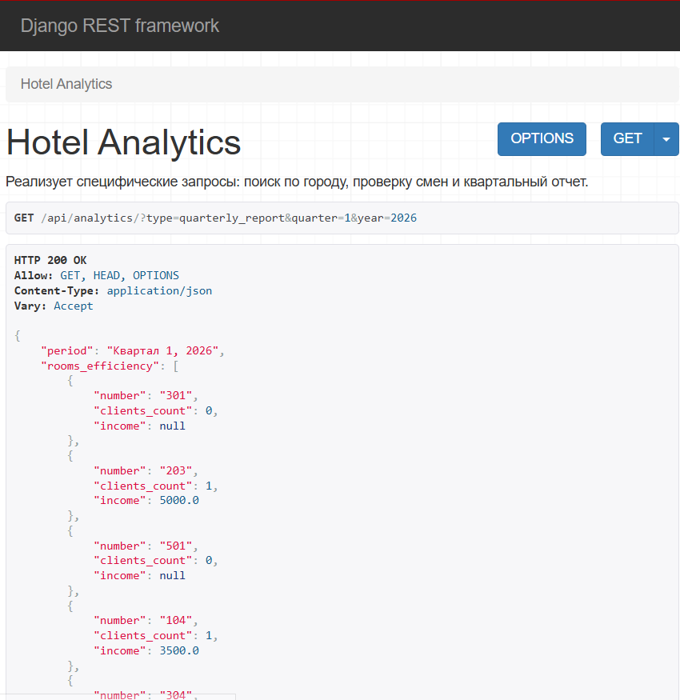
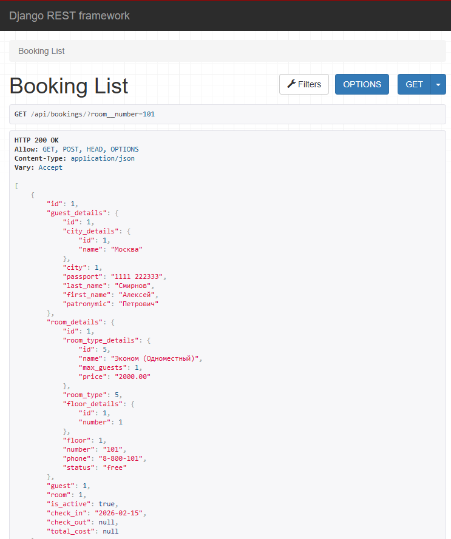

# Отчет по Лабораторной работе №3

## Тема: Реализация серверной части приложения средствами Django и Django REST Framework

> **Выполнил:** Христофоров Владислав Николаевич, K3340, WEB 2.3
>
> **Вариант:** Администратор гостиницы

### 1. Цель работы

Овладеть практическими навыками реализации web-сервисов средствами Django и Django REST Framework (DRF). Создать серверную часть приложения для предметной области "Гостиница", настроить взаимодействие с реляционной базой данных (PostgreSQL), реализовать API для CRUD-операций и разработать систему сложных агрегационных запросов для аналитики.

### 2. Задание

Разработать бэкенд-систему для администратора гостиницы, поддерживающую учет номеров, клиентов и персонала, а также обеспечивающую выдачу специфической отчетности.

**Основные требования:**

1. **Учет номеров:** В гостинице есть номера трех типов (одноместный, двухместный, трехместный), которые отличаются стоимостью и вместимостью.

2. **Учет клиентов:** Хранение данных о постояльцах (ФИО, паспорт, город).

3. **Учет сотрудников:** Хранение данных о персонале и графике уборки этажей.

4. **Бизнес-логика:**

    - Заселение клиентов в номера (учет дат заезда/выезда).

    - Контроль вместимости (нельзя заселить в номер больше людей, чем положено, с учетом пересечения дат).

    - Расчет стоимости проживания (автоматически при сохранении брони).

    - Управление жизненным циклом и состояниями объектов (статусы номеров)

5. **Аналитические запросы:**

    - Информация о клиентах в номере за период.

    - Количество клиентов из конкретного города.

    - Поиск сотрудников, убиравших номер в заданный день.

    - Статистика свободных номеров.

    - Поиск "соседей" (пересечение дат проживания разных гостей).

6. **Отчетность:** Автоматический квартальный отчет (доходы по номерам, структура этажей, общая выручка).

7. **Технологии:** Django ORM, DRF, Djoser, PostgreSQL.

### 3. Описание предметной области и структуры БД

Для реализации системы была спроектирована база данных, соответствующая **3-й нормальной форме**.

#### 3.1. Типы сущностей (Классификация по Э. Кодду)

- **Стержневые:** `Floor` (Этаж), `Room` (Номер), `Guest` (Клиент), `Employee` (Сотрудник). Независимые сущности.

- **Характеристические:** `RoomType` (Тип номера), `City` (Город). Справочники, уточняющие свойства стержневых сущностей.

- **Ассоциативные:**
    - `Booking` (Бронирование): Связывает `Guest` и `Room` во времени.

    - `CleaningSchedule` (График уборки): Связывает `Employee`, Этаж и День недели.

#### 3.2. Описание моделей (Таблицы)

| Модель               | Тип                | Описание      | Ключевые поля                                               |
| -------------------- | ------------------ | ------------- | ----------------------------------------------------------- |
| **RoomType**         | Характеристическая | Типы номеров  | `name`, `max_guests`, `price`                               |
| **City**             | Характеристическая | Города        | `name`                                                      |
| **Floor**            | Стержневая         | Этажи         | `number`                                                    |
| **Room**             | Стержневая         | Номера        | `number`, `room_type` (FK), `floor` (FK), `phone`, `status` |
| **Guest**            | Стержневая         | Клиенты       | `passport`, `fio`, `city` (FK)                              |
| **Booking**          | Ассоциативная      | Бронирование  | `guest` (FK), `room` (FK), `check_in`, `check_out`          |
| **Employee**         | Стержневая         | Сотрудники    | `fio`                                                       |
| **CleaningSchedule** | Ассоциативная      | График уборки | `employee` (FK), `floor` (FK), `day_of_week`                |

#### 3.3. ER-диаграмма (Схема связей)



### 4. Реализация серверной части

#### 4.1. Инициализация проекта

1. Создана директория проекта и виртуальное окружение.
2. Установлены необходимые библиотеки: `Django`, `djangorestframework`, `psycopg2-binary`, `python-dotenv`, `djoser`.
3. Инициализирован Django-проект `hotel_project` и создано приложение `hotel_app`

```bash
django-admin startproject hotel_project
cd hotel_project
python manage.py startapp hotel_app
```

**Настройка БД (PostgreSQL):** В файле `settings.py` настроено подключение к PostgreSQL через переменные окружения (`.env`):

```python
DATABASES = {
    'default': {
        'ENGINE': 'django.db.backends.postgresql',
        'NAME': os.getenv('DB_NAME'),
        'USER': os.getenv('DB_USER'),
        'PASSWORD': os.getenv('DB_PASSWORD'),
        'HOST': os.getenv('DB_HOST'),
        'PORT': os.getenv('DB_PORT'),
    }
}

```

#### 4.2. Реализация моделей (models.py)

В файле `models.py` описаны классы моделей. Для обеспечения целостности данных использован метод `clean()`, реализующий бизнес-логику (проверка дат, статуса ремонта и переполнения номера).

**Фрагмент кода (Модель Booking с валидацией):**

```python
class Booking(models.Model):
    """Бронирование"""
    room = models.ForeignKey(Room, on_delete=models.CASCADE, verbose_name="Номер", related_name="bookings")
    guest = models.ForeignKey(Guest, on_delete=models.CASCADE, verbose_name="Гость", related_name="bookings")
    check_in = models.DateField(verbose_name="Дата заезда")
    check_out = models.DateField(verbose_name="Дата выезда", null=True, blank=True)
    is_active = models.BooleanField(default=True, verbose_name="Активно")
    total_cost = models.DecimalField(max_digits=10, decimal_places=2, null=True, blank=True, verbose_name="Итого")


    def clean(self):
        """Проверка бизнес-логики"""
        # 1. Проверка дат
        if self.check_out and self.check_out < self.check_in:
            raise ValidationError("Дата выезда не может быть раньше даты заезда!")

        # 2. Проверка статуса номера (ремонт)
        if self.is_active and self.room.status == 'maintenance':
            raise ValidationError(f"Номер {self.room.number} находится на обслуживании!")

        # 3. Проверка на переполнение (с учетом дат)
        if self.is_active:
            check_out_date = self.check_out if self.check_out else (datetime.date.today() + datetime.timedelta(days=3650))

            overlapping_bookings = Booking.objects.filter(
                room=self.room,
                is_active=True,
                check_in__lt=check_out_date
            ).exclude(pk=self.pk)

            actual_overlaps = []
            for b in overlapping_bookings:
                b_end = b.check_out if b.check_out else (datetime.date.today() + datetime.timedelta(days=3650))
                if b_end > self.check_in:
                    actual_overlaps.append(b)

            capacity = self.room.room_type.max_guests
            if len(actual_overlaps) >= capacity:
                 raise ValidationError(f"Номер {self.room.number} занят на выбранные даты!")

    def save(self, *args, **kwargs):
        self.clean()
        if self.check_out:
            days = (self.check_out - self.check_in).days
            if days == 0: days = 1
            self.total_cost = days * self.room.room_type.price

            # Автоматическое освобождение, если дата выезда прошла или сегодня
            if self.check_out <= timezone.now().date():
                self.room.status = 'free'
                self.room.save()
        else:
            self.room.status = 'occupied'
            self.room.save()

        super().save(*args, **kwargs)

    def __str__(self):
        return f"{self.guest} -> {self.room}"
```

**Миграции:**
После описания моделей были созданы и применены миграции.

```
python manage.py makemigrations
python manage.py migrate
```

#### 4.3. Наполнение базы данных

Модели были зарегистрированы в файле `hotel_app/admin.py`. База данных была наполнена тестовыми данными (города, типы номеров, этажи, сотрудники, гости) для проверки работоспособности системы.

- Города: Москва, Санкт-Петербург, Сочи и др.
- Типы номеров: Эконом, Стандарт, Комфорт, Люкс, Президентский
- Этажи: 1-5.
- Номера: 101, 102, 205 и т.д.
- Сотрудники и их графики уборки.
- Гости и записи о бронировании.

**Пример данных:**

<table style="border: none; border-collapse: collapse; width: 100%;">
    <tr style="border: none;">
        <td style="border: none; vertical-align: top; width: 25%; padding: 5px;">
            
        </td>
        <td style="border: none; vertical-align: top; width: 25%; padding: 5px;">
            
        </td>
        <td style="border: none; vertical-align: top; width: 20%; padding: 5px;">
            
        </td>
        <td style="border: none; vertical-align: top; width: 30%; padding: 5px;">
            
        </td>
    </tr>
</table>

#### 4.4. Реализация API (DRF)

##### 4.4.1 Сериализаторы (serializers.py)

Для преобразования моделей в JSON использованы `ModelSerializer`.

- Для **чтения (`GET`)** реализована вложенная сериализация (Nested Serializers), чтобы вместо ID связанных объектов (например, типа номера) выводилась полная информация о них.
- Для **записи (`POST/PUT`)** используются стандартные поля `PrimaryKeyRelatedField`, принимающие ID.
- В `BookingSerializer` реализован метод `validate`, который вызывает логику `clean()` модели.

**Фрагмент кода (Сериализатор Booking с валидацией):**

```python
class BookingSerializer(serializers.ModelSerializer):
    guest_details = GuestSerializer(source='guest', read_only=True)
    room_details = RoomSerializer(source='room', read_only=True)

    guest = serializers.PrimaryKeyRelatedField(queryset=Guest.objects.all())
    room = serializers.PrimaryKeyRelatedField(queryset=Room.objects.all())

    is_active = serializers.BooleanField(default=True, initial=True)

    class Meta:
        model = Booking
        fields = "__all__"

    def validate(self, data):
        instance_data = {}
        if self.instance:
            instance_data = {
                'room': self.instance.room, 'guest': self.instance.guest,
                'check_in': self.instance.check_in, 'check_out': self.instance.check_out,
                'is_active': self.instance.is_active
            }
        instance_data.update(data)

        try:
            temp_instance = Booking(**instance_data)
        except TypeError:
            return data

        if self.instance:
            temp_instance.pk = self.instance.pk

        try:
            temp_instance.clean()
        except ValidationError as e:
            if hasattr(e, 'message_dict'):
                raise serializers.ValidationError(e.message_dict)
            else:
                raise serializers.ValidationError(e.messages)
        return data
```

##### 4.4.2. Представления (Views) и Фильтрация

Использованы `Generics` (`ListCreateAPIView`, `RetrieveUpdateDestroyAPIView`) для реализации полного набора CRUD-операций для всех моделей. Подключена фильтрация `django-filters`.

**Фрагмент кода (Представления для бронирований):**

```python
class BookingList(generics.ListCreateAPIView):
    queryset = Booking.objects.all()
    serializer_class = BookingSerializer
    filter_backends = [DjangoFilterBackend]
    filterset_fields = ['guest__last_name', 'room__number', 'is_active', 'check_in']

class BookingDetail(generics.RetrieveUpdateDestroyAPIView):
    queryset = Booking.objects.all()
    serializer_class = BookingSerializer
```

#### 4.5 Агрегационные запросы и аналитика

Для получения информации и отчетов реализован эндпоинт `/api/analytics/`, который выполняет сложные вычисления на стороне СУБД с помощью инструментов `Sum`, `Count` и `Q`-фильтров.

**Реализованная функциональность:**

1. **Квартальный отчет:** Агрегация доходов по каждому номеру и подсчет количества номеров на каждом этаже за выбранный период.

2. **Информационные выборки:**

    - Поиск пересекающихся интервалов дат для нахождения "соседей".

    - Цепочка связей для определения уборщика (Гость -> Номер -> Этаж -> График).

    - Подсчет текущего свободного фонда.

**Фрагмент кода (`HotelAnalyticsView`):**
```python
class HotelAnalyticsView(APIView):
    """
    Эндпоинт для выполнения специфических информационных запросов и генерации
    отчетов о работе гостиницы.
    """
    def get(self, request):
        query_type = request.query_params.get('type')

        # --- 1. КВАРТАЛЬНЫЙ ОТЧЕТ ---
        if query_type == 'quarterly_report':
            quarter = request.query_params.get('quarter') # 1, 2, 3 или 4
            year = request.query_params.get('year', datetime.date.today().year)
            
            if not quarter:
                return Response({"error": "Укажите номер квартала (1-4)"}, status=400)
            
            try:
                year = int(year)
                # Определение временных границ кварталов
                q_dates = {
                    '1': ((1, 1), (3, 31)),
                    '2': ((4, 1), (6, 30)),
                    '3': ((7, 1), (9, 30)),
                    '4': ((10, 1), (12, 31)),
                }
                
                (start_m, start_d), (end_m, end_d) = q_dates.get(quarter)
                start_date = datetime.date(year, start_m, start_d)
                end_date = datetime.date(year, end_m, end_d)

                # А) Число клиентов и доход за период в каждом номере
                # Используем фильтрованные агрегации (Conditional Aggregation)
                room_stats = Room.objects.annotate(
                    clients_count=Count('bookings', filter=Q(bookings__check_in__range=(start_date, end_date))),
                    income=Sum('bookings__total_cost', filter=Q(bookings__check_in__range=(start_date, end_date)))
                ).values('number', 'clients_count', 'income')

                # Б) Количество номеров на каждом этаже
                floor_stats = Floor.objects.annotate(
                    rooms_count=Count('rooms')
                ).values('number', 'rooms_count')

                # В) Суммарный доход по всей гостинице
                total_income = Booking.objects.filter(
                    check_in__range=(start_date, end_date)
                ).aggregate(total=Sum('total_cost'))['total'] or 0

                return Response({
                    "period": f"Квартал {quarter}, {year}",
                    "rooms_efficiency": list(room_stats),
                    "floors_structure": list(floor_stats),
                    "total_hotel_income": total_income
                })
            except (ValueError, TypeError, KeyError):
                return Response({"error": "Некорректные параметры квартала или года"}, status=400)

        # --- 2. О клиентах, проживавших в заданном номере в заданный период ---
        elif query_type == 'clients_in_room':
            room_num = request.query_params.get('room')
            start = request.query_params.get('start')
            end = request.query_params.get('end')
            bookings = Booking.objects.filter(
                room__number=room_num,
                check_in__lte=end,
                check_out__gte=start
            )
            data = [{"fio": f"{b.guest.last_name} {b.guest.first_name}", "from": b.check_in, "to": b.check_out} for b in bookings]
            return Response(data)

        # --- 3. О количестве клиентов из заданного города ---
        elif query_type == 'clients_by_city':
            city_id = request.query_params.get('city_id')
            count = Guest.objects.filter(city_id=city_id).count()
            return Response({"count": count})

        # --- 4. Кто убирал номер указанного клиента в заданный день недели ---
        elif query_type == 'cleaner_info':
            guest_id = request.query_params.get('guest_id')
            day = request.query_params.get('day') # 'mon', 'tue'...
            # Находим активную бронь гостя
            booking = Booking.objects.filter(guest_id=guest_id, is_active=True).first()
            if not booking:
                return Response({"error": "Активное проживание не найдено"}, status=404)
            
            floor = booking.room.floor
            schedules = CleaningSchedule.objects.filter(floor=floor, day_of_week=day)
            cleaners = [f"{s.employee.last_name} {s.employee.first_name}" for s in schedules]
            return Response({"cleaners": cleaners, "floor": floor.number, "room": booking.room.number})

        # --- 5. Сколько в гостинице свободных номеров ---
        elif query_type == 'free_rooms':
            count = Room.objects.filter(status='free').count()
            return Response({"free_rooms_count": count})

        # --- 6. Список "соседей" (пересечение дат проживания) ---
        elif query_type == 'overlapping_guests':
            target_guest_id = request.query_params.get('guest_id')
            # Находим последнюю или текущую бронь целевого клиента
            target_b = Booking.objects.filter(guest_id=target_guest_id).order_by('-check_in').first()
            if not target_b:
                return Response({"error": "Клиент не найден в базе бронирований"}, status=404)
            
            # Ищем пересечения по датам
            others = Booking.objects.filter(
                check_in__lt=target_b.check_out if target_b.check_out else datetime.date.max,
                check_out__gt=target_b.check_in
            ).exclude(guest_id=target_guest_id)

            data = [{
                "fio": f"{b.guest.last_name} {b.guest.first_name}",
                "city": b.guest.city.name,
                "room": b.room.number,
                "period": f"{b.check_in} - {b.check_out}"
            } for b in others]
            return Response(data)

        return Response({"error": "Неверный тип запроса или отсутствуют параметры"}, status=400)
```

{ width=60% }

### 5. Примеры работы системы

#### Сценарий 1: Просмотр и фильтрация бронирований

Администратор запрашивает список бронирований комнаты 101.

`GET /api/bookings/?room__number=101`

{ width=60% }

#### Сценарий 2: Заселение гостя (Валидация бизнес-логики)

Администратор пытается заселить гостя.

`POST /api/bookings/`

- **Кейс А (Успех):** Заселение в свободный номер.

    <table style="border: none; border-collapse: collapse; width: 100%;">
        <tr style="border: none;">
            <td style="border: none; vertical-align: top; width: 50%; padding: 5px;">
                
            </td>
            <td style="border: none; vertical-align: top; width: 50%; padding: 5px;">
                
            </td>
        </tr>
    </table>

- **Кейс Б (Ошибка):** Попытка заселить гостя в номер, который находится на ремонте. Система возвращает ошибку `400 Bad Request`.

    <table style="border: none; border-collapse: collapse; width: 100%;">
        <tr style="border: none;">
            <td style="border: none; vertical-align: top; width: 50%; padding: 5px;">
                
            </td>
            <td style="border: none; vertical-align: top; width: 50%; padding: 5px;">
                
            </td>
        </tr>
    </table>

### 6. Авторизация и Аутентификация (Djoser)

Подключена библиотека `Djoser` для управления пользователями. Реализована аутентификация по токенам.

**Конфигурация (urls.py):**

```python
path('auth/', include('djoser.urls')),
path('auth/', include('djoser.urls.authtoken')),

```

1. **Регистрация пользователя:** `POST /auth/users/`
2. **Вход в систему:** `POST /auth/token/login/`

**Регистрация пользователя:**

{ width=60% }

**Успешное получение токена при входе:**

{ width=60% }

### 7. Описание реализованных эндпоинтов

В соответствии с заданием, реализован API, покрывающий все сущности.

| Метод         | URL                   | Описание                                               |
| ------------- | --------------------- | ------------------------------------------------------ |
| GET, POST     | `/api/rooms/`         | Список номеров / Создать номер (фильтры: статус, этаж) |
| GET, PUT, DEL | `/api/rooms/{id}/`    | Детали номера, изменение, удаление                     |
| GET, POST     | `/api/guests/`        | Список гостей (фильтр: город, фамилия)                 |
| GET, PUT, DEL | `/api/guests/{id}/`   | Детали гостя                                           |
| GET, POST     | `/api/bookings/`      | Список бронирований (фильтр: гость, номер, даты)       |
| GET, PUT, DEL | `/api/bookings/{id}/` | Управление конкретной бронью                           |
| GET, POST     | `/api/employees/`     | Список сотрудников                                     |
| GET, PUT, DEL | `/api/employees/{id}/`| Детали сотрудника                                      |
| GET, POST     | `/api/schedules/`     | Графики уборки                                         |
| GET, PUT, DEL | `/api/schedules/{id}/`| Детали графика                                         |
| GET, POST     | `/api/floors/`        | Список этажей                                          |
| GET           | `/api/room-types/`    | Справочник типов номеров                               |
| GET           | `/api/cities/`        | Справочник городов                                     |
| GET           | `/api/analytics/`     | Аналитика и отчеты                                     |
| POST          | `/auth/users/`        | Регистрация нового пользователя (Djoser)               |
| POST          | `/auth/token/login/`  | Авторизация (получение токена) (Djoser)                |
| GET, PATCH    | `/auth/users/me/`     | Данные профиля текущего пользователя (Djoser)          |

### 8. Инструкция по установке и запуску

Для развертывания проекта на локальной машине необходимо выполнить следующие действия:

1. **Подготовка окружения:**

    ```bash
    # Клонирование репозитория и переход в папку с исходным кодом серверной части
    git clone <url_репозитория>
    cd hotel_project

    # Создание и активация виртуального окружения
    python -m venv venv
    source venv/bin/activate  # Для Windows: venv\Scripts\activate

    # Установка зависимостей
    pip install django djangorestframework psycopg2-binary django-cors-headers djoser python-dotenv django-filter
    ```

2. **Настройка базы данных (PostgreSQL):** 

    - Создайте пустую базу данных через интерфейс pgAdmin или через psql:

        ```
        CREATE DATABASE hotel_db;
        ```

    - Создайте файл `.env` в корне проекта. Пример заполнения (можно использовать данные ниже для быстрого запуска):

        ```
        DEBUG=True
        SECRET_KEY=django-insecure-example-key-for-lab-work
        DB_NAME=hotel_db
        DB_USER=postgres
        DB_PASSWORD=ваш_пароль
        DB_HOST=127.0.0.1
        DB_PORT=5432
        ```

3. **Инициализация БД и запуск:**

    ```
    python manage.py migrate
    python manage.py createsuperuser # Создайте админа (логин/пароль) для тестов
    python manage.py runserver
    ```

API будет доступно по адресу: `http://127.0.0.1:8000/api/`

### Заключение

В результате выполнения лабораторной работы успешно спроектирована и реализована серверная часть системы для администратора гостиницы, включающая нормализованную базу данных (3НФ), полноценный REST API на DRF с поддержкой CRUD и сложной аналитики, а также систему авторизации.
