# Отчет по Лабораторной работе №3

## Тема: Реализация серверной части приложения средствами Django и Django REST Framework

> **Выполнил:** Христофоров Владислав Николаевич, K3340, WEB 2.3
>
> **Вариант:** Администратор гостиницы

### 1. Цель работы

Овладеть практическими навыками реализации web-сервисов средствами Django и Django REST Framework (DRF). Создать серверную часть приложения для предметной области "Гостиница", настроить взаимодействие с базой данных, реализовать API для CRUD-операций и настроить систему авторизации.

### 2. Задание

Разработать информационную систему для администратора гостиницы.

**Основные требования:**

1. **Учет номеров:** В гостинице есть номера трех типов (одноместный, двухместный, трехместный), которые отличаются стоимостью и вместимостью.

2. **Учет клиентов:** Хранение данных о постояльцах (ФИО, паспорт, город).

3. **Учет сотрудников:** Хранение данных о персонале и графике уборки этажей.

4. **Бизнес-логика:**
    - Заселение клиентов в номера (учет дат заезда/выезда).

    - Контроль вместимости (нельзя заселить в номер больше людей, чем положено, с учетом пересечения дат).

    - Расчет стоимости проживания (автоматически при сохранении брони).

5. **Технологии:** Django ORM, DRF, Djoser (авторизация по токенам).

### 3. Описание предметной области и структуры БД

Для реализации системы была спроектирована база данных, соответствующая **3-й нормальной форме**.

#### 3.1. Типы сущностей (Классификация по Э. Кодду)

- **Стержневые:** `Room` (Номер), `Guest` (Клиент), `Employee` (Сотрудник). Независимые сущности.

- **Характеристические:** `RoomType` (Тип номера), `City` (Город). Справочники, уточняющие свойства стержневых сущностей.

- **Ассоциативные:**
    - `Booking` (Бронирование): Связывает `Guest` и `Room` во времени.

    - `CleaningSchedule` (График уборки): Связывает `Employee`, Этаж и День недели.

#### 3.2. Описание моделей (Таблицы)

| Модель               | Тип                | Описание      | Ключевые поля                                          |
| -------------------- | ------------------ | ------------- | ------------------------------------------------------ |
| **RoomType**         | Характеристическая | Типы номеров  | `name`, `max_guests`, `price`                          |
| **City**             | Характеристическая | Города        | `name`                                                 |
| **Room**             | Стержневая         | Номера        | `number`, `room_type` (FK), `floor`, `phone`, `status` |
| **Guest**            | Стержневая         | Клиенты       | `passport`, `fio`, `city` (FK)                         |
| **Booking**          | Ассоциативная      | Бронирование  | `guest` (FK), `room` (FK), `check_in`, `check_out`     |
| **Employee**         | Стержневая         | Сотрудники    | `fio`                                                  |
| **CleaningSchedule** | Ассоциативная      | График уборки | `employee` (FK), `floor`, `day_of_week`                |

#### 3.3. ER-диаграмма (Схема связей)

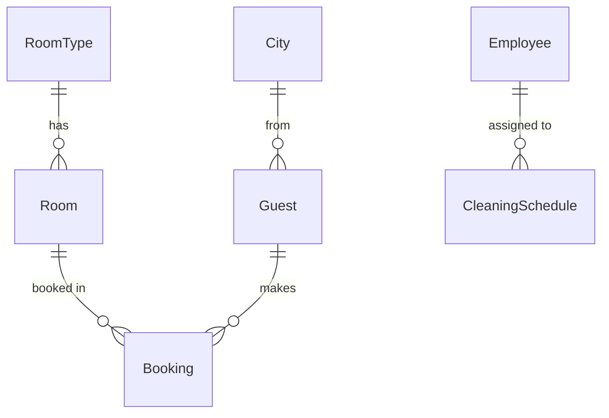

### 4. Ход выполнения работы

#### 4.1. Инициализация проекта

Создан проект `hotel_project` и приложение `hotel_app`. В файле `hotel_project/settings.py` подключены необходимые приложения: `rest_framework`, `djoser` и `hotel_app`.

```bash
django-admin startproject hotel_project
cd hotel_project
python manage.py startapp hotel_app
```

#### 4.2. Реализация моделей (models.py)

В файле `models.py` описаны классы моделей. Реализована сложная валидация данных на уровне моделей (метод clean в модели Booking), проверяющая даты, статус ремонта и переполнение номера.

**Фрагмент кода (Модель Booking с валидацией):**

```python
class Booking(models.Model):
    """Бронирование"""
    room = models.ForeignKey(Room, on_delete=models.CASCADE, verbose_name="Номер", related_name="bookings")
    guest = models.ForeignKey(Guest, on_delete=models.CASCADE, verbose_name="Гость", related_name="bookings")
    check_in = models.DateField(verbose_name="Дата заезда")
    check_out = models.DateField(verbose_name="Дата выезда", null=True, blank=True)
    is_active = models.BooleanField(default=True, verbose_name="Активно")
    total_cost = models.DecimalField(max_digits=10, decimal_places=2, null=True, blank=True, verbose_name="Итого")


    def clean(self):
        """Проверка бизнес-логики"""
        # 1. Проверка дат
        if self.check_out and self.check_out < self.check_in:
            raise ValidationError("Дата выезда не может быть раньше даты заезда!")

        # 2. Проверка статуса номера (ремонт)
        if self.is_active and self.room.status == 'maintenance':
            raise ValidationError(f"Номер {self.room.number} находится на обслуживании!")

        # 3. Проверка на переполнение (с учетом дат)
        if self.is_active:
            check_out_date = self.check_out if self.check_out else (datetime.date.today() + datetime.timedelta(days=3650))

            overlapping_bookings = Booking.objects.filter(
                room=self.room,
                is_active=True,
                check_in__lt=check_out_date
            ).exclude(pk=self.pk)

            actual_overlaps = []
            for b in overlapping_bookings:
                b_end = b.check_out if b.check_out else (datetime.date.today() + datetime.timedelta(days=3650))
                if b_end > self.check_in:
                    actual_overlaps.append(b)

            capacity = self.room.room_type.max_guests
            if len(actual_overlaps) >= capacity:
                 raise ValidationError(f"Номер {self.room.number} занят на выбранные даты!")

    def save(self, *args, **kwargs):
        self.clean()
        if self.check_out:
            days = (self.check_out - self.check_in).days
            if days == 0: days = 1
            self.total_cost = days * self.room.room_type.price

            # Автоматическое освобождение, если дата выезда прошла или сегодня
            if self.check_out <= timezone.now().date():
                self.room.status = 'free'
                self.room.save()
        else:
            self.room.status = 'occupied'
            self.room.save()

        super().save(*args, **kwargs)

    def __str__(self):
        return f"{self.guest} -> {self.room}"
```

**Миграции:**
После описания моделей были созданы и применены миграции.

```
python manage.py makemigrations
python manage.py migrate
```

#### 4.3. Наполнение базы данных

Модели были зарегистрированы в файле `hotel_app/admin.py`. Затем для тестирования системы база данных была наполнена тестовыми данными с помощью админ-панели Django. Были созданы:

- Города: Москва, Санкт-Петербург, Сочи и др.
- Типы номеров: Стандарт, Комфорт, Люкс.
- Номера: 101, 102, 205 и т.д.
- Сотрудники и их графики уборки.
- Гости и записи о бронировании.

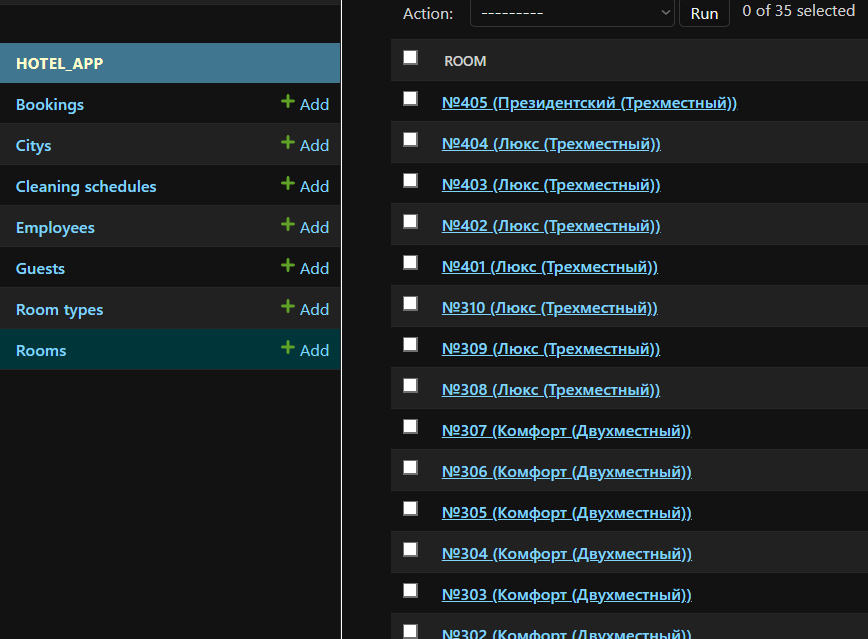

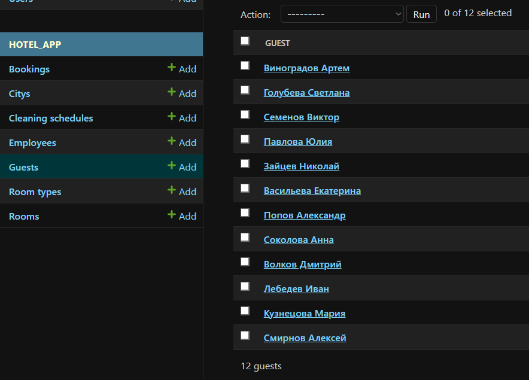

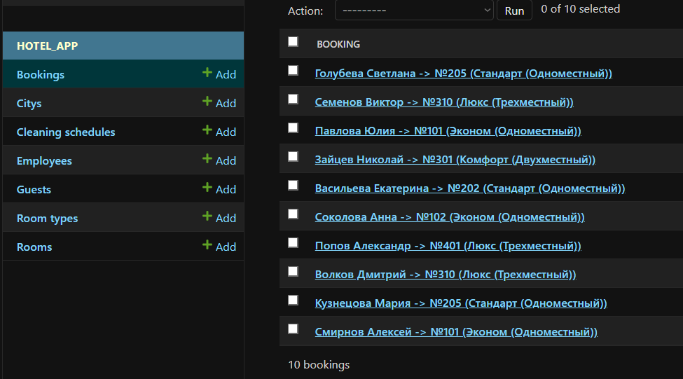

### 5. Реализация API (DRF)

#### 5.1. Сериализаторы (serializers.py)

Для преобразования моделей в JSON использованы `ModelSerializer`.

- Для **чтения (`GET`)** реализована вложенная сериализация (Nested Serializers), чтобы вместо ID связанных объектов (например, типа номера) выводилась полная информация о них.
- Для **записи (`POST/PUT`)** используются стандартные поля `PrimaryKeyRelatedField`, принимающие ID.
- В `BookingSerializer` реализован метод `validate`, который вызывает логику `clean()` модели.

**Фрагмент кода (Сериализатор Booking с валидацией):**

```python
class BookingSerializer(serializers.ModelSerializer):
    guest_details = GuestSerializer(source='guest', read_only=True)
    room_details = RoomSerializer(source='room', read_only=True)

    guest = serializers.PrimaryKeyRelatedField(queryset=Guest.objects.all())
    room = serializers.PrimaryKeyRelatedField(queryset=Room.objects.all())

    is_active = serializers.BooleanField(default=True, initial=True)

    class Meta:
        model = Booking
        fields = "__all__"

    def validate(self, data):
        instance_data = {}
        if self.instance:
            instance_data = {
                'room': self.instance.room, 'guest': self.instance.guest,
                'check_in': self.instance.check_in, 'check_out': self.instance.check_out,
                'is_active': self.instance.is_active
            }
        instance_data.update(data)

        try:
            temp_instance = Booking(**instance_data)
        except TypeError:
            return data

        if self.instance:
            temp_instance.pk = self.instance.pk

        try:
            temp_instance.clean()
        except ValidationError as e:
            if hasattr(e, 'message_dict'):
                raise serializers.ValidationError(e.message_dict)
            else:
                raise serializers.ValidationError(e.messages)
        return data
```

#### 5.2. Представления (views.py) и Маршруты (urls.py)

Использованы `Generics` (`ListCreateAPIView`, `RetrieveUpdateDestroyAPIView`) для реализации полного набора CRUD-операций для всех моделей.

**Фрагмент кода (Представления для бронирований):**

```python
class BookingList(generics.ListCreateAPIView):
    queryset = Booking.objects.all()
    serializer_class = BookingSerializer

class BookingDetail(generics.RetrieveUpdateDestroyAPIView):
    queryset = Booking.objects.all()
    serializer_class = BookingSerializer
```

**Реализованные эндпоинты:**

- `/api/rooms/` — Работа с номерами.
- `/api/guests/` — Работа с гостями.
- `/api/bookings/` — Управление заселением.
- `/api/employees/` — Управление персоналом.
- `/api/schedules/` — Управление графиком уборки.

### 6. Примеры работы системы

#### Сценарий 1: Просмотр списка текущих заселений

Администратор запрашивает список всех бронирований. Система возвращает JSON с подробной информацией о гостях и номерах.

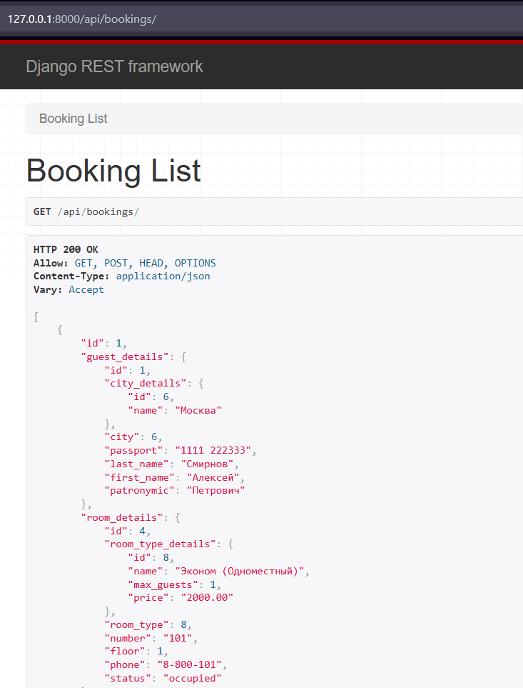

#### Сценарий 2: Заселение гостя (Валидация бизнес-логики)

Администратор пытается заселить гостя.

- **Кейс А (Успех):** Заселение в свободный номер.

    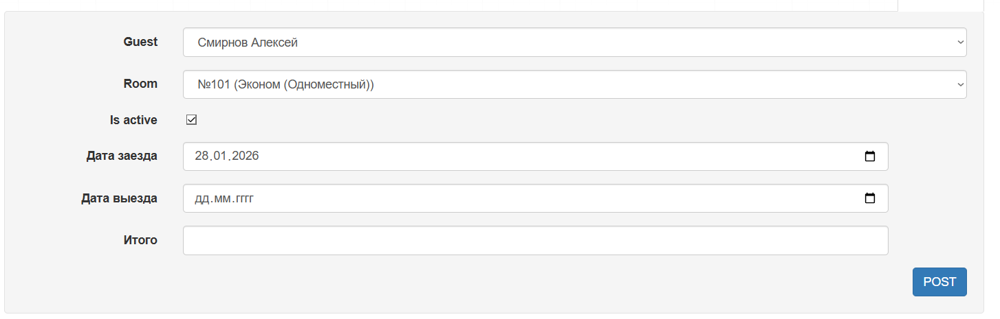

    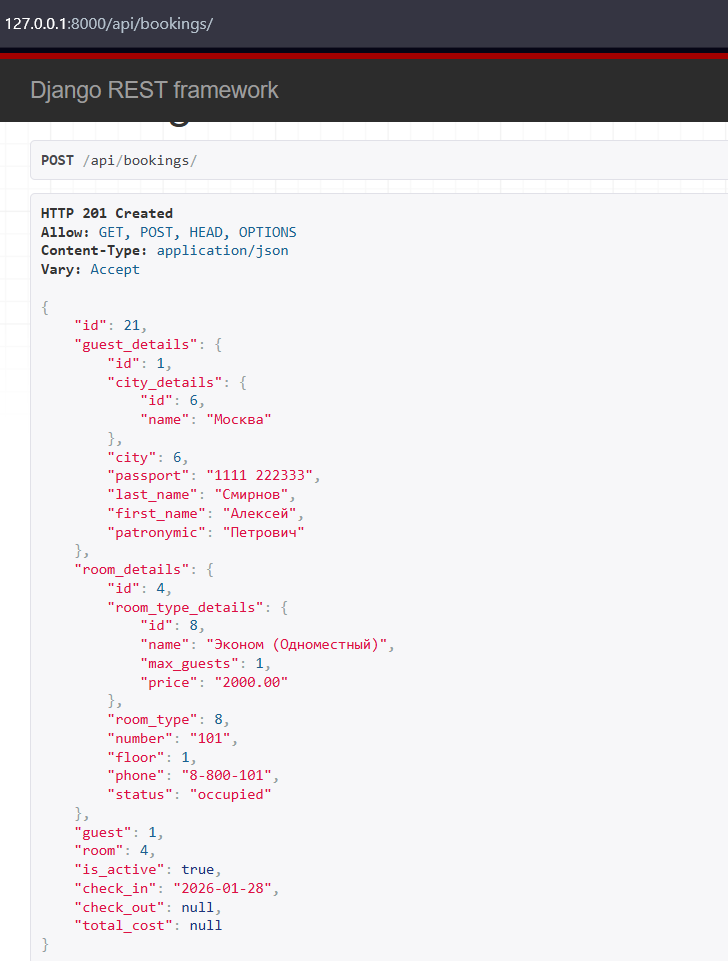

- **Кейс Б (Ошибка):** Попытка заселить гостя в номер, который уже занят (превышение вместимости) или находится на ремонте. Система возвращает ошибку `400 Bad Request`.

    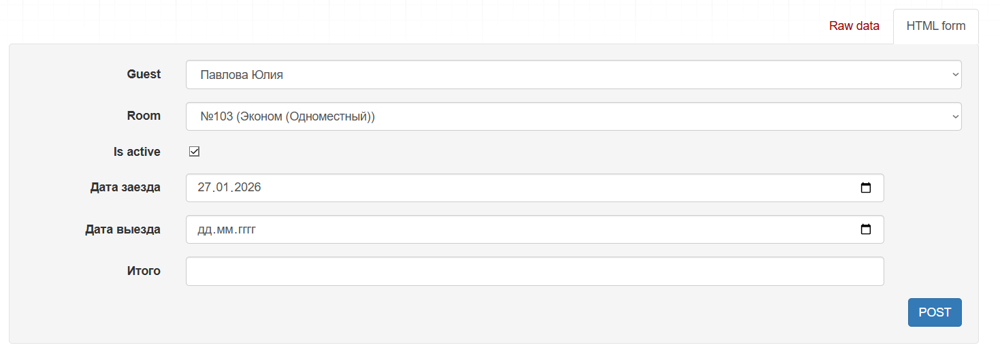

    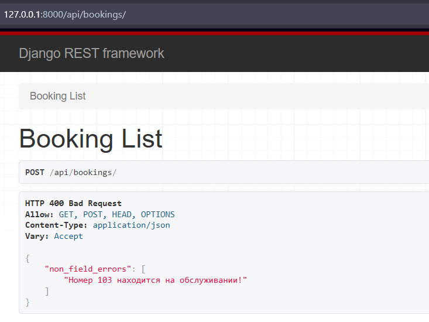

### 7. Авторизация и Аутентификация (Djoser)

Подключена библиотека `Djoser` для управления пользователями. Реализована аутентификация по токенам (`TokenAuthentication`).

1. **Регистрация пользователя:** `POST /auth/users/`
2. **Вход в систему:** `POST /auth/token/login/`

**Регистрация пользователя:**

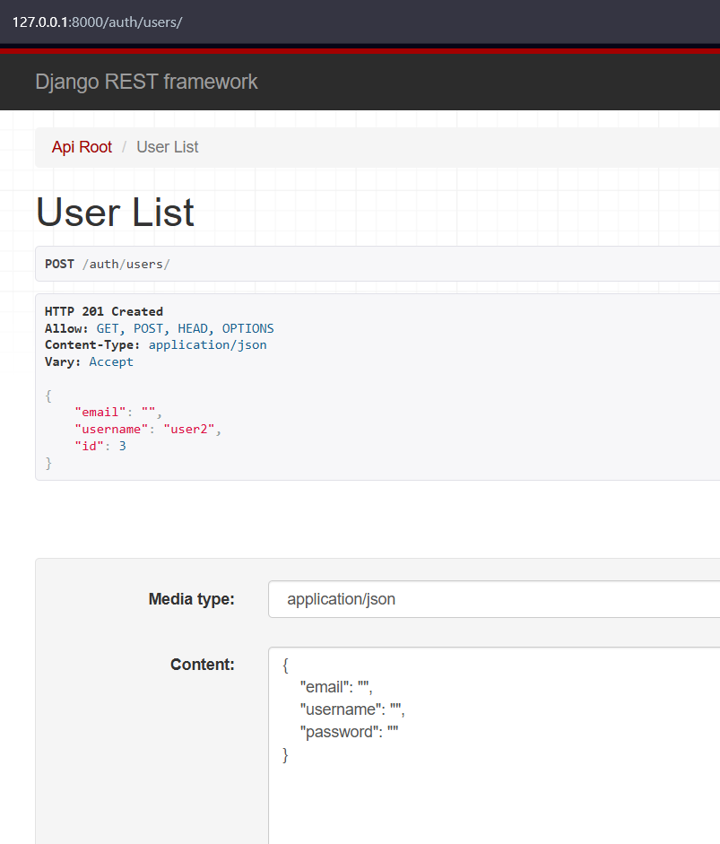

**Успешное получение токена при входе:**

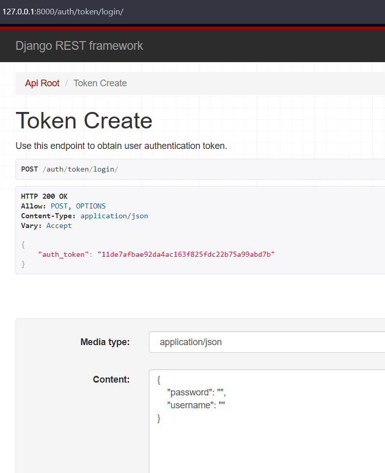

### Заключение

В результате выполнения лабораторной работы была успешно спроектирована и реализована серверная часть системы для администратора гостиницы, включающая нормализованную базу данных (3НФ) с учетом бизнес-логики предметной области, полноценный REST API с поддержкой CRUD и вложенной сериализации, а также систему авторизации на базе токенов.
