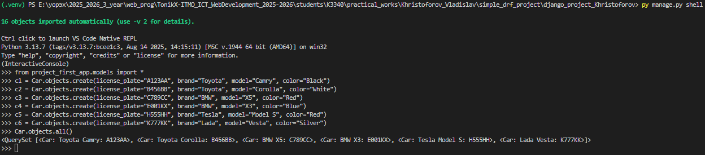
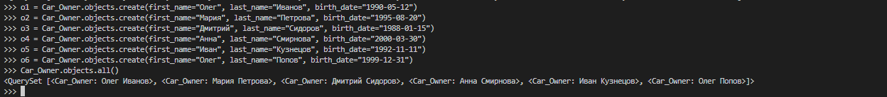
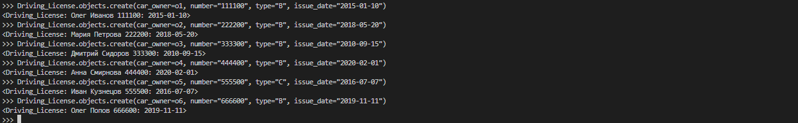
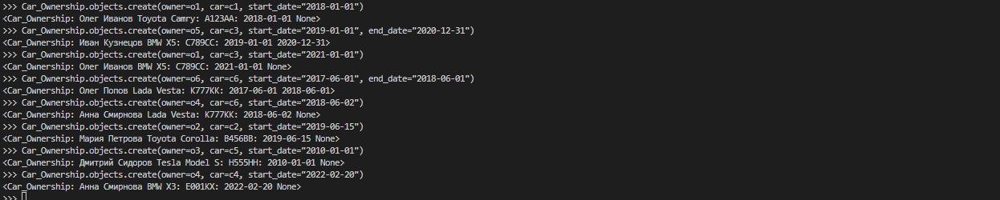
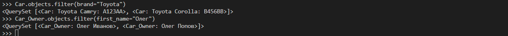
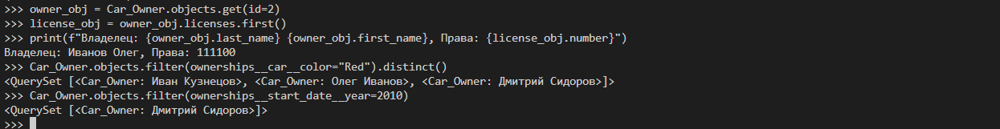
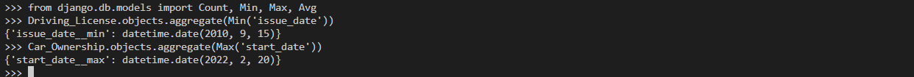
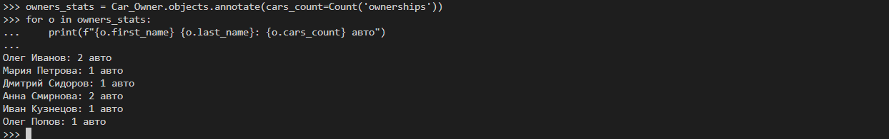
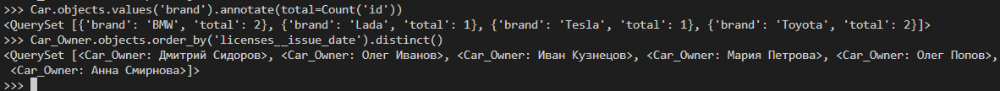

# Отчет по практической работе №3.1

## Тема: Django ORM. Запросы и их выполнение.

> **Выполнил:** Христофоров Владислав Николаевич, K3340, WEB 2.3

### 🎯 Цель работы

Получение практических навыков работы с базой данных через Django ORM, включая создание объектов, настройку связей между ними, выполнение запросов на выборку и фильтрацию данных, а также агрегацию данных.

### 🛠 1. Подготовка и настройка моделей

В файл `models.py` были внесены изменения для удобства работы со связями (добавлен `related_name`).

**Изменения в коде:**

```python
class Driving_License(models.Model):
    # Добавлен related_name='licenses'
    car_owner = models.ForeignKey(Car_Owner, on_delete=models.CASCADE, related_name='licenses')
    ...

class Car_Ownership(models.Model):
    # Добавлен related_name='ownerships'
    owner = models.ForeignKey(Car_Owner, on_delete=models.CASCADE, null=True, related_name='ownerships')
    car = models.ForeignKey(Car, on_delete=models.CASCADE, null=True, related_name='ownerships')
    ...

```

*После изменения моделей были созданы и применены миграции.*

```
python manage.py makemigrations
python manage.py migrate
```

### 💻 2. Ход выполнения работы

Работа проводилась в интерактивном режиме `manage.py shell`.

```
python manage.py shell
```

Были импортированы классы моделей из файла models.py нашего приложения:

```
from my_app.models import *
```

#### Часть 1: Создание объектов

Были созданы объекты автомобилей, владельцев, удостоверений и установлены связи между ними через промежуточную модель `Car_Ownership`.

**Создание машин:**

```python
c1 = Car.objects.create(license_plate="A123AA", brand="Toyota", model="Camry", color="Black")
c2 = Car.objects.create(license_plate="B456BB", brand="Toyota", model="Corolla", color="White")
c3 = Car.objects.create(license_plate="C789CC", brand="BMW", model="X5", color="Red")
c4 = Car.objects.create(license_plate="E001KX", brand="BMW", model="X3", color="Blue")
c5 = Car.objects.create(license_plate="H555HH", brand="Tesla", model="Model S", color="Red")
c6 = Car.objects.create(license_plate="K777KK", brand="Lada", model="Vesta", color="Silver")
```

**Результат выполнения:**


**Создание владельцев:**

```python
o1 = Car_Owner.objects.create(first_name="Олег", last_name="Иванов", birth_date="1990-05-12")
o2 = Car_Owner.objects.create(first_name="Мария", last_name="Петрова", birth_date="1995-08-20")
o3 = Car_Owner.objects.create(first_name="Дмитрий", last_name="Сидоров", birth_date="1988-01-15")
o4 = Car_Owner.objects.create(first_name="Анна", last_name="Смирнова", birth_date="2000-03-30")
o5 = Car_Owner.objects.create(first_name="Иван", last_name="Кузнецов", birth_date="1992-11-11")
o6 = Car_Owner.objects.create(first_name="Олег", last_name="Попов", birth_date="1999-12-31")
```

**Результат выполнения:**


**Выдача прав:**

```python
Driving_License.objects.create(car_owner=o1, number="111100", type="B", issue_date="2015-01-10")
Driving_License.objects.create(car_owner=o2, number="222200", type="B", issue_date="2018-05-20")
Driving_License.objects.create(car_owner=o3, number="333300", type="B", issue_date="2010-09-15")
Driving_License.objects.create(car_owner=o4, number="444400", type="B", issue_date="2020-02-01")
Driving_License.objects.create(car_owner=o5, number="555500", type="C", issue_date="2016-07-07")
Driving_License.objects.create(car_owner=o6, number="666600", type="B", issue_date="2019-11-11")
```

**Результат выполнения:**


**Связываем машин и владельцев:**

```python
Car_Ownership.objects.create(owner=o1, car=c1, start_date="2018-01-01")
Car_Ownership.objects.create(owner=o5, car=c3, start_date="2019-01-01", end_date="2020-12-31")
Car_Ownership.objects.create(owner=o1, car=c3, start_date="2021-01-01")
Car_Ownership.objects.create(owner=o6, car=c6, start_date="2017-06-01", end_date="2018-06-01")
Car_Ownership.objects.create(owner=o4, car=c6, start_date="2018-06-02")
Car_Ownership.objects.create(owner=o2, car=c2, start_date="2019-06-15")
Car_Ownership.objects.create(owner=o3, car=c5, start_date="2010-01-01")
Car_Ownership.objects.create(owner=o4, car=c4, start_date="2022-02-20")
```

**Результат выполнения:**


#### Часть 2: Фильтрация данных

**Запрос 1. Вывод всех автомобилей марки "Toyota"**

```python
Car.objects.filter(brand="Toyota")
```

**Запрос 2. Найти всех водителей с именем "Олег"**

```python
Car_Owner.objects.filter(first_name="Олег")
```

**Результат:**



**Запрос 3. Получение удостоверения по ID владельца**

Использована обратная связь через `related_name='licenses'`.

```python
owner_obj = Car_Owner.objects.get(id=2)
license_obj = owner_obj.licenses.first() 
print(f"Владелец: {owner_obj.last_name}, Права: {license_obj.number}")
```

**Запрос 4. Вывод всех владельцев красных машин**

Фильтрация через связанные таблицы: `ownerships` -> `car` -> `color`.

```python
Car_Owner.objects.filter(ownerships__car__color="Red").distinct()
```

**Запрос 5. Найти владельцев, владеющих машиной с 2010 года**

```python
Car_Owner.objects.filter(ownerships__start_date__year=2010)
```

**Результат:**



#### Часть 3: Агрегация и Аннотация

Были импортированы функции для агрегации и аннотации

```
from django.db.models import Count, Min, Max, Avg
```

**Запрос 6. Дата выдачи самого старого удостоверения (Min)**

```python
Driving_License.objects.aggregate(Min('issue_date'))
```

**Запрос 7. Самая поздняя дата начала владения машиной (Max)**

```python
Car_Ownership.objects.aggregate(Max('start_date'))
```

**Результат:**



**Запрос 8. Количество машин для каждого водителя**

Использована аннотация `Count('ownerships')`.

```python
owners_stats = Car_Owner.objects.annotate(cars_count=Count('ownerships'))
for o in owners_stats:
    print(f"{o.first_name} {o.last_name}: {o.cars_count} авто")
```

**Результат:**



**Запрос 9. Количество машин каждой марки**
Группировка по полю `brand`.

```python
Car.objects.values('brand').annotate(total=Count('id'))
```

**Запрос 10. Сортировка автовладельцев по дате выдачи удостоверения**

```python
Car_Owner.objects.order_by('licenses__issue_date').distinct()
```

**Результат:**



### ✅ Заключение

В ходе выполнения практической работы были изучены и освоены ключевые принципы взаимодействия с реляционными базами данных посредством Django ORM. Полученные навыки позволяют эффективно управлять данными: создавать и связывать объекты, выполнять сложные поисковые запросы, а также проводить агрегацию и аннотирование данных, полностью исключая необходимость использования прямых SQL-команд в коде приложения.
