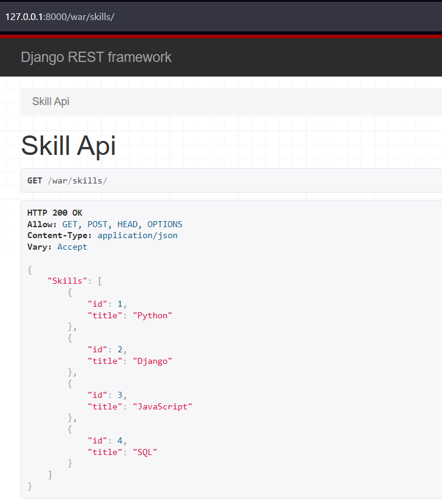
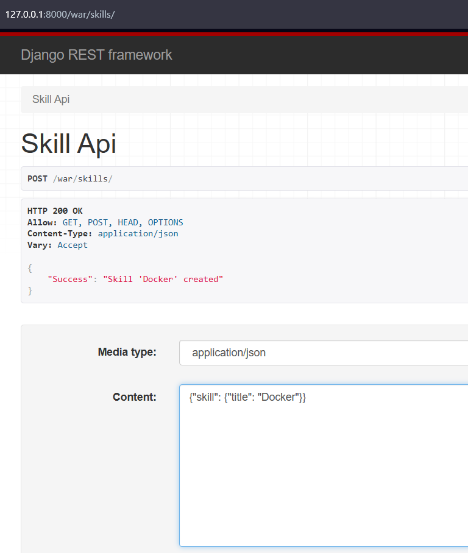
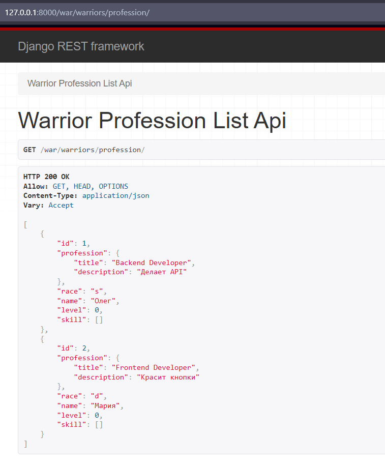
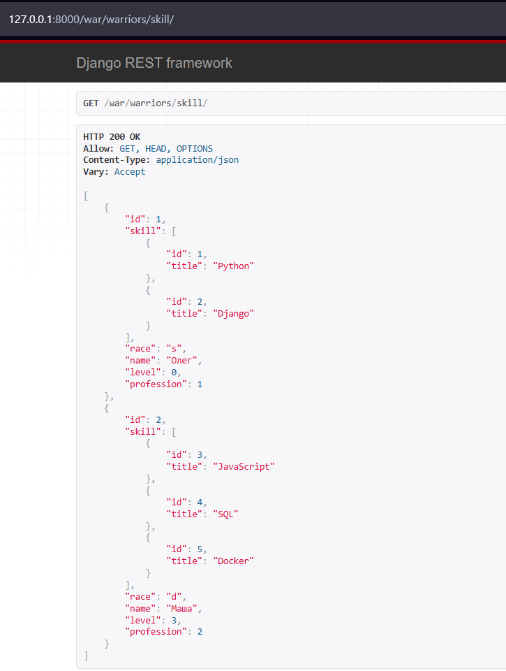
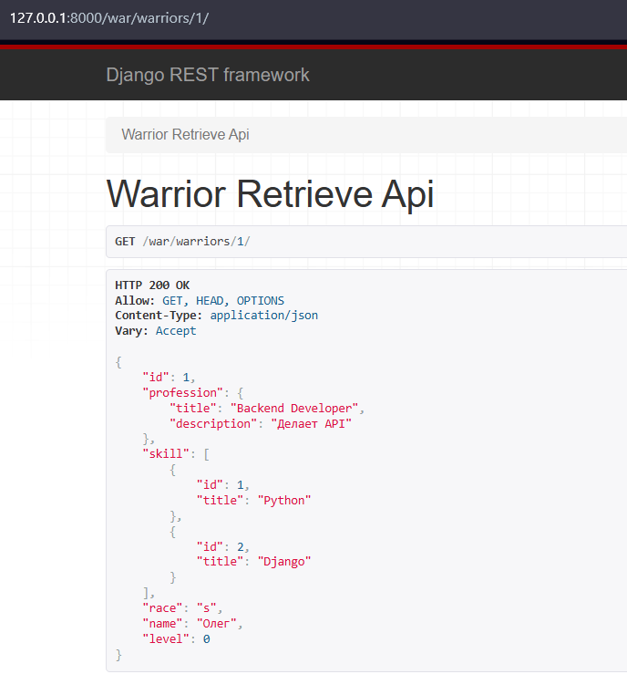
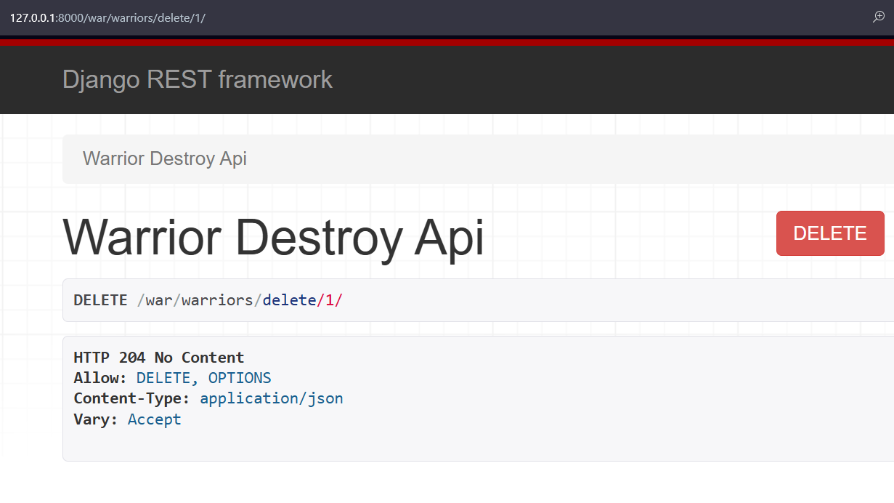
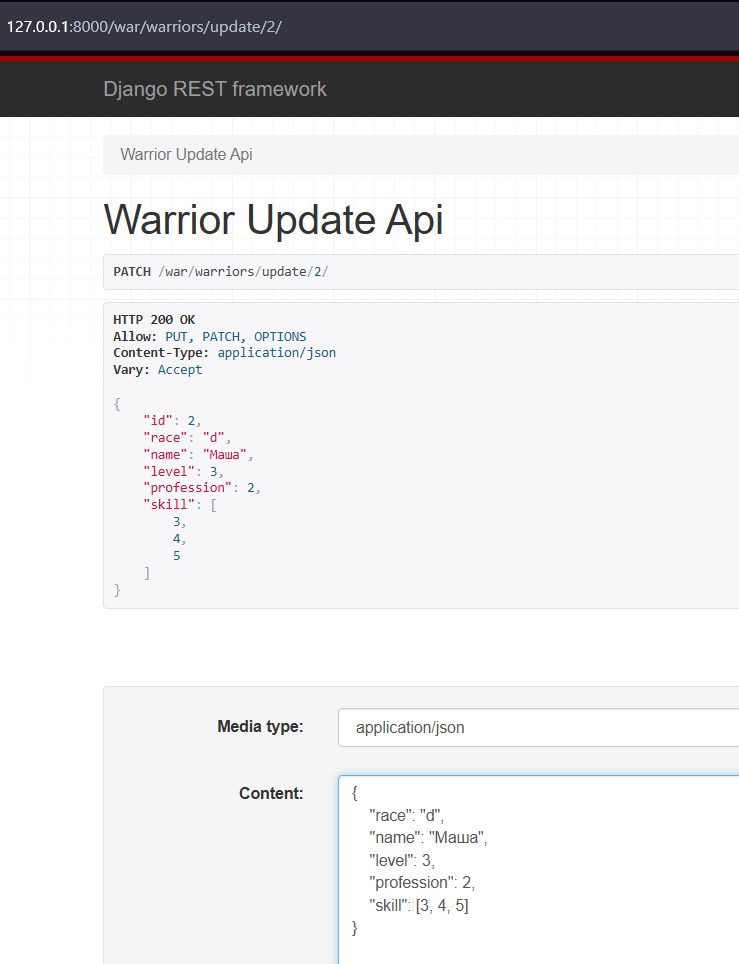

# Отчет по Практической работе №3.2

## Тема: Django REST Framework. Создание API.

> **Выполнил:** Христофоров Владислав Николаевич, K3340, WEB 2.3

### 🎯 Цель работы

Изучить основы построения RESTful API с использованием библиотеки Django REST Framework (DRF). Освоить работу с сериализаторами (Serializer, ModelSerializer), создать API-представления вручную (APIView) и с помощью дженериков (Generics), а также реализовать полный набор CRUD-операций для моделей.

### 🛠 1. Настройка проекта и модели

Был создан новый Django-проект `warriors_project` и приложение `warriors_app`.
В `models.py` описана структура базы данных для системы управления "Воинами":

- **Warrior** (Воин): имя, раса, уровень, навыки, профессия
- **Profession** (Профессия): название, описание.
- **Skill** (Навык): название.
- **SkillOfWarrior** (Промежуточная модель): связь Воин-Навык с уровнем владения.

Применены:

```shell
python manage.py makemigrations
python manage.py migrate
```

### 💻 2. Реализация API "вручную" (APIView)

На начальном этапе были реализованы эндпоинты с использованием базового класса `APIView` для понимания работы сериализаторов и методов HTTP.

**Код SkillAPIView:**

```python
class SkillAPIView(APIView):
    def get(self, request):
        skills = Skill.objects.all()
        serializer = SkillSerializer(skills, many=True)
        return Response({"Skills": serializer.data})

    def post(self, request):
        skill = request.data.get("skill")
        serializer = SkillSerializer(data=skill)
        if serializer.is_valid(raise_exception=True):
            skill_saved = serializer.save()
        return Response({"Success": "Skill '{}' created".format(skill_saved.title)})
```

**Код SkillSerializer:**

```python
class SkillSerializer(serializers.ModelSerializer):
    class Meta:
        model = Skill
        fields = "__all__"
```

**Код в urls.py:**

```python
urlpatterns = [
   ...
   path('skills/', SkillAPIView.as_view()),
]
```

**Результат 1: Получение списка скиллов (GET)**



**Результат 2: Создание нового скилла (POST)**



### 🚀 3. Использование Generics и вложенных сериализаторов

Для реализации финального задания использовались `Generics` для сокращения кода и вложенные сериализаторы для детального отображения связанных данных.

**Сериализаторы:**

- `WarriorSerializer`: Базовый (плоский), используется для записи/обновления.
- `WarriorProfessionSerializer`: Вложенный, показывает детали профессии.
- `WarriorSkillSerializer`: Вложенный, показывает детали скиллов.
- `WarriorDetailSerializer`: Полный, показывает и профессию, и скиллы.

**Код сериализаторов:**

```python
class WarriorSerializer(serializers.ModelSerializer):
    class Meta:
        model = Warrior
        fields = "__all__"

    def update(self, instance, validated_data):
        skills_data = self.initial_data.get('skill')

        instance = super().update(instance, validated_data)

        if skills_data:
            instance.skill.clear()
            for skill_id in skills_data:
                SkillOfWarrior.objects.create(
                    warrior=instance,
                    skill_id=skill_id,
                    level=1
                )
        return instance

class SkillSerializer(serializers.ModelSerializer):
    class Meta:
        model = Skill
        fields = "__all__"

class ProfessionSerializer(serializers.ModelSerializer):
    class Meta:
        model = Profession
        fields = ["title", "description"]

class WarriorProfessionSerializer(serializers.ModelSerializer):
    profession = ProfessionSerializer(read_only=True)
    class Meta:
        model = Warrior
        fields = "__all__"

class WarriorSkillSerializer(serializers.ModelSerializer):
    skill = SkillSerializer(many=True, read_only=True)
    class Meta:
        model = Warrior
        fields = "__all__"

class WarriorDetailSerializer(serializers.ModelSerializer):
    profession = ProfessionSerializer(read_only=True)
    skill = SkillSerializer(many=True, read_only=True)
    class Meta:
        model = Warrior
        fields = "__all__"
```

**Код в urls.py:**

```python
urlpatterns = [
    ...
    path('warriors/profession/', WarriorProfessionListAPIView.as_view()),
    path('warriors/skill/', WarriorSkillListAPIView.as_view()),
    path('warriors/<int:pk>/', WarriorRetrieveAPIView.as_view()),
    path('warriors/delete/<int:pk>/', WarriorDestroyAPIView.as_view()),
    path('warriors/update/<int:pk>/', WarriorUpdateAPIView.as_view()),
    ...
]
```

#### Задание 1: Вывод воинов и их профессий

Реализовано с помощью `ListAPIView` и `WarriorProfessionSerializer`.

**Код WarriorProfessionListAPIView:**

```python
class WarriorProfessionListAPIView(generics.ListAPIView):
    queryset = Warrior.objects.all()
    serializer_class = WarriorProfessionSerializer
```

**Скриншот:**



#### Задание 2: Вывод воинов и их скиллов

Реализовано с помощью `ListAPIView` и `WarriorSkillSerializer`.

**Код WarriorSkillListAPIView:**

```python
class WarriorSkillListAPIView(generics.ListAPIView):
    queryset = Warrior.objects.all()
    serializer_class = WarriorSkillSerializer
```

**Скриншот:**



#### Задание 3: Детальная информация о воине (GET по ID)

Реализовано с помощью `RetrieveAPIView` и `WarriorDetailSerializer`.

**Код WarriorRetrieveAPIView:**

```python
class WarriorRetrieveAPIView(generics.RetrieveAPIView):
    queryset = Warrior.objects.all()
    serializer_class = WarriorDetailSerializer
```

**Скриншот:**



#### Задание 4: Удаление воина (DELETE по ID)

Реализовано с помощью `DestroyAPIView`.

**Код WarriorDestroyAPIView:**

```python
class WarriorDestroyAPIView(generics.DestroyAPIView):
    queryset = Warrior.objects.all()
    serializer_class = WarriorSerializer
```

**Скриншот:**



#### Задание 5: Редактирование воина (UPDATE по ID)

Реализовано с помощью `UpdateAPIView`. Для корректной работы обновления полей использовался базовый `WarriorSerializer`.

**Код WarriorUpdateAPIView:**

```python
class WarriorUpdateAPIView(generics.UpdateAPIView):
    serializer_class = WarriorSerializer
    queryset = Warrior.objects.all()
```

**Скриншот:**



### ✅ Заключение

В ходе выполнения практической работы я ознакомился с принципами REST-архитектуры и реализовал API для веб-приложения на базе Django REST Framework. Были освоены различные способы создания представлений (APIView, Generics), работа с сериализаторами (включая вложенные связи) и маршрутизация запросов. В результате был создан функциональный API, поддерживающий чтение, создание, обновление и удаление данных.
