# Отчет по Лабораторной работе №4

## Тема: Реализация клиентской части приложения средствами Vue 3 и Vuetify

> **Выполнил:** Христофоров Владислав Николаевич, K3340, WEB 2.3

> **Вариант:** Администратор гостиницы

### 1. Цель работы

Овладеть практическими навыками разработки клиентской части веб-приложений на базе фреймворка Vue 3. Настроить взаимодействие с серверной частью (Django REST Framework), реализовать динамический интерфейс с использованием библиотеки компонентов Vuetify, настроить систему роутинга и авторизации по токенам.

### 2. Задание

Разработать пользовательский интерфейс для информационной системы администратора гостиницы.

**Основные требования:**

1. **SPA Архитектура:** Использование Vue Router для навигации без перезагрузки.
2. **Компонентный подход:** Разделение логики на переиспользуемые компоненты и страницы (Views).
3. **Интеграция с API:** Реализация CRUD-операций через Axios.
4. **Бизнес-логика:** Реализация проверок (валидации) и расчетов на стороне клиента.
5. **Дизайн:** Оформление в стиле Material Design средствами Vuetify.

---

### 3. Технологический стек

- **Core:** Vue 3 (Composition API, Vite).
- **UI:** Vuetify (Material Design Framework).
- **Networking:** Axios (HTTP-клиент).
- **Routing:** Vue Router.
- **Icons:** Material Design Icons (MDI).

---

### 4. Ход выполнения работы

#### 4.1. Настройка сетевого взаимодействия и авторизации

Для централизованного взаимодействия с бэкендом настроен сервис `api.js`. Реализован механизм перехватчиков (interceptors), который автоматически подставляет токен авторизации из `localStorage` во все заголовки запросов, что обеспечивает доступ к защищенным эндпоинтам.

**Фрагмент кода (api.js):**

```javascript
const api = axios.create({
    baseURL: "http://127.0.0.1:8000",
    headers: {
        "Content-Type": "application/json",
    },
});

api.interceptors.request.use((config) => {
    const token = localStorage.getItem("auth_token");
    if (token) {
        config.headers.Authorization = `Token ${token}`;
    }
    return config;
});
```

#### 4.2. Настройка маршрутизации и защиты (Guards)

В файле `router/index.js` описаны пути ко всем страницам приложения. Для обеспечения безопасности настроен глобальный навигационный гвард, который перенаправляет неавторизованных пользователей на страницу входа.

**Фрагмент кода (router/index.js):**

```javascript
const router = createRouter({
    history: createWebHistory(import.meta.env.BASE_URL),
    routes: [
        { path: "/", name: "home", component: HomeView },
        { path: "/login", name: "login", component: LoginView },
        { path: "/register", name: "register", component: RegisterView },
        { path: "/profile", name: "profile", component: ProfileView },
        { path: "/reports", name: "reports", component: ReportsView },
        { path: "/rooms", name: "rooms", component: RoomsView },
        { path: "/guests", name: "guests", component: GuestsView },
        { path: "/bookings", name: "bookings", component: BookingsView },
        { path: "/employees", name: "employees", component: EmployeesView },
        { path: "/schedules", name: "schedules", component: SchedulesView },
    ],
});

router.beforeEach((to, from, next) => {
    const publicPages = ["/login", "/register"];
    const authRequired = !publicPages.includes(to.path);
    const loggedIn = localStorage.getItem("auth_token");

    if (authRequired && !loggedIn) {
        next("/login");
    } else {
        next();
    }
});
```

#### 4.3. Описание реализованных интерфейсов

##### 4.3.1. Страницы авторизации и регистрации (`LoginView`, `RegisterView`)

Реализованы формы для входа и создания новых учетных записей администраторов. Используется библиотека Djoser на стороне сервера.

**Логика:** При успешном входе токен сохраняется в локальное хранилище браузера.

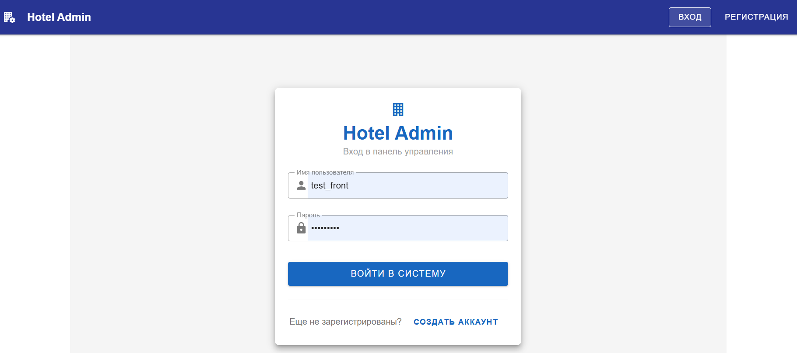{ width=80%}

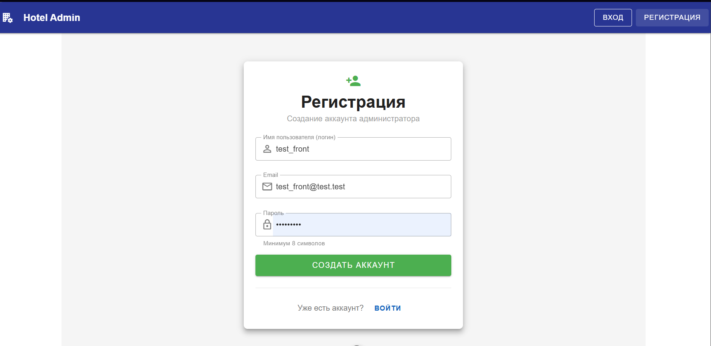{ width=80% }

##### 4.3.2. Главная панель управления (`HomeView`)

Дашборд администратора с оперативными показателями (свободные/занятые номера, количество гостей) и кнопками быстрого перехода.

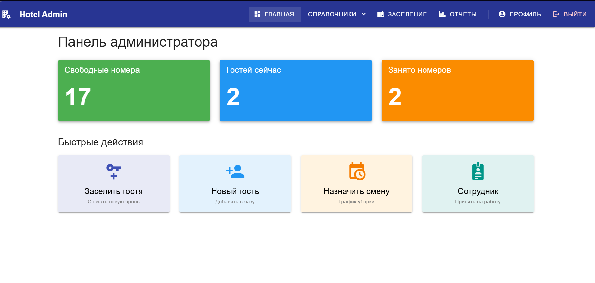{ width=80% }

##### 4.3.3. Управление номерным фондом (`RoomsView`)

Обеспечивает CRUD-операции над номерами. Внедрена кастомная валидация: номер комнаты обязан начинаться с цифры этажа.

**Фрагмент кода (Валидация номера):**

```javascript
const numberRules = [
    (v) => !!v || "Номер обязателен",
    (v) => {
        if (!editedItem.value.floor) return true;

        let floorNum = "";
        if (
            typeof editedItem.value.floor === "object" &&
            editedItem.value.floor
        ) {
            floorNum = String(editedItem.value.floor.number);
        } else {
            const f = floors.value.find((f) => f.id === editedItem.value.floor);
            if (f) floorNum = String(f.number);
        }

        if (floorNum && !v.startsWith(floorNum)) {
            return `На ${floorNum} этаже номер должен начинаться с "${floorNum}"`;
        }
        return true;
    },
];
```

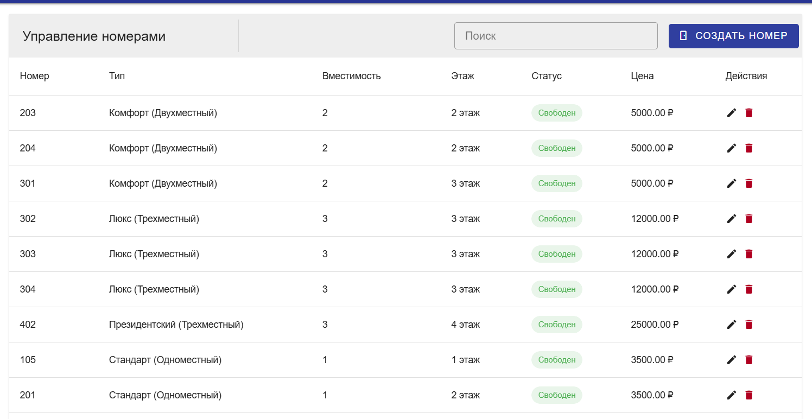{ width=80% }

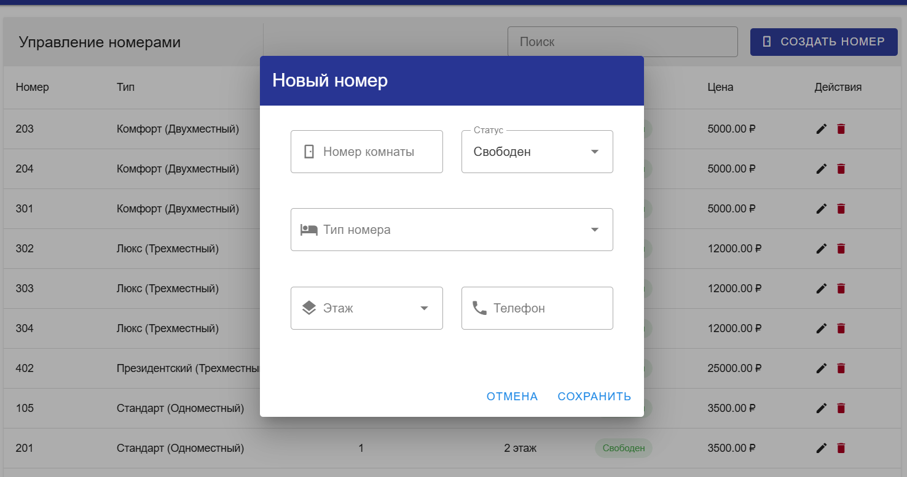{ width=80% }

##### 4.3.4. База гостей (`GuestsView`)

Учет постояльцев с интеграцией справочника городов. Реализован `v-combobox`, позволяющий выбрать город или создать новый в процессе регистрации гостя.

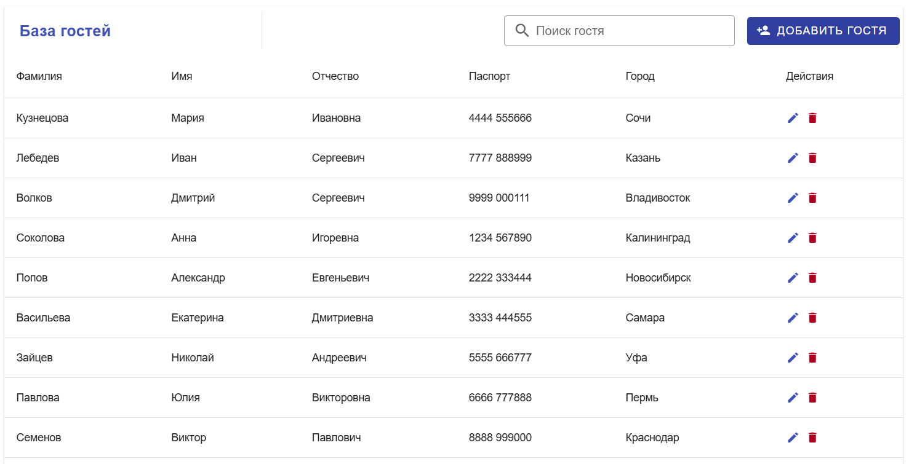{ width=80% }

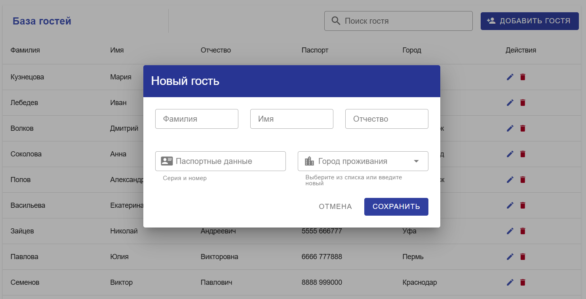{ width=80% }

##### 4.3.5. Журнал заселения (`BookingsView`)

Сложный интерфейс для управления бронированиями. Реализованы функции автоматического расчета стоимости проживания на основе дат и типов номеров.

**Фрагмент кода (Авторасчет стоимости):**

```javascript
const estimatedCost = computed(() => {
    if (
        !selectedRoomData.value ||
        !editedItem.value.check_in ||
        !editedItem.value.check_out
    )
        return 0;

    const start = new Date(editedItem.value.check_in);
    const end = new Date(editedItem.value.check_out);

    if (end <= start) return 0;

    const diffTime = Math.abs(end - start);
    const diffDays = Math.ceil(diffTime / (1000 * 60 * 60 * 24));

    const price = Number(selectedRoomData.value.room_type_details?.price || 0);
    return diffDays * price;
});
```

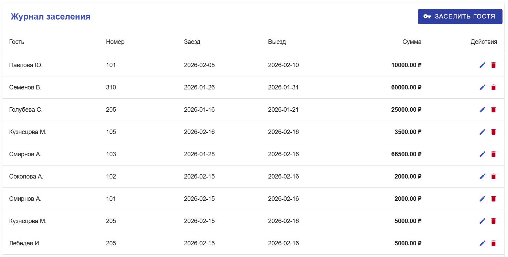{ width=80% }

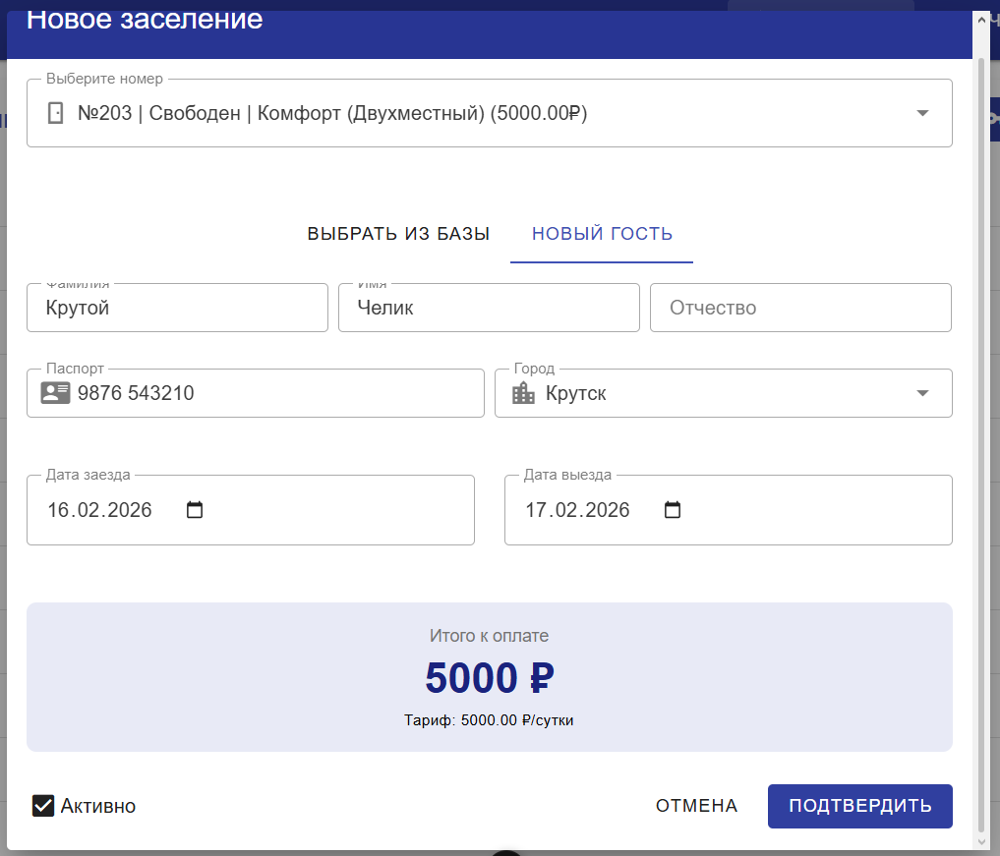{ width=80% }

##### 4.3.6. Персонал и Графики уборки (`EmployeesView`, `SchedulesView`)

Управление штатом сотрудников и назначением смен на этажах. Реализована проверка на пересечение графиков (один сотрудник не может убирать разные этажи в один день).

**Фрагмент кода (Валидация пересечения графиков):**

```javascript
const rules = {
    required: (v) => !!v || "Обязательное поле",
    unique: () => {
        if (!editedItem.value.employee || !editedItem.value.day_of_week)
            return true;

        const duplicate = schedules.value.find(
            (s) =>
                s.employee === editedItem.value.employee &&
                s.day_of_week === editedItem.value.day_of_week &&
                s.id !== editedItem.value.id,
        );

        if (duplicate) {
            let floorInfo = duplicate.floor;
            if (duplicate.floor_details) {
                floorInfo = duplicate.floor_details.number;
            } else {
                const f = floors.value.find((fl) => fl.id === duplicate.floor);
                if (f) floorInfo = f.number;
            }
            return `Сотрудник уже занят в этот день на ${floorInfo} этаже!`;
        }
        return true;
    },
};
```

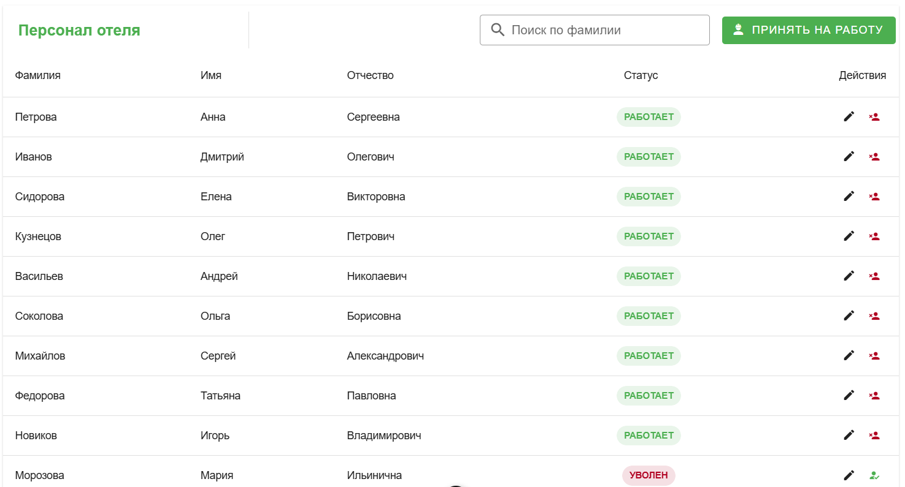{ width=80% }

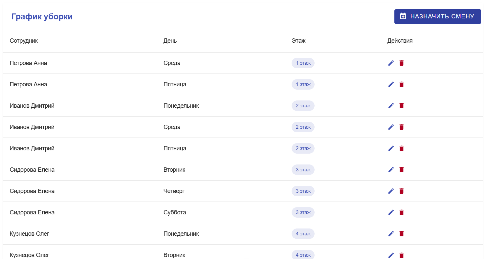{ width=80% }

##### 4.3.7. Аналитические отчеты (`ReportsView`)

Модуль для работы с данными.

- **Квартальный отчет:** Интерфейс запрашивает агрегированные данные у бэкенда (`/api/analytics/?type=quarterly_report`) и отображает финансовые показатели.

- **Инфо-запросы:** Отдельная вкладка для выполнения специфических поисковых запросов (поиск соседей, проверка уборщиков).

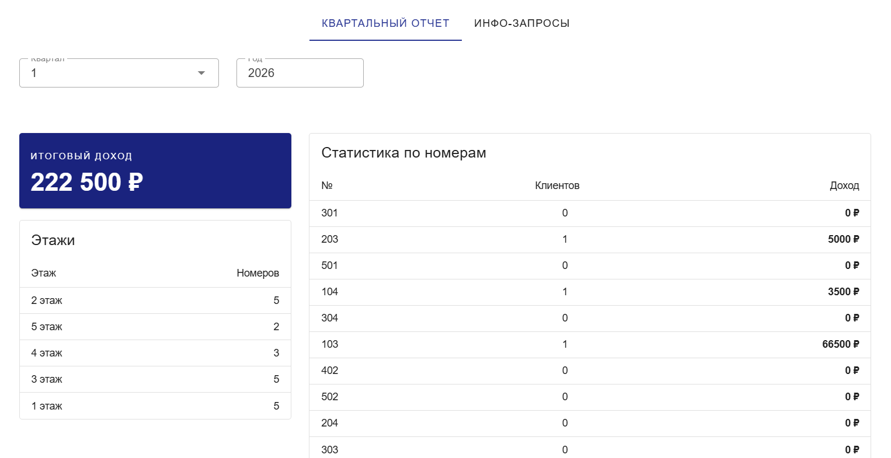{ width=80% }

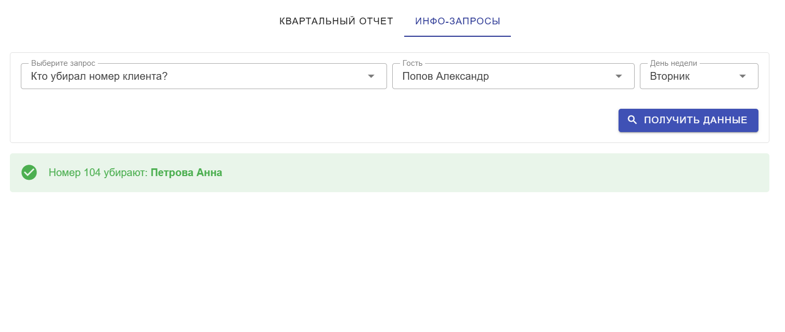{ width=80% }

---

### 5. Инструкция по установке и запуску

> **Важно:** Для корректной работы приложения необходимо, чтобы серверная часть (Django REST Framework из Лабораторной работы №3) была запущена параллельно и доступна по адресу http://127.0.0.1:8000.


Для запуска фронтенд-приложения на локальной машине необходимо выполнить следующие действия. Убедитесь, что у вас установлен Node.js (версии 16 или выше) и пакетный менеджер npm.

1. **Подготовка окружения:**

    Перейдите в директорию с исходным кодом клиентской части:

    ```bash
    cd hotel-frontend
    ```

2. **Установка зависимостей:** 

    Выполните команду для скачивания и установки всех необходимых библиотек, указанных в package.json (Vue, Vuetify, Axios, Vue Router и др.):

    ```
    npm install
    ```

3. **Запуск в режиме разработки:**

    Запустите локальный сервер разработки. По умолчанию приложение будет доступно по адресу `http://localhost:5173`.

    ```
    npm run dev
    ```

### Заключение

В результате выполнения лабораторной работы успешно реализована клиентская часть информационной системы администратора гостиницы на базе Vue 3 и Vuetify. В приложении настроена надежная система авторизации, реализована сложная бизнес-логика (валидация, авторасчеты), а также обеспечено бесшовное взаимодействие с серверным API для получения аналитических отчетов. Разработанный интерфейс обладает высокой интерактивностью и полностью соответствует предметной области.
