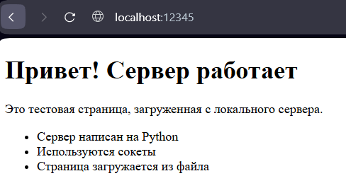
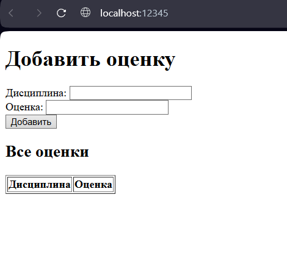
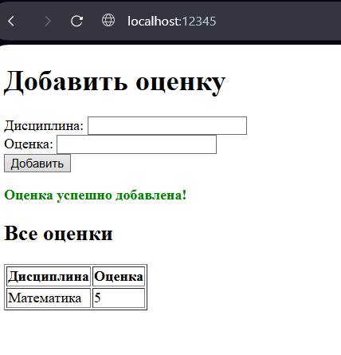

# Отчет по лабораторной работе №1

> **Выполнил:** Христофоров Владислав Николаевич, K3340, WEB 2.3

---

## Задание 1: Клиент-серверное приложение (UDP)

### Описание задания

> Реализовать клиентскую и серверную часть приложения. Клиент отправляет серверу сообщение «Hello, server», и оно должно отобразиться на стороне сервера. В ответ сервер отправляет клиенту сообщение «Hello, client», которое должно отобразиться у клиента.

### Краткое описание реализации

Разработаны UDP-сервер и UDP-клиент. Сервер ожидает датаграммы на определенном порту, а клиент отправляет датаграмму и ожидает ответ. Использован протокол UDP, который не требует установления соединения.

### Код

#### Сервер (udp_server.py)

```python
import socket

HOST = 'localhost'
PORT = 12345
BUFFER_SIZE = 1024

def main():
    with socket.socket(socket.AF_INET, socket.SOCK_DGRAM) as s:
        s.bind((HOST, PORT))
        print(f"UDP сервер запущен на {HOST}:{PORT}")

        try:
            while True:
                data, client_addr = s.recvfrom(BUFFER_SIZE)
                print(f"Получены данные от {client_addr}: {data.decode('utf-8')}")
                reply = "Hello, client!"
                s.sendto(reply.encode('utf-8'), client_addr)
                print(f"Отправлено сообщение '{reply}' клиенту {client_addr}")
        except KeyboardInterrupt:
            print("UDP сервер остановлен")

if __name__ == "__main__":
    main()
```

#### Клиент (udp_client.py)

```python
import socket

HOST = 'localhost'
PORT = 12345
BUFFER_SIZE = 1024

def main():
    with socket.socket(socket.AF_INET, socket.SOCK_DGRAM) as s:
        s.settimeout(2.0)

        try:
            msg = "Hello, server!"
            s.sendto(msg.encode('utf-8'), (HOST, PORT))
            print(f"Отправлено сообщение '{msg}' серверу {HOST}:{PORT}")

            data, address = s.recvfrom(BUFFER_SIZE)
            print(f"Получен ответ от {address}: {data.decode('utf-8')}")
        except ConnectionResetError:
            print("Соединение разорвано")
        except TimeoutError:
            print("Нет ответа от сервера")

if __name__ == "__main__":
    main()
```

### Пояснение

**Ключевые элементы кода и их назначение:**

```python
# Создание UDP-сокета
socket.socket(socket.AF_INET, socket.SOCK_DGRAM)
```

-   `socket.AF_INET` - использование IPv4 адресации
-   `socket.SOCK_DGRAM` - указание на протокол UDP (датаграммы)

```python
# Сервер привязывается к порту для получения сообщений
s.bind((HOST, PORT))
```

```python
# Получение данных и адреса отправителя
data, client_addr = s.recvfrom(BUFFER_SIZE)
```

-   `recvfrom()` возвращает как данные, так и адрес отправителя
-   Это позволяет ответить конкретному клиенту

```python
# Отправка ответа конкретному адресу
s.sendto(reply.encode('utf-8'), client_addr)
```

-   В UDP нет постоянного соединения, поэтому каждый раз указываем адрес получателя

**Как это работает**:

Сервер "слушает" на определенном порту. Когда приходит датаграмма, он извлекает данные и адрес отправителя, затем отправляет ответ на этот адрес. Клиент отправляет сообщение и ждет ответ на тот же сокет.

### Примеры работы

**Запуск сервера:**

```
UDP сервер запущен на localhost:12345
Получены данные от ('127.0.0.1', 51049): Hello, server!
Отправлено сообщение 'Hello, client!' клиенту ('127.0.0.1', 51049)
```

**Запуск клиента:**

```
Отправлено сообщение 'Hello, server!' серверу localhost:12345
Получен ответ от ('127.0.0.1', 12345): Hello, client!
```

---

## Задание 2: Клиент-серверное приложение (TCP) с математической операцией

### Описание задания

> Реализовать клиентскую и серверную часть приложения. Клиент запрашивает выполнение математической операции, параметры которой вводятся с клавиатуры. Сервер обрабатывает данные и возвращает результат клиенту.
>
> _Вариант 2: Решение квадратного уравнения._

### Краткое описание реализации

Использован протокол TCP, который требует установления соединения. Сервер прослушивает порт, принимает соединения и обрабатывает каждое соединение. Реализована полная обработка квадратного уравнения с учетом всех особых случаев.

### Код

#### Сервер (tcp_server.py)

```python
from math import sqrt
import socket

HOST = 'localhost'
PORT = 12345
BUFFER_SIZE = 1024

def solve_equation(a, b, c):
    if a == 0:
        if b == 0:
            if c == 0:
                return "Уравнение имеет бесконечное количество решений"
            else:
                return "Уравнение не имеет решений"
        else:
            x = -c / b
            return f"Это линейное уравнение. Корень: x = {x:.2f}"

    D = b**2 - 4 * a * c

    if D < 0:
        return "У уравнения нет действительных корней"
    elif D == 0:
        x = -b / (2 * a)
        return f"Уравнение имеет один корень: x = {x:.2f}"
    else:
        x_1 = (-b - sqrt(D)) / (2 * a)
        x_2 = (-b + sqrt(D)) / (2 * a)
        return f"Уравнение имеет два корня: x₁ = {x_1:.2f}, x₂ = {x_2:.2f}"


def main():
    with socket.socket(socket.AF_INET, socket.SOCK_STREAM) as s:
        s.setsockopt(socket.SOL_SOCKET, socket.SO_REUSEADDR, 1)
        s.bind((HOST, PORT))
        s.listen(5)
        print(f"TCP сервер запущен на {HOST}:{PORT}")

        while True:
            try:
                conn, client_addr = s.accept()
                print(f"Соединение от {client_addr}")

                with conn:
                    data = conn.recv(BUFFER_SIZE)
                    if not data:
                        continue

                    try:
                        values = data.decode("utf-8").split()
                        if len(values) != 3:
                            error_msg = "Ошибка: требуется 3 коэффициента (a b c)"
                            conn.sendall(error_msg.encode("utf-8"))
                            continue

                        a, b, c = map(float, values)
                        result = solve_equation(a, b, c)
                        conn.sendall(result.encode("utf-8"))

                    except ValueError:
                        error_msg = "Ошибка: все коэффициенты должны быть числами"
                        conn.sendall(error_msg.encode("utf-8"))
                    except Exception as e:
                        error_msg = f"Ошибка обработки: {str(e)}"
                        conn.sendall(error_msg.encode("utf-8"))

            except KeyboardInterrupt:
                print("Сервер остановлен")
                break
            except Exception as e:
                print(f"Ошибка сервера: {e}")
                continue

if __name__ == "__main__":
    main()
```

#### Клиент (tcp_client.py)

```python
import socket

HOST = 'localhost'
PORT = 12345
BUFFER_SIZE = 1024

def get_equation_coef(coef):
    while True:
        try:
            value = input(coef).strip().replace(",", ".")
            return float(value)
        except ValueError:
            print("Ошибка: введите число!")

def main():
    print("Решение квадратного уравнения: ax² + bx + c = 0\n")

    a = get_equation_coef("Введите коэффициент a: ")
    b = get_equation_coef("Введите коэффициент b: ")
    c = get_equation_coef("Введите коэффициент c: ")

    with socket.socket(socket.AF_INET, socket.SOCK_STREAM) as s:
        try:
            s.settimeout(10.0)
            s.connect((HOST, PORT))

            message = f"{a} {b} {c}"
            s.sendall(message.encode("utf-8"))

            data = s.recv(BUFFER_SIZE)
            response = data.decode("utf-8")
            print(f"\nРезультат: {response}")

        except ConnectionRefusedError:
            print("Ошибка: не удалось подключиться к серверу")
        except socket.timeout:
            print("Ошибка: превышено время ожидания ответа от сервера")
        except ConnectionResetError:
            print("Ошибка: соединение было разорвано сервером")
        except Exception as e:
            print(f"Произошла ошибка: {e}")

if __name__ == "__main__":
    main()
```

### Пояснение

**Ключевые элементы кода и их назначение:**

```python
# Создание TCP-сокета
socket.socket(socket.AF_INET, socket.SOCK_STREAM)
```

-   `socket.SOCK_STREAM` - указание на протокол TCP (потоковая передача)

```python
# Сервер переходит в режим прослушивания
s.listen(5)
```

-   Сервер готов принимать входящие соединения
-   Число 5 - максимальная длина очереди ожидающих соединений

```python
# Принятие входящего соединения
conn, client_addr = s.accept()
```

-   `accept()` блокирует выполнение до подключения клиента
-   Возвращает новый сокет `conn` для общения с этим клиентом

```python
# Клиент устанавливает соединение
s.connect((HOST, PORT))
```

-   Клиент активно устанавливает соединение с сервером

```python
# Надежная отправка всех данных
conn.sendall(result.encode("utf-8"))
```

-   `sendall()` гарантирует отправку всех данных, в отличие от send()

### Примеры работы

**Сервер:**

```
TCP сервер запущен на localhost:12345
Соединение от ('127.0.0.1', 55140)
```

**Клиент:**

```
Решение квадратного уравнения: ax² + bx + c = 0

Введите коэффициент: a = 1
Введите коэффициент: b = -3
Введите коэффициент: c = 2

Результат: Уравнение имеет два корня: x₁ = 1.00, x₂ = 2.00
```

---

## Задание 3: HTTP-сервер с загрузкой HTML-страницы

### Описание задания

> Реализовать серверную часть приложения. Клиент подключается к серверу, и в ответ получает HTTP-сообщение, содержащее HTML-страницу, которая сервер подгружает из файла index.html.

### Краткое описание реализации

Создан простой HTTP-сервер, который читает HTML-файл и отправляет его с корректными HTTP-заголовками. Сервер обрабатывает GET-запросы и возвращает статическую HTML-страницу.

### Код

#### Сервер (http_server.py)

```python
import socket
import os

HOST = 'localhost'
PORT = 12345
BUFFER_SIZE = 1024

def main():
    script_dir = os.path.dirname(os.path.abspath(__file__))
    html_path = os.path.join(script_dir, "index.html")

    if not os.path.exists(html_path):
        print(f"Ошибка: файл {html_path} не найден")
        return

    with socket.socket(socket.AF_INET, socket.SOCK_STREAM) as s:
        s.setsockopt(socket.SOL_SOCKET, socket.SO_REUSEADDR, 1)
        s.bind((HOST, PORT))
        s.listen(5)

        print(f"Сервер запущен на {HOST}:{PORT}")

        try:
            while True:
                conn, addr = s.accept()

                with conn:
                    conn.recv(BUFFER_SIZE)

                    with open(html_path, 'r', encoding='utf-8') as f:
                        html_content = f.read()

                    response = (
                        "HTTP/1.1 200 OK\r\n"
                        "Content-Type: text/html; charset=utf-8\r\n"
                        f"Content-Length: {len(html_content.encode('utf-8'))}\r\n"
                        "\r\n"
                        f"{html_content}"
                    )

                    conn.sendall(response.encode('utf-8'))

                    print(f"Отправлена страница клиенту {addr[0]}")

        except KeyboardInterrupt:
            print("\nСервер остановлен")

if __name__ == "__main__":
    main()
```

#### Файл index.html

```html
<!DOCTYPE html>
<html>
    <head>
        <meta charset="UTF-8" />
        <title>Простой сервер</title>
    </head>
    <body>
        <h1>Привет! Сервер работает</h1>
        <p>Это тестовая страница, загруженная с локального сервера.</p>
        <ul>
            <li>Сервер написан на Python</li>
            <li>Используются сокеты</li>
            <li>Страница загружается из файла</li>
        </ul>
    </body>
</html>
```

### Пояснение

**Ключевые элементы кода и их назначение:**

```python
# Определение пути к HTML-файлу
script_dir = os.path.dirname(os.path.abspath(__file__))
html_path = os.path.join(script_dir, "index.html")
```

-   Получение абсолютного пути к файлу независимо от расположения скрипта

```python
# Формирование HTTP-ответа
response = (
    "HTTP/1.1 200 OK\r\n"
    "Content-Type: text/html; charset=utf-8\r\n"
    f"Content-Length: {len(html_content.encode('utf-8'))}\r\n"
    "\r\n"
    f"{html_content}"
)
```

-   `HTTP/1.1 200 OK` - строка статуса
-   `Content-Type` - тип содержимого (HTML) и кодировка
-   `Content-Length` - размер содержимого в байтах
-   Пустая строка `\r\n` разделяет заголовки и тело ответа
-   `html_content` - собственно HTML-страница

```python
# Чтение HTML-файла
with open(html_path, 'r', encoding='utf-8') as f:
    html_content = f.read()
```

-   Файл читается с указанием кодировки UTF-8 для корректного отображения русских символов

### Примеры работы

**Сервер:**

```
Сервер запущен на localhost:12345
Отправлена страница клиенту 127.0.0.1
```

**В браузере по адресу http://localhost:12345:**  


---

## Задание 4: Многопользовательский чат

### Описание задания

> Реализовать двухпользовательский или многопользовательский чат. Для максимального количества баллов реализуйте многопользовательский чат

### Краткое описание реализации

Разработаны сервер и клиенты с использованием потоков. Сервер обрабатывает каждого клиента в отдельном потоке, обеспечивает рассылку сообщений и управление списком подключенных пользователей.

### Код

#### Сервер (chat_server.py)

```python
import socket
import threading

HOST = "localhost"
PORT = 12345

clients = {}
lock = threading.Lock()

def broadcast(message, sender_conn=None):
    """Отправляет сообщение всем клиентам кроме отправителя"""
    with lock:
        clients_copy = clients.copy()

    disconnected = []
    for conn, nickname in clients_copy.items():
        if conn != sender_conn:
            try:
                conn.send(f"{message}\n".encode())
            except:
                disconnected.append(conn)

    if disconnected:
        with lock:
            for conn in disconnected:
                if conn in clients:
                    del clients[conn]

def handle_client(conn, addr):
    """Обрабатывает подключение одного клиента"""
    nickname = f"user_{addr[1]}"

    try:
        conn.send("Введите ваш никнейм: ".encode())
        nickname_data = conn.recv(1024).decode().strip()

        if nickname_data:
            nickname = nickname_data

        with lock:
            clients[conn] = nickname

        print(f"Клиент {nickname} подключился")
        broadcast(f"{nickname} присоединился к чату!")
        conn.send("Вы в чате! Команды: /list, /quit\n".encode())

        while True:
            message = conn.recv(1024).decode().strip()

            if not message:
                break

            print(f"Получено от {nickname}: {message}")

            if message == "/quit":
                conn.send("До свидания!\n".encode())
                print(f"Клиент {nickname} вышел по команде")
                break
            elif message == "/list":
                with lock:
                    users = ", ".join(clients.values())
                conn.send(f"Участники чата: {users}\n".encode())
            else:
                broadcast(f"{nickname}: {message}", conn)

    except Exception as e:
        print(f"Ошибка с клиентом {nickname}: {e}")
    finally:
        with lock:
            if conn in clients:
                del clients[conn]
                print(f"Клиент {nickname} удален из списка")

        broadcast(f"{nickname} покинул чат")

        try:
            conn.close()
        except:
            pass

def main():
    with socket.socket(socket.AF_INET, socket.SOCK_STREAM) as server:
        server.setsockopt(socket.SOL_SOCKET, socket.SO_REUSEADDR, 1)
        server.bind((HOST, PORT))
        server.listen()

        print(f"Чат-сервер запущен на {HOST}:{PORT}")

        try:
            while True:
                conn, addr = server.accept()
                print(f"Новое подключение от {addr}")
                thread = threading.Thread(target=handle_client, args=(conn, addr))
                thread.daemon = True
                thread.start()
        except KeyboardInterrupt:
            print("\nСервер остановлен")
        except Exception as e:
            print(f"Ошибка сервера: {e}")

if __name__ == "__main__":
    main()
```

#### Клиент (chat_client.py)

```python
import socket
import threading
import time

HOST = "localhost"
PORT = 12345

def receive_messages(sock):
    """Получает сообщения от сервера"""
    while True:
        try:
            message = sock.recv(1024).decode()
            if not message:
                print("\nСервер закрыл соединение")
                break
            print(message, end="")
        except:
            break

def main():
    try:
        with socket.socket(socket.AF_INET, socket.SOCK_STREAM) as client:
            client.connect((HOST, PORT))

            receiver = threading.Thread(target=receive_messages, args=(client,))
            receiver.daemon = True
            receiver.start()

            print("Подключение к чату установлено!")

            try:
                while True:
                    message = input()

                    if message.strip() == "/quit":
                        client.send(b"/quit\n")
                        time.sleep(0.1)
                        break
                    else:
                        client.send(f"{message}\n".encode())

            except KeyboardInterrupt:
                print("\nВыход из чата...")
                client.send(b"/quit\n")
                time.sleep(0.1)

    except ConnectionRefusedError:
        print("Не удалось подключиться к серверу")
    except Exception as e:
        print(f"Ошибка: {e}")

if __name__ == "__main__":
    main()
```

### Пояснение

**Ключевые элементы кода и их назначение:**

```python
# Словарь для хранения подключенных клиентов
clients = {}
lock = threading.Lock()
```

-   `clients` - хранит соединения и соответствующие им никнеймы
-   `lock` - обеспечивает потокобезопасность при работе с общими данными

```python
# Функция рассылки сообщений
def broadcast(message, sender_conn=None):
    with lock:
        clients_copy = clients.copy()

    for conn, nickname in clients_copy.items():
        if conn != sender_conn:
            try:
                conn.send(f"{message}\n".encode())
            except:
                # Удаляем отключившегося клиента
                pass
```

-   Создается копия словаря клиентов для безопасности во время итерации
-   Сообщение отправляется всем, кроме отправителя
-   Обработка ошибок отправки (клиент отключился)

```python
# Обработка клиента в отдельном потоке
def handle_client(conn, addr):
    # Получение никнейма
    conn.send("Введите ваш никнейм: ".encode())
    nickname = conn.recv(1024).decode().strip()

    # Добавление в список клиентов
    with lock:
        clients[conn] = nickname

    # Основной цикл обработки сообщений
    while True:
        message = conn.recv(1024).decode().strip()

        if not message or message == "/quit":
            break
        elif message == "/list":
            # Отправка списка участников
            pass
        else:
            # Рассылка сообщения всем
            broadcast(f"{nickname}: {message}", conn)
```

```python
# Запуск потока для каждого клиента
thread = threading.Thread(target=handle_client, args=(conn, addr))
thread.daemon = True
thread.start()
```

-   Каждое новое соединение обрабатывается в отдельном потоке
-   `daemon=True` позволяет потокам автоматически завершаться при остановке программы

### Примеры работы

**Сервер:**

```
Чат-сервер запущен на localhost:12345
```

**Клиент 1:**

```
Подключение к чату установлено!
Введите ваш никнейм: Moon
Moon присоединился к чату!
Вы в чате! Команды: /list, /quit
Sun присоединился к чату!
Привет
Sun: Приветствую
November присоединился к чату!
November: Всем дарова
Ку
November покинул чат
```

**Клиент 2:**

```
Подключение к чату установлено!
Введите ваш никнейм: Sun
Sun присоединился к чату!
Вы в чате! Команды: /list, /quit
Moon: Привет
Приветствую
November присоединился к чату!
November: Всем дарова
Moon: Ку
November покинул чат
```

**Клиент 3:**

```
Подключение к чату установлено!
Введите ваш никнейм: November
November присоединился к чату!
Вы в чате! Команды: /list, /quit
Всем дарова
Moon: Ку
/list
Участники чата: Moon, Sun, November
/quit
До свидания!

Сервер закрыл соединение
```

---

## Задание 5: Веб-сервер для обработки GET и POST запросов

### Описание задания

> Написать простой веб-сервер для обработки GET и POST HTTP-запросов с помощью библиотеки socket в Python.
>
> Задание:
>
> Сервер должен:
>
> -   Принять и записать информацию о дисциплине и оценке по дисциплине.
> -   Отдать информацию обо всех оценках по дисциплинам в виде HTML-страницы.

### Краткое описание реализации

Реализован HTTP-сервер, обрабатывающий GET и POST запросы. При GET запросе возвращается форма для ввода данных и таблица существующих оценок. При POST запросе данные добавляются в хранилище и отображается обновленная страница.

### Код

#### Сервер (get_post_server.py)

```python
import socket
from urllib.parse import unquote_plus

HOST = "localhost"
PORT = 12345

grades = {}

def handle_request(conn):
    """Обрабатывает HTTP запрос"""
    try:
        request_data = b""
        conn.settimeout(2.0)

        # Сначала читаем заголовки
        while b"\r\n\r\n" not in request_data:
            chunk = conn.recv(4096)
            if not chunk:
                break
            request_data += chunk

        # Если это POST запрос, читаем тело до конца
        if request_data.startswith(b"POST"):
            headers = request_data.split(b"\r\n\r\n")[0]
            content_length = 0
            for line in headers.split(b"\r\n"):
                if line.lower().startswith(b"content-length:"):
                    content_length = int(line.split(b":")[1].strip())
                    break

            body_start = request_data.find(b"\r\n\r\n") + 4
            current_body_length = len(request_data) - body_start

            while current_body_length < content_length:
                chunk = conn.recv(4096)
                if not chunk:
                    break
                request_data += chunk
                current_body_length = len(request_data) - body_start

        request = request_data.decode('utf-8', errors='ignore')

        # Обрабатываем POST запрос
        post_success = False
        if request.startswith("POST") and "\r\n\r\n" in request:
            body = request.split("\r\n\r\n", 1)[1]
            parts = body.split("&")
            subject = ""
            grade = ""
            for part in parts:
                if part.startswith("subject="):
                    subject = unquote_plus(part[8:], encoding='utf-8')
                elif part.startswith("grade="):
                    grade = unquote_plus(part[6:], encoding='utf-8')

            if subject and grade:
                grades[subject] = grade
                post_success = True
                print(f"Добавлена оценка: {subject} - {grade}")

        # Генерируем HTML страницу
        rows = ""
        for subject, grade in grades.items():
            rows += f"<tr><td>{subject}</td><td>{grade}</td></tr>"

        success_msg = ""
        if post_success:
            success_msg = '<p style="color: green; font-weight: bold;">Оценка успешно добавлена!</p>'

        html_content = f"""<!DOCTYPE html>
            <html>
            <head>
                <meta charset="UTF-8">
                <title>Оценки по дисциплинам</title>
            </head>
            <body>
                <h1>Добавить оценку</h1>
                <form method="POST">
                    Дисциплина: <input type="text" name="subject" required><br>
                    Оценка: <input type="text" name="grade" required><br>
                    <input type="submit" value="Добавить">
                </form>

                {success_msg}

                <h2>Все оценки</h2>
                <table border="1">
                    <tr><th>Дисциплина</th><th>Оценка</th></tr>
                    {rows}
                </table>
            </body>
            </html>"""

        # Формируем HTTP ответ
        response = f"HTTP/1.1 200 OK\r\n"
        response += "Content-Type: text/html; charset=utf-8\r\n"
        response += f"Content-Length: {len(html_content.encode('utf-8'))}\r\n"
        response += "\r\n"
        response += html_content

        conn.sendall(response.encode('utf-8'))
        print("Ответ успешно отправлен")

    except socket.timeout:
        print("Таймаут при чтении запроса")
    except Exception as e:
        print(f"Ошибка: {e}")
    finally:
        conn.close()

def main():
    """Запускает сервер"""
    with socket.socket(socket.AF_INET, socket.SOCK_STREAM) as server:
        server.setsockopt(socket.SOL_SOCKET, socket.SO_REUSEADDR, 1)
        server.bind((HOST, PORT))
        server.listen(5)

        print(f"Сервер запущен на http://{HOST}:{PORT}")

        try:
            while True:
                conn, addr = server.accept()
                print(f"Новое подключение от {addr[0]}:{addr[1]}")
                handle_request(conn)
        except KeyboardInterrupt:
            print("\nСервер остановлен")

if __name__ == "__main__":
    main()
```

### Пояснение

**Ключевые элементы кода и их назначение:**

```python
# Хранение данных об оценках
grades = {}
```

-   Простое хранилище в оперативной памяти

```python
# Обработка POST-запроса
if request.startswith("POST") and "\r\n\r\n" in request:
    body = request.split("\r\n\r\n", 1)[1]
    parts = body.split("&")
    subject = ""
    grade = ""
    for part in parts:
        if part.startswith("subject="):
            subject = unquote_plus(part[8:], encoding='utf-8')
        elif part.startswith("grade="):
            grade = unquote_plus(part[6:], encoding='utf-8')

    if subject and grade:
        grades[subject] = grade
```

-   Извлечение тела POST-запроса (после `\r\n\r\n`)
-   Разбор данных формы в формате `application/x-www-form-urlencoded`
-   `unquote_plus()` - декодирование URL-encoded данных (пробелы как + и т.д.)
-   Сохранение данных в словарь

```python
# Динамическая генерация HTML-таблицы
rows = ""
for subject, grade in grades.items():
    rows += f"<tr><td>{subject}</td><td>{grade}</td></tr>"
```

-   Создание HTML-строк таблицы на основе данных из словаря
-   Каждая пара "дисциплина-оценка" становится строкой таблицы

```python
# Форма для ввода данных
html_content = f"""
<form method="POST">
    Дисциплина: <input type="text" name="subject" required>
    Оценка: <input type="text" name="grade" required>
    <input type="submit" value="Добавить">
</form>
<table border="1">
    <tr><th>Дисциплина</th><th>Оценка</th></tr>
    {rows}
</table>
"""
```

-   HTML-форма с методом POST и обязательными полями
-   Динамически вставляемая таблица с текущими оценками
-   После отправки формы страница обновляется с новыми данными

### Примеры работы

**Сервер:**

```
Сервер запущен на http://localhost:12345
```

**В браузере по адресу http://localhost:12345:**

1. Отображается форма с полями "Дисциплина" и "Оценка"
   
2. После ввода "Математика" и "5" и нажатия "Добавить"
3. В таблице появляется строка "Математика - 5"
   
4. При добавлении новой оценки таблица автоматически обновляется

---

## Заключение

В результате выполнения лабораторной работы реализованы задания, демонстрирующие различные аспекты работы с сокетами:

1. **UDP** - работа с датаграммами без установления соединения
2. **TCP** - надежная передача данных с установлением соединения
3. **HTTP-сервер** - обработка протокола прикладного уровня
4. **Многопоточный чат** - одновременная работа с множеством клиентов
5. **GET/POST обработка** - веб-формы и динамическое содержимое
