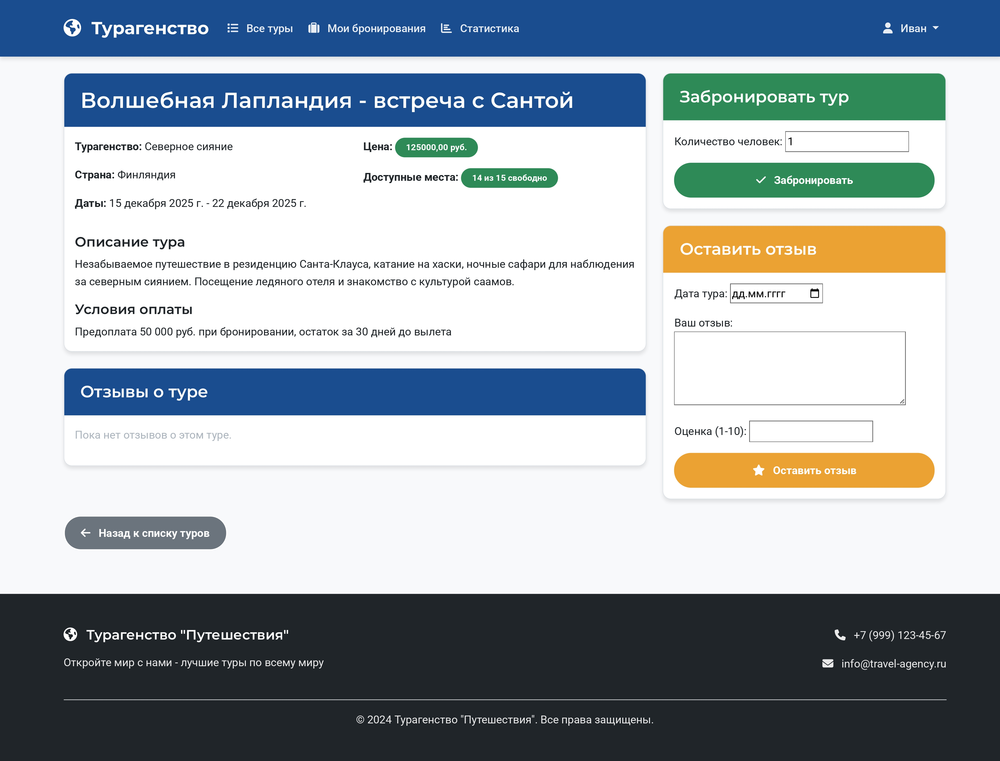
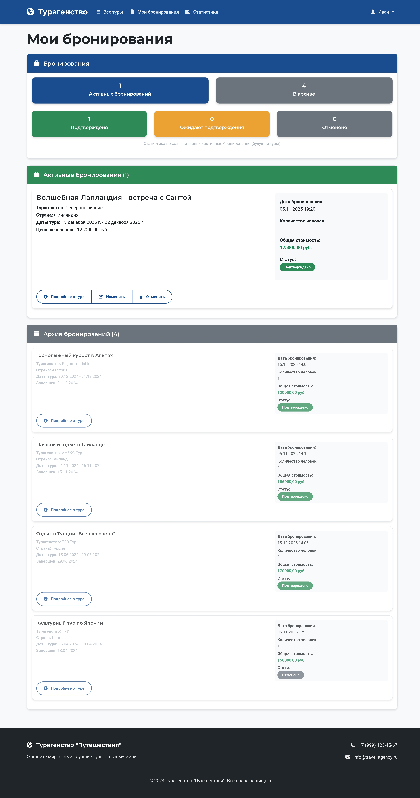
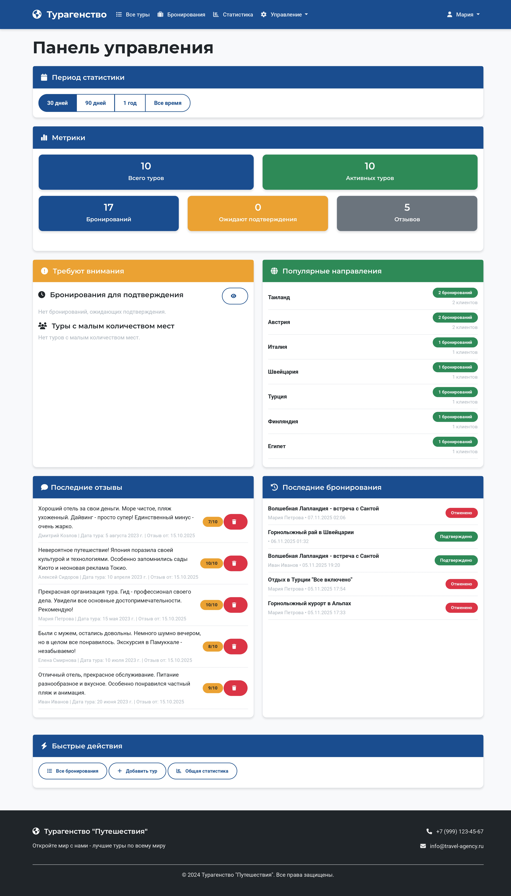
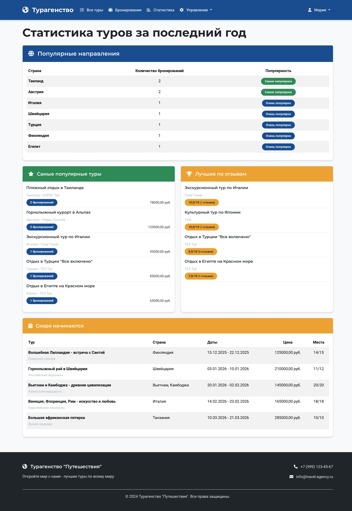

# Отчёт по лабораторной работе №2

# Реализация простого сайта средствами Django

> **Выполнил:** Христофоров Владислав Николаевич, K3340, WEB 2.3

---

## Задание

Вариант 4: Разработка сайта "Список туров туристической фирмы"

## Описание задания

Разработать веб-приложение для туристической фирмы со следующим функционалом:

-   Регистрация новых пользователей
-   Просмотр и бронирование туров с возможностью редактирования и удаления бронирований
-   Система отзывов о турах с рейтингом 1-10
-   Панель администратора для подтверждения бронирований
-   Статистика проданных туров по странам

## Кратко о выполнении

Было разработано Django-приложение с использованием PostgreSQL, реализующее частичный цикл работы туристического агентства. Приложение включает систему аутентификации, бронирования туров, управления пользователями и административную панель.

---

## Основные фрагменты кода

### 1. Модели данных (tour_app/models.py)

```python
class Tour(models.Model):
    title = models.CharField(max_length=200, verbose_name="Название тура")
    agency = models.CharField(max_length=200, verbose_name="Турагенство")
    description = models.TextField(verbose_name="Описание тура")
    country = models.CharField(max_length=100, verbose_name="Страна")
    start_date = models.DateField(verbose_name="Дата начала")
    end_date = models.DateField(verbose_name="Дата окончания")
    price = models.DecimalField(max_digits=10, decimal_places=2, verbose_name="Цена")
    payment_conditions = models.TextField(verbose_name="Условия оплаты")
    available_spots = models.IntegerField(verbose_name="Доступные места")

    @property
    def confirmed_bookings_count(self):
        return self.booking_set.filter(status='confirmed').count()

    def get_available_spots(self):
        total_booked = self.booking_set.filter(status__in=['pending', 'confirmed']).aggregate(
            total=models.Sum('persons')
        )['total'] or 0
        return self.available_spots - total_booked
```

**Объяснение:** Модель `Tour` представляет тур со всей необходимой информацией. Используется `@property` для вычисляемого поля `confirmed_bookings_count`, которое не сохраняется в БД, но доступно как атрибут. Метод `get_available_spots()` вычисляет реальное количество свободных мест с учетом подтвержденных бронирований.

---

### 2. Система бронирования (tour_app/models.py)

```python
class Booking(models.Model):
    STATUS_CHOICES = [
        ('pending', 'Ожидает подтверждения'),
        ('confirmed', 'Подтверждено'),
        ('cancelled', 'Отменено'),
    ]

    user = models.ForeignKey(settings.AUTH_USER_MODEL, on_delete=models.CASCADE, verbose_name="Пользователь")
    tour = models.ForeignKey(Tour, on_delete=models.CASCADE, verbose_name="Тур")
    booking_date = models.DateTimeField(auto_now_add=True, verbose_name="Дата бронирования")
    persons = models.IntegerField(default=1, verbose_name="Количество человек")
    status = models.CharField(max_length=20, choices=STATUS_CHOICES, default='pending', verbose_name="Статус")

    def clean(self):
        if self.persons <= 0:
            raise ValidationError('Количество человек должно быть положительным числом')
        if hasattr(self, 'tour') and self.tour:
            if not self.tour.can_book(self.persons):
                raise ValidationError(f'Недостаточно свободных мест. Доступно: {self.tour.get_available_spots()}')
```

**Объяснение:** Модель `Booking` управляет бронированиями с системой статусов. Метод `clean()` обеспечивает валидацию данных перед сохранением, проверяя корректность количества человек и доступность мест. Это встроенный механизм Django для проверки данных.

---

### 3. Представление списка туров (tour_app/views.py)

```python
class TourListView(ListView):
    model = Tour
    template_name = 'tour_app/tour_list.html'
    context_object_name = 'tours'
    paginate_by = 6

    def get_queryset(self):
        queryset = Tour.objects.filter(end_date__gte=timezone.now().date()).order_by('start_date')
        self.filterset = TourFilter(self.request.GET, queryset=queryset)
        return self.filterset.qs

    def get_context_data(self, **kwargs):
        context = super().get_context_data(**kwargs)
        context['filter'] = self.filterset
        # ... дополнительная логика для активных фильтров
        return context
```

**Объяснение:** Класс-представление `TourListView` наследуется от `ListView` и предоставляет список туров. Метод `get_queryset()` фильтрует только активные туры (с датой окончания в будущем) и применяет систему фильтрации. `get_context_data()` добавляет фильтры в контекст шаблона.

---

### 4. Система фильтрации (tour_app/filters.py)

```python
class TourFilter(django_filters.FilterSet):
    search = django_filters.CharFilter(
        method='filter_search',
        label='Поиск'
    )
    country = django_filters.CharFilter(
        field_name='country',
        lookup_expr='icontains',
        label='Страна'
    )

    def filter_search(self, queryset, name, value):
        return queryset.filter(
            models.Q(title__icontains=value) |
            models.Q(description__icontains=value) |
            models.Q(country__icontains=value) |
            models.Q(agency__icontains=value)
        )
```

**Объяснение:** Используется библиотека `django-filters` для создания системы фильтрации. Кастомный метод `filter_search()` позволяет искать по нескольким полям одновременно с помощью объектов `Q` Django, которые обеспечивают сложные запросы с оператором OR.

---

### 5. Панель управления администратора (tour_app/views.py)

```python
@login_required
@staff_required
def management_dashboard(request):
    period = request.GET.get('period', '30days')

    if period == '30days':
        date_filter = timezone.now() - timezone.timedelta(days=30)
    # ... логика выбора периода

    if date_filter:
        bookings = Booking.objects.filter(booking_date__gte=date_filter)
        tours = Tour.objects.filter(start_date__gte=date_filter)
        reviews = Review.objects.filter(review_date__gte=date_filter)

    booking_stats = bookings.aggregate(
        pending=Count('id', filter=Q(status='pending')),
        confirmed=Count('id', filter=Q(status='confirmed')),
        cancelled=Count('id', filter=Q(status='cancelled'))
    )
```

**Объяснение:** Представление для панели управления использует декораторы `@login_required` и `@staff_required` для ограничения доступа. Метод `aggregate()` с условиями `filter=Q()` позволяет получать агрегированные данные по разным статусам бронирований в одном запросе.

---

### 6. Статистика по странам (tour_app/views.py)

```python
@login_required
def statistics(request):
    one_year_ago = timezone.now() - timezone.timedelta(days=365)

    tours_by_country = Booking.objects.filter(
        status='confirmed',
        booking_date__gte=one_year_ago
    ).values('tour__country').annotate(
        total_sold=Count('id')
    ).order_by('-total_sold')
```

**Объяснение:** Этот код реализует требование задания по отображению статистики проданных туров по странам. Используется `values()` для группировки по странам и `annotate()` с `Count()` для подсчета количества бронирований в каждой группе.

---

### 7. Кастомная модель пользователя (user_app/models.py)

```python
class CustomUser(AbstractUser):
    phone = models.CharField(max_length=20, blank=True, verbose_name="Телефон")
    address = models.TextField(blank=True, verbose_name="Адрес")
    date_of_birth = models.DateField(null=True, blank=True, verbose_name="Дата рождения")

    def __str__(self):
        return f"{self.first_name} {self.last_name} ({self.username})"
```

**Объяснение:** Модель наследуется от `AbstractUser`, что позволяет расширить стандартную модель пользователя Django без изменения базовой логики аутентификации. Это рекомендуемый подход в Django для добавления дополнительных полей к пользователю.

---

### 8. Система разрешений (tour_app/decorators.py)

```python
def staff_required(view_func):
    @wraps(view_func)
    def _wrapped_view(request, *args, **kwargs):
        if request.user.is_authenticated and request.user.is_staff:
            return view_func(request, *args, **kwargs)
        else:
            messages.error(request, 'Требуются права администратора.')
            return redirect('tour_list')
    return _wrapped_view
```

**Объяснение:** Кастомный декоратор для проверки прав администратора. Использует `functools.wraps` для сохранения метаданных функции и интегрируется с системой сообщений Django для информирования пользователя.

---

## Примеры работы приложения

### 1. Главная страница - список туров


**Описание:** На главной странице отображается сетка карточек туров с основной информацией. Реализованы:

-   Фильтрация по стране и цене
-   Поиск по названию и описанию
-   Пагинация (по 6 туров на странице)
-   Отображение доступных мест и цен

### 2. Страница c деталями тура



**Описание:** Страница содержит полную информацию о туре, включая:

-   Даты проведения и условия оплаты
-   Форму бронирования с валидацией количества мест
-   Систему отзывов с рейтингом 1-10
-   Проверку авторизации для функционала бронирования

### 3. Бронирования пользователя



**Описание:** В личном кабинете пользователи видят:

-   Активные бронирования с статусами
-   Архив завершенных туров
-   Статистику по бронированиям
-   Возможность редактирования и отмены бронирований

### 4. Панель управления администратора



**Описание:** Администраторы имеют доступ к:

-   Общей статистике и метрикам
-   Управлению всеми бронированиями
-   Подтверждению/отклонению заявок
-   Просмотру туров с малым количеством мест

### 5. Статистика проданных туров



**Описание:** Реализована таблица, отображающая:

-   Количество проданных туров по странам за последний год
-   Рейтинг популярных туров
-   Список предстоящих туров
-   Лучшие туры по отзывам

---

## Заключение

В результате выполнения лабораторной работы успешно разработано функциональное веб-приложение для туристической фирмы, соответствующее всем требованиям задания. Приложение включает систему бронирования, управления пользователями, административную панель и статистические отчёты. Использованы подходы Django-разработки, включая классы-представления, систему фильтрации и кастомную модель пользователя.
