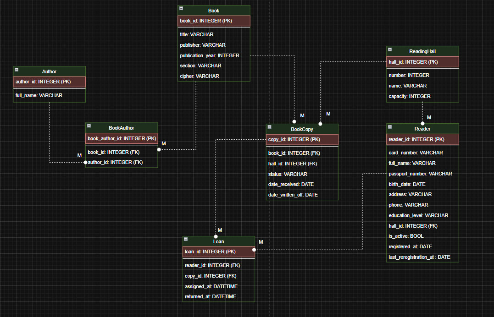

# Модели данных (Django ORM)

Ниже приведено описание всех моделей.

## Схема моделей

---

## Book (Книга)

| Поле | Тип | Описание |
|------|------|----------|
| title | CharField | Название книги |
| publisher | CharField | Издательство |
| publication_year | IntegerField | Год издания |
| section | CharField | Раздел |
| cipher | CharField | Шифр книги |
| is_active | Boolean | Книга активна / списана |

---

## Author (Автор)

| Поле | Тип |
|------|------|
| full_name | CharField |

M2M-связь через модель **BookAuthor**.

---

## ReadingHall (Читальный зал)

| Поле | Тип | |
|------|------|-----|
| number | Integer | Номер зала |
| name | CharField | Название |
| capacity | Integer | Вместимость |

---

## Reader (Читатель)

| Поле | Тип |
|------|------|
| card_number | CharField |
| full_name | CharField |
| passport_number | CharField |
| birth_date | Date |
| education_level | CharField |
| is_active | Boolean |
| hall | FK → ReadingHall |

---

## BookCopy (Экземпляр книги)

Каждая копия книги имеет:

- привязку к залу  
- статус: `available`, `on_loan`, `written_off`

| Поле | Тип |
|------|------|
| book | FK |
| hall | FK |
| status | CharField |

---

## Loan (Выдача книги)

| Поле | Тип |
|------|------|
| reader | FK |
| copy | FK |
| assigned_at | DateTime |
| returned_at | DateTime (nullable) |

---
