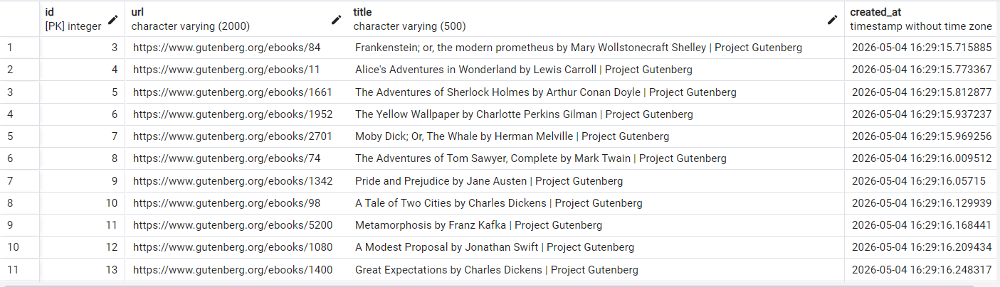

# Лабораторная работа 2. Потоки. Процессы. Асинхронность.

## Цель работы: 

Понять отличия между потоками и процессами и понять, что такое ассинхронность в Python.

## Задача 1. Различия между threading, multiprocessing и async в Python

**Задача**: Напишите три различных программы на Python, использующие каждый из подходов: threading, multiprocessing и async. Каждая программа должна решать считать сумму всех чисел от 1 до 10000000000000. Разделите вычисления на несколько параллельных задач для ускорения выполнения.

**Подробности задания:**

Напишите программу на Python для каждого подхода: threading, multiprocessing и async.
Каждая программа должна содержать функцию calculate_sum(), которая будет выполнять вычисления.
Для threading используйте модуль threading, для multiprocessing - модуль multiprocessing, а для async - ключевые слова async/await и модуль asyncio.
Каждая программа должна разбить задачу на несколько подзадач и выполнять их параллельно.
Замерьте время выполнения каждой программы и сравните результаты.

### Выполнение

Все три подхода были реализованы по одной схеме:

1. Диапазон от `1` до `N` разбивается на несколько частей.
2. Для каждой части создаётся отдельная задача:
   - поток для `threading`
   - процесс для `multiprocessing`
   - асинхронная задача для `asyncio`
3. Каждая задача вычисляет сумму своего диапазона.
4. После завершения всех задач частичные суммы складываются в общий результат.

### Результаты:

| Подход          | Время выполнения (сек) |
|-----------------|------------------------|
| Threading       | threads=8 time=0.011124s              |
| Multiprocessing | procs=6 time=1.155195s                |
| Async           | tasks=8 time=0.000589s                       |

**Вывод**:

В этом эксперименте мы вычислили сумму чисел от 1 до N = 10 000 000 000 000 000, разделив диапазон на части и суммировав
каждую часть с помощью формулы арифметических рядов.
((start + end) * count // 2)

Поскольку эта формула работает постоянное время для каждой под выборки, фактический вычислительный процесс внутри каждой
задачи крайне мал, а общее время выполнения определяется главным образом накладными затратами выбранного подхода.

Результаты измерений показывают, что:

Asyncio (0,000589 s) был самым быстрым, потому что создание и планирование асинхронных задач требует очень низких 
накладных расходов, а задачи выполняются почти мгновенно.

Threading (0,011124 с) оказался медленнее Asyncio, потому что создание и присоединение потоков операционной системы 
добавляет заметную перегрузку. Кроме того, для работы с процессором потоки Python не обеспечивают реального 
параллельного выполнения из-за GIL, поэтому они здесь не приносят никакой пользы.

Multiprocessing (1,155195 с) была намного медленнее, потому что запуск/использование отдельных процессов и передача 
данных между ними является дорогим. Поскольку каждая подзадача выполняет только несколько арифметических операций, 
накладные затраты намного больше, чем сам вычислительный процесс.

Следовательно, при математическом решении O(1) параллелизование не требуется: наилучшая производительность возникает 
из подхода с минимальными затратами на планирование (Asyncio), в то время как Multiprocessing является худшей из-за 
высоких затрат на управление процессом. Multiprocessing станет выгодной только в том случае, если каждая подзадача 
будет выполнять тяжёлые вычисления ЦПУ (например, реальный цикл или сложные расчеты).

## Задача 2 Параллельный парсинг веб-страниц с сохранением в базу данных. Различия между threading, multiprocessing и async в Python

**Задача**: Напишите программу на Python для параллельного парсинга нескольких веб-страниц с сохранением данных в базу 
данных с использованием подходов threading, multiprocessing и async. Каждая программа должна парсить информацию с 
нескольких веб-сайтов, сохранять их в базу данных.

**Подробности задания:**

Напишите три различных программы на Python, использующие каждый из подходов: threading, multiprocessing и async.
Каждая программа должна содержать функцию parse_and_save(url), которая будет загружать HTML-страницу по указанному URL, парсить ее, сохранять заголовок страницы в базу данных и выводить результат на экран.
Используйте базу данных из лабораторной работы номер 1 для заполенния ее данными. Если Вы не понимаете, какие таблицы и откуда Вы могли бы заполнить с помощью парсинга, напишите преподавателю в общем чате потока.
Для threading используйте модуль threading, для multiprocessing - модуль multiprocessing, а для async - ключевые слова async/await и модуль aiohttp для асинхронных запросов.
Создайте список нескольких URL-адресов веб-страниц для парсинга и разделите его на равные части для параллельного парсинга.
Запустите параллельный парсинг для каждой программы и сохраните данные в базу данных.
Замерьте время выполнения каждой программы и сравните результаты.

### Выполнение:

Для сохранения URL и заголовков, была добавлена таблица:
```python
class ParsedPage(SQLModel, table=True):
    __tablename__ = "parsed_pages"
    id: Optional[int] = Field(default=None, primary_key=True)
    url: str = Field(index=True, nullable=False, max_length=2000)
    title: str = Field(nullable=False, max_length=500)
    created_at: datetime = Field(default_factory=datetime.utcnow)
```

Установка необходимых зависимостей
```bash
pip install beautifulsoup4 lxml requests aiohttp
```

Реализация парсера:

Для парсера мы используем готовую библиотеку BeautifulSoup, которая преобразует HTML в удобную структуру для извлечения 
данных. Мы будем извлекать book title, author, description из 25 книг, url которых находится в файле `urls_25.py`.

Реализация различных подходов:

| Подход          | Описание                                                                | Время выполнения (сек) |
|-----------------|-------------------------------------------------------------------------|------------------|
| Threading       | Использует потоки для параллельного выполнения задач. Я использлвала 5. | 5.86s            |
| Multiprocessing | Использует процессы для параллельного выполнения задач. Я использовала 5. | 8.73s            |
| Async           | Использует асинхронные задачи для параллельного выполнения. Я использовала 5. | 2.89s            |

Результаты парсинга можно посмотреть в файлах:
- `thread_results.txt`
- `mp_results.txt`
- `async_results.txt`

Использование парсера для заполнения таблицы Book в базе данных:

Для заполнения базы данных я использовала async подход, так как он самый быстрый. И с 8 задачами он справился за
2.45 секунд.

Таблица `parsed_pages`:



Таблица `books`:


### Вывод

В этой лабораторной работе мы реализовали параллельный анализ нескольких веб-страниц и сохранение извлеченной информации
в файл с использованием трех подходов: hreading, multiprocessing, и asyncio.

Результаты:

- Threading (5 threads): 5.86 s
- Multiprocessing (5 processes): 8.73 s
- Asyncio (5 tasks): 2.89 s

Результаты показывают, что Asyncio является самым быстрым подходом для этой задачи. Это происходит потому, что 
обработка веб-страниц в основном является рабочей нагрузкой, связанной с I/O: большую часть времени тратят на ожидание 
сетевых ответов. Асинхронные запросы позволяют эффективно совмещать время ожидания с очень низкими накладными расходами,
поэтому несколько страниц могут загружаться одновременно без создания потоков или процессов операционной системы.

Подход, основанный на потоках, дал умеренный результат. Потоки могут улучшать производительность для операций, 
связанных с I/O, потому что сетевое ожидание выпускает GIL, но создание потоков и планирование добавляют дополнительные
затраты, поэтому скорость ограничена по сравнению с Asyncio.

Подход Multiprocessing был самым медленным. Хотя Multiprocessing полезна для задач, связанных с процессором, для 
веб-анализа он создает значительные накладные расходы из-за создания процессов, управления между процессами и отдельных
пространств памяти. Поскольку основным узким местом является сетевой I/O, а не вычисления процессора, это перевес 
перевешивает любые выгоды.

В целом, для параллельного анализа и сохранения результатов веб-страниц asyncio является наиболее эффективным решением,
Threading приемлем, а Multiprocessing неэффективна для этой задачи, ориентированной на ввод/вывод.