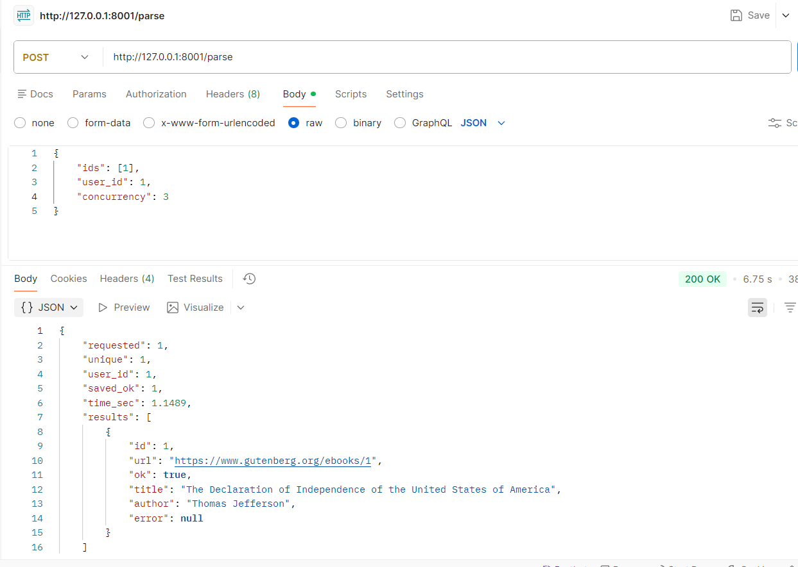
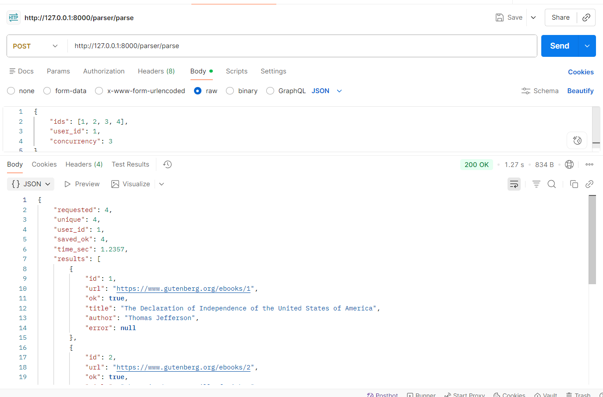
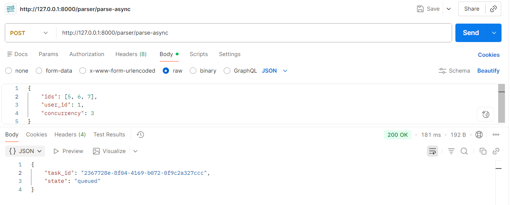
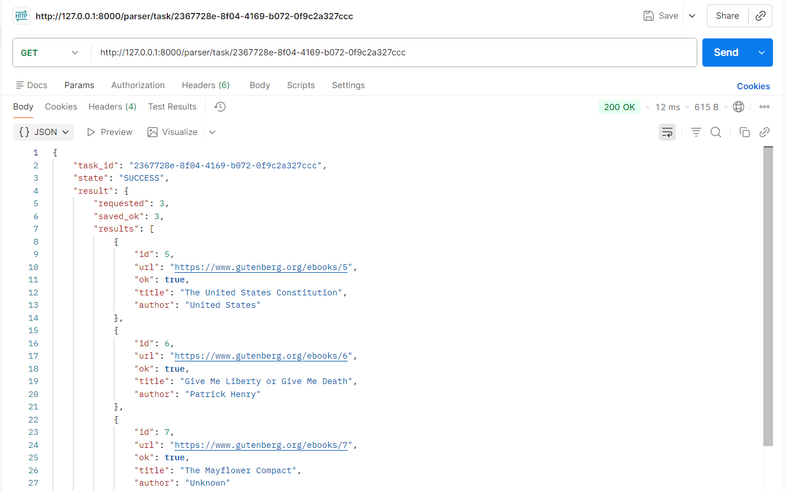

# Лабораторная работа 3. Упаковка FastAPI приложения в Docker, Работа с источниками данных и Очереди

## Цель работы: 

Научиться упаковывать FastAPI приложение в Docker, интегрировать парсер данных с базой данных и вызывать парсер через 
API и очередь.

## Подзадача 1: Упаковка FastAPI приложения, базы данных и парсера данных в Docker

1. Создание FastAPI приложения: Создано в рамках лабораторной работы номер 1
2. Создание базы данных: Создано в рамках лабораторной работы номер 1
3. Создание парсера данных: Создано в рамках лабораторной работы номер 2
4. Реулизуйте возможность вызова парсера по http Для этого можно сделать отдельное приложение FastAPI для парсера или 
воспользоваться библиотекой socket или подобными.

5. Разработка Dockerfile:

* Необходимо создать Dockerfile для упаковки FastAPI приложения и приложения с паресером. В Dockerfile указать базовый 
образ, установить необходимые зависимости, скопировать исходные файлы в контейнер и определить команду для запуска 
приложения.
* Зачем: Docker позволяет упаковать приложение и все его зависимости в единый контейнер, что обеспечивает консистентность 
среды выполнения и упрощает развертывание.

7. Создание Docker Compose файла:

* Необходимо написать docker-compose.yml для управления оркестром сервисов, включающих FastAPI приложение, базу данных 
и парсер данных. Определите сервисы, укажите порты и зависимости между сервисами.
* Зачем: Docker Compose упрощает управление несколькими контейнерами, позволяя вам запускать и настраивать все сервисы 
вашего приложения с помощью одного файла конфигурации.

### Выполнение

#### Написание приложения для парсера

Внутри папки создаем файл `parser_service.py` в котором создаем приложение fastAPI. В нем создаем эндпоинт POST `/parse` 
который будет принимать JSON (ParseRequest) тело с полями 
- `user_id` пользователь, для которого сохранять результаты парсинга в базу данных,
- `ids` список ID книг для парсинга,
- `concurrency` максимальное количество одновременных запросов к сайту.

Метод parse_endpoint():
- удаляет дубликаты ID,
- создает asyncio.Semaphore(concurrency) для ограничения параллельности,
- создает по одной asyncio задаче на каждый ID и запускает их вместе с помощью asyncio.gather().
- каждая задача вызывает parse_one(id, http, sem):
  - строит URL https://www.gutenberg.org/ebooks/{id},
  - скачивает страницу с помощью aiohttp внутри async with sem:,
  - парсит HTML с помощью парсера,
  - сохраняет результаты в базу данных (ParsedPage + Book с user_id=1, Status.ACTIVE, Condition.NEW).

После завершения всех задач parse_endpoint() возвращает JSON ответ с общей статистикой: общее количество, количество 
успешных, затраченное время и статус по каждому ID.

<details>
<summary>Код `parser_service.py`</summary>

```python
from typing import List, Optional
import asyncio
import time

import aiohttp
from fastapi import FastAPI
from pydantic import BaseModel, Field

from connection import init_db, get_session
from models import Book, ParsedPage, Status, Condition
from lab2.ex2.parser import parse as parse_html

app = FastAPI(title="Parser Service")

class ParseRequest(BaseModel):
    ids: List[int] = Field(..., min_length=1, max_length=200)
    user_id: int = Field(..., ge=1)
    concurrency: int = Field(default=8, ge=1, le=50)

class ParseItemResult(BaseModel):
    id: int
    url: str
    ok: bool
    title: Optional[str] = None
    author: Optional[str] = None
    error: Optional[str] = None

def build_url(book_id: int) -> str:
    return f"https://www.gutenberg.org/ebooks/{book_id}"

def save_to_db(user_id: int, url: str, page_title: str, book_title: str, author: str, summary: str | None):
    session = next(get_session())
    try:
        session.add(ParsedPage(url=url, title=page_title))
        session.add(Book(
            user_id=user_id,
            title=book_title,
            author=author or "Unknown",
            description=summary,
            status=Status.ACTIVE,
            condition=Condition.NEW,
        ))
        session.commit()
    finally:
        session.close()

async def parse_one(user_id: int, book_id: int, http: aiohttp.ClientSession, sem: asyncio.Semaphore) -> ParseItemResult:
    url = build_url(book_id)
    try:
        async with sem:
            async with http.get(
                url,
                timeout=aiohttp.ClientTimeout(total=20),
                headers={"User-Agent": "Mozilla/5.0 (student parser)"},
            ) as resp:
                resp.raise_for_status()
                html = await resp.text()

        data = parse_html(html)

        title = (data.get("title") or "").strip() or "(no title)"
        author = (data.get("author") or "").strip() or "Unknown"
        page_title = (data.get("page_title") or "").strip() or title
        desc = data.get("description")

        save_to_db(user_id, url, page_title, title, author, desc)
        return ParseItemResult(id=book_id, url=url, ok=True, title=title, author=author)

    except Exception as e:
        return ParseItemResult(id=book_id, url=url, ok=False, error=str(e))

@app.on_event("startup")
def startup():
    init_db()

@app.post("/parse")
async def parse_endpoint(req: ParseRequest):
    seen = set()
    ids_unique: List[int] = []
    for x in req.ids:
        if x not in seen:
            seen.add(x)
            ids_unique.append(x)

    sem = asyncio.Semaphore(req.concurrency)

    t0 = time.perf_counter()
    async with aiohttp.ClientSession() as http:
        results = await asyncio.gather(*(parse_one(req.user_id, i, http, sem) for i in ids_unique))
    t1 = time.perf_counter()

    return {
        "requested": len(req.ids),
        "unique": len(ids_unique),
        "user_id": req.user_id,
        "saved_ok": sum(1 for r in results if r.ok),
        "time_sec": round(t1 - t0, 4),
        "results": [r.model_dump() for r in results],
    }
```

</details>

Проверка парсинга:



Пишем Dockerfile для парсера:

Он устанавливает oython, необходимые зависимости для fastAPI приложения, копирует исходные файлы и запускает приложение 
на порту 8000. Также он открывает порт 8001 для доступа к API парсера.

```Dockerfile
FROM python:3.10-slim

WORKDIR /app

RUN apt-get update && apt-get install -y --no-install-recommends \
    build-essential \
    libpq-dev \
    && rm -rf /var/lib/apt/lists/*

COPY requirements.txt /app/requirements.txt
RUN pip install --no-cache-dir -r /app/requirements.txt

COPY . /app

EXPOSE 8000
EXPOSE 8001

CMD ["uvicorn", "main:app", "--host", "0.0.0.0", "--port", "8000"]
```

Пишем docker-compose.yml для всех сервисов:

Этот файл оркеструет запуск всех сервисов приложения вместе. Сначала он запускает базу данных PostgreSQL,
затем выполняет миграции для создания таблиц, выполняет файл с добавлением пользователя,
затем FastAPI приложение и парсер.

<details>
<summary>Код `docker-compose.yaml`</summary>

```yaml
services:
  db:
    image: postgres:15
    container_name: booksharing_db
    environment:
      POSTGRES_USER: postgres
      POSTGRES_PASSWORD: postgres
      POSTGRES_DB: booksharing
    healthcheck:
      test: [ "CMD-SHELL", "pg_isready -U postgres" ]
      interval: 10s
      timeout: 5s
      retries: 5
    ports:
      - "5432:5432"
    volumes:
      - pgdata:/var/lib/postgresql/data

  migrate:
    build: .
    env_file:
      - .env
    depends_on:
      db:
        condition: service_healthy
    command: sh -c "alembic upgrade head"

  seed:
    build: .
    env_file:
      - .env
    depends_on:
      - migrate
    command: sh -c "python seed_user.py"

  main_app:
    build: .
    container_name: booksharing_main
    env_file:
      - .env
    ports:
      - "8000:8000"
    command: uvicorn main:app --host 0.0.0.0 --port 8000
    depends_on:
      - seed

  parser_app:
    build: .
    container_name: booksharing_parser
    env_file:
      - .env
    ports:
      - "8001:8001"
    command: uvicorn parser_service:app --host 0.0.0.0 --port 8001
    depends_on:
      - seed

volumes:
  pgdata:
```

</details>

Пишем файл для вставки пользователя, который будет использоваться по умолчанию для сохранения результатов парсинга в базу данных:

`seed_user.py`

```python
import datetime
import os

from passlib.context import CryptContext
from sqlalchemy import create_engine, text

DB_ADMIN = os.getenv("DB_ADMIN")
if not DB_ADMIN:
    raise RuntimeError("DB_ADMIN is not set")

engine = create_engine(DB_ADMIN)

def main():
    with engine.begin() as conn:
        pwd_context = CryptContext(schemes=['bcrypt'])
        conn.execute(
            text("""
                            INSERT INTO users (id, username, email, password, created_at)
                            VALUES (:id, :username, :email, :password, NOW())
                            ON CONFLICT (id) DO NOTHING
                        """),
            {
                "id": 1,
                "username": "seed_user",
                "email": "seed_user@example.com",
                "password": "seed_password"
            },
        )

if __name__ == "__main__":
    main()
```

### Выводы

В рамках задания был написан Dockerfile для контейнеризации приложения, а также файл docker-compose для оркестрации 
двух сервисов: основного приложения на порту 8000 и сервиса парсера на порту 8001. Дополнительно создан скрипт 
seed_user.py для добавления базового пользователя в базу данных. Это позволило развернуть два взаимосвязанных FastAPI 
приложения с автоматической инициализацией БД одной командой.

## Подзадача 2: Вызов парсера из FastAPI

**Эндпоинт в FastAPI для вызова парсера**:
* Необходимо добавить в FastAPI приложение ендпоинт, который будет принимать запросы с URL для парсинга от клиента, 
отправлять запрос парсеру (запущенному в отдельном контейнере) и возвращать ответ с результатом клиенту.
* Зачем: Это позволит интегрировать функциональность парсера в ваше веб-приложение, предоставляя возможность 
пользователям запускать парсинг через API.

### Выполнение

Добавим в `.env` файл ссылку на API парсера.

Добавим router endpoint в main app, который будут перенаправлять запрос.

<details>
<summary>Код `parser_proxy.py`</summary>

```python
from typing import List
import os
import aiohttp
from fastapi import APIRouter, HTTPException
from pydantic import BaseModel, Field

router = APIRouter(prefix="/parser", tags=["parser"])

PARSER_SERVICE_URL = os.getenv("PARSER_SERVICE_URL")

class ParseRequest(BaseModel):
    ids: List[int] = Field(..., min_length=1, max_length=200)
    user_id: int = Field(..., ge=1)
    concurrency: int = Field(default=8, ge=1, le=50)

@router.post("/parse")
async def parse_via_parser_service(req: ParseRequest):
    url = f"{PARSER_SERVICE_URL}/parse"

    try:
        timeout = aiohttp.ClientTimeout(total=60)
        async with aiohttp.ClientSession(timeout=timeout) as session:
            async with session.post(url, json=req.model_dump()) as resp:
                if resp.status >= 400:
                    detail_text = await resp.text()
                    raise HTTPException(
                        status_code=resp.status,
                        detail=f"Parser service error: {detail_text}",
                    )
                return await resp.json()

    except aiohttp.ClientError as e:
        raise HTTPException(status_code=502, detail=f"Cannot reach parser service: {e}")
```

</details>


Проверка результата:



### Выводы

В рамках данной подзадачи был реализован новый endpoint в основном FastAPI приложении, который принимает запросы на 
парсинг от клиентов, перенаправляет их на API парсера, запущенного в отдельном контейнере, и возвращает результаты 
обратно клиенту. Это позволило интегрировать функциональность парсера в основное приложение, обеспечив взаимодействие 
между двумя сервисами через HTTP запросы.

## Подзадача 3: Вызов парсера из FastAPI через очередь

**Celery** - это асинхронная очередь задач для Python. Она позволяет выполнять долгие операции в фоне, не блокируя основное приложение.

Установим зависимости celery и redis в requirements.txt.

```text
celery~=5.5.3
redis~=6.4.0
```

Создадим конфигурационный файл celery:

```python
import os
from celery import Celery

REDIS_URL = os.getenv("REDIS_URL", "redis://redis:6379/0")

celery_app = Celery(
    "booksharing",
    broker=REDIS_URL,
    backend=REDIS_URL,
)

celery_app.conf.update(
    task_serializer="json",
    result_serializer="json",
    accept_content=["json"],
    timezone="UTC",
    enable_utc=True,
)
```

Заменим предыдущую логику парсинга на celery задачу в файле `parser_service.py`:

<details>
<summary>Код `parser_service.py`</summary>

```python
import asyncio
from typing import List

import aiohttp

from celery_app import celery_app
from connection import init_db, get_session
from models import Book, ParsedPage, Status, Condition
from lab2.ex2.parser import parse as parse_html


def build_url(book_id: int) -> str:
    return f"https://www.gutenberg.org/ebooks/{book_id}"


def save_to_db(user_id: int, url: str, page_title: str, book_title: str, author: str, summary: str | None):
    session = next(get_session())
    try:
        session.add(ParsedPage(url=url, title=page_title))
        session.add(Book(
            user_id=user_id,
            title=book_title,
            author=author or "Unknown",
            description=summary,
            status=Status.ACTIVE,
            condition=Condition.NEW,
        ))
        session.commit()
    finally:
        session.close()


async def _parse_many(ids: List[int], user_id: int, concurrency: int) -> dict:
    sem = asyncio.Semaphore(concurrency)

    async def parse_one(book_id: int, http: aiohttp.ClientSession):
        url = build_url(book_id)
        async with sem:
            async with http.get(
                url,
                timeout=aiohttp.ClientTimeout(total=20),
                headers={"User-Agent": "Mozilla/5.0 (student parser)"},
            ) as resp:
                resp.raise_for_status()
                html = await resp.text()

        data = parse_html(html)
        title = (data.get("title") or "").strip() or "(no title)"
        author = (data.get("author") or "").strip() or "Unknown"
        page_title = (data.get("page_title") or "").strip() or title
        desc = data.get("description")

        save_to_db(user_id, url, page_title, title, author, desc)
        return {"id": book_id, "url": url, "ok": True, "title": title, "author": author}

    init_db()
    async with aiohttp.ClientSession() as http:
        results = await asyncio.gather(*(parse_one(i, http) for i in ids), return_exceptions=True)

    normalized = []
    ok = 0
    for i, r in zip(ids, results):
        if isinstance(r, Exception):
            normalized.append({"id": i, "url": build_url(i), "ok": False, "error": str(r)})
        else:
            ok += 1
            normalized.append(r)

    return {"requested": len(ids), "saved_ok": ok, "results": normalized}


@celery_app.task(name="tasks.parse_books")
def parse_books_task(ids: list[int], user_id: int, concurrency: int = 8) -> dict:
    return asyncio.run(_parse_many(ids=ids, user_id=user_id, concurrency=concurrency))
```

</details>

Обновим endpoint в `parser_proxy` для вызова celery задачи вместо прямого запроса к парсеру:

<details>
<summary>Код `parser_proxy.py`</summary>

```python
from typing import List, Optional
from fastapi import APIRouter
from pydantic import BaseModel, Field
from celery.result import AsyncResult

from celery_app import celery_app
from parser_service import parse_books_task

router = APIRouter(prefix="/parser", tags=["parser-queue"])

class ParseAsyncRequest(BaseModel):
    ids: List[int] = Field(..., min_length=1, max_length=200)
    user_id: int = Field(..., ge=1)
    concurrency: int = Field(default=8, ge=1, le=50)

@router.post("/parse-async")
def parse_async(req: ParseAsyncRequest):
    job = parse_books_task.delay(req.ids, req.user_id, req.concurrency)
    return {"task_id": job.id, "state": "queued"}

@router.get("/task/{task_id}")
def task_status(task_id: str):
    r = AsyncResult(task_id, app=celery_app)
    # r.state: PENDING / STARTED / SUCCESS / FAILURE
    resp = {"task_id": task_id, "state": r.state}
    if r.successful():
        resp["result"] = r.result
    if r.failed():
        resp["error"] = str(r.result)
    return resp
```

</details>

Обновим `docker-compose.yaml`, добавив redis и celery_worker:

<details>
<summary>Код `docker-compose.yaml`</summary>

```yaml
services:
  db:
    image: postgres:15
    container_name: booksharing_db
    environment:
      POSTGRES_USER: postgres
      POSTGRES_PASSWORD: postgres
      POSTGRES_DB: booksharing
    healthcheck:
      test: [ "CMD-SHELL", "pg_isready -U postgres" ]
      interval: 10s
      timeout: 5s
      retries: 5
    ports:
      - "5432:5432"
    volumes:
      - pgdata:/var/lib/postgresql/data

  migrate:
    build: .
    env_file:
      - .env
    depends_on:
      db:
        condition: service_healthy
    command: sh -c "alembic upgrade head"

  seed:
    build: .
    env_file:
      - .env
    depends_on:
      - migrate
    command: sh -c "python seed_user.py"

  redis:
    image: redis:7-alpine
    container_name: booksharing_redis
    ports:
      - "6379:6379"

  main_app:
    build: .
    container_name: booksharing_main
    env_file:
      - .env
    ports:
      - "8000:8000"
    command: uvicorn main:app --host 0.0.0.0 --port 8000
    depends_on:
      - seed

  celery_worker:
    build: .
    container_name: booksharing_celery
    env_file:
      - .env
    environment:
      - REDIS_URL=redis://redis:6379/0
    depends_on:
      - redis
      - db
      - migrate
      - seed
    command: celery -A celery_app.celery_app worker --loglevel=info

volumes:
  pgdata:
```

</details>

Проверка результата:

Отправка запроса на парсинг:



Проверка статуса задачи:



### Выводы
В рамках данной подзадачи была реализована интеграция Celery для выполнения задач парсинга в фоне. Был создан новый
endpoint в основном FastAPI приложении, который принимает запросы на парсинг, ставит задачи в очередь Celery и возвращает
ID задачи клиенту. Также был добавлен endpoint для проверки статуса задачи и получения результатов после её выполнения.
Это позволило обрабатывать долгие операции парсинга асинхронно, не блокируя основной поток приложения, и обеспечило
масштабируемость при увеличении количества запросов на парсинг.