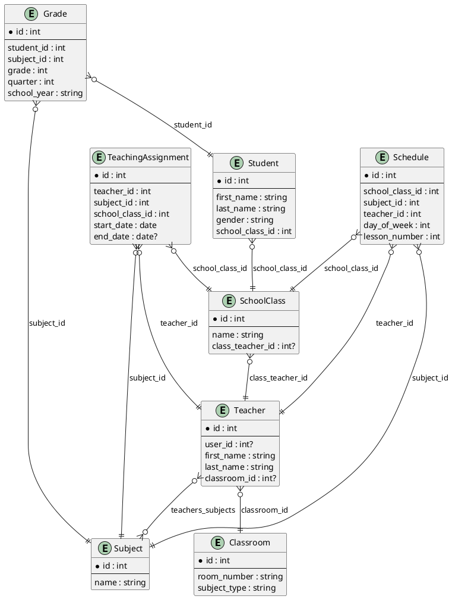

# Модели данных

## Ключевые модели (фрагменты кода)

## Схема БД (PlantUML)



```python
class Classroom(models.Model):
    room_number = models.CharField(max_length=10, unique=True)
    SUBJECT_TYPE_CHOICES = [
        ("base", "Базовая дисциплина"),
        ("profile", "Профильная дисциплина"),
    ]
    subject_type = models.CharField(
        max_length=20, choices=SUBJECT_TYPE_CHOICES, default="base"
    )
```

```python
class Teacher(models.Model):
    user = models.OneToOneField(
        User, on_delete=models.CASCADE, related_name="teacher_profile"
    )
    first_name = models.CharField(max_length=50)
    last_name = models.CharField(max_length=50)
    classroom = models.ForeignKey(
        Classroom, on_delete=models.SET_NULL, null=True, blank=True
    )
    subjects = models.ManyToManyField(Subject, related_name="teachers")
```

```python
class Student(models.Model):
    GENDER_CHOICES = [
        ("M", "Мальчик"),
        ("F", "Девочка"),
    ]
    first_name = models.CharField(max_length=50)
    last_name = models.CharField(max_length=50)
    school_class = models.ForeignKey(
        SchoolClass, on_delete=models.CASCADE, related_name="students"
    )
    gender = models.CharField(max_length=1, choices=GENDER_CHOICES)
```

```python
class TeachingAssignment(models.Model):
    teacher = models.ForeignKey(Teacher, on_delete=models.CASCADE)
    subject = models.ForeignKey(Subject, on_delete=models.CASCADE)
    school_class = models.ForeignKey(SchoolClass, on_delete=models.CASCADE)
    start_date = models.DateField()
    end_date = models.DateField(null=True, blank=True)

    class Meta:
        unique_together = ("teacher", "subject", "school_class", "start_date")
```

```python
class Grade(models.Model):
    student = models.ForeignKey(
        Student, on_delete=models.CASCADE, related_name="grades"
    )
    subject = models.ForeignKey(Subject, on_delete=models.CASCADE)
    grade = models.PositiveSmallIntegerField(
        validators=[MinValueValidator(2), MaxValueValidator(5)]
    )
    quarter = models.PositiveSmallIntegerField(choices=QUARTER_CHOICES)
    school_year = models.CharField(max_length=9)
```

```python
class Schedule(models.Model):
    school_class = models.ForeignKey(
        SchoolClass, on_delete=models.CASCADE, related_name="schedule"
    )
    subject = models.ForeignKey(Subject, on_delete=models.CASCADE)
    teacher = models.ForeignKey(Teacher, on_delete=models.CASCADE)
    day_of_week = models.PositiveSmallIntegerField(choices=DAYS_OF_WEEK)
    lesson_number = models.PositiveSmallIntegerField()

    class Meta:
        unique_together = ("school_class", "day_of_week", "lesson_number")
        ordering = ["day_of_week", "lesson_number"]
```

## Classroom
Кабинет школы. Поля: номер кабинета, тип дисциплин (базовые или профильные).

## Subject
Предмет (например, "Математика", "Информатика").

## Teacher
Учитель. Связан с пользователем Django (`User`), может иметь закрепленный кабинет и
несколько предметов.

## SchoolClass
Класс (например, "10А"). Имеет классного руководителя и список учеников.

## Student
Ученик. ФИО, пол, принадлежность к классу.

## TeachingAssignment
Назначение учителя на предмет и класс с учетом периода действия.

## Grade
Четвертные оценки учеников по предметам и учебному году. Диапазон оценок: 2–5.

## Schedule
Расписание по классам: день недели, номер урока, предмет и учитель.
