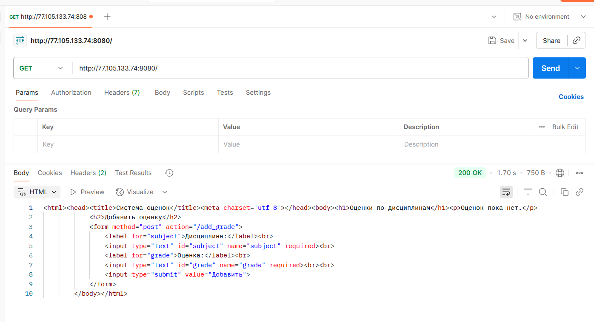
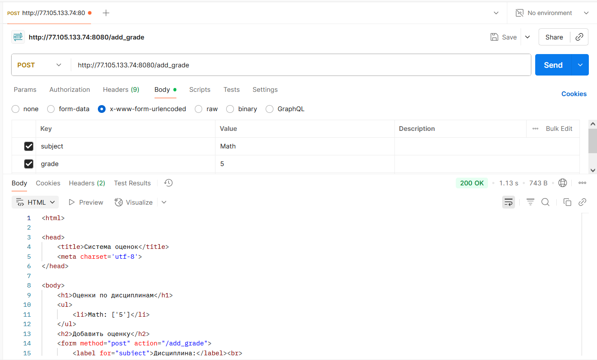

## Отчет по лабораторной работе №1

### Структура лабораторной работы

1. **UDP клиент-сервер**  
    - `task1/server_t1.py` — сервер, принимающий сообщения от клиента и отправляющий ответ.  
    - `task1/client_t1.py` — клиент, отправляющий сообщение серверу и получающий ответ.  

2. **TCP клиент-сервер с вычислениями**  
    - `task2/server_t2.py` — сервер, принимающий два числа, вычисляющий гипотенузу по теореме Пифагора и отправляющий результат.  
    - `task2/client_t2.py` — клиент, отправляющий два числа и получающий результат вычисления.  
    - `task2/math_utils.py` — набор математических функций.  

3. **HTTP сервер с отдачей HTML**  
    - `task3/server_t3.py` — простой HTTP сервер, отдающий статическую страницу `index.html`.  
    - `task3/index.html` — HTML страница для теста.  

4. **Чат на TCP с многопоточностью**  
    - `task4/server_t4.py` — сервер, поддерживающий многопользовательский чат с рассылкой сообщений.  
    - `task4/client_t4.py` — клиент для подключения к чату.  

5. **Минимальный HTTP сервер с обработкой POST**  
    - `task5/server_t5.py` и `task5/MyHTTPServer.py` — сервер, реализующий хранение и добавление оценок по дисциплинам через веб-форму.  	

## Задание 1
Реализован обмен сообщениями между клиентом и сервером по протоколу UDP. Клиент отправляет приветствие, сервер принимает его и отвечает.

- Клиент создает UDP-сокет, отправляет строку серверу и ждет ответ.
- Сервер принимает сообщение, выводит его и отправляет ответ клиенту.

**Код:**

*server_t1.py:*
```python
import socket
from utils import server_address


def start_server(address):
    """Создает UDP сокет сервера на адресе address, принимает сообщение от клиента и отправляет ему приветственное сообщение"""
    # Создаем UDP сокет
    server_socket = socket.socket(socket.AF_INET, socket.SOCK_DGRAM)
    server_socket.bind(address)
    print(f'Сервер запущен на {address[0]}:{address[1]}')

    while True:
        # Получаем данные от клиента
        client_data, client_address = server_socket.recvfrom(1024)
        if client_data:
            print("Получены данные: ", client_data.decode("utf-8"))
            # Отправляем ответ обратно клиенту
            response = 'Hello, client'
            sent = server_socket.sendto(response.encode('utf-8'), client_address)


if __name__ == "__main__":
    start_server(server_address)
```

*client_t1.py:*
```python
import socket
from utils import server_address


def start_client(address: tuple):
    """Создает UDP сокет клиента и отправляет сообщение серверу с адресом address"""
    # Создаем UDP сокет
    client_socket = socket.socket(socket.AF_INET, socket.SOCK_DGRAM)

    message = 'Hello, server'
    # Отправляем сообщение серверу
    sent = client_socket.sendto(message.encode('utf-8'), address)

    # Ждем ответа от сервера
    server_data, server = client_socket.recvfrom(1024)
    # Декодируем полученные байты обратно в строку
    print(f'Получен ответ: ', server_data.decode("utf-8"))

    client_socket.close()


if __name__ == "__main__":
    start_client(server_address)
```

---

## Задание 2
Реализован TCP клиент-сервер для вычисления гипотенузы по двум сторонам треугольника. Клиент отправляет два числа, сервер вычисляет результат и возвращает его.

- Клиент подключается к серверу, отправляет два числа.
- Сервер принимает числа, вычисляет гипотенузу с помощью функции из модуля, отправляет результат.

**Код:**

*server_t2.py:*
```python
import socket
from utils import server_address
from math_utils import *


def start_server(address: tuple):
    """Создает TCP сокет сервера на адресе address, принимает данные о катетах от клиента, считает гипотенузу
    по теореме Пифагора и отправляет клиенту результат"""

    # Создаем TCP сокет
    server_socket = socket.socket(socket.AF_INET, socket.SOCK_STREAM)
    server_socket.bind(address)
    print(f'Сервер запущен на {address[0]}:{address[1]}')

    server_socket.listen(1)

    while True:
        # Получаем данные от клиента
        connection, client_address = server_socket.accept()

        # Получаем данные
        data = connection.recv(1024)

        if data:
            # Декодируем данные и разбираем их
            decoded_data = data.decode('utf-8')
            print(f'Получены данные: {decoded_data}')
            try:
                parts = decoded_data.split(',')
                a = float(parts[0])
                b = float(parts[1])

                # Вычисляем результат
                result = calculate_pythagoras(a, b)
                response = str(result)
            except (ValueError, IndexError):
                response = 'Ошибка: неверный формат данных. Ожидается (float, float)'

            # Отправляем результат клиенту
            connection.sendall(response.encode('utf-8'))

            # Закрываем соединение с клиентом
            connection.close()


if __name__ == "__main__":
    start_server(server_address)
```

*client_t2.py:*
```python
import socket
from utils import server_address


def start_client(address: tuple):
    """Создает TCP сокет клиента и отправляет данные с катетами серверу с адресом address"""
    # Создаем TCP сокет
    client_socket = socket.socket(socket.AF_INET, socket.SOCK_STREAM)

    client_socket.connect(address)

    a_str = input('Введите первый катет (a): ')
    b_str = input('Введите второй катет (b): ')
    message = f'{a_str},{b_str}'

    # Отправляем данные
    client_socket.sendall(message.encode('utf-8'))

    # Получаем ответ
    data = client_socket.recv(1024)
    print(f'Ответ сервера (гипотенуза): {data.decode("utf-8")}')

    client_socket.close()


if __name__ == "__main__":
    start_client(server_address)
```

*math_utils.py:*
```python
# Функция для вычисления гипотенузы по теореме Пифагора
def calculate_pythagoras(a, b):
    return (a ** 2 + b ** 2) ** 0.5


# Функция для решения квадратного уравнения
def calculate_quadratic_equation(a, b, c):
    return b * b - 4 * a * c


# Функция для вычисления площади трапеции
def calculate_trapezoid_area(a, b, h):
    return (a + b) * h / 2


# Функция для вычисления площади параллелограмма
def calculate_parallelogram_area(a, h):
    return a * h
```

---

## Задание 3
Реализован HTTP сервер, отдающий статическую HTML страницу для теста.

- Сервер принимает HTTP-запросы и возвращает содержимое файла `index.html`.
- Страница содержит простой HTML для проверки работы.

**Код:**

*server_t3.py:*
```python
import socket
from utils import server_address


def start_server(address):
    """Создает веб-сервер на адресе address, который при подключении клиента, отправляет ему HTTP-сообщение,
    содержащие HTML-страницу index.html"""

    # Создаем сокет
    sock = socket.socket(socket.AF_INET, socket.SOCK_STREAM)
    sock.setsockopt(socket.SOL_SOCKET, socket.SO_REUSEADDR, 1)

    sock.bind(address)
    sock.listen(1)
    print(f'Сервер запущен на http://{address[0]}:{address[1]}')

    while True:
        connection, client_address = sock.accept()
        try:
            # Принимаем запрос от браузера
            request = connection.recv(1024)
            print(f"Получен запрос:\n{request.decode('utf-8')}")

            # Читаем содержимое файла
            with open('index.html', 'r', encoding='utf-8') as f:
                html_content = f.read()

            # Формируем HTTP-ответ
            response = (
                'HTTP/1.1 200 OK\r\n'
                'Content-Type: text/html; charset=utf-8\r\n'
                f'Content-Length: {len(html_content.encode("utf-8"))}\r\n'
                '\r\n'
                f'{html_content}'
            )
            connection.sendall(response.encode('utf-8'))

        finally:
            connection.close()


if __name__ == "__main__":
    start_server(server_address)
```

*index.html:*
```html
<!DOCTYPE html>
<html lang="ru">
<head>
    <meta charset="UTF-8">
    <title>Тестовая страница</title>
</head>
<body>
    <h1>Привет от моего Python-сервера!</h1>
    <p>Эта страница была загружена с помощью сокетов.</p>
</body>
</html>
```

---

## Задание 4
Реализован многопоточный чат на TCP, поддерживающий несколько клиентов.

- Сервер принимает подключения, создает поток для каждого клиента и рассылает сообщения всем участникам.
- Клиент подключается к серверу, отправляет и получает сообщения.

**Код:**

*server_t4.py:*
```python
import socket
import threading
from utils import server_address

clients = []  # Список для хранения сокетов всех клиентов


def broadcast(message, sender_connection):
    """Функция для рассылки сообщений всем клиентам, кроме отправителя"""
    for client_conn in clients:
        try:
            if sender_connection is not client_conn:
                client_conn.send(message)
        except:
            # Если отправка не удалась, клиент отключился
            clients.remove(client_conn)
            client_conn.close()


def handle_client(connection, address):
    """Функция для обработки сообщений от клиента"""
    print(f'[НОВОЕ ПОДКЛЮЧЕНИЕ] {address} подключился.')

    while True:
        try:
            # Получаем сообщение
            message = connection.recv(1024)
            if message:
                print(f'[{address}] {message.decode("utf-8")}')
                # Рассылаем его всем остальным
                broadcast(message, connection)
            else:
                # Если сообщение пустое, клиент отключился
                print(f'[{address}] отключился.')
                clients.remove(connection)
                connection.close()
                break
        except:
            print(f'[{address}] соединение разорвано.')
            clients.remove(connection)
            connection.close()
            break


# Основная часть сервера
def start_server():
    """Функция для создания TCP сокета сервера, к которому происходит подключение,
    и запуска обработки новых клиентов в отдельных потоках"""
    # Создаем TCP сокет
    server_socket = socket.socket(socket.AF_INET, socket.SOCK_STREAM)
    server_socket.bind(server_address)
    print(f'Сервер запущен на {server_address[0]}:{server_address[1]}')

    server_socket.listen(1)

    while True:
        # Принимаем новое подключение
        connection, address = server_socket.accept()
        # Добавляем нового клиента в список
        clients.append(connection)
        # Создаем и запускаем для него новый поток
        thread = threading.Thread(target=handle_client, args=(connection, address))
        thread.start()
        print(f'[АКТИВНЫЕ ПОДКЛЮЧЕНИЯ] {threading.active_count() - 1}')


if __name__ == "__main__":
    start_server()
```

*client_t4.py:*
```python
import socket
import threading
from utils import server_address


def receive_messages(client_socket):
    """Функция для получения сообщений от сервера"""
    while True:
        try:
            message = client_socket.recv(1024).decode('utf-8')
            if message:
                print(message)
            else:
                break
        except:
            print("Соединение с сервером разорвано.")
            client_socket.close()
            break


def send_messages(client_socket, nickname):
    """Функция для отправки сообщений серверу"""
    while True:
        message_text = input()
        message = f'{nickname}: {message_text}'
        client_socket.send(message.encode('utf-8'))


def start_client():
    """Функция для создания TCP сокета клиента, отправки сообщений серверу
    и обработки ответов"""
    nickname = input("Введите ваш ник: ")
    # Создаем TCP сокет
    client_socket = socket.socket(socket.AF_INET, socket.SOCK_STREAM)
    client_socket.connect(server_address)

    # Запускаем поток для получения сообщений
    receive_thread = threading.Thread(target=receive_messages, args=(client_socket,))
    receive_thread.start()

    # Запускаем отправку сообщений в основном потоке
    send_messages(client_socket, nickname)


if __name__ == "__main__":
    start_client()
```

---

## Задание 5
Реализован минимальный HTTP сервер с поддержкой POST-запросов для хранения оценок по дисциплинам.

- Сервер принимает POST-запросы с оценками, сохраняет их и отображает список.
- Используется собственный класс сервера.

**Запрос с Postman**

GET-запрос




POST-запрос



**Код:**

*server_t5.py:*
```python
from MyHTTPServer import MyHTTPServer

if __name__ == '__main__':
    host = 'localhost'
    port = 8080
    serv = MyHTTPServer(host, port)
    try:
        serv.serve_forever()
    except KeyboardInterrupt:
        pass
```

*MyHTTPServer.py:*
```python
import socket
from urllib.parse import parse_qs


class MyHTTPServer:
    """Класс для создания веб-сервера для обработки GET и POST HTTP-запросов"""

    def __init__(self, host='localhost', port=8080):
        self.host = host
        self.port = port
        self.grades = {}  # Хранилище для оценок: {'Дисциплина': [Оценка1, Оценка2]}

    def serve_forever(self):
        """1. Запуск сервера на сокете, обработка входящих соединений"""
        server_socket = socket.socket(socket.AF_INET, socket.SOCK_STREAM)
        server_socket.setsockopt(socket.SOL_SOCKET, socket.SO_REUSEADDR, 1)
        try:
            server_socket.bind((self.host, self.port))
            server_socket.listen(1)
            print(f'Сервер запущен на http://{self.host}:{self.port}')

            while True:
                connection, client_address = server_socket.accept()
                print(f"Подключен клиент: {client_address}")
                try:
                    self.serve_client(connection)
                except Exception as e:
                    print(f"Ошибка при обработке клиента: {e}")
                finally:
                    connection.close()
        finally:
            server_socket.close()

    def serve_client(self, connection):
        """2. Обработка клиентского подключения"""
        # Используем makefile для удобного чтения данных из сокета
        rfile = connection.makefile('rb')

        # Парсим первую строку запроса (метод, URL, версия)
        method, path, version = self.parse_request(rfile)

        # Парсим заголовки
        headers = self.parse_headers(rfile)

        # Читаем тело запроса, если оно есть (для POST)
        body = b''
        if 'Content-Length' in headers:
            try:
                content_length = int(headers['Content-Length'])
                body = rfile.read(content_length)
            except (ValueError, TypeError):
                print("Неверное значение Content-Length")

        # Обрабатываем запрос и получаем компоненты ответа
        response_code, response_reason, response_headers, response_body = self.handle_request(method, path, body)

        # Отправляем ответ клиенту
        self.send_response(connection, response_code, response_reason, response_headers, response_body)

    def parse_request(self, rfile):
        """3. функция для обработки заголовка http+запроса.
        Python, сокет предоставляет возможность создать вокруг него некоторую обертку,
        которая предоставляет file object интерфейс. Это дайте возможность построчно обработать запрос.
        Заголовок всегда - первая строка.
        Первую строку нужно разбить на 3 элемента (метод + url + версия протокола).
        URL необходимо разбить на адрес и параметры (isu.ifmo.ru/pls/apex/f?p=2143,
        где isu.ifmo.ru/pls/apex/f, а p=2143 - параметр p со значением 2143)"""
        raw = rfile.readline()

        request_line = str(raw, 'iso-8859-1').rstrip('\r\n')
        words = request_line.split()
        if len(words) != 3:
            raise Exception('Неверный формат строки запроса')

        method, target, version = words
        return method, target, version

    def parse_headers(self, rfile):
        """4. Функция для обработки headers.
        Необходимо прочитать все заголовки после первой строки до появления пустой строки
        и сохранить их в массив."""
        headers = {}
        while True:
            line = rfile.readline(65537)
            if line in (b'\r\n', b'\n', b''):
                break

            line_str = str(line, 'iso-8859-1').rstrip('\r\n')
            key, value = line_str.split(':', 1)
            headers[key.strip()] = value.strip()

        return headers

    def handle_request(self, method, path, body):
        """5. Функция для обработки url в соответствии с нужным методом.
        В случае данной работы, нужно будет создать набор условий,
        который обрабатывает GET или POST запрос. GET запрос должен возвращать данные.
        POST запрос должен записывать данные на основе переданных параметров."""
        if method == 'GET' and path == '/':
            html_content = self._generate_html_page()
            body_bytes = html_content.encode('utf-8')
            headers = {
                'Content-Type': 'text/html; charset=utf-8',
                'Content-Length': str(len(body_bytes))
            }
            return 200, 'OK', headers, body_bytes

        elif method == 'POST' and path == '/add_grade':
            data_str = body.decode('utf-8')
            parsed_data = parse_qs(data_str)

            subject = parsed_data.get('subject', [''])[0]
            grade = parsed_data.get('grade', [''])[0]

            if subject and grade:
                self.grades[subject] = self.grades.get(subject, []) + [grade]
                print(f"Обновлены оценки: {self.grades}")

            # Делаем редирект на главную страницу
            headers = {'Location': '/'}
            return 303, 'See Other', headers, b''
        else:
            body_bytes = b"404 Not Found"
            headers = {
                'Content-Type': 'text/plain',
                'Content-Length': str(len(body_bytes))
            }
            return 404, 'Not Found', headers, body_bytes

    def send_response(self, connection, code, reason, headers, body):
        """6. Функция для отправки ответа. Необходимо записать в соединение
        status line вида HTTP/1.1 <status_code> <reason>.
        Затем, построчно записать заголовки и пустую строку, обозначающую конец секции заголовков."""
        # Формируем статус-строку
        status_line = f"HTTP/1.1 {code} {reason}\r\n"
        connection.sendall(status_line.encode('iso-8859-1'))

        # Отправляем заголовки
        for key, value in headers.items():
            header_line = f"{key}: {value}\r\n"
            connection.sendall(header_line.encode('iso-8859-1'))

        # Пустая строка после заголовков
        connection.sendall(b'\r\n')

        # Отправляем тело ответа, если оно есть
        if body:
            connection.sendall(body)

    def _generate_html_page(self):
        """Вспомогательная функция для генерации HTML-страницы."""
        body = "<h1>Оценки по дисциплинам</h1>"

        if self.grades:
            body += "<ul>"
            for subject, grade in self.grades.items():
                body += f"<li>{subject}: {grade}</li>"
            body += "</ul>"
        else:
            body += "<p>Оценок пока нет.</p>"

        body += """
            <h2>Добавить оценку</h2>
            <form method="post" action="/add_grade">
                <label for="subject">Дисциплина:</label><br>
                <input type="text" id="subject" name="subject" required><br>
                <label for="grade">Оценка:</label><br>
                <input type="text" id="grade" name="grade" required><br><br>
                <input type="submit" value="Добавить">
            </form>
        """
        return f"<html><head><title>Система оценок</title><meta charset='utf-8'></head><body>{body}</body></html>"
```

### Выводы
- В ходе лабораторной работы были реализованы различные типы сетевых взаимодействий: UDP, TCP, HTTP.
- Получен опыт работы с сокетами, многопоточностью, обработкой HTTP-запросов и форм.
- Все задания структурированы по папкам, код снабжен комментариями и легко расширяем.