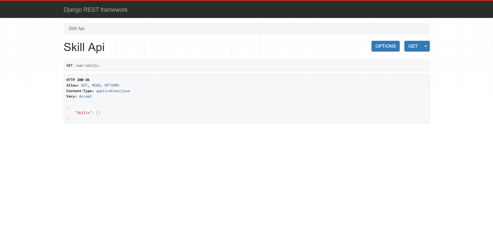
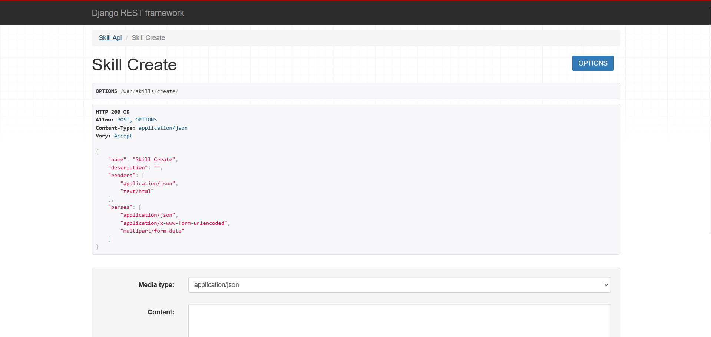
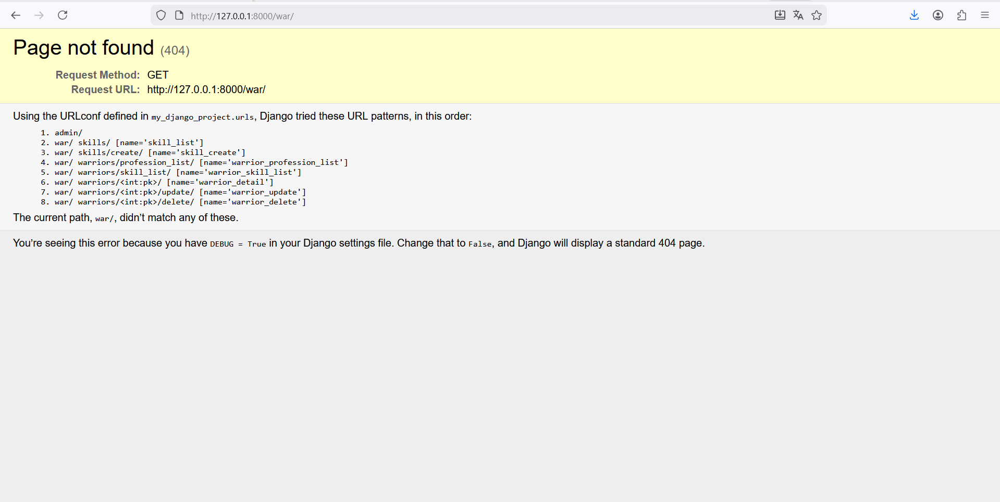

# Отчет по Практическому занятию №3.2
### Тема: Контроллеры и Сериализаторы в Django REST Framework (DRF)

В рамках работы была осуществлена интеграция Django REST Framework (DRF) в существующий проект, определены новые модели для API-сервиса (Warrior, Profession, Skill, SkillOfWarrior), и реализованы все требуемые эндпоинты с использованием как базовых **APIView**, так и **Generic API Views**.


## 1. Подготовка Проекта и Модели Данных

### Интеграция DRF

Библиотека **`djangorestframework`** была установлена (`pip install djangorestframework`) и добавлена в `INSTALLED_APPS` в файле `settings.py`.

### Определение Моделей

Модели, описывающие сущности воинов, их профессий и умений, были созданы в новом приложении **`warriors_app`**.

```python
from django.db import models

class Profession(models.Model):
    title = models.CharField(max_length=120, verbose_name='Название')
    description = models.TextField(verbose_name='Описание')
    
    def __str__(self):
        return self.title

class Skill(models.Model):
    title = models.CharField(max_length=120, verbose_name='Наименование')
    
    def __str__(self):
        return self.title

class Warrior(models.Model):
    race_types = (
        ('s', 'student'),
        ('d', 'developer'),
        ('t', 'teamlead'),
    )
    race = models.CharField(max_length=1, choices=race_types, verbose_name='Расса')
    name = models.CharField(max_length=120, verbose_name='Имя')
    level = models.IntegerField(verbose_name='Уровень', default=0)
    skill = models.ManyToManyField('Skill', verbose_name='Умения', through='SkillOfWarrior',
                                   related_name='warrior_skils')
    profession = models.ForeignKey('Profession', on_delete=models.CASCADE, verbose_name='Профессия',
                                   blank=True, null=True)

    def __str__(self):
        return self.name

class SkillOfWarrior(models.Model):
    skill = models.ForeignKey('Skill', verbose_name='Умение', on_delete=models.CASCADE)
    warrior = models.ForeignKey('Warrior', verbose_name='Воин', on_delete=models.CASCADE)
    level = models.IntegerField(verbose_name='Уровень освоения умения')
```


## 2. Практическое задание 1: Эндпоинты для Skill (APIView)

Реализованы эндпоинты для просмотра (GET) и создания (POST) объектов **Skill** с использованием базового класса **`APIView`**.

### Сериализаторы (`warriors_app/serializers.py`)

```python
from rest_framework import serializers
from .models import Skill

class SkillSerializer(serializers.ModelSerializer):
    class Meta:
        model = Skill
        fields = '__all__'

class SkillCreateSerializer(serializers.ModelSerializer):
    class Meta:
        model = Skill
        fields = ('title',)
```

### Представления (`warriors_app/views.py`)

```python
from rest_framework.views import APIView
from rest_framework.response import Response
from .models import Skill
from .serializers import SkillSerializer, SkillCreateSerializer

class SkillAPIView(APIView):
    def get(self, request):
        skills = Skill.objects.all()
        serializer = SkillSerializer(skills, many=True)
        return Response({"Skills": serializer.data})

class SkillCreateView(APIView):
    def post(self, request):
        skill_data = request.data.get("skill")
        serializer = SkillCreateSerializer(data=skill_data)
        
        if serializer.is_valid(raise_exception=True):
            skill_saved = serializer.save()
            return Response({"Success": f"Skill '{skill_saved.title}' created successfully."})
        
        return Response(serializer.errors, status=400)
```

### Маршруты (`warriors_app/urls.py`)

```python
from django.urls import path
from .views import SkillAPIView, SkillCreateView

app_name = "warriors_app"

urlpatterns = [
    path('skills/', SkillAPIView.as_view(), name='skill_list'),
    path('skills/create/', SkillCreateView.as_view(), name='skill_create'),
]
```

### Результат работы:






## 3. Практическое задание 2: Generic API Views

Реализованы эндпоинты для вывода, редактирования и удаления информации о воинах с использованием **Generic API Views**.

### Дополнительные Сериализаторы (Вложенность)

Для выполнения требований по выводу полной информации о воинах (с профессиями и скиллами в одном запросе) использовалась **вложенная сериализация** (Nested Serialization).

```python
# warriors_app/serializers.py (дополнение)

class ProfessionSerializer(serializers.ModelSerializer):
    class Meta:
        model = Profession
        fields = ('title', 'description')

class SkillOfWarriorSerializer(serializers.ModelSerializer):
    title = serializers.CharField(source='skill.title', read_only=True)

    class Meta:
        model = SkillOfWarrior
        fields = ('title', 'level')


class WarriorProfessionSerializer(serializers.ModelSerializer):
    profession = ProfessionSerializer()
    
    class Meta:
        model = Warrior
        fields = '__all__'
        
class WarriorSkillSerializer(serializers.ModelSerializer):
    skill = SkillOfWarriorSerializer(source='skillofwarrior_set', many=True)
    
    class Meta:
        model = Warrior
        fields = '__all__'

class WarriorDetailSerializer(serializers.ModelSerializer):
    profession = ProfessionSerializer()
    skill = SkillOfWarriorSerializer(source='skillofwarrior_set', many=True)
    race_display = serializers.CharField(source='get_race_display', read_only=True)

    class Meta:
        model = Warrior
        fields = '__all__'
```

### Представления (`warriors_app/views.py`)

Использовались специализированные классы, такие как `ListAPIView`, `RetrieveAPIView`, `UpdateAPIView` и `DestroyAPIView`, которые требуют только указания `serializer_class` и `queryset`.

```python
from rest_framework import generics
from .serializers import (
    WarriorProfessionSerializer,
    WarriorSkillSerializer,
    WarriorDetailSerializer,
)

class WarriorProfessionListAPIView(generics.ListAPIView):
    serializer_class = WarriorProfessionSerializer
    queryset = Warrior.objects.all()

class WarriorSkillListAPIView(generics.ListAPIView):
    serializer_class = WarriorSkillSerializer
    queryset = Warrior.objects.all()

class WarriorRetrieveAPIView(generics.RetrieveAPIView):
    serializer_class = WarriorDetailSerializer
    queryset = Warrior.objects.all()
    lookup_field = 'pk'

class WarriorUpdateAPIView(generics.UpdateAPIView):
    serializer_class = WarriorDetailSerializer
    queryset = Warrior.objects.all()
    lookup_field = 'pk'

class WarriorDestroyAPIView(generics.DestroyAPIView):
    queryset = Warrior.objects.all()
    lookup_field = 'pk'
```

### Маршруты (`warriors_app/urls.py`)

```python
# warriors_app/urls.py (дополнение)
urlpatterns = [
    path('skills/', SkillAPIView.as_view(), name='skill_list'),
    path('skills/create/', SkillCreateView.as_view(), name='skill_create'),

    path('warriors/profession_list/', WarriorProfessionListAPIView.as_view(), name='warrior_profession_list'),
    path('warriors/skill_list/', WarriorSkillListAPIView.as_view(), name='warrior_skill_list'),
    path('warriors/<int:pk>/', WarriorRetrieveAPIView.as_view(), name='warrior_detail'),
    path('warriors/<int:pk>/update/', WarriorUpdateAPIView.as_view(), name='warrior_update'),
    path('warriors/<int:pk>/delete/', WarriorDestroyAPIView.as_view(), name='warrior_delete'),
]
```

### Результат работы:



## 4. Выводы

В результате выполнения практического задания было получено представление об использовании ключевых компонентов Django REST Framework:
* **Сериализация**: Освоены базовые и вложенные сериализаторы (`ModelSerializer`, вложенность).
* **Контроллеры (Views)**: Реализованы эндпоинты на основе **`APIView`** для создания и просмотра данных.
* **Generic Views**: Применено использование **Generic API Views** (`ListAPIView`, `RetrieveAPIView`, `UpdateAPIView`, `DestroyAPIView`) для быстрой реализации CRUD-операций, что значительно сокращает количество кода.