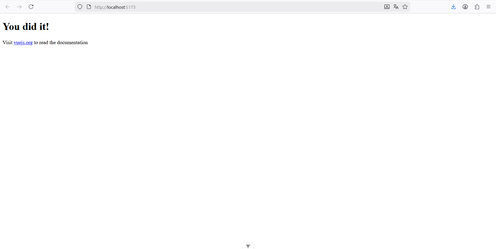
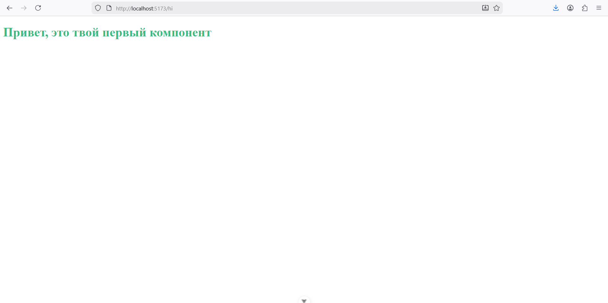
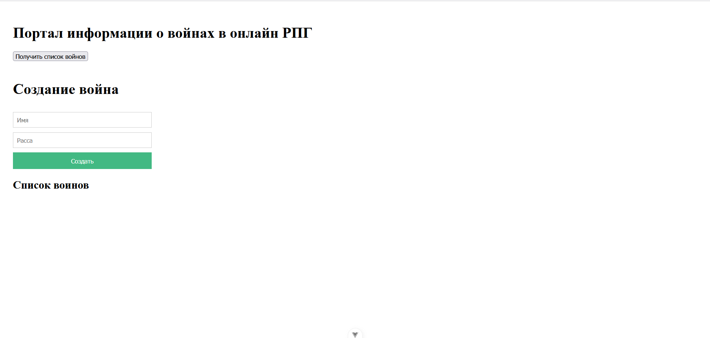

# Отчет по Практической работе №4.2
### Тема: Введение во Vue.js

В рамках практической работы была успешно проведена инициализация, настройка и запуск одностраничного приложения (SPA) на базе фреймворка **Vue.js** (версия 3, с использованием **Vite**). Были освоены базовые концепции компонентного подхода, маршрутизации (роутинга) и взаимодействия компонентов с внешними данными (Backend API).


## 1. Подготовка и Запуск Проекта

### 1.1. Инициализация и Установка
Проект был инициализирован с помощью утилиты CLI:
```bash
$ npm init vue@latest
```

После создания структуры проекта, были установлены зависимости и осуществлен запуск сервера для разработки:
```bash
$cd vue-project$ npm install
$ npm run dev
```

Проект успешно запустился на локальном хосте:



### 1.2. Настройка Роутинга

Для управления страницами в приложении был настроен **Vue Router**:
* В файле **`src/main.js`** импортирован и подключен сконфигурированный роутер.
* В файле **`src/App.vue`** был размещен компонент `<router-view />`.
```html
<template>
  <div class="app">
    <router-view />
  </div>
</template>
```


## 2. Создание Первого Компонента и Роута

### 2.1. Компонент `Hello.vue`
Был создан тестовый компонент **`src/components/Hello.vue`**.

```html
<template>
  <div>
    <h1>Привет, это твой первый компонент</h1>
  </div>
</template>

<script>
export default {
}
</script>

<style scoped>
h1 {
  color: #42b983;
}
</style>
```

### 2.2. Настройка Роута `/hi`
В файле конфигурации роутера **`src/router/index.js`** был добавлен маршрут `/hi`, который ссылается на созданный компонент `Hello`.

```javascript
import Hello from "@/components/Hello.vue";
import {createRouter, createWebHistory} from "vue-router";

const routes = [
   {
       path: '/hi',
       component: Hello
   },
]

const router = createRouter({
   history: createWebHistory(), routes
})

export default router
```

### 2.3. Настройка главного файла: `src/main.js`

```javascript
// src/main.js
import { createApp } from 'vue'
import App from './App.vue'
import './assets/main.css'
import router from "./router"; 

createApp(App).use(router).mount('#app')
```

После перехода по адресу `http://localhost:5173/hi` компонент был успешно отображен:




## 3. Разделение Компонентов и Работа с Данными

### 3.1. Создание Представления `Warriors.vue`
Представление **`src/views/Warriors.vue`** стало основной страницей для работы с данными.

```html
<template>
  <div class="app">
    <h1>Портал информации о войнах в онлайн РПГ</h1>
    <button v-on:click="fetchWarriors">Получить список войнов</button> 
    
    <warrior-form /> 

    <warrior-list 
      v-bind:warriors="warriors" 
    /> 
  </div>
</template>

<script>
import WarriorForm from "@/components/WarriorForm.vue";
import WarriorList from "@/components/WarriorList.vue";
import axios from "axios";

export default {
  components: {
    WarriorForm,
    WarriorList 
  },
  data() { 
    return {
      warriors: [], 
    } 
  },
  methods: { 
    async fetchWarriors () { 
      try {
        const response = await axios.get('http://62.109.28.95:8890/warriors/list/') 
        console.log(response.data.results)
        this.warriors = response.data.results 
      } catch (e) {
        alert('Ошибка')
      }
    }
  },
  mounted() {
    this.fetchWarriors() 
  }
}
</script>

<style scoped>
.app {
  padding: 20px;
}
button {
  margin-bottom: 20px;
}
</style>
```

### 3.2. Компонент `WarriorList.vue`
Этот компонент отвечает за отображение списка воинов, принимая данные через `props`.

```html
<template>
  <div>
    <h2>Список воинов</h2>
    <div class="warrior" v-for="warrior in warriors" :key="warrior.name"> 
      <div><strong>Имя:</strong> {{ warrior.name }}</div>
      <div><strong>Расса:</strong> {{ warrior.race }}</div>
      <hr>
    </div>
  </div>
</template>

<script>
export default {
  props: { 
    warriors: {
      type: Array,
      required: true
    }
  }
}
</script>

<style scoped>
.warrior {
  margin-bottom: 10px;
}
</style>
```

### 3.3. Компонент `WarriorForm.vue`
Данный компонент содержит форму для создания нового воина.

```html
<template>
  <form @submit.prevent> 
    <h1>Создание война</h1>
    <input 
      v-model="warrior.name" 
      class="input" 
      type="text" 
      placeholder="Имя"
    >
    <input 
      v-model="warrior.race" 
      class="input" 
      type="text" 
      placeholder="Расса"
    >
    <button class="btn" v-on:click="createWarrior">Cоздать</button> 
  </form>
</template>

<script>
import axios from "axios";

export default {
  name: "WarriorForm",
  data () {
    return {
      warrior: { 
        name: '',
        race: ''
      }
    }
  },
  methods: {
    createWarrior() {
      axios.post('http://62.109.28.95:8890/warrior/create1', {
        race: this.warrior.race,
        name: this.warrior.name,
      });

      this.warrior.name = '';
      this.warrior.race = '';
    },
  },
}
</script>

<style scoped>
form {
  display: flex;
  flex-direction: column;
  gap: 10px;
  max-width: 300px;
  margin-bottom: 20px;
}
.input {
  padding: 8px;
  border: 1px solid #ccc;
}
.btn {
  padding: 10px;
  background-color: #42b983;
  color: white;
  border: none;
  cursor: pointer;
}
</style>
```

Итоговый результат:



## 4. Выводы

В ходе выполнения практической работы были получены фундаментальные навыки работы с Vue.js:
1.  **Настройка среды**: Успешно установлен и запущен проект Vue 3 с помощью NPM и Vite.
2.  **Компонентный подход**: Освоено деление кода на **`template`**, **`script`**, **`style`** и принципы разделения на **`views`** и **`components`**.
3.  **Маршрутизация**: Настроен Vue Router для создания многостраничного приложения (SPA).
4.  **Связывание данных**: Использованы ключевые директивы Vue, такие как **`v-for`**, **`v-bind`**, и **`v-model`**.
5.  **Взаимодействие с API**: Реализованы асинхронные запросы GET и POST к внешнему Backend-серверу для получения и отправки данных.