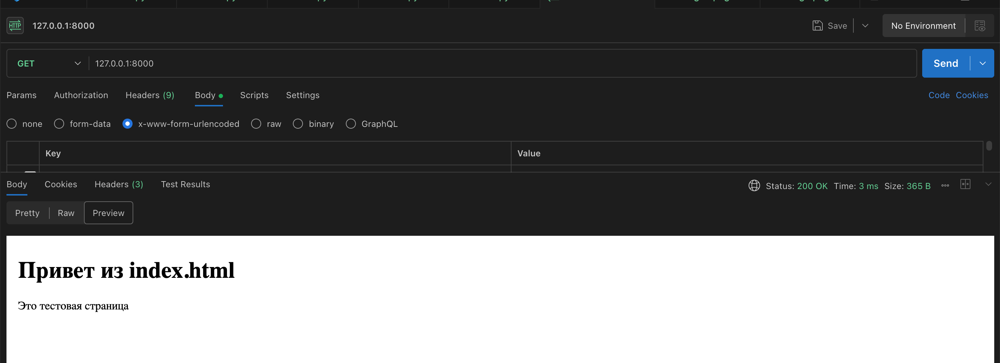
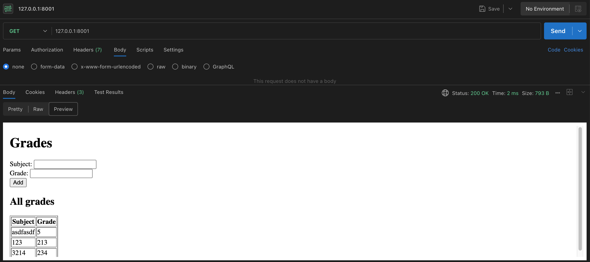
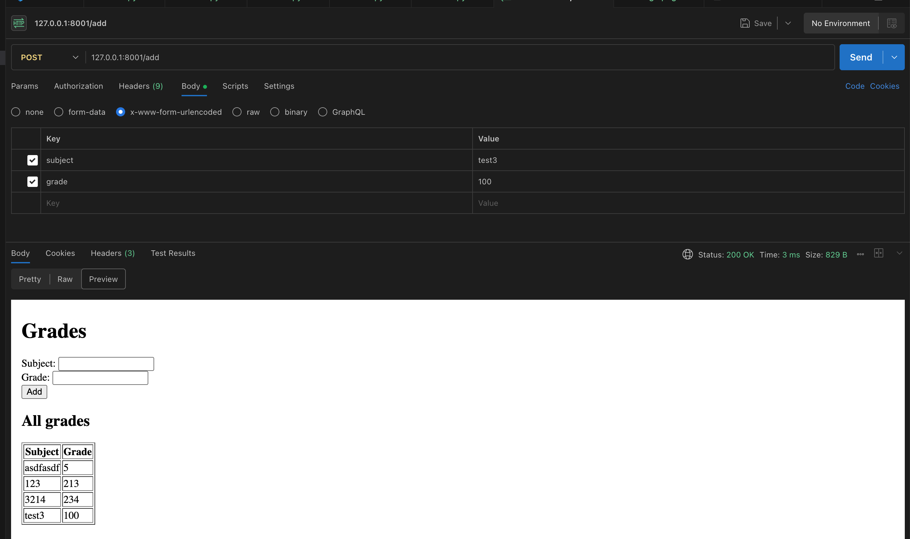

# Отчёт по лабораторной работе 1

Ниже приведены исходные коды заданий и краткие описания реализации (по каждому файлу в папке `laboratory_work_1`). Код вставлен полностью.

---

## Задание 1 — `task1.py`

Код задания:

```python
#!/usr/bin/env python3
"""
Как использовать (в двух терминалах):

Запустить сервер:
   python3 task1.py --server

В другом терминале запустить клиент:
   python3 task1.py --client

Остальные команды описаны в python task1.py --help
"""

import argparse
import socket
import sys
import time


HOST = '127.0.0.1'
PORT = 9999


def run_server(host: str = HOST, port: int = PORT) -> None:
    with socket.socket(socket.AF_INET, socket.SOCK_DGRAM) as sock:
        sock.bind((host, port))
        print(f"Server listening on {host}:{port}")
        try:
            data, addr = sock.recvfrom(1024)
            print(f"Received from {addr}: {data.decode()}")
            reply = "Hello, client"
            sock.sendto(reply.encode(), addr)
            print(f"Sent reply to {addr}: {reply}")
        except KeyboardInterrupt:
            print("Server interrupted by user")


def run_client(host: str = HOST, port: int = PORT, timeout: float = 5.0) -> None:
    with socket.socket(socket.AF_INET, socket.SOCK_DGRAM) as sock:
        sock.settimeout(timeout)
        message = "Hello, server"
        try:
            sock.sendto(message.encode(), (host, port))
            print(f"Sent to {host}:{port}: {message}")
            data, addr = sock.recvfrom(1024)
            print(f"Received from {addr}: {data.decode()}")
        except socket.timeout:
            print("No response received (timeout)")
        except Exception as e:
            print(f"Client error: {e}")


def parse_args():
    p = argparse.ArgumentParser(description='UDP client/server demo')
    group = p.add_mutually_exclusive_group(required=True)
    group.add_argument('--server', action='store_true', help='Run as server')
    group.add_argument('--client', action='store_true', help='Run as client')
    p.add_argument('--host', default=HOST, help='Host to bind/connect (default: 127.0.0.1)')
    p.add_argument('--port', type=int, default=PORT, help=f'Port (default: {PORT})')
    return p.parse_args()


if __name__ == '__main__':
    args = parse_args()
    if args.server:
        try:
            run_server(args.host, args.port)
        except Exception as e:
            print(f"Server error: {e}")
            sys.exit(1)
    elif args.client:
        try:
            # small sleep in case server was just started in another process
            time.sleep(0.1)
            run_client(args.host, args.port)
        except Exception as e:
            print(f"Client error: {e}")
            sys.exit(1)

```

Реализация (кратко):

- Простой демонстрационный UDP-сервер и клиент. Сервер слушает один пакет методом recvfrom и отвечает строкой "Hello, client".
- Клиент отправляет один UDP-пакет и ожидает ответ с таймаутом.

---

## Задание 2 — `task2.py`

Код задания:

```python
#!/usr/bin/env python3
"""
Как использовать (в двух терминалах):

Запустить сервер:
   python3 task2.py --server

В другом терминале запустить клиент:
   python3 task2.py --client

Остальные команды описаны в python task2.py --help
"""

from __future__ import annotations

import argparse
import math
import socket
from typing import Tuple

HOST = '127.0.0.1'
PORT = 10000
BUFFER_SIZE = 1024


def parse_pair(s: str) -> Tuple[float, float]:
    s = s.strip()
    if not s:
        raise ValueError("empty input")
    for sep in (',', None):
        try:
            parts = s.split(sep) if sep is not None else s.split()
            if len(parts) != 2:
                continue
            a, b = float(parts[0]), float(parts[1])
            return a, b
        except Exception:
            continue
    raise ValueError(f"could not parse two numbers from: '{s}'")


def run_server(host: str = HOST, port: int = PORT) -> None:
    with socket.socket(socket.AF_INET, socket.SOCK_STREAM) as srv:
        srv.setsockopt(socket.SOL_SOCKET, socket.SO_REUSEADDR, 1)
        srv.bind((host, port))
        srv.listen()
        print(f"Server listening on {host}:{port}")
        try:
            while True:
                conn, addr = srv.accept()
                with conn:
                    print(f"Connection from {addr}")
                    data = b""
                    try:
                        data = conn.recv(BUFFER_SIZE)
                        if not data:
                            print("No data received, closing connection")
                            continue
                        line = data.decode().strip()
                        print(f"Received: {line}")
                        try:
                            a, b = parse_pair(line)
                            hyp = math.hypot(a, b)
                            resp = f"{hyp}\n"
                        except ValueError as e:
                            resp = f"ERROR: {e}\n"
                        conn.sendall(resp.encode())
                        print(f"Sent: {resp.strip()}")
                    except Exception as e:
                        print(f"Error handling client {addr}: {e}")
        except KeyboardInterrupt:
            print("Server interrupted by user, exiting")


def run_client(host: str = HOST, port: int = PORT, timeout: float = 5.0) -> None:
    print("Enter two lengths for a right triangle.")
    try:
        a_str = input("First lengths (a): ").strip()
        b_str = input("Second lengths (b): ").strip()
        try:
            a, b = parse_pair(f"{a_str} {b_str}")
        except ValueError:
            try:
                a, b = parse_pair(a_str)
            except ValueError:
                raise
    except Exception as e:
        print(f"Input error: {e}")
        return

    msg = f"{a} {b}\n"
    try:
        with socket.create_connection((host, port), timeout=timeout) as s:
            s.sendall(msg.encode())
            print(f"Sent to {host}:{port}: {a} {b}")
            data = s.recv(BUFFER_SIZE)
            if not data:
                print("No response from server")
                return
            resp = data.decode().strip()
            if resp.startswith("ERROR:"):
                print(f"Server error: {resp}")
            else:
                try:
                    val = float(resp)
                    print(f"Hypotenuse: {val}")
                except Exception:
                    print(f"Unexpected server reply: {resp}")
    except Exception as e:
        print(f"Client error: {e}")


def parse_args():
    p = argparse.ArgumentParser(description='TCP client/server for Pythagoras theorem')
    group = p.add_mutually_exclusive_group(required=True)
    group.add_argument('--server', action='store_true', help='Run as server')
    group.add_argument('--client', action='store_true', help='Run as client')
    p.add_argument('--host', default=HOST, help=f'Host (default: {HOST})')
    p.add_argument('--port', type=int, default=PORT, help=f'Port (default: {PORT})')
    p.add_argument('--timeout', type=float, default=5.0, help='Client timeout in seconds')
    return p.parse_args()


if __name__ == '__main__':
    args = parse_args()
    if args.server:
        try:
            run_server(args.host, args.port)
        except Exception as e:
            print(f"Server error: {e}")
            exit(1)
    elif args.client:
        try:
            run_client(args.host, args.port, timeout=args.timeout)
        except Exception as e:
            print(f"Client error: {e}")
            exit(1)

```

Реализация (кратко):

- TCP-сервер, принимающий строку с двумя числами (через пробел или запятую), вычисляет гипотенузу (math.hypot) и возвращает результат клиенту.
- Клиент собирает ввод пользователя, отправляет серверу и печатает ответ.

---

## Задание 3 — `task3.py` и `index.html`

Код задания (`task3.py`):

```python
#!/usr/bin/env python3
"""
Simple HTTP server

Использование:
  python3 task3.py --host 127.0.0.1 --port 8000

Остальные команды описаны в python task3.py --help
"""

from __future__ import annotations

import argparse
import os
import socket
from typing import Tuple

HOST = '127.0.0.1'
PORT = 8000
BUFFER_SIZE = 4096


def build_http_response(body: bytes, status_code: int = 200, content_type: str = 'text/html; charset=utf-8') -> bytes:
    reason = {200: 'OK', 404: 'Not Found', 400: 'Bad Request'}.get(status_code, 'OK')
    headers = [
        f'HTTP/1.1 {status_code} {reason}',
        f'Content-Type: {content_type}',
        f'Content-Length: {len(body)}',
        'Connection: close',
        '\r\n'
    ]
    return '\r\n'.join(headers).encode() + body


def handle_request(conn: socket.socket, addr: Tuple[str, int], root_dir: str) -> None:
    try:
        data = conn.recv(BUFFER_SIZE)
        if not data:
            return
        text = data.decode(errors='ignore')
        first_line = text.splitlines()[0] if text.splitlines() else ''
        parts = first_line.split()
        if len(parts) < 3:
            resp = build_http_response(b'Bad Request', status_code=400, content_type='text/plain')
            conn.sendall(resp)
            return
        method, path, _ = parts
        if method != 'GET':
            resp = build_http_response(b'Method Not Allowed', status_code=400, content_type='text/plain')
            conn.sendall(resp)
            return

        if path == '/':
            path = '/index.html'
        # prevent path traversal
        safe_path = os.path.normpath(path).lstrip('/')
        full_path = os.path.join(root_dir, safe_path)
        if not os.path.commonpath([os.path.abspath(full_path), os.path.abspath(root_dir)]) == os.path.abspath(root_dir):
            resp = build_http_response(b'Not Found', status_code=404, content_type='text/plain')
            conn.sendall(resp)
            return

        if not os.path.exists(full_path) or not os.path.isfile(full_path):
            resp = build_http_response(b'Not Found', status_code=404, content_type='text/plain')
            conn.sendall(resp)
            return

        with open(full_path, 'rb') as f:
            body = f.read()
        resp = build_http_response(body, status_code=200, content_type='text/html; charset=utf-8')
        conn.sendall(resp)
    except Exception:
        try:
            conn.sendall(build_http_response(b'Bad Request', status_code=400, content_type='text/plain'))
        except Exception:
            pass


def run_server(host: str = HOST, port: int = PORT, root_dir: str | None = None) -> None:
    if root_dir is None:
        root_dir = os.path.dirname(os.path.abspath(__file__))

    with socket.socket(socket.AF_INET, socket.SOCK_STREAM) as srv:
        srv.setsockopt(socket.SOL_SOCKET, socket.SO_REUSEADDR, 1)
        srv.bind((host, port))
        srv.listen(5)
        print(f'Serving HTTP on {host}:{port} (root: {root_dir})')
        try:
            while True:
                conn, addr = srv.accept()
                with conn:
                    print(f'Connection from {addr}')
                    handle_request(conn, addr, root_dir)
        except KeyboardInterrupt:
            print('\nServer stopped by user')


def parse_args():
    p = argparse.ArgumentParser(description='Minimal HTTP server serving index.html using sockets')
    p.add_argument('--host', default=HOST, help=f'Host to bind (default: {HOST})')
    p.add_argument('--port', type=int, default=PORT, help=f'Port (default: {PORT})')
    p.add_argument('--root', default=None, help='Directory to serve files from (default: script directory)')
    return p.parse_args()


if __name__ == '__main__':
    args = parse_args()
    run_server(args.host, args.port, root_dir=args.root)

```

Файл `index.html` использован как статическая страница при обращении к `/`:

```html
<!doctype html>
<html lang="ru">
<head>
  <meta charset="utf-8" />
  <title>Лабораторная работа 1 — Задание 3</title>
</head>
<body>
  <h1>Привет из index.html</h1>
  <p>Это тестовая страница</p>
</body>
</html>

```

Реализация (кратко):

- Минимальный HTTP-сервер на сокетах. Обрабатывает простые GET-запросы, защищает от обхода пути (path traversal) и отдает `index.html`.



---

## Задание 4 — `task4.py`

Код задания:

```python
#!/usr/bin/env python3
"""
Multi-user chat supporting TCP and UDP

Использование
  TCP server: python3 task4.py --mode server --host 127.0.0.1 --port 12000
  TCP client: python3 task4.py --mode client --host 127.0.0.1 --port 12000 --name Alice

Остальные команды описаны в python3 task4.py --help
"""

from __future__ import annotations

import argparse
import socket
import threading
from typing import Dict, Tuple

BUFFER_SIZE = 4096


def tcp_server(host: str, port: int) -> None:
    clients: Dict[threading.Thread, socket.socket] = {}
    clients_lock = threading.Lock()

    srv = socket.socket(socket.AF_INET, socket.SOCK_STREAM)
    srv.setsockopt(socket.SOL_SOCKET, socket.SO_REUSEADDR, 1)
    srv.bind((host, port))
    srv.listen()
    print(f"TCP server listening on {host}:{port}")

    def broadcast(message: bytes, exclude: socket.socket | None = None) -> None:
        with clients_lock:
            for sock in list(clients.values()):
                try:
                    if sock is exclude:
                        continue
                    sock.sendall(message)
                except Exception:
                    pass

    def handle_client(conn: socket.socket, addr: Tuple[str, int]) -> None:
        print(f"Client connected: {addr}")
        try:
            while True:
                data = conn.recv(BUFFER_SIZE)
                if not data:
                    break
                # broadcast received message to other clients
                broadcast(data, exclude=conn)
        except Exception as e:
            print(f"Error with client {addr}: {e}")
        finally:
            with clients_lock:
                # remove this connection from clients
                for t, s in list(clients.items()):
                    if s is conn:
                        del clients[t]
                        break
            try:
                conn.close()
            except Exception:
                pass
            print(f"Client disconnected: {addr}")

    try:
        while True:
            conn, addr = srv.accept()
            t = threading.Thread(target=handle_client, args=(conn, addr), daemon=True)
            with clients_lock:
                clients[t] = conn
            t.start()
    except KeyboardInterrupt:
        print("\nTCP server stopped")
    finally:
        srv.close()


def tcp_client(host: str, port: int, name: str | None = None) -> None:
    if not name:
        name = 'Anonymous'

    def recv_loop(sock: socket.socket) -> None:
        try:
            while True:
                data = sock.recv(BUFFER_SIZE)
                if not data:
                    print('Disconnected from server')
                    break
                print(data.decode(errors='ignore'))
        except Exception:
            pass

    try:
        with socket.create_connection((host, port)) as s:
            print(f"Connected to TCP server at {host}:{port}")
            rthread = threading.Thread(target=recv_loop, args=(s,), daemon=True)
            rthread.start()
            # send loop
            while True:
                line = input()
                if not line:
                    continue
                if line.strip().lower() == '/quit':
                    break
                msg = f"{name}: {line}\n".encode()
                try:
                    s.sendall(msg)
                except Exception:
                    print('Failed to send, exiting')
                    break
    except KeyboardInterrupt:
        print('\nClient stopped')
    except Exception as e:
        print(f"Client error: {e}")


def parse_args():
    p = argparse.ArgumentParser(description='Multi-user chat (TCP/UDP) using sockets and threading')
    p.add_argument('--mode', choices=['server', 'client'], required=True, help='Run as server or client')
    p.add_argument('--host', default='127.0.0.1', help='Host to bind/connect (default: 127.0.0.1')
    p.add_argument('--port', type=int, required=True, help='Port to bind/connect')
    p.add_argument('--name', help='Client name (for clients)')
    return p.parse_args()


def main() -> None:
    args = parse_args()
    if args.mode == 'server':
        tcp_server(args.host, args.port)
    elif args.mode == 'client':
        tcp_client(args.host, args.port, name=args.name)


if __name__ == '__main__':
    main()

```

Реализация (кратко):

- TCP-мультиклиентный чат на сокетах и потоках. Сервер принимает подключения и пересылает сообщения всем остальным клиентам. Клиент запускает поток для приёма сообщений и основной цикл для отправки.

---

## Задание 5 — `task5.py`

Код задания:

```python
#!/usr/bin/env python3
"""
Minimal HTTP server supporting GET and POST using sockets.

Usage:
  python3 task5.py --host 127.0.0.1 --port 8001

The server keeps grades in memory. POST to /add with form fields
`subject` and `grade` to add a record. GET / returns an HTML page
with a form and the list of stored grades.
"""

from __future__ import annotations

import argparse
import socket
import urllib.parse
from typing import Tuple

HOST = '127.0.0.1'
PORT = 8001
BUFFER_SIZE = 8192

# in-memory storage: list of (subject, grade)
grades: list[tuple[str, str]] = []


def build_http_response(body: bytes, status_code: int = 200, content_type: str = 'text/html; charset=utf-8') -> bytes:
    reason = {200: 'OK', 404: 'Not Found', 400: 'Bad Request', 405: 'Method Not Allowed'}.get(status_code, 'OK')
    headers = [
        f'HTTP/1.1 {status_code} {reason}',
        f'Content-Type: {content_type}',
        f'Content-Length: {len(body)}',
        'Connection: close',
        '\r\n'
    ]
    return '\r\n'.join(headers).encode('utf-8') + body


def render_index_page() -> bytes:
    rows = '\n'.join(f"<tr><td>{s}</td><td>{g}</td></tr>" for s, g in grades)
    html = f"""
    <!doctype html>
    <html>
      <head><meta charset="utf-8"><title>Grades</title></head>
      <body>
        <h1>Grades</h1>
        <form method="post" action="/add">
          <label>Subject: <input name="subject" required></label><br>
          <label>Grade: <input name="grade" required></label><br>
          <button type="submit">Add</button>
        </form>
        <h2>All grades</h2>
        <table border="1">
          <thead><tr><th>Subject</th><th>Grade</th></tr></thead>
          <tbody>
            {rows}
          </tbody>
        </table>
      </body>
    </html>
    """
    return html.encode('utf-8')


def parse_headers_and_body(data: bytes) -> tuple[str, dict[str, str], bytes]:
    # returns request_line(str), headers(dict), body(bytes)
    text = data.decode('utf-8', errors='ignore')
    parts = text.split('\r\n\r\n', 1)
    head = parts[0]
    body = parts[1].encode('utf-8') if len(parts) > 1 else b''
    lines = head.split('\r\n')
    request_line = lines[0] if lines else ''
    headers: dict[str, str] = {}
    for line in lines[1:]:
        if ':' in line:
            k, v = line.split(':', 1)
            headers[k.strip().lower()] = v.strip()
    return request_line, headers, body


def handle_request(conn: socket.socket, addr: Tuple[str, int]) -> None:
    try:
        data = conn.recv(BUFFER_SIZE)
        if not data:
            return

        request_line, headers, body = parse_headers_and_body(data)
        parts = request_line.split()
        if len(parts) < 3:
            conn.sendall(build_http_response(b'Bad Request', status_code=400, content_type='text/plain'))
            return
        method, path, _ = parts

        if method == 'GET':
            if path == '/' or path.startswith('/'):
                resp = render_index_page()
                conn.sendall(build_http_response(resp, status_code=200, content_type='text/html; charset=utf-8'))
                return
            else:
                conn.sendall(build_http_response(b'Not Found', status_code=404, content_type='text/plain'))
                return

        if method == 'POST':
            # expect POST /add
            if path != '/add':
                conn.sendall(build_http_response(b'Not Found', status_code=404, content_type='text/plain'))
                return

            content_type = headers.get('content-type', '')
            content_length = int(headers.get('content-length', '0') or '0')

            # If body length may be larger than initial recv, try to read remaining
            received_len = len(body)
            while received_len < content_length:
                more = conn.recv(BUFFER_SIZE)
                if not more:
                    break
                body += more
                received_len = len(body)

            # parse form data (application/x-www-form-urlencoded)
            if 'application/x-www-form-urlencoded' in content_type:
                decoded = body.decode('utf-8', errors='ignore')
                params = urllib.parse.parse_qs(decoded)
                subject = params.get('subject', [''])[0].strip()
                grade = params.get('grade', [''])[0].strip()
                print(f"Adding grade: subject={subject}, grade={grade}")
                if subject and grade:
                    grades.append((subject, grade))
                    # after adding, redirect back to /
                    location_body = b''
                    headers_resp = [
                        'HTTP/1.1 303 See Other',
                        'Location: /',
                        'Content-Length: 0',
                        'Connection: close',
                        '\r\n'
                    ]
                    conn.sendall('\r\n'.join(headers_resp).encode('utf-8'))
                    return
                else:
                    conn.sendall(build_http_response(b'Bad Request', status_code=400, content_type='text/plain'))
                    return
            else:
                conn.sendall(build_http_response(b'Unsupported Media Type', status_code=400, content_type='text/plain'))
                return

        # other methods
        conn.sendall(build_http_response(b'Method Not Allowed', status_code=405, content_type='text/plain'))
    except Exception as e: 
        try:
            print(f"Error handling request from {e}.")
            conn.sendall(build_http_response(b'Internal Server Error', status_code=400, content_type='text/plain'))
        except Exception:
            pass


def run_server(host: str = HOST, port: int = PORT) -> None:
    with socket.socket(socket.AF_INET, socket.SOCK_STREAM) as srv:
        srv.setsockopt(socket.SOL_SOCKET, socket.SO_REUSEADDR, 1)
        srv.bind((host, port))
        srv.listen(5)
        print(f'Serving on http://{host}:{port}/ (in-memory storage)')
        try:
            while True:
                conn, addr = srv.accept()
                with conn:
                    print(f'Connection from {addr}')
                    handle_request(conn, addr)
        except KeyboardInterrupt:
            print('\nServer stopped')


def parse_args():
    p = argparse.ArgumentParser(description='Minimal HTTP server supporting GET and POST (in-memory grades)')
    p.add_argument('--host', default=HOST)
    p.add_argument('--port', type=int, default=PORT)
    return p.parse_args()


if __name__ == '__main__':
    args = parse_args()
    run_server(args.host, args.port)

```

Реализация (кратко):

- Минимальный HTTP-сервер, обрабатывающий GET / (возвращает HTML форму и таблицу оценок) и POST /add (принимает form-urlencoded данные и добавляет в in-memory список `grades`).


---

# Вывод

Выполнены все пять заданий лабораторной работы. Кратко:

- Задания 1 и 2 реализуют сетевые демонстрации: UDP-сервер/клиент и TCP-сервер/клиент для вычисления гипотенузы. Скрипты запускаются локально с параметрами --server/--client и корректно обмениваются сообщениями.
- Задание 3 — минимальный HTTP-сервер, отдающий статический `index.html` и защищающийся от path traversal.
- Задание 4 — мультиклиентный TCP-чат с потоками: сервер ретранслирует полученные сообщения другим клиентам, клиент имеет поток приёма и цикл отправки.
- Задание 5 — HTTP-сервер с поддержкой GET и POST: хранит оценки в памяти, принимает form-urlencoded POST на `/add` и показывает таблицу оценок на `/`.
