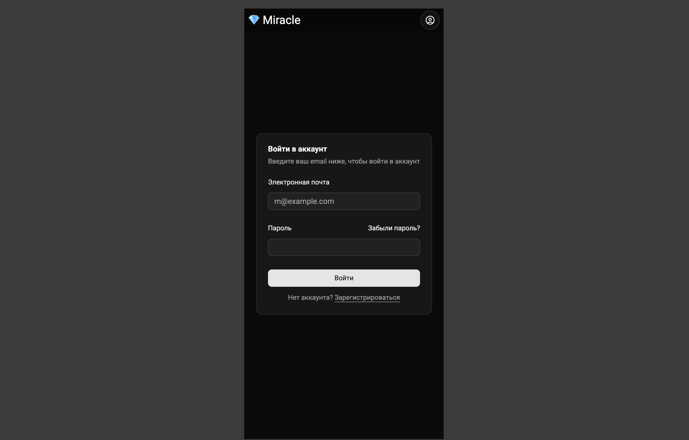
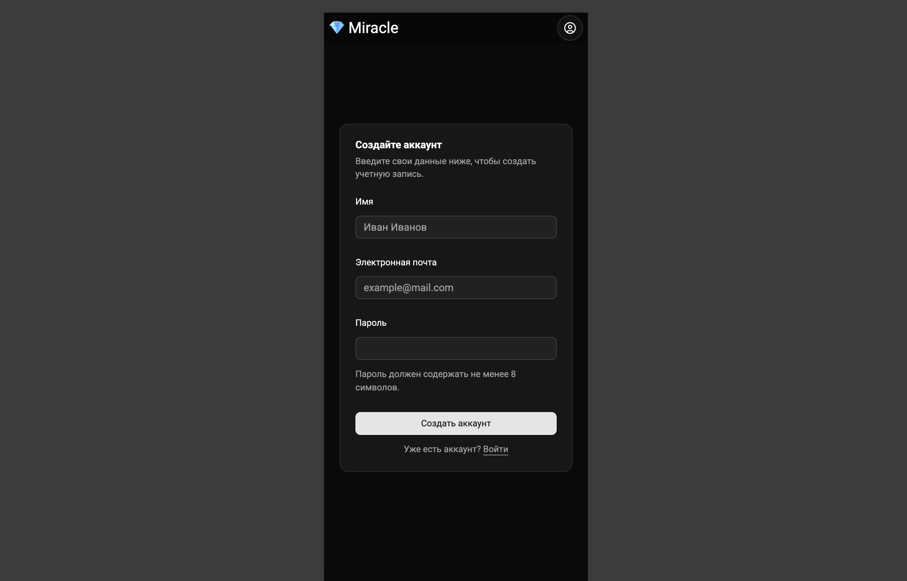
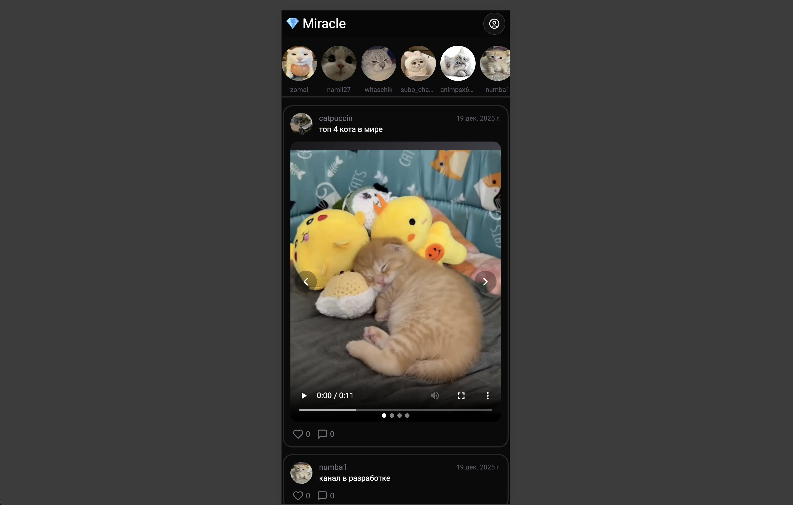
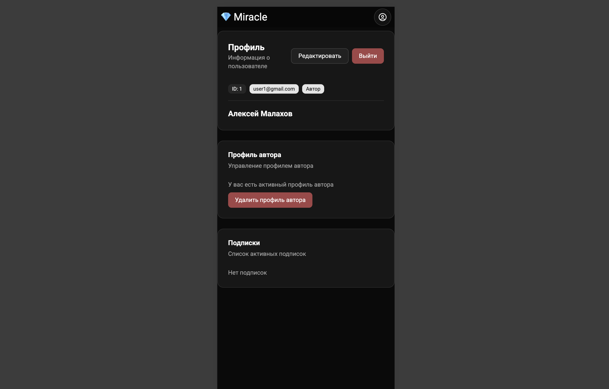
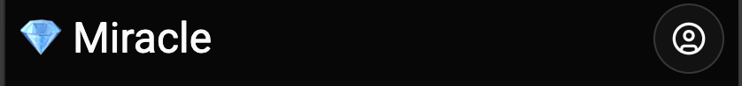
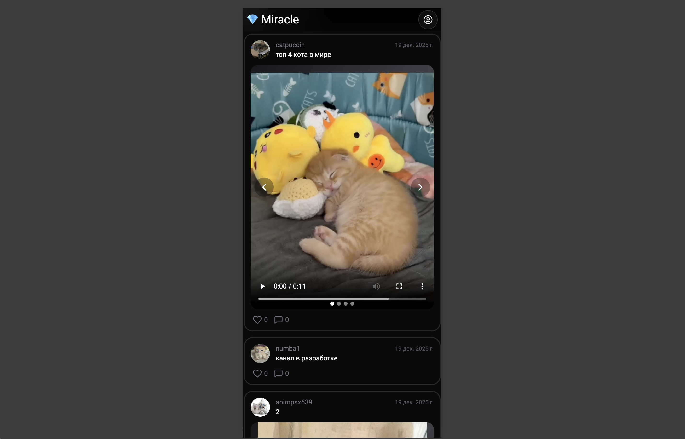
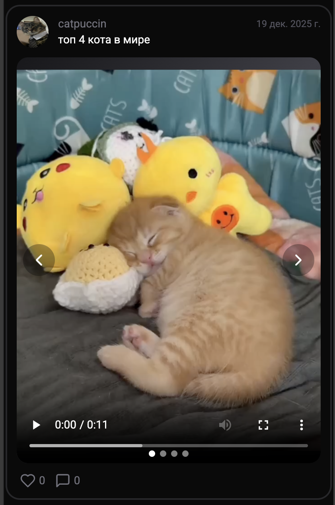
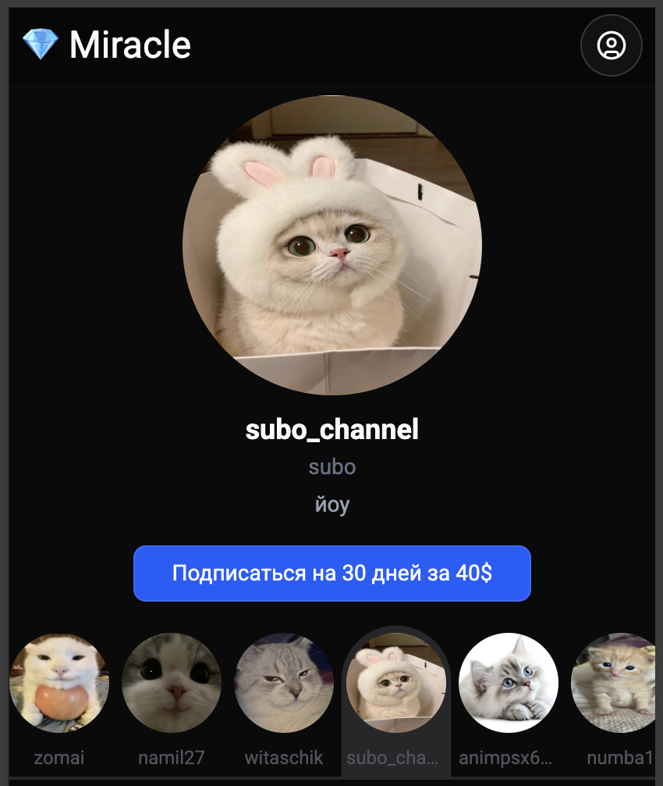
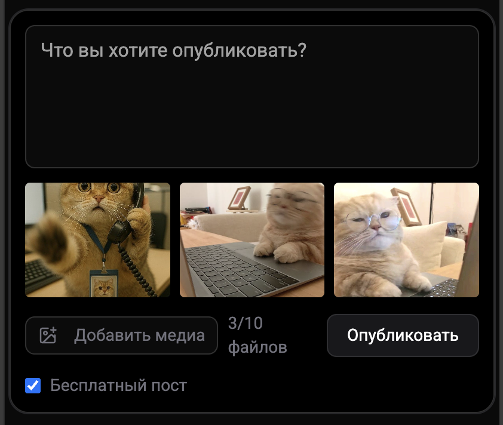

# Описание интерфейсов и компонентов

## Архитектура приложения

Фронтенд приложение построено на основе компонентной архитектуры React с использованием маршрутизации. Основной поток приложения:

1. **Аутентификация** — пользователь входит или регистрируется
2. **Главная страница** — просмотр ленты постов
3. **Профиль** — управление профилем и подписками
4. **Интерактивность** — лайки, комментарии, создание постов

---

## Основные страницы

### LogIn

Страница входа в систему.

**Назначение**: Аутентификация существующих пользователей через email и пароль.

**Элементы интерфейса**:

- Форма с полями email и пароль
- Кнопка "Вход"
- Ссылка на регистрацию
- Обработка ошибок аутентификации

**Состояния**:

- Пустая форма
- Процесс отправки
- Успешный вход
- Ошибка (неверные учетные данные)

**Скриншот**:

> 

---

### SignUp

Страница регистрации нового пользователя.

**Назначение**: Создание новой учетной записи с валидацией входных данных.

**Элементы интерфейса**:

- Форма с полями имя, email, пароль
- Кнопка "Регистрация"
- Ссылка на вход
- Валидация полей в реальном времени
- Сообщения об ошибках

**Состояния**:

- Пустая форма
- Заполненная форма с ошибками
- Процесс отправки
- Успешная регистрация

**Скриншот**:

> 

---

### Main

Главная страница приложения с лентой постов.

**Назначение**: Основной интерфейс для просмотра контента от авторов.

**Элементы интерфейса**:

- Навигационная панель сверху
- Боковое меню (авторы, фильтры)
- Центральная зона с лентой постов
- Пост-карточки с текстом, медиа, лайками и комментариями
- Бесконечный скролл с подгрузкой постов

**Компоненты**:

- `Navbar` — верхняя навигация
- `Menubar` — боковое меню
- `Posts` — лента постов
- `PostBlock` — отдельная карточка поста

**Функциональность**:

- Отображение постов с учетом прав доступа
- Фильтрация по авторам
- Бесконечный скролл с подгрузкой постов
- Лайки и комментарии к постам
- Просмотр профилей авторов

**Скриншот**:

> 

---

### Profile

Страница профиля пользователя.

**Назначение**: Управление профилем, просмотр подписок, создание контента для авторов.

**Элементы интерфейса**:

- Информация о пользователе (имя, email, аватар)
- Кнопка "Стать автором"
- Список подписок с возможностью управления
- Черновики и опубликованные посты (для авторов)
- Секция загрузки фото/видео

**Вкладки/разделы**:

- Основная информация
- Мои подписки
- Мой контент (для авторов)
- Фото галерея

**Функциональность**:

- Редактирование профиля
- Управление подписками (продление, отмена)
- Создание постов (для авторов)
- Загрузка медиафайлов
- Просмотр статистики

**Скриншот**:

> 

---

## Основные компоненты

### Navbar

Верхняя навигационная панель приложения.

**Функциональность**:

- Логотип/название приложения
- Навигационные ссылки (Главная, Авторы, Профиль)
- Кнопка выхода
- Индикатор авторизации пользователя

**Скриншот**:

> 

---

### Posts

Компонент ленты постов.

**Функциональность**:

- Отображение постов в виде ленты
- Бесконечная подгрузка постов при скролле
- Фильтрация по авторам
- Отображение сведений о доступности (бесплатный/платный)
- Индикаторы лайков и комментариев

**Детали**:

- Каждый пост содержит информацию об авторе, текст и медиа
- Платные посты отображают "Платный пост" без полного контента для неподписанных пользователей

**Скриншот**:

> 

---

### PostBlock

Отдельная карточка поста.

**Функциональность**:

- Отображение информации об авторе (аватар, имя, handle)
- Текст поста (с обозначением платности)
- Галерея медиаконтента (фото/видео)
- Кнопки лайка (с отображением количества)
- Раздел комментариев (развёрнутый/свёрнутый)
- Возможность написать комментарий

**Интерактивность**:

- Клик на лайк — добавление/удаление лайка
- Клик на комментарий — открытие формы

**Скриншот**:

> 

---

### Authors

Компонент отображения списка авторов.

**Функциональность**:

- Карточки авторов с аватарами и информацией
- Кнопка подписки/отписки
- Отображение количества подписчиков
- Поиск авторов
- Сортировка по популярности

**Элементы карточки автора**:

- Аватар
- Имя (name)
- Handle (юзернейм)
- Биография
- Кнопка подписки

**Скриншот**:

> 

---

### PostCreation

Форма создания нового поста (для авторов).

**Функциональность**:

- Поле для ввода текста поста
- Выбор типа поста (бесплатный/платный)
- Загрузка медиафайлов (до 10 файлов)
- Превью загруженных файлов
- Кнопка "Опубликовать"

**Валидация**:

- Минимальная длина текста
- Типы файлов (JPEG/PNG для фото, MP4 для видео)
- Размер файлов

**Скриншот**:

> 

---

## Формы

### LoginForm

Форма входа в систему.

**Поля**:

- Email (обязательное)
- Пароль (обязательное)

**Валидация**:

- Email должен быть валидным
- Пароль должен быть не пустым

---

### SignUpForm

Форма регистрации.

**Поля**:

- Имя (обязательное, до 128 символов)
- Email (обязательное, уникальное)
- Пароль (обязательное, мин 6 символов)

**Валидация**:

- Email должен быть валидным и уникальным
- Пароль должен быть достаточной длины

---

## UI Компоненты (Shadcn UI)

Приложение использует компоненты из Shadcn UI для создания доступного и современного интерфейса:

- **Button** — кнопки действий
- **Input** — текстовые поля
- **Dialog** — модальные окна
- **Checkbox** — флажки
- **Select** — выпадающие списки
- **Separator** — разделители
- **Avatar** — аватары пользователей
- **Label** — подписи к полям
