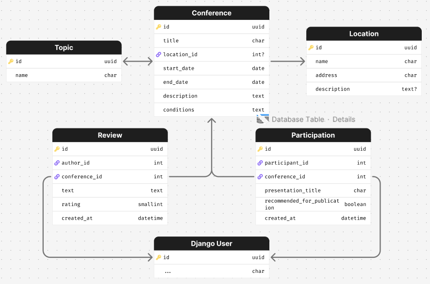
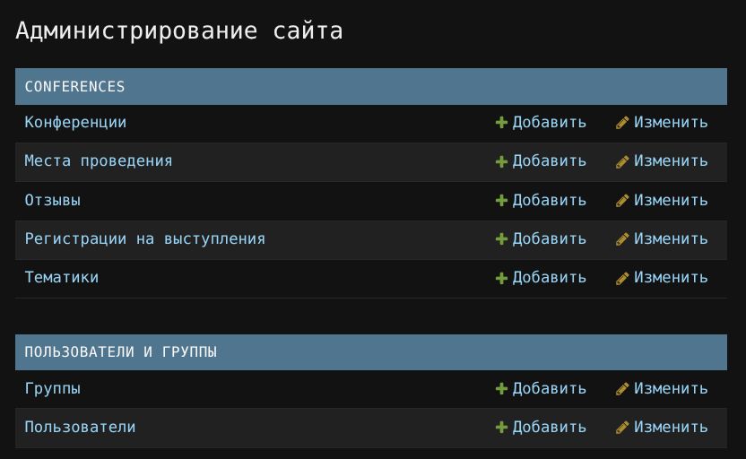
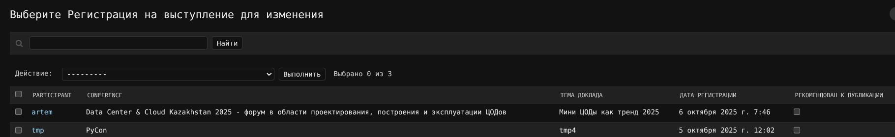
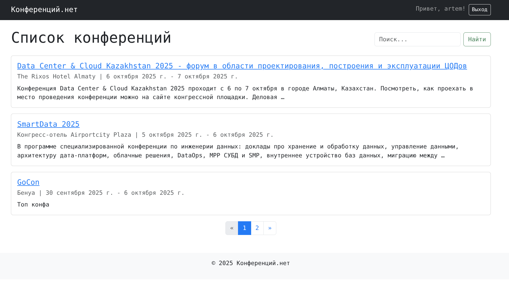
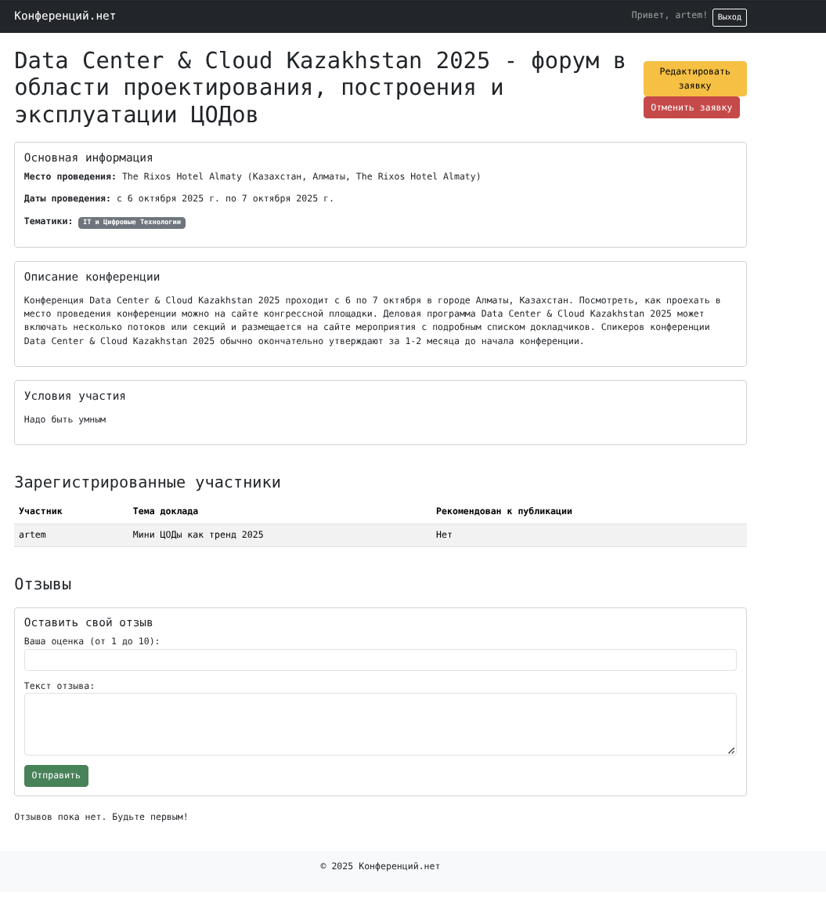

# Система учёта научных конференций

В этой лабораторной работе было разработано веб приложение для учёта и управления научными конференциями. Система
позволяет пользователям регистрироваться, просматривать список предстоящих конференций, подавать заявки на выступление,
а также оставлять отзывы и оценки. Администратор обладает возможностью через админку рекомендовать доклады к публикации.

-----

## Ход выполнения

### Модели данных

Первым шагом была спроектирована основа приложения - модели данных.

* **Conference** хранит ключевую информацию о мероприятии: название, тематики, место и даты проведения, а также
  подробное описание и условия участия.
* **Location** и **Topic** являются вспомогательными моделями для структурирования информации.
* **Participation** - модель, связывающая пользователя и конференцию. Она содержит тему доклада
  и специальное логическое поле `recommended_for_publication` для отметки администратором.
* **Review** позволяет пользователям оставлять отзывы на конференции. Включает текст
  комментария, рейтинг от 1 до 10 и дату создания. Для предотвращения дублирования была установлена уникальность на
  пару "пользователь-конференция".

```python
class Location(models.Model):
    """Модель места проведения конференции."""
    name = models.CharField("Название места", max_length=255)
    address = models.CharField("Адрес", max_length=300)
    description = models.TextField("Описание места", blank=True)

    class Meta:
        verbose_name = "Место проведения"
        verbose_name_plural = "Места проведения"

    def __str__(self):
        return self.name


class Topic(models.Model):
    """Модель тематики конференции."""
    name = models.CharField("Название тематики", max_length=150, unique=True)

    class Meta:
        verbose_name = "Тематика"
        verbose_name_plural = "Тематики"

    def __str__(self):
        return self.name


class Conference(models.Model):
    """Модель научной конференции."""
    title = models.CharField("Название", max_length=255)
    topics = models.ManyToManyField(Topic, verbose_name="Тематики", related_name="conferences")
    location = models.ForeignKey(
        Location,
        on_delete=models.SET_NULL,
        null=True,
        verbose_name="Место проведения"
    )
    start_date = models.DateField("Дата начала")
    end_date = models.DateField("Дата окончания")
    description = models.TextField("Описание конференции")
    conditions = models.TextField("Условия участия")

    class Meta:
        verbose_name = "Конференция"
        verbose_name_plural = "Конференции"
        ordering = ['-start_date']  # сначала новые

    def __str__(self):
        return self.title


class Participation(models.Model):
    """Модель регистрации пользователя на выступление в конференции."""
    participant = models.ForeignKey(User, on_delete=models.CASCADE, related_name="participations")
    conference = models.ForeignKey(Conference, on_delete=models.CASCADE, related_name="participations")
    presentation_title = models.CharField("Тема доклада", max_length=255)
    created_at = models.DateTimeField("Дата регистрации", auto_now_add=True)

    recommended_for_publication = models.BooleanField(
        "Рекомендован к публикации",
        default=False,
        help_text="Отмечается администратором"
    )

    class Meta:
        verbose_name = "Регистрация на выступление"
        verbose_name_plural = "Регистрации на выступления"
        # один пользователь может зарегистрироваться на конференцию только один раз
        unique_together = ('participant', 'conference')

    def __str__(self):
        return f"{self.participant.username} на '{self.conference.title}'"


class Review(models.Model):
    """Модель отзыва о конференции."""
    author = models.ForeignKey(User, on_delete=models.CASCADE, related_name="reviews")
    conference = models.ForeignKey(Conference, on_delete=models.CASCADE, related_name="reviews")
    text = models.TextField("Текст комментария")
    rating = models.PositiveSmallIntegerField(
        "Рейтинг",
        validators=[MinValueValidator(1), MaxValueValidator(10)]
    )
    created_at = models.DateTimeField("Дата создания", auto_now_add=True)

    class Meta:
        verbose_name = "Отзыв"
        verbose_name_plural = "Отзывы"
        ordering = ['-created_at']  # сначала новые
        unique_together = ('author', 'conference')  # Один пользователь - один отзыв на конференцию

    def __str__(self):
        return f"Отзыв от {self.author.username} на '{self.conference.title}'"

```



### Формы

Были созданы две основные формы на основе `ModelForm`:

* **ParticipationForm** содержит одно поле - `presentation_title` (тема доклада), которое пользователь заполняет при
  подаче заявки.
* **ReviewForm** позволяет указать рейтинг и текст отзыва.

* Для регистрации новых пользователей применялась стандартная форма Django `UserCreationForm`.

```python
class ParticipationForm(forms.ModelForm):
    class Meta:
        model = Participation
        fields = ['presentation_title']
        labels = {
            'presentation_title': 'Тема вашего доклада'
        }


class ReviewForm(forms.ModelForm):
    class Meta:
        model = Review
        fields = ['rating', 'text']
        widgets = {
            'rating': forms.NumberInput(attrs={'class': 'form-control', 'min': 1, 'max': 10}),
            'text': forms.Textarea(attrs={'class': 'form-control', 'rows': 4}),
        }
        labels = {
            'rating': 'Ваша оценка (от 1 до 10)',
            'text': 'Текст отзыва'
        }

```

### URL адреса и Пользовательский функционал

Для навигации по сайту и выполнения действий была настроена маршрутизация.

* Главная страница (`/`) отображает список всех конференций с поиском и пагинацией.
* Детальная информация о конференции доступна по адресу `/conference/<id>/`.
* Процессы аутентификации вынесены в  `accounts/`, где `/accounts/signup/` отвечает за регистрацию, а
  для входа и выхода используются встроенные представления Django (`/accounts/login/`, `/accounts/logout/`).
* Для создания, редактирования и удаления заявок на участие были созданы соответствующие
  ендпоинты: `/conference/<id>/participate/`, `/participation/<id>/edit/` и `/participation/<id>/delete/`.
* Добавление отзыва происходит по адресу `/conference/<id>/review/`.

### Представления

Логика работы приложения реализована с помощью Class Based Views.

* **ConferenceListView** отвечает за отображение списка конференций. В нем была реализована логика поиска по названию и
  описанию с помощью `Q` объектов, а также пагинация (`paginate_by`).
* **ConferenceDetailView** отображает полную информацию о конференции, а также связанные с ней списки участников и
  отзывы.
* Классы **ParticipationCreateView**, **ParticipationUpdateView** и **ParticipationDeleteView** управляют жизненным
  циклом заявки на выступление. Для защиты роутов использовались миксины `LoginRequiredMixin`
  и `UserPassesTestMixin`, которые гарантируют, что пользователь может редактировать или удалять только свою собственную
  заявку.
* **ReviewCreateView** обрабатывает отправку отзыва.

### Панель администратора

Была кастомизирована панель администратора. В файле `admin.py` для
модели `Participation` поле `recommended_for_publication` было добавлено в `list_editable`. Это позволит администратору
изменять статус рекомендации к публикации прямо из общего списка заявок без необходимости переходить на страницу
редактирования каждой из них, что значительно повышает удобство работы.




### Скриншоты сайта


