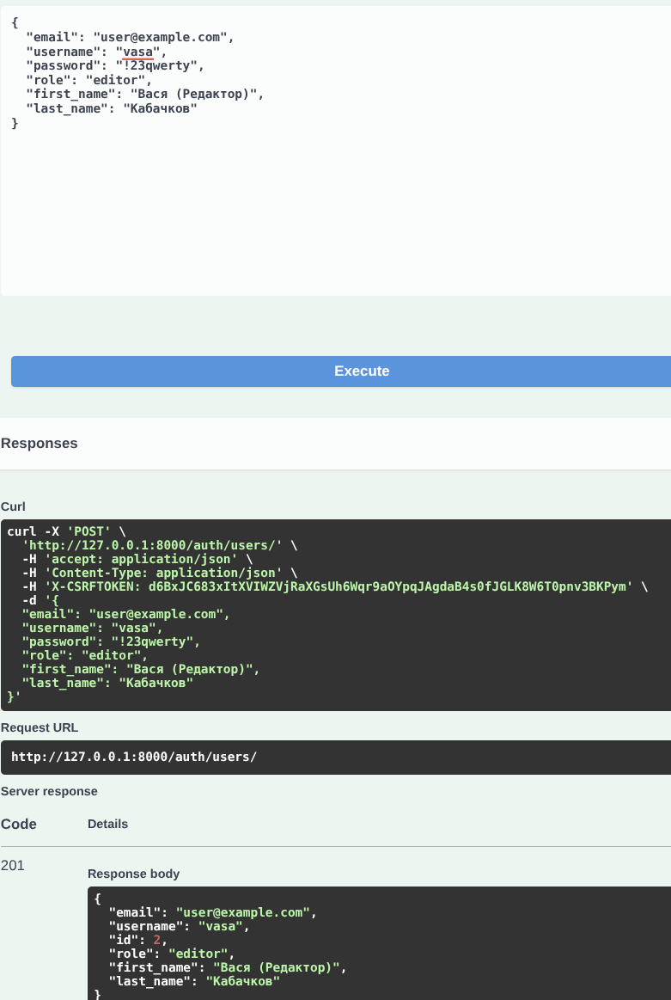
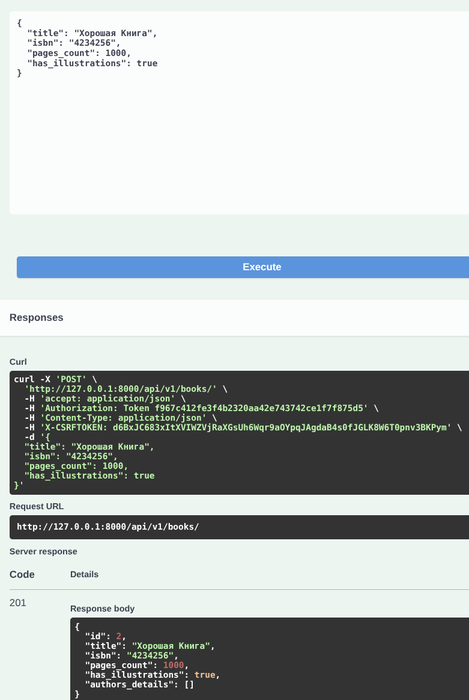
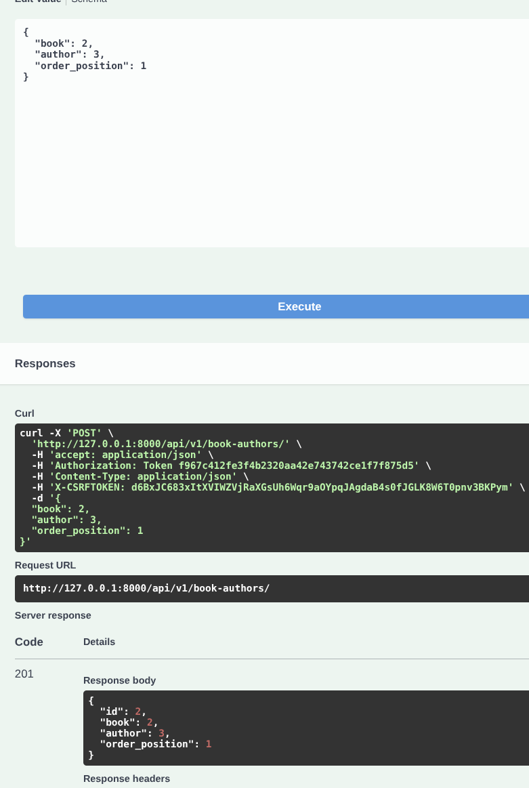
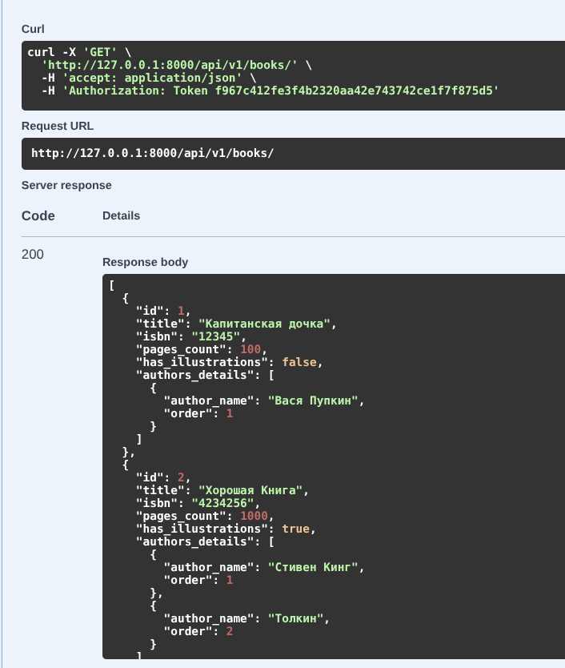
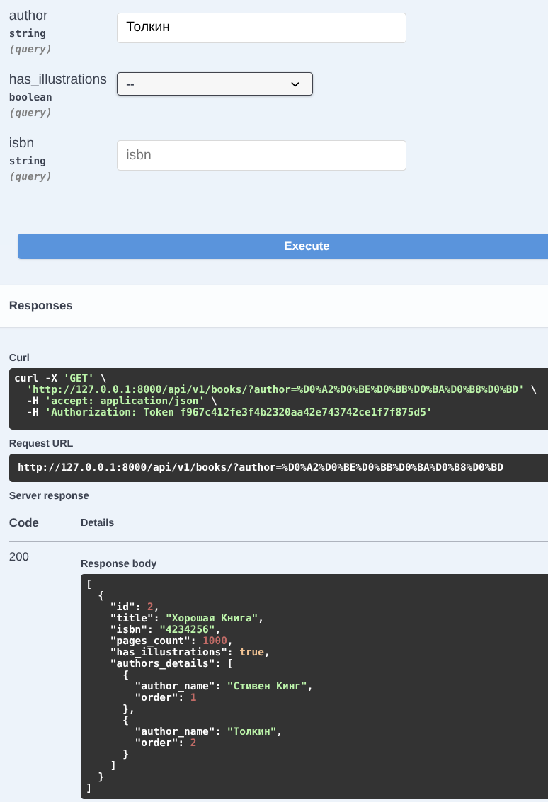
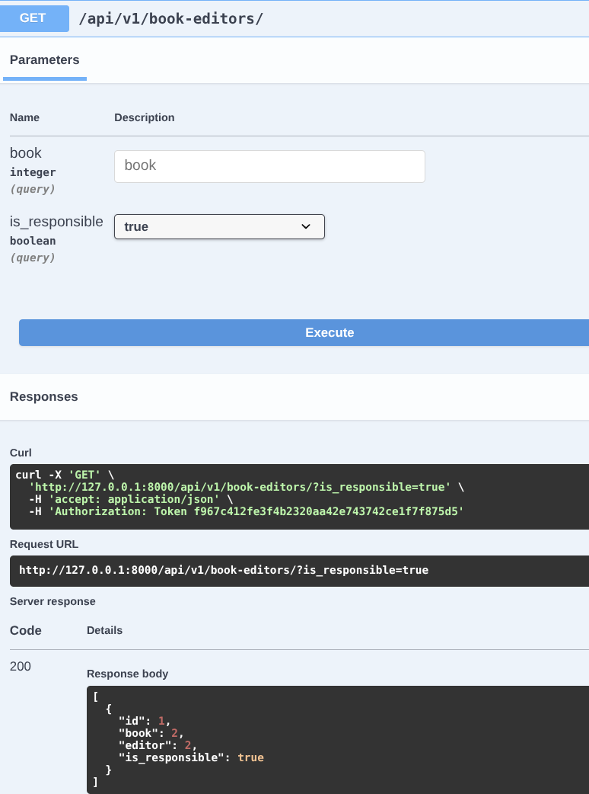
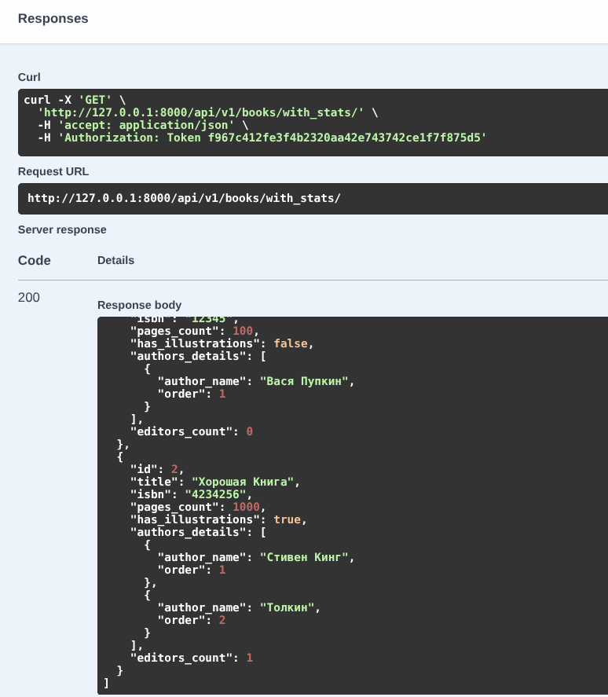
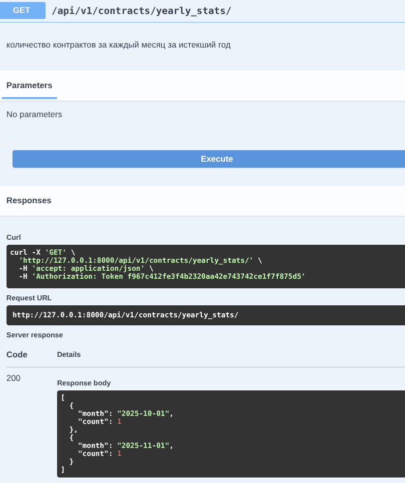
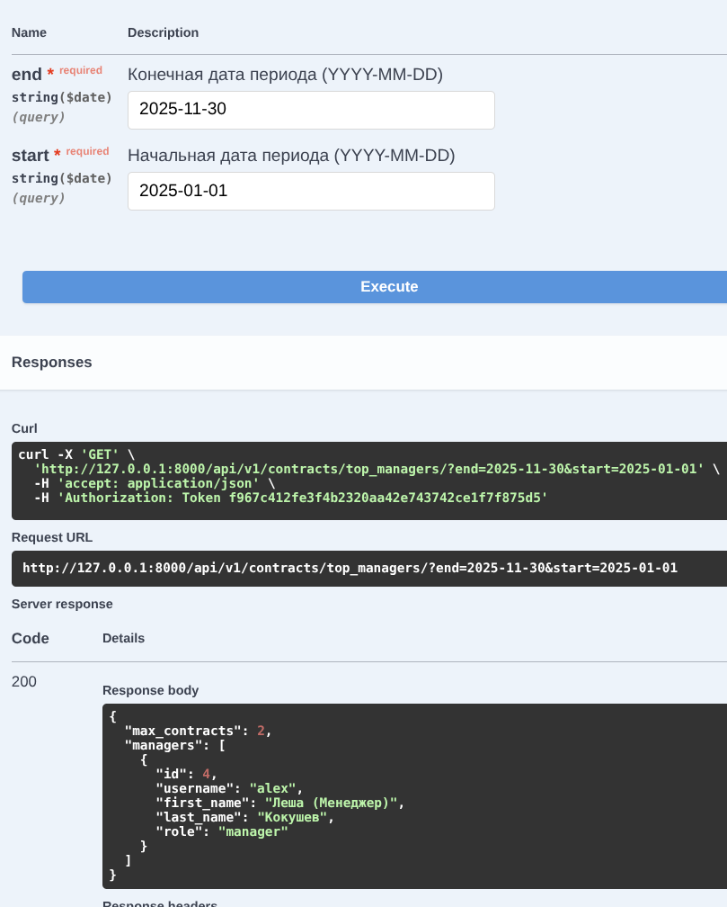
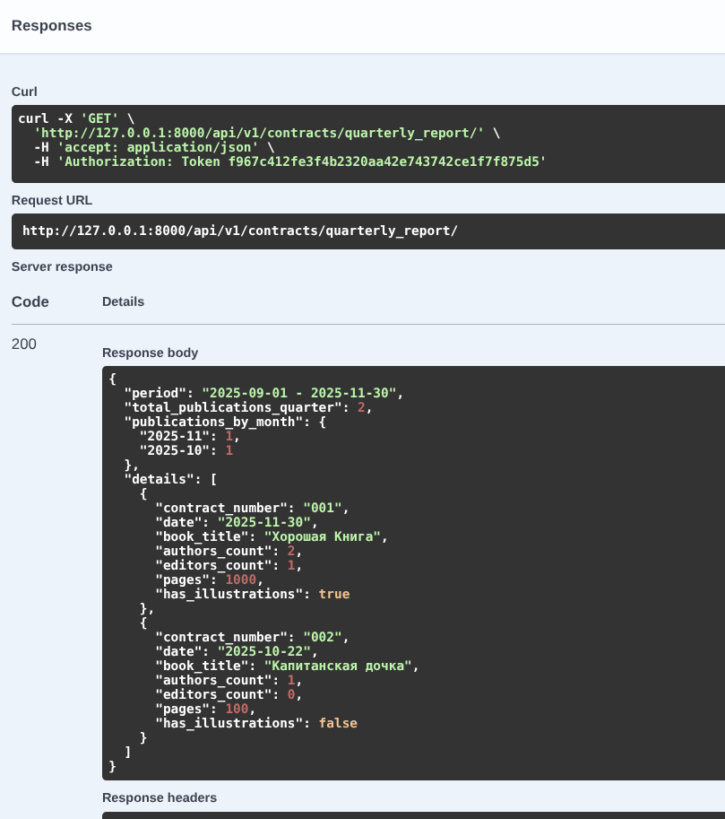

## Цель работы

Овладеть практическими навыками проектирования и реализации REST API с использованием фреймворка Django REST Framework.
Научиться моделировать сложные связи в базе данных, реализовывать авторизацию по токенам и создавать
агрегированные отчеты средствами ORM.

## Постановка задачи

Необходимо разработать программную систему для обслуживания сотрудников типографии.

**Ключевые требования:**

* **Ролевая модель:** Разделение на менеджеров и редакторов.
* **Сложные связи:**
    * У книги несколько авторов, важен их порядок.
    * У книги несколько редакторов, один из них - ответственный.
    * Контракты подписываются менеджерами.
* **Функциональность:** CRUD операции для всех сущностей, авторизация, специальные отчеты
* **Документация:** Автоматическая генерация документации API.

-----

## Ход работы

### Проектирование и реализация базы данных (Django ORM)

Первым этапом я проанализировал предметную область. Самой сложной частью оказалось реализация связей Многие-ко-Многим
с дополнительными условиями. Стандартный `ManyToManyField` не подходил, так как нужно было хранить порядок авторов и
флаг ответственности редактора.

Я решил эту проблему через использование промежуточных моделей (аргумент `through`).

**Реализованная схема БД:**

1. **User:** Кастомная модель пользователя, наследуемая от `AbstractUser`. Добавлено поле `role` (Manager/Editor).
2. **Book:** Основная сущность.
3. **Author:** Справочник авторов.
4. **Contract:** Связан с Книгой (OneToOne) и Менеджером.
5. **Order:** Заказ от клиента.
6. **BookAuthor (Промежуточная):** Связывает Книгу и Автора, содержит поле `order_position` (порядок на обложке).
7. **BookEditor (Промежуточная):** Связывает Книгу и Редактора, содержит булево поле `is_responsible`.

*Пример реализации модели Книги с промежуточными связями:*

```python
class Book(models.Model):
    # ... поля title, isbn ...
    authors = models.ManyToManyField(Author, through='BookAuthor')
    editors = models.ManyToManyField(settings.AUTH_USER_MODEL, through='BookEditor')
```

### Настройка Админ панели

Для удобного наполнения базы данных я настроил `admin.py`, используя `TabularInline`. Это позволило добавлять авторов и
назначать редакторов прямо на странице редактирования книги, а не создавать связи в отдельных окнах. Это значительно
ускорило процесс тестирования.

### Реализация логики API

Для сериализации данных я использовал `ModelSerializer`.
В сериализаторах возникла необходимость выводить не просто ID связанных объектов, а их детальную информацию.

* **Решение:** Использовал `SerializerMethodField` для поля `authors_details` в `BookSerializer`, чтобы API возвращал
  список авторов сразу с их порядковыми номерами.

Для обработки запросов использовал `ModelViewSet`. Это позволило сократить код, так как базовые методы (GET, POST, PUT,
DELETE) создаются автоматически.

### Реализация аналитических отчетов

Это была наиболее трудоемкая часть работы. Требовалось не просто выводить данные, а агрегировать их, считать суммы,
группировать по датам.

Использованные инструменты:

* `@action`: Декоратор для создания кастомных эндпоинтов внутри ViewSet.
* `annotate` и `Count`: Для подсчета количества редакторов и контрактов.
* `TruncMonth`: Для группировки статистики по месяцам.

**Пример логики для поиска лучших менеджеров:**
Я реализовал эндпоинт `top_managers`, который принимает даты периода. Логика следующая: фильтруем контракты по дате ->
группируем по менеджеру -> считаем количество -> сортируем по убыванию.

```python
# Фрагмент кода из ContractViewSet
stats = Contract.objects.filter(date_signed__range=[start, end])
.values('manager')
.annotate(total_contracts=Count('id'))
.order_by('-total_contracts')
```

### Аутентификация и безопасность

Для реализации регистрации и входа в систему была подключена библиотека **Djoser**.

* Настроены эндпоинты `/auth/token/login/` для получения токена.
* В `settings.py` установлен класс аутентификации `TokenAuthentication`.
* Права доступа: Все методы API закрыты пермишеном `IsAuthenticated`.

-----

## Результаты работы

### Тестирование управления данными (CRUD и связи)

Тест: Создание книги с несколькими авторами.

Результат: Система корректно сохраняет порядковый номер автора. При GET запросе книги авторы выводятся
в строгом соответствии с заданным порядком.

Создание редактора


Создание менеджера


Создание книги


Добавление первого автора


Добавление второго автора


Просмотр книги с авторами

### Тестирование системы отчетности

Для проверки аналитических функций база данных была наполнена тестовыми контрактами, подписанными в разные месяцы
текущего и прошлого квартала.

1. **Отчет: Книги заданного автора**

Запрос: GET /api/v1/books/?author=Толстой

Результат: Реализована фильтрация через Query Parameters. Сервер возвращает JSON список книг только указанного автора.



2. **Отчет: Ответственные редакторы**

Запрос: GET /api/v1/book-editors/?is_responsible=true

Результат: Получен список всех назначений, где редактор имеет статус ответственного. Записи с обычными редакторами
отфильтрованы.


3. **Отчет: Статистика по редакторам (Aggregation)**

Запрос: GET /api/v1/books/with_stats/

Результат: Средствами ORM (annotate) к каждой книге добавлено вычисляемое поле editors_count. Данные совпадают с
фактическим количеством записей в БД.


4. **Отчет: Динамика контрактов за год**

Запрос: GET /api/v1/contracts/yearly_stats/

Результат: Система выполнила группировку записей по месяцам. В ответе получен массив объектов вида {"
month": "2023-10-01", "count": 5}, отражающий активность заключения контрактов.


5. **Отчет: Эффективность менеджеров**

Запрос: GET /api/v1/contracts/top_managers/?start=...&end=...

Результат: При передаче временного периода система корректно определила менеджера с максимальным числом подписанных
контрактов и вернула его данные.


6. **Комплексный отчет за квартал**

Запрос: GET /api/v1/contracts/quarterly_report/

Результат: Сформирован JSON документ сложной структуры.

В блоке details для каждого контракта выведены: название книги, количество авторов, количество редакторов, объем в
страницах.

В блоке publications_by_month подсчитано количество изданий за каждый месяц квартала.

В блоке total выведена итоговая сумма за квартал.


-----

## Выводы

В ходе выполнения лабораторной работы я разработал backend приложение для типографии.

1. Разобрался, как работают связи `Many-to-Many` с дополнительными полями в Django и как их правильно сериализовать.
2. Научился использовать `aggregations` и `annotations` в Django ORM для построения сложной аналитики без нагрузки на
   интерпретатор Python.
3. Освоил библиотеку Djoser для быстрой настройки системы аутентификации.
4. Понял принцип работы ViewSets и Routers, что позволяет писать лаконичный и поддерживаемый код.